> Golang 学习资料：[ Golang学习与面试](https://ls8sck0zrg.feishu.cn/wiki/wikcnMImRDPO2nl71Iql5HPOrpe)

# 基础相关：

## 1. 相比较于其他语言, Go 有什么优势或者特点？

**分析**

这是一个开放性题目，言之有理即可，主要考察对go语言整体的一个理解和感受，看看对go语言了解是否全面，可以从语法层面，是否支持跨平台编译，以及对并发编程的支持方式以及协程支持等几个方面来分析

**回答**
- 云原生的时代，go是天生适合k8s来的；虽然java适合做业务，但是太重了。go生态差一点，像中间件什么的
- Go 允许跨平台编译，编译出来的是二进制的可执行文件，直接部署在对应系统上即可运行。
- Go 在语言层次上天生支持高并发，通过 goroutine 和 channel 实现。channel 的理论依据是 CSP 并发模型， 即所谓的`通过通信来共享内存`；Go 在 runtime 运行时里实现了属于自己的调度机制：GMP，降低了内核态和用户态的切换成本。java的虚拟线程实测性能上比不过goroutine
- Go 的语法简单，代码风格比较统一

## 2. **go是面向对象的吗**

**分析：**

Go官网的回答中提到，Yes or No。也就是说Go不是面向对象语言，但也可以进行面向对象风格的编程，Go可以看作是一种泛化的面向对象，他不像Java那样那么规范，Go的对象没有层次结构，但也使得Go的对象比Java中的对象更轻量级

> 没有层次结构指的是这意味着Go不支持传统面向对象意义上的继承，而是更喜欢专注于组合。但是我们可以使用接口、结构体和嵌入在Go中模拟继承。不过，以这种方式创建复杂的继承层次结构是非常笨拙的。

> 这里可以引发一下思考，不是说面向对象才是最优的代码结构和开发范式，各有优缺点

**回答：**

我之前有阅读过Go官方QA文档，答案是Yes and No，也就是说Go不是面向对象语言，但也可以进行面向对象风格的编程，在Go里面，实现面向对象三大特性是这样的

封装：Go语言里面字段首字母大小写来决定字段是否可以被外包访问

> 封装：在一个对象内部，某些方法和数据可以是私有的，不能被外界访问，封装为对象内部数据提供了不同级别的保护

继承：Go语言里面用组合结构体的方式 或 接口继承来实现

> 继承：让某个类型的对象获得另一个类型的对象的属性
>
> 继承概念的实现方式有二类：实现继承与接口继承。
>
> - 实现继承就是直接使用父类的属性和方法而无需额外编码的能力
> - 接口继承是指仅使用属性和方法的名称、但是子类必须提供实现的能力。

多态：Go语言中通过接口来实现多态，不同的类型实现对应接口，然后调用接口变量的方法，结果取决于接口存储的对应类型的方法

> 多态：指一个类实例的相同方法能有不同表现形式。多态机制可以让不同内部结构的对象共享相同的外部接口。这意味着，虽然针对不同对象的具体操作不同，但通过一个公共的类，它们（那些操作）可以通过相同的方式予以调用。

## 3. golang 中 make 和 new 的区别？（基本必问）

**分析**

考察go语言的基础，对象的创建方式，make和new都可以用来创建对象，但是make创建对象有一定的限制，回回顾我们平常写代码的过程，只是针对某些特定的数据类型一般用make来创建，比如slice，map，还有channel，以及创建完之后，返回值是什么？回答的要点要突出创建对象的区别以及返回值类型。

**回答**

- make 只能用来分配及初始化类型为 slice、map、chan 的数据。new 可以分配任意类型的数据；
- new 分配返回的是指针，即类型 *Type。make 返回数据类型本身，即 Type；
- new 分配的空间被清零。make 分配空间后，会进行初始化；

## 4. 数组和切片的区别 （基本必问），切片怎么扩容

**分析**

数组和切片在编程中都会用到，都是用来存储一组相同数据的内存连续的数据结构，主要区别在于长度是否固定且数据类型的性质，是否是引用数据类型，比如在做函数参数传递时，是否会影响到原数据(数组或切片)，这就需要了解切片的底层实现，回顾下go语言切片的底层实现，

切片的底层数据结构定义如下：

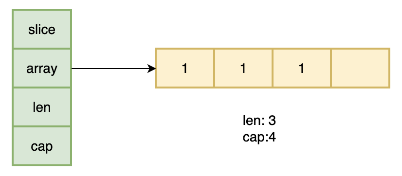

slice结构 包含三个字段，array 类型为unsafe.Pointer，还有两个int类型的字段len和cap。

- **array：是一个指针变量，指向一块连续的内存空间，即底层数组结构**
- **len：当前切片中数据长度**
- **cap：切片的容量**

**注意：cap是大于等于len的，当cap大于len的时候，说明切片未满，它们之间的元素并不属于当前切片。**

**回答**

数组是值类型，长度固定

切片是引用类型，长度不固定，可以动态扩容

**切片怎么扩容？**

**分析**

这个问题其实是对上个问题的补充提问，因为切片的长度不固定，可以动态扩容，所以需要了解其具体的扩容策略是怎样的，这里回答的要点是需要区分go的版本，在go1.17之前和之后扩容策略是不一样的

**回答**

1.17及以前

1. 如果期望容量大于当前容量的两倍就会使用期望容量；
2. 如果当前切片的容量小于 1024 就会将容量翻倍；
3. 如果当前切片的容量大于 1024 就会每次增加 25% 的容量，直到新容量大于期望容量；

1.18之后

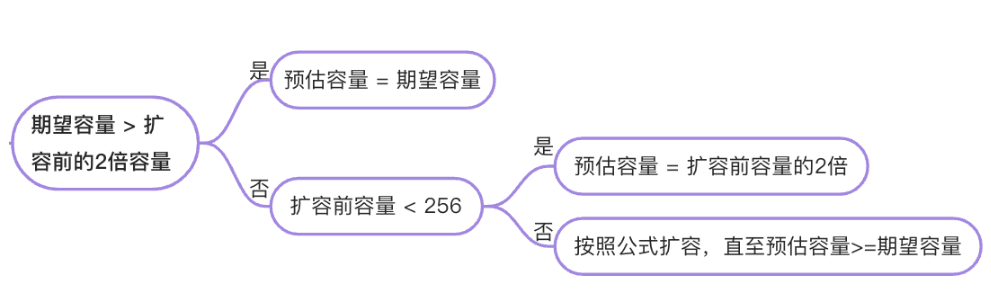

     扩容公示：

**推荐学习**

《golang学习与面试》[ slice](https://ls8sck0zrg.feishu.cn/wiki/wikcn00HZW62D8XnOIrEqtH5Ynb) 

为什么代码中测试扩容大小和策略对不上？

https://zhuanlan.zhihu.com/p/612436072

## 5. for i, v := range 切片，v地址会变化吗

**分析**

for range是面试中经常会出现的一个问题，用于考察面试者语言基础是否扎实。主要会考察写代码时经常遇到的的一些坑，这里就要对for range整个语法糖有一个深层次的了解，for range在遍历的时候，其实它的底层实现是这样的，会对原切片做一次拷贝，确定其值和长度，遍历数组中每个元素的时候都把这个值赋给同一个临时变量，所以每次遍历拿到的是同一个地址，但是值不同

思考题：

**回答**

地址不会发生变化，但是该地址的值是变化的，每遍历到一个元素，就把该元素值就会写到该地址

PS：在最新版本Go 1.22中， v的地址会变化的 ， 也就是不再共享变量了 ，知道这点的话，在面试一定要提出来，展示自己的技术面广

追加一个思考题

for range 循环遍历 slice 有什么问题？

1. 对slice用for range遍历，遍历过程中追加元素不会遍历到

**推荐学习**

[ Golang 夜市8月29日（Slice探秘）](https://ls8sck0zrg.feishu.cn/wiki/QmA6wajErivdWok0Zzfcctkbndh)

## 6. go defer，多个 defer 的顺序，defer 在什么时机会修改返回值？（defer 和 return）

### **5.1  defer 的执行顺序**

**分析**

关于go语言中的defer，需要明确defer的作用和执行机制，一般用defer来做什么，优势在什么地方，defer在函数返回前执行过程又是怎样的？在回答的时候要突出顺序是LIFO这个特性，接着可以简单介绍下defer底层实现是怎么实现的

可以回顾defer的底层实现：

底层存储如下图：

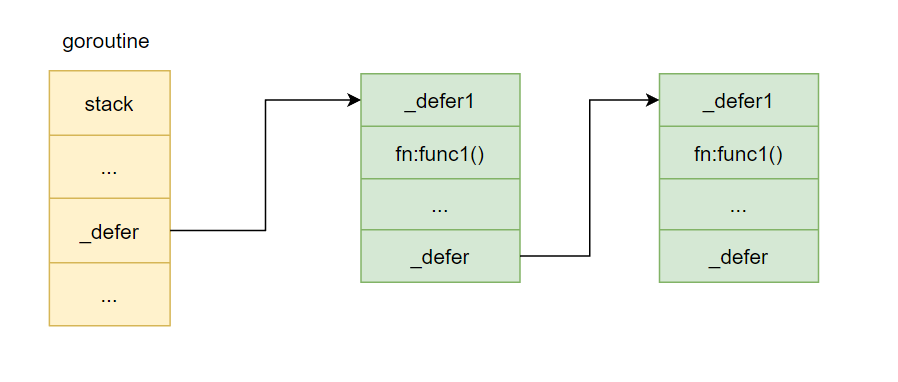

defer函数在注册的时候，创建的_defer结构会依次插入到_defer链表的表头，在当前函数return的时候，依次从_defer链表的表头取出_defer结构执行里面的fn函数，所以执行顺序是LIFO。

**回答**

defer的执行顺序类似于栈，是LIFO，先调用的defer语句后执行。

### **5.2   defer在什么时机会修改返回值**

**分析**

defer在return的时候有机会修改返回值，return的过程可以被分解为以下三步：

1. 设置返回值
2. 执行defer语句
3. 将结果返回

defer recover 的问题？(主要是能不能捕获)

1. 用recover捕获异常时，只能捕获当前goroutine的panic，不能捕获其他goroutine发生的panic
2. 一个recover只能捕获一次panic，且一一对应

**推荐学习**

[ go语言defer](https://ls8sck0zrg.feishu.cn/wiki/wikcneIuHynkvIPpYNcrKr8Y9Hh) ，[ defer](https://ls8sck0zrg.feishu.cn/wiki/wikcnR7kG67xDQh5bFSpVSJKSsb) 

## 7.  uint 类型溢出

**分析**

关于整形溢出主要是考察go语言基本数据类型的大小范围是个否了解，以及各种数据类型的占用和空间大小，下表整理了go语言基本数据类型的大小范围，溢出主要是关注无符号整数的溢出

uint8大小为1个字节，占8位，byte其实就是uint8的别名，uint8的溢出情况举例：

## 8. 介绍 rune 类型

**分析**

主要考察对go语言基本数据类型有没有细致的了解，rune类型是go语言一种特殊的数据类型，回答的时候重点要突出rune类型具体在底层对应什么数据类型(int32)，以及它的作用是用作处理字符的

- uint8 类型，或者叫 byte 型，代表了 ASCII 码的一个字符。
- rune 类型，代表一个 UTF-8 字符，当需要处理中文、日文或者其他复合字符时，则需要用到 rune 类型。rune 类型等价于 int32 类型。

**回答**

rune类型是 Go 语言的一种特殊数字类型。在builtin/builtin.go文件中，它的定义：`type rune = int32`；官方对它的解释是：rune是类型int32的别名，在所有方面都等价于它，用来区分字符值跟整数值。使用单引号定义 ，返回采用 UTF-8 编码的 Unicode 码点。Go 语言通过rune处理中文，支持国际化多语言。

**推荐学习**

http://www.mebugs.com/post/gorune.html

## 9. Go中两个Nil可能不相等吗？

**分析**

两个数据要进行比较，首先得明白数据类型，对于两个nil的比较同样如此，这里主要得注意interface类型，因为interface类型是类型T和值V二者的综合，只有在类型T和值V都相等的情况下，两个interface才会相等

接口(interface) 是对非接口值(例如指针，struct等)的封装，内部实现包含 2 个字段，类型 T 和 值 V。一个接口等于 nil，当且仅当 T 和 V 处于 unset 状态（T=nil，V is unset）。

两个接口值比较时，会先比较 T，再比较 V。接口值与非接口值比较时，会先将非接口值尝试转换为接口值，再比较。

- 例子中，将一个nil非接口值p赋值给接口i，此时,i的内部字段为(T=*int, V=nil)，i与p作比较时，将 p 转换为接口后再比较，因此 i == p，p 与 nil 比较，直接比较值，所以 p == nil。
- 但是当 i 与nil比较时，因为i为接口指，会将nil转换为接口(T=nil, V=nil),与i(T=*int, V=nil)不相等，因此 i != nil。因此 V 为 nil ，但 T 不为 nil 的接口不等于 nil。

**回答**

Go中两个Nil可能不相等，当一个接口类型的变量为nil和一个非接口类型的变量也为nil的时候，虽然两者都为nil，但是却不相。

## 10.  golang 中解析 tag 是怎么实现的？反射原理是什么？(问的很少，但是代码中用的多)

**解析 tag **

**分析**

首先要明白，tag是什么以及tag的规则，go语言中的tag就是就是结构体中的各个字段的一个标签，`Tag`本身是一个字符串，它是 **以空格分隔的 key:value 对，**

- key : 必须是非空字符串，不能包含控制字符、空格、引号、冒号
- value : 以双引号标记的字符串
- 注意 ：冒号前后不能有空格

举个例子

``之间的就是一个tag，第一个问题就是要回答怎样获取这个tag的值，一般是通过反射来实现

**回答**

Go 中解析的 tag 是通过反射实现的
**反射的实现原理**

**分析**

主要考察反射的实现机制，即获取数据的动态类型和动态值，联想一下我们学习的知识，在哪一节讲过动态类型和动态值，就是**interface**，所以这题回答的关键点就是要点出interface，然后介绍下，interface的底层实现

**回答**

反射是指计算机程序在运行时（Run time）可以访问、检测和修改它本身状态或行为的一种能力

Go语言反射是通过接口来实现的，通过隐式转换，普通的类型被转换成interface类型，这个过程涉及到类型转换的过程，首先从Golang类型转为interface类型, 再从interface类型转换成反射类型, 再从反射类型得到想的类型和值的信息

**推荐学习**

https://golang.design/go-questions/stdlib/reflect/how/

## 11. go struct 能不能比较？

**分析**

主要考察对go语言基本数据类型的掌握程度，其实本质就是考察哪些数据机构不能比较，哪些可以比较，在go语言中，回答的时候，要明确可比较的范围，很明显，两个不同类型的数据类型不能进行比较，struct包含不可比较的字段也是不可比较的。

**回答**

1. 对于不同类型的struct无法进行比较；而同一个struct的两个实例可比较也不可比较。
2. 在Go中，Slice、map、func无法比较，当一个struct的成员是这三种类型中的任意一个，就无法进行比较。反之，struct是可以进行比较的

## 12. **结构体打印时，**`%v` 和 `%+v` 的区别

**分析**
看下面代码示例

**回答**

`%v`输出结构体各成员的值；

`%+v`输出结构体各成员的名称和值；

`%#v`输出结构体名称和结构体各成员的名称和值

## 13. 空 struct{} 占用空间么？

**分析**

可以使用 unsafe.Sizeof 计算出一个数据类型实例需要占用的字节数:

**回答**

空结构体 struct{} 实例不占据任何的内存空间。

## 14.  go语言中空 struct{} 的用途？

**分析**

这个题目可以看做是上一题地12题的补充提问，通过上一题我们知道空结构体 struct{}不占用任何内存，那么这题就可以转化思考，不占用内存的struct有什么用处？正因为不占用内存，所以空struct被广泛作为各种场景下的占位符使用

1. 将 map 作为集合(Set)使用时，可以将值类型定义为空结构体，仅作为占位符使用即可。
2. 不发送数据的信道(channel)
   使用 channel 不需要发送任何的数据，只用来通知子协程(goroutine)执行任务，或只用来控制协程并发度。
3. 结构体只包含方法，不包含任何的字段

**回答**

1. 将 map 作为集合(Set)使用时，可以将值类型定义为空结构体，仅作为占位符使用即可。
2. 使用在不发送数据的信道(channel)上，使用 channel 不需要发送任何的数据，只用来通知子协程(goroutine)执行任务，或只用来控制协程并发度。
3. 用作接口的实现，结构体只包含方法，不包含任何的字段

## 15. go中"_"的作用

**分析**

_在go语言中可以出现在不同的位置，可以在import中，也可以在代码中出现，在不同的场合其作用是不一样的，在回答的时候要凸显出在不同场景下，回答全面

1. **import中的下滑线**

此时“_”的作用是：当导入一个包的时候，不需要把所有的包都导进来，只需要执行使用该包下的文件里所有的init()的函数。

- **下划线在代码中**

作用是：下划线在代码中是忽略这个变量

也可以理解为占位符，那个位置上本应该赋某个值，但是我们不需要这个值，所以就把该值给下划线，意思是丢掉不要，这样编译器可以更好的优化，任何类型的单个值都可以丢给下划线。

如果方法返回两个值，只想要其中的一个结果，那另一个就用_占位

**回答**

1. import中的下滑线用于执行导入包下的所有init函数
2. 代码体中的下划线用于忽略返回值

## 16. Go 闭包

**分析**

主要考察对go语言对匿名函数的支持，回答的时候点出匿名函数关键字即可，面试种不常见

**回答**

1. 匿名函数也可以被称为闭包
2. 闭包实际上就是匿名函数 + 引用环境(捕获的变量)
   1. 在《深度探索Go语言》一书中提到，从语义角度来讲，闭包捕获变量并不是要复制一个副本，变量无论被捕获与否都应该是唯一的，所谓捕获只是编译器为闭包函数访问外部环境中的变量搭建了一个桥梁。这个桥梁可以复制变量的值，也可以存储变量的地址。只有在变量的值不会再改变的前提下，才可以复制变量的值，否则就会出现不一致错误

**推荐学习**

[ go语言函数](https://ls8sck0zrg.feishu.cn/wiki/wikcnG5QG6zb9dSVncrCGd5q0Ud) 

https://aijishu.com/a/1060000000015474

## 17. Go 多返回值怎么实现的？

**分析**

主要考察go语言中对函数栈帧的了解程度，要清楚go语言中函数调用过程中，函数栈帧是怎样保存各个寄存器值的，以及栈帧的布局是怎样的，回答这个问题要突出go语言函数调用是通过fp寄存器 +offset来实现的，

回顾一下函数栈帧布局

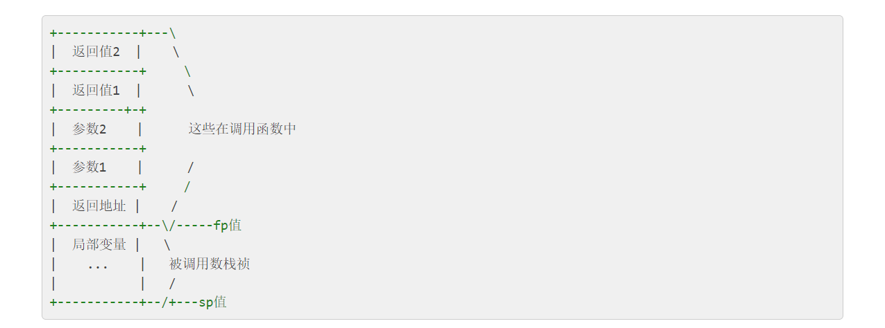

**回答**

Go函数传参是通过fp+offset来实现的，而多个返回值也是通过fp+offset存储在调用函数的栈帧中

**推荐学习**

https://www.w3cschool.cn/go_internals/go_internals-vn2d282m.html

## 18. Go 语言中不能比较的类型如何比较是否相等？

**分析**

这个题目主要考察对reflect.DeepEqua的了解，因为基本类型都可以用==来比较，但是涉及到像不能比较的类型，比如slice，map怎么比较，所以再回答的时候要点出关键字reflect.DeepEqual 

**回答**

1. 像 string，int，float interface 等可以通过 reflect.DeepEqual 和等于号进行比较
2. 像 slice，struct，map 则一般使用 reflect.DeepEqual 来检测是否相等。

**推荐学习**

https://golang.design/go-questions/stdlib/reflect/compare/

https://juejin.cn/post/7170332084144177165

## 19. Go 中 init 函数的特征?

**分析**

主要考察go语言的初始化过程，初始化过程中分为全局变量，init函数，在初始化过程中主要是要明确他们的初始化顺序，所以回答要点要突出各个包下的全局变量，init函数，它们的执行顺序

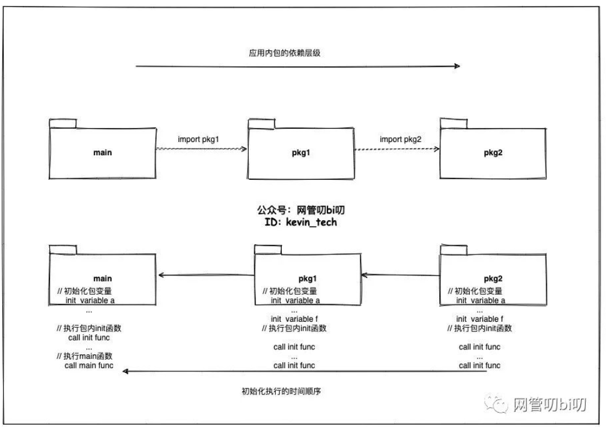

**回答**

1. 每个包下可以有多个 init 函数，每个文件也可以有多个 init 函数。多个 init 函数按照它们的文件名顺序逐个初始化。
2. 应用初始化时初始化工作的顺序是，从被导入的最深层包开始进行初始化，层层递出最后到 main 包。
   1. 不管包被导入多少次，包内的 init 函数只会执行一次。
   2. 而且包级别变量的初始化先于包内 init 函数的执行。

> 执行顺序import –> const –> var –>init()–>main()

**推荐学习**

[ 程序初始化](https://ls8sck0zrg.feishu.cn/wiki/wikcnvGazyhjizWltzvPHl5qXjf) 

## 20. Go 中 uintptr 和 unsafe.Pointer 的区别？

**分析**

考察对go语言中指针的了解，go语言中指针分为普通指针类型，unsafe.Pointer，uintptr(本质不是指针，下面会进行说明)。三者的功能各不相同

- *类型:普通指针类型，用于传递对象地址，不能进行指针运算。
- unsafe.Pointer:通用指针类型，用于转换不同类型的指针，不能进行指针运算，不能读取内存存储的值（必须转换到某一类型的普通指针）。
- uintptr:用于指针运算，GC 不把 uintptr 当指针，uintptr 无法持有对象。uintptr 类型的目标会被回收。

在回答unsafe.Pointer和uintptr的区别时，重点突出指针运算上，unsafe.Pointer用于指针类型转换，不能参与运算，而uintptr 可以运算。

**回答**

1. unsafe.Pointer 是通用指针类型，它不能参与计算，任何类型的指针都可以转化成unsafe.Pointer，unsafe.Pointer 可以转化成任何类型的指针
   1. 当我们想让普通指针类型之间进行转换的时候，就需要unsafe.Pointer作为中间指针
2. uintptr 可以转换为 unsafe.Pointer，unsafe.Pointer 可以转换为 uintptr。uintptr 是指针运算的工具，但是它不能持有指针对象（意思就是它跟指针对象不能互相转换），unsafe.Pointer 是指针对象进行运算（也就是 uintptr）的桥梁。
   1. 很多人都认为uintptr是个指针，其实不然。不要对这个名字感到疑惑，它只不过是个uint，大小与当前平台的指针宽度一致。因为unsafe.Pointer可以跟uintptr互相转换，所以Go语言中可以把指针转换为uintptr进行数值运算，然后转换回原类型，以此来模拟C语言中的指针运算。
   2. unsafe.Pointer类似于C语言中的void∗，虽然未指定元素类型，但是本身类型就是个指针。

**推荐学习**

https://www.cnblogs.com/-wenli/p/12682477.html

# Context 相关：

## 1、context 结构是什么样的？

**分析**

关于context要清楚具体是什么，context其实是一个接口，提供了四种方法，而在官方go语言中对context接口提供了四种基本类型的实现，回答的时候，要答出接口以及几种实现结构

**回答**

1. go语言里的context实际上是一个接口，提供了四种方法：
2. 有emptyCtx 、cancelCtx 、timerCtx、valueCtx四种实现
   1. emptyCtx：emptyCtx 虽然实现了context接口，但是不具备任何功能，因为实现很简单，基本都是直接返回空值
      1. 我们一般调用context.Background()和context.TODO() 都是返回一个 *emptyCtx的动态类型(通过静态类型context.Context传递)
   2. cancelCtx：cancelCtx同时实现Context和canceler接口，通过取消函数cancelFunc实现退出通知。注意其退出通知机制不但通知自己，同时也通知其children节点。
      1. 我们一般调用context.WithCancel() 就会返回一个*cancelCtx 和cancelFunc  
   3. t imerCtx:  timerCtx是一个实现了Context接口的具体类型，其内部封装了cancelCtx类型实例，同时也有个deadline变量，用来实现定时退出通知
      1. 我们一般调用context.WithTimeout() 就会返回一个*timerCtx和cancelFunc，不仅可以定时通知，也可以调用cancelFunc进行通知
      2. 调用context.WithDeadline()也可以，WithTimeout是多少秒后进行通知，WithDeadline是在某个时间点通知，本质上，WithTimeout会转而WithDeadline
   4. valueCtx: valueCtx是一个实现了Context接口的具体类型,其内部封装了Context接口类型，同时也封装了一个k/v的存储变量，其是一个实现了数据传递
      1. 我们一般context.WithValue()来得到一个*valueCtx，valueCtx可以继承它的parent valueCtx中的{key, value}

**推荐学习**

《golang学习与面试》并发实践[ Context](https://ls8sck0zrg.feishu.cn/wiki/wikcn3FaReZWNARQcpXU1QaOyJw)

《golang学习与面试》数据结构 [ context](https://ls8sck0zrg.feishu.cn/wiki/wikcnZtmFdI2dwmXHtD2yXq4woe) 

## 2、context 使用场景和用途？（基本必问）

**分析**

这个问题其实可以可以上一个问题的补充提问，在明确了context是什么之后，即context接口提供了哪些哪些方法，以及有哪些实践之后，看似联想出这些实现是为了解决什么问题，主要突出两点：上下文信息传递和协程的取消控制

**回答**

1. context 主要用来在 goroutine 之间传递上下文信息，比如传递请求的trace_id,以便于追踪全局唯一请求
2. 另一个用处是可以用来做取消控制，通过取消信号和超时时间来控制子goroutine的退出，防止goroutine泄漏

包括：取消信号、超时时间、截止时间、k-v 等。

**推荐学习**

《golang学习与面试》并发实践[ Context](https://ls8sck0zrg.feishu.cn/wiki/wikcn3FaReZWNARQcpXU1QaOyJw)

《golang学习与面试》数据结构 [ context](https://ls8sck0zrg.feishu.cn/wiki/wikcnZtmFdI2dwmXHtD2yXq4woe) 

# Channel 相关：

## 1. channel 是否线程安全？锁用在什么地方？

**分析**

channel配合goroutine可以用来实现并发编程，并且是go语言推荐的并发编程模式，那么肯定是可以保证线程安全的，可以先回顾下channel的底层定义，channel用make函数创建初始化的时候会在堆上分配一个runtime.hchan类型的数据结构

可以看到channel的底层实现中是有锁的，是通过mutex来保证线程安全的，所以在回答的时候要突出底层实现有锁

**回答**

- 一般来说，我们对channel就只有读，写，关闭三种操作，这三种操作，channel底层数据结构都用同一把runtime.Mutex来进行保护

**推荐学习**

《golang学习与面试》[ channel](https://ls8sck0zrg.feishu.cn/wiki/wikcn8zirn3I2ePNHDrTGeuvA5f) 

## 2. channel 的底层实现原理 （数据结构）

**分析**

这个问题其实是上一个问题的补充，channel的底层实现是一个hchan的结构，hchan的结构定义

回顾这个图

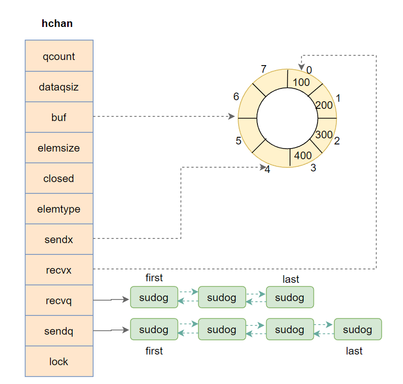

**回答**

1. 对于包含缓冲的channel，go语言的channel底层是一个hchan的结构，里面包含一个指向循环数组的指针，这个循环数组就是用于存储数据的。当然还包含下次读取和下次发送的数据索引位置recvx和sendx
2. 还包含两个goroutine等待队列，在一个goroutine对这个channel读写阻塞的时候会分情况放到这两个队列里，发送数据阻塞就放到sendq这个等待队列，接收数据阻塞就放到recvq这个等待队列
3. 为了保证channel的线程安全，hchan结构还有一个互斥锁，用作数据读写时候加锁，当前close channel也会用到这个互斥锁

**推荐学习**

《golang学习与面试》[ channel](https://ls8sck0zrg.feishu.cn/wiki/wikcn8zirn3I2ePNHDrTGeuvA5f) 

## 3. nil、关闭的 channel、有数据的 channel，再进行读、写、关闭会怎么样？（各类变种题型）

**分析**

主要是考察对channel在各个状态下进行读写操作会出现什么结果，这块建议自己代码跑一下各个场景，加深一下理解

**回答**

|操作 \ 状态 |未初始化（nil） |关闭（closed） |正常（normal） |
|---|---|---|---|
|关闭 |panic |panic |正常关闭 |
|写 |当前goroutine永久性挂起，可能导致死锁 |panic |阻塞挂起或者成功发送  |
|读 |当前goroutine永久性挂起，可能导致死锁 |读取缓冲区数据，读完后，每次读取都返回零值 |阻塞挂起或者成功接收 |

1. 对nil的channel进行读和写 都会造成当前goroutine永久阻塞（如果当前goroutine是main goroutine，则会让整个程序直接报fatal error 退出，也就是报错deadlock），关闭则会发生panic
2. 对已经关闭的channel进行写 和 再次关闭，都会导致panic，而读操作的话，会一直将channel中的数据读完，读完之后，每次读channel都会获得一个对应类型的零值
3. 对一个正常的channel进行读写都有两种情况
   1. 读：阻塞挂起或者成功发送
   2. 写： 阻塞挂起或者成功接收
   3. 关闭：正常close

> 下面是与回答无关的内容

给出对nil channel 操作的测试代码

## 4. 对channel 进行读写数据的流程是怎样的

**分析**

考察对channel 底层结构以及chansend和chanrecv流程的掌握程度，下面回答不区分有缓冲channel 和 无缓冲channel，注意理解

> 下面是对一个非nil，且未关闭的channel进行读写的流程

**回答**

操作一个不为nil，并且未关闭的channel，读和写都有两种情况

1. 读操作：
   1. 成功读取：

   如果channel中有数据，直接从channel里面读取，并且此时如果写等待队列里面有goroutine，还需要将队列头部goroutine数据放入到channel中，并唤醒这个goroutine

   如果channel没有数据，就尝试从 写等待队列 头部goroutine读取数据，并做对应的唤醒操作
   - 阻塞挂起：channel里面没有数据 并且 写等待队列为空，则将当前goroutine 加入 读等待队列中，并挂起，等待唤醒
2. 写操作
   1. 成功写入：

   如果channel 读等待队列不为空，则取 头部goroutine，将数据直接复制给这个头部goroutine，并将其唤醒，流程结束

   否则就尝试将数据写入到channel 环形缓冲中
   - 阻塞挂起：通道里面无法存放数据  并且 读等待队列为空，则当前gorotine 加入写等待队列中，并挂起，等待唤醒

**推荐学习**

《golang学习与面试》[ channel](https://ls8sck0zrg.feishu.cn/wiki/wikcn8zirn3I2ePNHDrTGeuvA5f) 

## 5. select的底层原理

**分析**

select也被称为多路select，指的是一个goroutine 可以服务多个 channel的读或写操作，要清楚的知道 select分为两种，包含非阻塞型select(包含default分支的） 和 阻塞型select（不包含default分支的），然后再回答其对应原理

**回答**

- select的核心原理是，按照随机的顺序执行case，直到某个case完成操作，如果所有case的都没有完成操作，则看有没有default分支，如果有default分支，则直接走default，防止阻塞
- 如果没有的话，需要将当前goroutine 加入到所有case对应channel的等待队列中，并挂起当前goroutine，等待唤醒。
- 如果当前goroutine被某一个case 上的channel操作唤醒后，还需要将当前goroutine从所有case对应channel的等待队列中剔除

# Map 相关：

## 1. map 使用注意的点，是否是并发安全的？

**分析**

考察map的线程安全，map在使用过程中主要是要注意并发读写不加锁会造成fatal error，让程序崩溃。并且这种错误是不能被recover捕获的

**回答**

map 不是线程安全的。 

如果某个任务正在对map进行写操作，那么其他任务就不能对该 字典执行并发操作(读、写、删除)，否则会导致进程崩溃。 

在查找、赋值、遍历、删除的过程中都会**检测写标志**，一旦发现写标志等于1，则直接 fatal 退出程序。赋值和删除函数在检测完写标志是0之后，先将写标志改成1，才会进行之后的操作。

**推荐学习**

《golang学习与面试》[ map](https://ls8sck0zrg.feishu.cn/wiki/wikcnHgsHy2cgYi04sa8p0L8SHe) 

## 为什么 `map` 不是并发安全的

1. **核心原因：性能至上（设计权衡）** Go 官方在设计时认为，`map` 最常见的场景是在单线程/单协程（Goroutine）中使用。如果为了并发安全在底层内置加锁机制（如读写锁），会带来巨大的性能开销，导致单线程下的读写效率大幅下降。Go 选择把“加锁”的控制权交给了开发者。
    
2. **底层机制：扩容时的内存冲突** Go 的 `map` 在数据量变多时会自动触发**渐进式扩容（Hashing & Rehash）**。 如果两个 Goroutine 同时操作一个 `map`：一个在写入新数据触发扩容（导致内存地址迁移、桶结构改变），另一个在读取或同时写入，就会导致**底层的指针和内存状态错乱**，发生不可预知的致命错误。

## 2. map 循环是有序的还是无序的？

**分析**

考察对map遍历的底层实现是否了解，map在每次遍历的时候都会选定一个随机桶号还有槽位，遍历从这个随机桶开始往后依次便利完所有的桶，在每个桶内，则是按照之前选定随机槽位开始遍历，回答的时候要突出随机桶号和槽位

**回答**

map的遍历是无序的，map每次遍历,都会从一个随机值序号的桶,在每个桶中，再从按照之前选定随机槽位开始遍历,所以是无序的。

**补充问题**：为什么go语言的map要这样设计，要随机选定桶号和槽位进行随机遍历？

**分析**

因为map是可以动态扩容的，map 在扩容后，会发生 key 的搬迁，这样 key 的位置就会发生改变，那么如果顺序遍历key，在扩容前后顺序肯定会不一样，这道题回答一定要突出扩容会带来key的位置发生变化

回顾一下双倍扩容，key的变化过程，双倍扩容，目标桶扩容后的位置可能在原位置也可能在原位置+偏移量处。

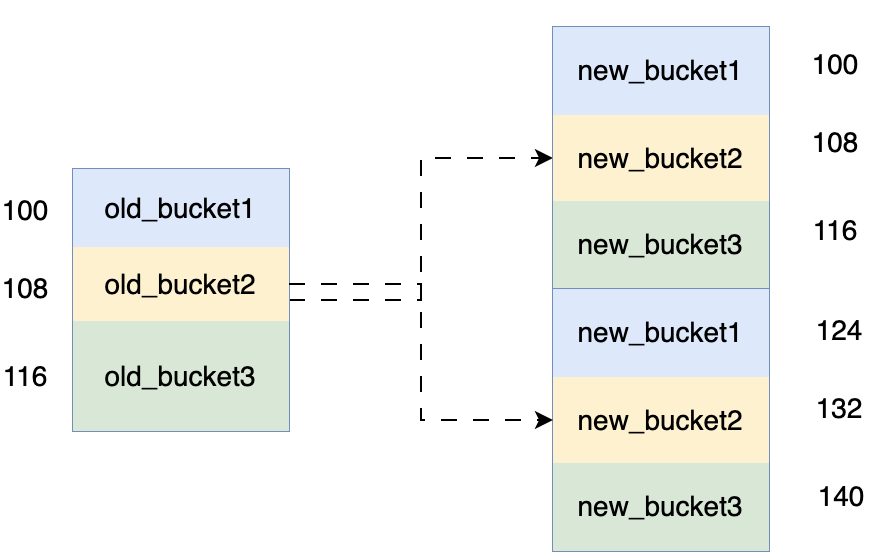

**回答**

因为map 在扩容后，会发生 key 的搬迁，原来落在同一个 bucket 中的 key，搬迁后，有些 key 的位置就会发生改变。而遍历的过程，就是按顺序遍历 bucket，同时按顺序遍历 bucket 中的 key。搬迁后，key 的位置发生了重大的变化，这样，遍历 map 的结果就不可能按原来的顺序了。所以，go语言，强制每次遍历都随机开始。

**推荐学习**

《golang学习与面试》[ map](https://ls8sck0zrg.feishu.cn/wiki/wikcnHgsHy2cgYi04sa8p0L8SHe) 

## 3. map 如何顺序读取？

**分析**

这个题目实际上是上一个题目的补充，因为map本身的遍历是不能顺序执行的，所以我们要达到一个顺序遍历的目的就不能用原map的遍历方式，要想顺序遍历，显然需要对map的key进行排序，然后，我们按照这个排完序之后的key从map里面取出对应的数据即可

代码示例：

程序输出

**回答**

如果想顺序遍历map,先把key放到切片排序,再按照key的顺序遍历map

## 4.  map 中删除一个 key，它的内存会释放么？

**分析**

考察map中key的删除原理，map删除key的时候是根据hash值找对对应的槽位，找对对应的key删除，将key置为空，并且将对应的tophash置为emptyOne，如果后面没有任何数据了，则再将emptyOne状态置为emptyReset，所以删除一个key，只是修改对应内存位置的值，并不会释放内存

回顾：

假设当前map的状态如下图所示，溢出桶2后面没有在接溢出桶，或者是溢出桶2后面接的溢出桶中没有数据，溢出桶2中有三个空槽，即第2，3，6处为emptyOne，

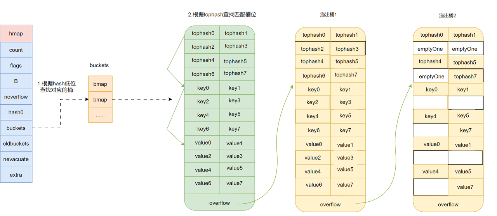

在删除了溢出桶1的key2和key4，以及溢出桶2的key7之后，对应map状态如下：

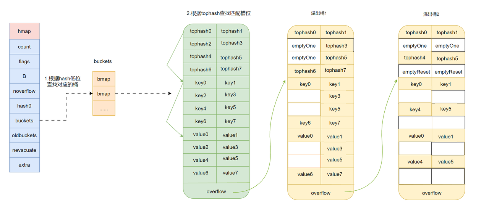

**回答**

不会释放，删除一个key，可以认为是标记删除，只是修改key对应内存位置的值为空，并不会释放内存，只有在置空这个map的时候，整个map的空间才会被垃圾回后释放

**推荐学习**

《golang学习与面试》[ map](https://ls8sck0zrg.feishu.cn/wiki/wikcnHgsHy2cgYi04sa8p0L8SHe) 

## 5. 怎么处理对 map 进行并发访问？有没有其他方案？ 区别是什么？

**分析**

主要考察对加锁运用熟悉程度以及对go语言中内置的sync.map的了解，要使用线程安全的map，一般有这两种方式

- 加锁
- sync.map

同时，要明确这两种方式的性能比较，sync.map在性能上要优于map加锁，因为sync.map在底层使用了两个map，read和dirty来提升性能，对read的操作时原子操作不用加锁，只有在对read操作不能满足要求时才会加锁操作dirty，这样就减少了加锁的场景，锁竞争频率会减小，所以性能会高于单纯的map加锁，在回答的时候要突出sync.map的read和dirty，以及锁竞争的频率。

**回答**

对map进行加读写锁或者是使用sync.map

和原始map+RWLock的实现并发的方式相比，减少了加锁对性能的影响。它做了一些优化：可以无锁访问read map，而且会优先操作read map，倘若只操作read map就可以满足要求，那就不用去加锁操作write map(dirty)，所以在某些特定场景中它发生锁竞争的频率会远远小于map+RWLock的实现方式

**优点：**

适合读多写少的场景

**缺点：**

写多的场景，会导致 read map 缓存失效，需要加锁，冲突变多，性能急剧下降

## 6.  nil map 和空 map 有何不同？

**分析**

主要考察细节对各种情况下的map的读写情况，结合代码示例理解

**回答**

1. 未初始化的map为nil map，
   1. 往值为nil的map添加值，会触发**panic**
   2. 读取值为nil的map，不会报错
   3. 删除值为nil的map，不会报错
2. 已经初始化，没有任何元素的map为空map，对空map增删改查不会报错

## 7. map 的数据结构是什么？是怎么实现扩容？

**分析**

map的底层实现其实是一个hmap的结构，其中包括一个buckets指针，指向一个bmap的数组，bmap数组每个元素是一个bmap结构，称之为桶，每个桶内存储着8个tophash和8个key-value的键值对，以及指向下一个溢出桶的指针。回答要突出hmap，bmap，tophash，以溢出指针overflow

hmap结构定义：

底层结构：

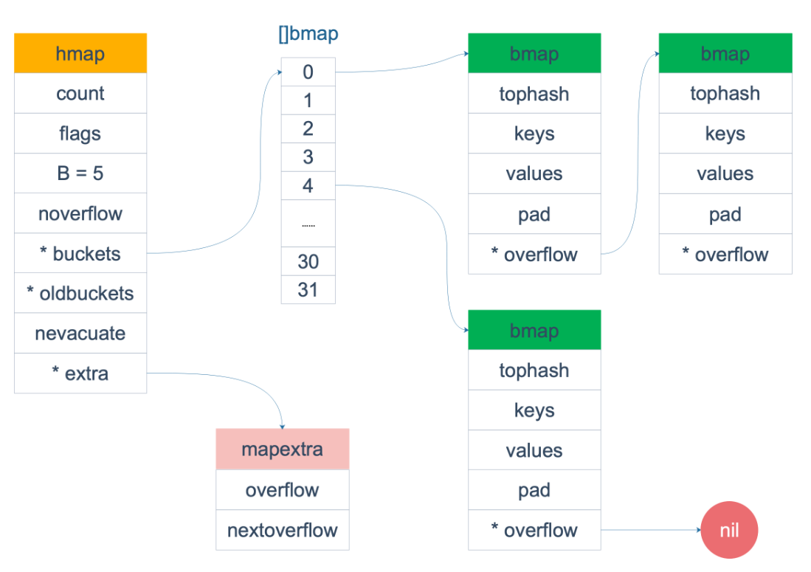

**回答**

Map的底层实现数据结构实际上是一个哈希表。在运行时表现为个指向hmap结构的指针，hmap中有记录了桶数组指针buckets，溢出桶指针以及元素个数等字段。每个桶是一个bmap的数据结构，可以存储8个键值对和8个tophash以及指向下一个溢出桶的指针overflow。为了内存紧凑，采用的是先存8个key过后再存value.

**map怎么实现扩容**

**分析**

这个问题作为上一个问题的补充，其实在回答的时候也要参考map的底层结构，回答扩容一定要涵盖扩容策略，扩容时机，扩容方式(渐进式扩容)

**回答**

扩容时机：

向 map 插入新 key 的时候，会进行条件检测，符合下面这 2 个条件，就会触发扩容

- 扩容条件：
  1. 超过负载 map元素个数 > 6.5（负载因子） * 桶个数，触发双倍扩容
  2. 溢出桶太多，触发等量扩容

     当桶总数<2^15时，如果溢出桶总数>=桶总数，则认为溢出桶过多

     当桶总数>2^15时，如果溢出桶总数>=2^15，则认为溢出桶过多

扩容机制：

双倍扩容：新建一个buckets数组，新的buckets数量大小是原来的2倍，然后旧buckets数据搬迁到新的buckets。

等量扩容：并不扩大容量，buckets数量维持不变，重新做一遍类似双倍扩容的搬迁动作，把松散的键值对重新排列一次，使得同一个 bucket 中的 key 排列地更紧密，节省空间，提高 bucket 利用率，进而保证更快的存取。

扩容方式： 扩容过程并不是一次性进行的，而是采用的渐进式扩容，在插入修改删除key的时候，都会尝试进行搬迁桶的工作，每次都会检查oldbucket是否nil，如果不是nil则每次搬迁2个桶，蚂蚁搬家一样渐进式扩容

**推荐学习**

《golang学习与面试》[ map](https://ls8sck0zrg.feishu.cn/wiki/wikcnHgsHy2cgYi04sa8p0L8SHe) 

## 8. map 的 key 为什么得是可比较类型的？

**分析**

- 本题主要考察go语言map中如何通过一个key计算得到它在桶中的位置
  - 第一步：根据key来计算出一个hash值(64位的，当然与机器位数挂钩)
  - 第二步：然后根据hash值的低B位锁定桶号(找到对应的bucket)
  - 第三步：接着在桶中找到对应的槽位(找到对应的一个cell)
- 但是这里会存在一个hash冲突的问题，并不是找到了这个槽位就是当前key的位置，因为可能有其他的key和这个key计算出的hash值相同，那么显然槽位也就一样，
- 所以还有第四步：进而比较key本身，来获取当前key的位置，所以key一定要是可比较的

所以在回答时，一定要重点突出会存在hash冲突，然后会比较key本身

**回答**

- 首先map 的 key、value 是存在 buckets 数组里的，而每个 bucket 又可以容纳 8 个 key 和 8 个 value。
- 当要插入一个新的 key - value 时，会对 key 进行 hash 运算得到一个 hash 值，然后根据 hash 值 的低B位(取几位取决于桶的数量，比如一开始桶的数量是4，则取低2位)来决定命中哪个 bucket。
  - bucket数量 = 2^B
- 在命中某个 bucket 后，又会根据 hash 值的高 8 位来决定是 8 个 key 里的哪个位置。如果不巧，发生了 hash 冲突，即该位置上已经有**其他 key** 存在了，则会去其他空位置寻找插入。如果全都满了，则使用 overflow 指针指向一个新的 bucket，重复刚刚的寻找步骤。

从上面的流程可以看出，在判断 hash 冲突，即该位置是否已有**其他 key** 时，肯定是要进行比较的，所以 key 必须得是可比较类型的。像 **slice、map、function **就不能作为 key。

**推荐学习**

《golang学习与面试》[ map](https://ls8sck0zrg.feishu.cn/wiki/wikcnHgsHy2cgYi04sa8p0L8SHe) 

# sync.Map相关

## 1. sync.Map的底层原理

**分析:**

- 对于sync.Map的底层原理，我们回答的核心点围绕，sync.Map如何保证并发安全，并减少锁操作的原理

**回答**

> 空间换时间、数据的动态流转、entry状态的设计

- sync.Map采用 空间换取时间的取舍策略 以及 实时动态的数据流转策略，期望使用read map来尽量将读、更新、删除操作的流量用无锁化的操作挡下来，避免去加锁去访问拥有全量数据的dirty map
- sync.Map对于k-v对里面的v，还设计了两种删除状态，一种是为nil的软删除态，一种是为expunged的硬删除态
  - nil态可以拦截删除操作在read map这一层
  - expunged态可以正确标识dirty map中有没有对应的逻辑删除的key-entry

## 2. read map和dirty map之间的关联？

**分析:**

- read map和dirty map作为sync.Map中的两个最重要的结构，他们互帮互助，read map为dirty map尽量用轻便的原子操作挡住读、更新、删的流量，而dirty map也为read map提供最终的兜底手段
- 同时 read map和dirty map数据有互相流转的过程

**回答**

- read 可以当做 dirty的保护层map，尽量用轻便的原子操作将流量拦截在read，防止加锁访问dirty
- dirty 当做read的兜底层map，如果在read 中没有完成的操作，最终需要加锁，然后尝试在dirty 完成兜底
- 当因为miss read而访问dirty的次数等于dirty的长度时，需要将dirty map提升到read map，并置dirty为nil
- 当dirty map为nil，会在Store里面触发dirtyLocked流程，这个流程会遍历read map，将所有非删除状态的k-entry对写入到新dirty 里面去

《golang学习与面试》[ Sync.Map(图文并茂版) ](https://ls8sck0zrg.feishu.cn/wiki/BbgbwlL9OiZWQQkIErmc1EhZnPZ)

## 3. 为什么要设计nil和expunged状态？

**分析:**

- dirty map用于最终数据兜底，如果每次我们删除操作，直接删除dirty中对应k-entey对，但后面又对这个k进行写操作，那就导致多次加锁操作
- 设计nil状态来标记k-entry对已经被逻辑删除了，但是k-entry还存在于read map和dirty map中，如果想对一个删除的key，再进行写，那么也可以通过在read map中解决
- 而设计expunged状态是为了正确标识出key-entry对是否存在于dirty map中
- nil状态是软删除状态，代表逻辑上k-v被删除了，但是k-entry对还存在与read map和dirty map中
- expunged态是硬删除态，也是逻辑上k-v删除了，但是k-entey对只存在read map中

**回答:**

- nil态是软删除态，可以让删除操作的流量在read map层挡住，防止加锁，去删除dirty map中的数据
- expunged态是硬删除态，也是逻辑上k-v删除了，但是k-entey对只存在read map中，能正确标识出key-entry对是否存在于dirty map中

## 4. sync.Map 适用的场景？

**分析：**

因为我们期望将更多的流量在read map这一层进行拦截，从而避免加锁访问dirty map
对于更新，删除，读取，read map可以尽量通过一些原子操作，让整个操作变得无锁化，这样就可以避免进一步加锁访问dirty map
倘若写操作过多，sync.Map 基本等价于一把互斥锁 + map，所以我们要尽可能避免写多的场景，场景应用贴合读多，更新多，删多

**回答:**

sync.Map 是适用于读多、更新多、删多、写少的场景

**推荐学习：**

《golang学习与面试》[ sync.map](https://ls8sck0zrg.feishu.cn/wiki/wikcnVMjpTUkU9cbbpSvqHl9swc) 

## 5. 你认为sync.Map有啥不足吗？

**分析：**

对于sync.map，在dirtyLocked流程中，需要遍历整个read map，完成两步工作

- 更新read map中的删除状态，将软删除态（nil） 变成 硬删除态（expunged）
- 将read map中非删除态的key-entry对 写入到 dirty map中

dirtyLocked这整个流程是加锁的，如果在sync.map数据量比较大情况下，会引发性能抖动问题，因为这个时候其他goroutine想要访问dirty map拿锁就只能阻塞起来，存在很大的隐患

> 也是因为这个原因，我们的雅哥`@九哥`开源项目https://github.com/HDT3213/godis 在实现并发安全map的时候没有采用sync.map，最终选择的是分段锁map

**回答：**

- sync.Map不适用于写多的场景，因为写操作足够多的话，sync.Map就相当于一把Mutex+Map
- 而且sync.Map中存在一个将read map数据流转到 dirty map的过程，这个过程是线性时间复杂度，当map中k-v数量较多的时候，容易导致程序性能抖动，比如想要访问sync.Map拿锁操作的goroutine 一直等待这个线性时间复杂度的过程完成

**推荐学习：**

《golang学习与面试》[ sync.map（有空再学底层原理，可以放到后面）](https://ls8sck0zrg.feishu.cn/wiki/wikcnVMjpTUkU9cbbpSvqHl9swc) 

Godis 并发安全map实现——https://github.com/hdt3213/godis/blob/master/datastruct/dict/concurrent.go

## 6. 补充知识——分段锁map是什么

保证map的并非安全，最简单的做法就是直接用锁来进行保护，比如加读写锁保护，但是这样锁的粒度比较大，加锁直接锁住了整个map，性能很差

分段锁的核心思想:
 1.数据分片：将整个Map划分为多个段，每个段包含独立的子Map和锁。
2. 锁粒度细化：操作时仅锁定目标数据所在的段，其他段仍可并发访问，减少锁竞争

适用写多或Key分布均匀的场景，在选择sync.Map和分段锁map，优先考虑的就是应用场景下读写流量的比例，像sync.Map只适用了读多写少的场景，如果读写流量中写流量占比较大 或者 无法在使用之初确定读写流量比例，那就可以直接选择使用分段锁map

# Interface相关

## 1. Go语言中，interface的底层原理是怎样的？

**回答：**

Go的interface底层有两种数据结构：eface和iface。

eface是空interface{}的实现，只包含两个指针：`_type`指向类型信息，`data`指向实际数据。这就是为什么空接口能存储任意类型值的原因，通过类型指针来标识具体类型，通过数据指针来访问实际值。

iface是带方法的interface实现，包含`itab`和`data`两部分。`itab`是核心，它存储了接口类型、具体类型，以及方法表。方法表是个函数指针数组，保存了该类型实现的所有接口方法的地址。

**分析：**

eface定义：

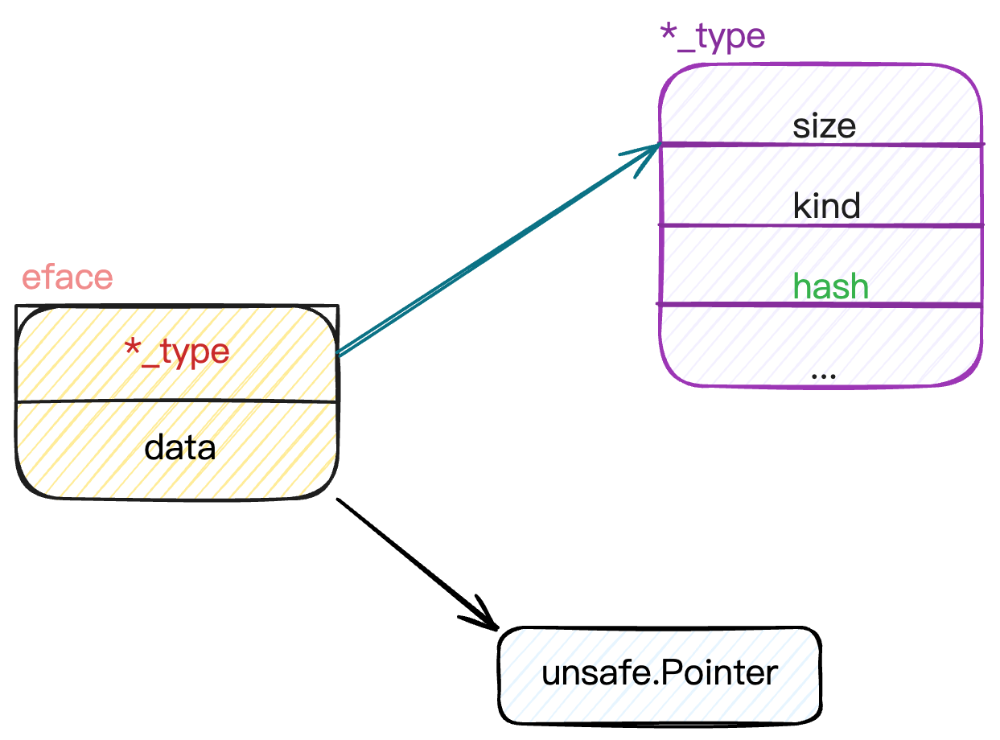

iface定义：

其中itab的结构定义如下：

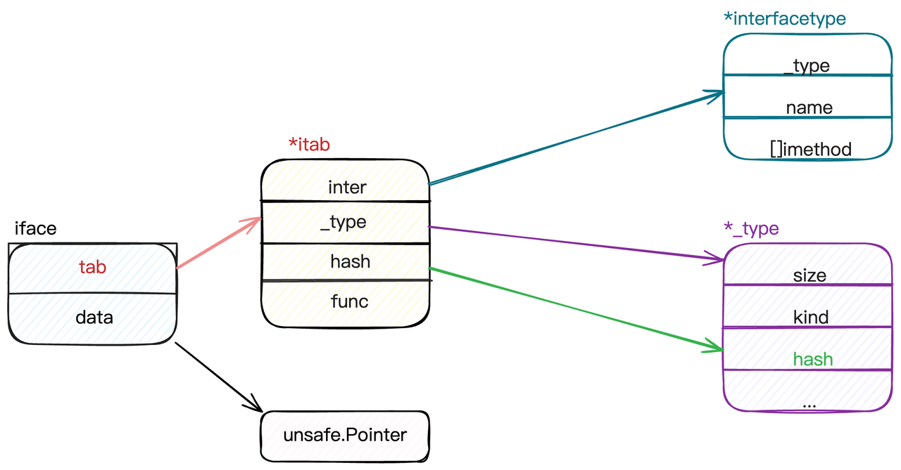

## 2. iface和eface的区别是什么？

iface和eface的核心区别在于是否包含方法信息。

eface是空接口interface{}的底层实现，结构非常简单，只有两个字段：`_type`指向类型信息，`data`指向实际数据。因为空接口没有方法约束，所以不需要存储方法相关信息。

iface是非空接口的底层实现，结构相对复杂，包含`itab`和`data`。关键是这个`itab`，它不仅包含类型信息，还包含了一个方法表，存储着该类型实现的所有接口方法的函数指针。

## 3. 类型转换和断言的区别是什么？

`类型转换`、`类型断言`本质都是把一个类型转换成另外一个类型。不同之处在于，类型断言是对接口变量进行的操作。对于类型转换而言，类型转换是在编译期确定的强制转换，转换前后的两个类型要相互兼容才行，语法是`T(value)`。而类型断言是运行期的动态检查，专门用于从接口类型中提取具体类型，语法是`value.(T)`

**安全性差别很大**：类型转换在编译期保证安全性，而类型断言可能在运行时失败。所以实际开发中更常用安全版本的类型断言`value, ok := x.(string)`，通过ok判断是否成功。

**使用场景不同**：类型转换主要解决数值类型、字符串、切片等之间的转换问题；类型断言主要用于接口编程，当你拿到一个interface{}需要还原成具体类型时使用。

**底层实现也不同**：类型转换通常是简单的内存重新解释或者数据格式调整；类型断言需要检查接口的底层类型信息，涉及到runtime的类型系统。

## 4. Go语言interface有哪些应用场景

1. **依赖注入和解耦**。通过定义接口抽象，让高层模块不依赖具体实现，比如定义一个`UserRepo`接口，具体可以是MySQL、Redis或者Mock实现。这样代码更容易测试和维护，也符合SOLID原则。
2. **多态实现**。比如定义一个`Shape`接口包含`Area()`方法，不同的图形结构体实现这个接口，就能用统一的方式处理各种图形。这让代码更加灵活和可扩展。
3. **标准库中大量使用interface来提供统一API**。像`io.Reader`、`io.Writer`让文件、网络连接、字符串等都能用统一的方式操作；`sort.Interface`让任意类型都能使用标准库的排序算法。
4. **还有类型断言和反射的配合使用**，比如JSON解析、ORM映射等场景，先用`interface{}`接收任意类型，再通过类型断言或反射处理具体逻辑。
5. **插件化架构也heavily依赖interface**。比如Web框架的中间件、数据库驱动、日志组件等，都通过接口定义规范，让第三方能够轻松扩展功能。

## 5. 接口之间可以相互比较吗？

**回答：**

1. 接口值之间可以使用 `==`和 `!＝`来进行比较。两个接口值相等仅当它们都是nil值，或者它们的动态类型相同并且动态值也根据这个动态类型的==操作相等。如果两个接口值的动态类型相同，但是这个动态类型是不可比较的（比如切片），将它们进行比较就会失败并且panic。
2. 接口值在与非接口值比较时，Go会先将非接口值尝试转换为接口值，再比较。
3. 接口值很特别，其它类型要么是可比较类型（如基本类型和指针）要么是不可比较类型（如切片，映射类型，和函数），但是接口值视具体的类型和值，可能会报出潜在的panic。

**分析：**

接口类型和 `nil` 作比较

接口值的零值是指`动态类型`和`动态值`都为 `nil`。当仅且当这两部分的值都为 `nil` 的情况下，这个接口值就才会被认为 `接口值 == nil`。

程序输出：

一开始，`c` 的 动态类型和动态值都为 `nil`，`g` 也为 `nil`，当把 `g` 赋值给 `c` 后，`c` 的动态类型变成了 `*main.Gopher`，仅管 `c` 的动态值仍为 `nil`，但是当 `c` 和 `nil` 作比较的时候，结果就是 `false` 了。

# GMP 相关：

## 1. 什么是 GMP？（必问）调度过程是什么样的？（对流程熟悉，要求更高，问的较少）

**什么是 GMP ？**

**分析**

gmp模型是go语言中的协程调度模型

**G,M,P简单介绍**

G：Goroutine
M: 内核线程，每个m都有1个特殊的协程g0，这个g0主要负责协程调度和切换，goroutine只有绑定到m上才能够正常运行
P: 逻辑处理器Processor 吧，包含goroutine本地队列，队列长度为256，当有 goroutine 要创建时，会被添加到 P 上的 goroutine 本地队列上，如果 P 的本地队列已满，则会维护到全局队列里

**P和M的创建时机**

P何时创建：在确定了P的最大数量n后，运行时系统会根据这个数量创建n个P。

M何时创建：没有足够的M来关联P并运行其中的可运行的G。比如所有的M此时都阻塞住了，而P中还有很多就绪任务，就会去寻找空闲的M，而没有空闲的，就会去创建新的M。

**回答**

gmp是go语言协程调度模型，g代表goroutine，m代表内核线程，p代表逻辑处理器，p中包含本地g队列，g通过p绑定到m才能真正运行

**调度过程是怎样的？**

**分析**

上面回答了gmp是go语言的协程调度模型，这个问题是对上一个问题的补充提问，进一步回答协程是怎样调度的。协程的调度是一个很复杂的过程，尽然是调度，肯定涉及到协程的上下文切换，调度策略以及调度时机还有调度过程，下面分为这几个场景来简单回顾一下，在回答这个提的时候不用这么详细，主要介绍协程的调度策略和调度时机即可。但是对于调度过程细问，比如问协程会给你上下文切换保存了哪些寄存器，发生调度的时机等问题要做到心中有数

**协程上下文切换过程**

协程的调度主要是发生在用户的goroutine和g0之间，

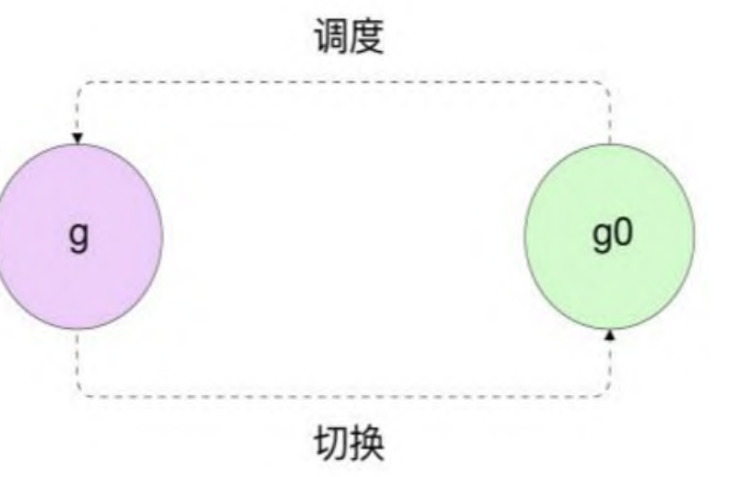

协程经过g——>g0——>g的过程就完成了一次调度循环，一次协程调度过程跟线程的调度一样，也会发生协程的上下文切换，同样需要保存协程的执行现场，这样才能够切回g接着上次继续执行，协程的执行现场主要是几个寄存器的值，分别是rsp，rip，rbp。

rsp: 指向函数调用的栈顶

rip：指向程序要执行的下一条指令地址

rbp：存储函数栈帧的起始地址

 这些寄存器主要保存在goroutine的sched这个字段结构中，goroutine的结构如下：

**调度策略**

协程的调度过程可以认为是m寻找一个可以运行的g来运行的过程，优先从 P 的本地队列获取 goroutine 来执行；如果本地队列没有，从全局队列获取，如果全局队列也没有，从网络轮询器中查找是否有 Goroutine 等待运行；

还是没有获取到，则会从其他的 P 上偷取 goroutine。

但是这种调度策略存在一个问题，如果本地p队列一直有g的话，那么全局队列的g可能完全没有机会执行？

所以，go的调度器在每执行61次调度，就会优先从全局队列获取一个g放到当前p队列。

如果本地运行队列已经满了，那么无法从 全局运行队列调用并放入怎么办？

如果本地运行队列 满了，那么调度器会将本地运行队列的一半放入全局队列。这保 证了当程序中有很多协程时，每个协程都有执行的机会

**调度模式**

调度模式一般有两种，抢占式和协作式，协作式调度依靠被调度方主动弃权；抢占式调度则依靠调度器强制将被调度方被动中断

**发生调度的时机**

- 等待读取或写入未缓冲的通道
- 由于 time.Sleep() 而等待
- 等待互斥量释放
- 发生系统调用

**回答**

协程在刚创建的时候，会优先加到当前p的本地队列中，等待被调度，当这个p队列满了的时候，本地队列满了时，会将本地队列的一半 G 和新创建的 G 一起放入全局队列。每个m都有一个特殊的协程g0负责调度工作，每一轮调度过程是这样的，M 优先执行其所绑定的 P 的本地运行队列中的 G，如果本地队列没有 G，则会从全局队列获取，为了**提高效率和负载均衡**，会从全局队列获取多个 G，而不是只取一个，同样，当全局队列没有时，会从其他 M 的 P 上偷取 G 来运行，偷取的个数通常是其他 P 运行队列的一半；如果还没有获取到g，则m就处于自旋状态。

**推荐学习**

《golang学习与面试》[ GMP调度原理](https://ls8sck0zrg.feishu.cn/wiki/wikcnJnSidRVVmCmLLzoYHBRfzg) 

https://learnku.com/articles/41728

## 2. **GMP能不能去掉P层？会怎么样？**

**分析**

主要考察对p的作用的理解，因为在期初的时候，是单纯的gm模型，是没有p的，为什么会被弃用呢？假设没有p的话，也就没有本地p的g队列，则所有的m都将去同一个全局队列获取可用g，这样势必会有锁竞争问题，所以回答可以抓住这个点，从性能加以分析

**回答**

- 每个 P 有自己的本地队列，大幅度的减轻了对全局队列的直接依赖，所带来的效果就是锁竞争的减少。而 GM 模型的性能开销大头就是锁竞争。
- 每个 P 相对的平衡上，在 GMP 模型中也实现了 Work Stealing 算法，如果 P 的本地队列为空，则会从全局队列或其他 P 的本地队列中窃取可运行的 G 来运行，减少空转，提高了资源利用率。

## 3. M 和 P 的数量问题？

**分析**

其实是上一个问题的补充问题，考察对gmp模型的了解深不深入，

**P的数量：**

由启动时环境变量`$GOMAXPROCS`或者是由`runtime`的方法`GOMAXPROCS()`决定

**M的数量**:

go语言本身的限制：go程序启动时，会设置M的最大数量，默认10000.但是内核很难支持这么多的线程数

runtime/debug中的SetMaxThreads函数，设置M的最大数量

一个M阻塞了，会创建新的M。

**G的数量：**

理论上没有限制，受限于内存，但是goroutine过多会影响程序性能

## 4. 进程、线程、协程有什么区别？

**分析**

进程，线程，还有协程都是并发单元，但是具体又有不同，在分析三者区别的时候可以从大小，调度，资源分配还有用户态或者是内核态等几个方面进行分析

**回答**

进程可以理解为一个动态的程序，进程是操作系统资源分配的基本单位，而线程是操作系统调度的基本单位，进程独占一个虚拟内存空间，而进程里的线程共享一个进程虚拟内存空间。线程的粒度更小，一个进程可以有多个线程

协程可以理解为用户态线程，跟线程的区别主要有三个方面

1. 大小，协程大小为2k，可以动态扩容，而线程大小为2m,协程更轻量
2. 线程切换需要用户态到内核态的切换，而协程的切换不用，只在用户态完成，线程切换需要保存各种寄存器，而协程切换只需要保存rsp，rip，rbp三个寄存器，协程切换消耗更小
3. 线程的调度由操作系统完成，而协程的调度由运行时的调度器完成

## 5. 抢占式调度是如何抢占的？

**分析**

本题其实是考察对go语言的协程调度方式的了解，一般的调度方式有两种，协作式和抢占式，协作式就是会主动让渡使用权，抢占式就是在一定情况下，使用权会被抢占。go语言的调度方式都是抢占式的，但是在Go1.14之前和Go1.14之后具体的抢占策略实现又有所不同，本题在回答的时候要注意区分go的版本，对Go1.14之前和之后的抢占策略熟悉，并且分析出Go1.14之后的抢占策略的优势

**go语言调度方式**

go语言的调度模式在Go1.14 之前是基于协作的抢占式调度，在Go1.14及以后实现了基于信号的抢占式调度（异步抢占）

Go1.14 之前

协作式调度就是m会主动让渡出p，让p可以与其他的m绑定，以下情况会发生这种主动让渡（协作调度）：

而在下面情况下会发生抢占：

- 同一个goroutine运行超过10ms

抢占的实现原理：

Go 会启动一个线程，一直运行着“sysmon”函数，该函数实现了抢占式调度（以及其他诸如使网络处理的等待状态变为非阻塞状态）的功能。sysmon 运行在 M（Machine，实际上是一个系统线程），且不需要 P（Processor）

当 sysmon 发现 M 已运行同一个 G（Goroutine）10ms 以上时，它会将该 G 的内部参数 `preempt` 设置为 true，

当 G 进行函数调用时，G 会检查自己的 `preempt` 标志，如果它为 true，则它将自己与 M 分离并推入goroutine的局部队列，局部队列满了，再放入全局队列。抢占完成。

但是通过上述过程可以看到，要发生抢占，有1个前提，那就是发生**函数调用**，如果没有函数调用，即使设置了抢占标志，也不会进行该标志的检查，自然也就不会执行抢占过程。所以下述代码：

设置单核情况下，在go1.14之前这个代码将正常运行，被阻塞住，因为不会发生调度，for循环这个死循环不是函数调用，所以`preempt` 标志检查这个阶段，不会发生抢占调度，这个goroutine不会被抢占，一直阻塞。

Go1.14 之后

sysmon 会检测到运行了 10ms 以上的 G（goroutine）。然后，sysmon 向运行 G 的 P 发送信号（SIGURG）。Go 的信号处理程序会调用P上的一个叫作 gsignal 的 goroutine 来处理该信号，将其映射到 M 而不是 G，并使其检查该信号。gsignal 看到抢占信号，停止正在运行的 G。

由于此机制会显式发出信号，因此无需调用函数，就能将正在运行死循环的 goroutine 切换到另一个 goroutine

通过使用信号的异步抢占机制，上面的代码现在就可以按预期工作。`GODEBUG=asyncpreemptoff=1` 可用于禁用异步抢占。

**回答**

Go1.14 之前是协作式抢占，Go 会启动一个线程，一直运行着“sysmon”函数，该函数实现了抢占式调度（以及其他诸如使网络处理的等待状态变为非阻塞状态）的功能。sysmon 运行在 M（Machine，实际上是一个系统线程），且不需要 P（Processor）

当 sysmon 发现 M 已运行同一个 G（Goroutine）10ms 以上时，它会将该 G 的内部参数 `preempt` 设置为 true，

当 G 进行函数调用时，G 会检查自己的 `preempt` 标志，如果它为 true，则它将自己与 M 分离并推入goroutine的全局队列，抢占完成

Go1.14 之后是 异步式 抢占，基于信号。sysmon 会检测到运行了 10ms 以上的 G（goroutine）。然后，sysmon 向运行 G 的 M发送信号（SIGURG）。Go 的信号处理程序会调用M上的一个叫作 gsignal 的 goroutine 来处理该信号，并使其检查该信号。gsignal 看到抢占信号，停止正在运行的 G。

基于信号量的抢占可以防止类似于死循环这种没有发生函数调用的goroutine一直占用cpu导致程序阻塞，提高了程序的合理性

**推荐学习**

《golang学习与面试》[ GMP调度原理](https://ls8sck0zrg.feishu.cn/wiki/wikcnJnSidRVVmCmLLzoYHBRfzg) 

https://learnku.com/articles/41728

# sync相关：

## 1. 除了 mutex 以外还有那些方式安全读写共享变量？

**分析**

考察go语言中对数据竞争的解决方案，在go语言中有锁，信号量还有channel三种方式实现，回答的时候要出现信号量以及channel关键字

1. 用信号量实现互斥功能

程序输出

- 用channel实现互斥功能

程序输出

- mutex实现互斥

程序输出

**回答**

- 将共享变量的读写放到一个 goroutine 中，其它 goroutine 通过 channel 进行读写操作。
- 可以用个数为 1 的信号量（semaphore）实现互斥

**推荐学习**

https://www.bilibili.com/video/BV1hv411x7we?spm_id_from=333.788.videopod.episodes&vd_source=cc9cc8dfd848ca60c1bf76f733bc2db3&p=24

《golang学习与面试》[ channel](https://ls8sck0zrg.feishu.cn/wiki/wikcn8zirn3I2ePNHDrTGeuvA5f) 

《golang学习与面试》[ Sync](https://ls8sck0zrg.feishu.cn/wiki/wikcnFCOmm59zf58OttOLPmLZSe) 

## 2. Go 如何实现原子操作？

**分析**

主要考察对go语言中原子操作基本方法是否了解，是否使用过，在回答的时候，要突出go语言实现的原子操作在sync/atomic包下面实现，提供了store，add等方法。

**回答**

原子操作是一组不可中断的指令序列，由底层硬件支持，go语言的原子操作由sync/atomic包提供，主要提供了下面的一些方法：

T的类型是`int32`、`int64`、`uint32`、`uint64`和`uintptr`中的任意一种

**推荐学习**

《golang学习与面试》[ Sync](https://ls8sck0zrg.feishu.cn/wiki/wikcnFCOmm59zf58OttOLPmLZSe) 

https://gfw.go101.org/article/concurrent-atomic-operation.html

## 3. **原子操作和锁的区别**

**分析**

原子操作和锁都是可以用来保证线程安全，但是二者在实现原理以及使用方式上都存在着很大的区别，有哪些区别呢？要回答这个问题，可以从二者的实现方式，作用范围，还有使用场景，以及锁类型等几个方面说来分析

**回答**

原子操作由底层硬件支持，而锁是基于原子操作+信号量完成的。若实现相同的功能，前者通常会更有效率

原子操作是单个指令的互斥操作；互斥锁/读写锁是一种数据结构，可以完成临界区（多个指令）的互斥操作，扩大原子操作的范围

原子操作是无锁操作，属于乐观锁；说起锁的时候，一般属于悲观锁

## 4. Mutex 是悲观锁还是乐观锁？悲观锁、乐观锁是什么？

**分析**

首先要明确什么是悲观锁，什么是乐观锁

- 乐观锁：乐观锁在操作数据时非常乐观，认为别人不会同时修改数据。因此乐观锁不会上锁，只是在执行更新的时候判断一下在此期间别人是否修改了数据：如果别人修改了数据则放弃操作，否则执行操作。
- 悲观锁：悲观锁在操作数据时比较悲观，认为别人会同时修改数据。因此操作数据时直接把数据锁住，直到操作完成后才会释放锁；上锁期间其他人不能修改数据。

然后再看mutex满足哪种性质，其实很明确，Mutex并没有在操作的时候假定别人不会修改数据，然后在真正更新的时候去比对数据是否被修改，所以go语言中的mutex是悲观锁

**回答**

乐观锁和悲观锁其实是两种锁思想，乐观锁假定别人不会修改数据，在操作数据的时候，查看一次数据，然后修改完真正生效的时候在查看一下数据有没有发生变化，如果发生变化，则认为数据被修改，有并发问题，放弃操作，否则执行操锁。而悲观所就是时时刻刻认为有其他操作者修改数据，每次操作数据的时候，都尝试把数据锁住，操作期间其他人不能修改数据，直至锁被释放。

Mutex是悲观锁，Go sync包提供了两种锁类型：互斥锁sync.Mutex 和 读写互斥锁sync.RWMutex，都属于悲观锁。

## 5. **互斥锁mutex底层是怎么实现的？**

**分析**

首先要熟悉mutex的底层定义

以及明确各个字段的含义及作用

state 是32位的整型变量，内部实现是把它分成了四份，用来记录 Mutex 的四种状态。Mutex 的内部布局

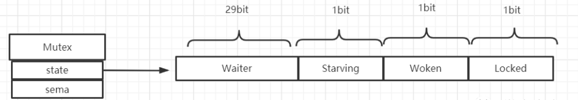

- Waiter: 表示阻塞等待锁的协程个数，协程解锁时根据此值来判断是否需要释放信号量。
- Starving：表示该 Mutex 是否处于饥饿状态， 0：没有饥饿 1：饥饿状态，说明有协程阻塞了超过1ms。
- Woken: 表示是否有协程已被唤醒，0：没有协程唤醒 1：已有协程唤醒，正在加锁过程中。
- Locked: 表示该 Mutex 是否已被锁定，0：没有锁定 1：已被锁定。

sema是一个uint32类型的整数，用于协程排队和唤醒，协程阻塞等待该信号量，解锁的协程释放信号量从而唤醒等待这个信号量的协程

**回答**

mutex底层是通过原子操作加信号量来实现的，通过atomic 包中的一些原子操作来实现锁的锁定，通过信号量来实现协程的阻塞与唤醒

**推荐学习**

https://www.bilibili.com/video/BV1hv411x7we?p=21

https://mp.weixin.qq.com/s/z339qcv3rQSSsfZlhpITFA

https://mp.weixin.qq.com/s/j0NCgrU6M8ps0zIOkOT3FQ

https://mp.weixin.qq.com/s/irXUkd9CZMInTUTu7pbriQ

## 6. Mutex 有几种模式？

**分析**

这个题目可以看作是上一个问题的补充问题，在明白了锁的实现原理之后，通过state字段的倒数第三位Starving可以判断出锁是否处于饥饿模式，所以锁可以处于两种不同模式，正常模式。在不同的模式下，所得获取方式存在差别。

在正常模式下，锁的等待者会按照先进先出的顺序获取锁。但是刚被唤起的 Goroutine 与新创建的 Goroutine 竞争时，大概率会获取不到锁，在这种情况下，这个被唤醒的 Goroutine 会加入到等待队列的前面。 如果一个等待的 Goroutine 超过1ms 没有获取锁，那么它将会把锁转变为饥饿模式。

在饥饿模式中，互斥锁会直接交给等待队列最前面的 Goroutine。新的 Goroutine 在该状态下不能获取锁、也不会进入自旋状态，它们只会在队列的末尾等待。如果一个 Goroutine 获得了互斥锁并且它是处在队列的末尾或者它获得锁之前等待的时间少于 1ms，那么当前的互斥锁就会切换回正常模式。

**回答**

两种，正常模式和饥饿模式

|模式 |描述 |公平性 |
|---|---|---|
|正常模式 |正常模式下所有的goroutine按照FIFO的顺序进行锁获取,被唤醒的goroutine和新请求锁的goroutine同时进行锁获取，通常新请求锁的goroutine更容易获取锁 |否 |
|饥饿模式 |饥饿模式所有尝试获取锁的goroutine进行等待排队，新请求锁的goroutine不会进行锁获取，而是加入队列尾部等待获取锁 |是 |

**推荐学习**

https://www.bilibili.com/video/BV1hv411x7we?p=21

https://mp.weixin.qq.com/s/z339qcv3rQSSsfZlhpITFA

https://mp.weixin.qq.com/s/j0NCgrU6M8ps0zIOkOT3FQ

https://mp.weixin.qq.com/s/irXUkd9CZMInTUTu7pbriQ

https://mp.weixin.qq.com/s/bCUmKDSqlJnm6KEx3ZpsxA

## 7. 在Mutex上自旋的goroutine 会占用太多资源吗

**分析**

首先要明白什么是goroutine的自旋状态，goroutine自旋是指当一个线程在获取锁的时候，如果锁已经被其他协程获取，那么该协程将循环等待，然后不断地判断是否能够被成功获取，直到获取到锁才会退出循环。

从这里就可以看出goroutine的自旋状态会消耗cpu资源，导致cpu一定时间的空转。所以长时间处于自旋状态肯定是不合理的。所以自旋状态一定要满足一定的条件

比如次数不能过多，锁要不能处于饥饿模式，不然其他goroutine将很难获取到锁，以及处理器的个数，比如在单核下自旋是没有意义的，因为同一只有一个线程可以运行，要获取锁只能等当前线程释放，自旋自然没有意义，所以，在回答的时候可以从以上几个方面来考虑。

**回答**

goroutine自旋要满足一定的条件：

1. 还没自旋超过 4 次
2. 锁已被占用，并且锁不处于饥饿模式
3. 多核处理器，
4. GOMAXPROCS > 1，
5. p 上本地 goroutine 队列为空。

mutex 会让当前的 goroutine 去空转 CPU，在空转完后再次调用 CAS 方法去尝试性的占有锁资源，直到不满足自旋条件，则最终会加入到等待队列里，结束自旋。综上所述，自选条件下其实是不会占用太多资源的，首先不在饥饿模式，而且资源有一定的次数限制，超过4次就会结束自旋

|模式 |描述 |公平性 |
|---|---|---|
|正常模式 |正常模式下所有的goroutine按照FIFO的顺序进行锁获取,被唤醒的goroutine和新请求锁的goroutine同时进行锁获取，通常新请求锁的goroutine更容易获取锁 |否 |
|饥饿模式 |饥饿模式所有尝试获取锁的goroutine进行等待排队，新请求锁的goroutine不会进行锁获取，而是加入队列尾部等待获取锁 |是 |

**推荐学习**

https://www.bilibili.com/video/BV1hv411x7we?p=21

https://mp.weixin.qq.com/s/z339qcv3rQSSsfZlhpITFA

https://mp.weixin.qq.com/s/j0NCgrU6M8ps0zIOkOT3FQ

https://mp.weixin.qq.com/s/irXUkd9CZMInTUTu7pbriQ

## 8. 读写锁底层是怎么实现的

**分析**

首先回顾一下读写锁的底层定义

从RWMutex的定义可以看出，读写锁里面有一个互斥锁mutex存在，所以在实现上一定会基于mutext，但是多了其余的一些字段，用于记录读锁加锁次数，当前正在读的goroutine数量，以及写阻塞时等待完成的读goroutine数量。

加锁过程：

加读锁：若锁处于空闲状态，那么直接获取读锁，若有协程持有写锁，那么无法获取读锁，当前goroutine休眠

加写锁：获取写锁要用到mutex和readerWait，首先获取mutex，获取成功之后，若readerWait大于0，此时有goroutine占用了读锁，那么加写锁阻塞，若没有goroutine占用读锁，加写锁成功

解锁过程：

释放读锁：直接释放读锁；若有goroutine等待加写锁，则在释放读锁之后会将readerWait减1，当readerWait减到0时就唤醒被阻塞的写操作的goroutine了

释放写锁：修改readerCount值为正，解除互斥，然后唤醒所有的读goroutine，最后释放互斥锁mutex

**回答**

读写锁的底层是基于互斥锁实现的，这个互斥锁被读写共享，但是通过readerCount、readerWait进行控制。readerWait大于0会阻塞加写锁，当readerCount为负的时候，锁处于互斥状态。

写锁需要阻塞写锁：一个协程拥有写锁时，其他协程写锁定需要阻塞；

写锁需要阻塞读锁：一个协程拥有写锁时，其他协程读锁定需要阻塞；

读锁需要阻塞写锁：一个协程拥有读锁时，其他协程写锁定需要阻塞；

读锁不能阻塞读锁：一个协程拥有读锁时，其他协程也可以拥有读锁。

**推荐学习**

https://mp.weixin.qq.com/s/t8zk8q716n4h7m9gfKKLvQ

https://www.51cto.com/article/713044.html

## 9. Mutex 已经被一个 Goroutine 获取了, 其它等待中的 Goroutine 们只能一直等待。那么等这个锁释放后，等待中的 Goroutine 中哪一个会优先获取 Mutex 呢?

**分析**

本题可以看作是上面第7题的补充问题，通过第7题的分析我们知道，在正常模式和饥饿模式下获取锁的策略是不同的，所以在回答的时候也要分两种情形来回答

在饥饿模式下新加入的goroutine不会获取锁，而是会加获取锁的goroutine队列排队，所以排在最前面的goroutine会优先获取锁

在正常模式下，则是新请求锁的goroutine更容易获取锁，为什么呢？可以联想到资源占用，新请求的goroutine正在cpu上运行，占用着cpu资源，更容易枪锁成功

**回答**

正常情况下, 当一个 Goroutine 获取到锁后, 其他的 Goroutine 开始进入自旋转(为了持有CPU) 或者进入沉睡阻塞状态(等待信号量唤醒). 但是这里存在一个问题, 新请求的 Goroutine 进入自旋时是仍然拥有 CPU 的, 所以比等待信号量唤醒的 Goroutine 更容易获取锁. 用官方话说就是，新请求锁的 Goroutine具有优势，它正在CPU上执行，而且可能有好几个，所以刚刚唤醒的 Goroutine 有很大可能在锁竞争中失败

而在饥饿模式下，新加入的goroutine不参与抢锁，会加获取锁的goroutine队列末尾排队，所以是排在最前面的goroutine会优先获取锁

## 10. waitgroup 是怎样实现协程等待？

**分析**

考察waitgroup 的实现原理，首先看一下waitgroup的结构定义：

state1 :64位值，高32位为计数器，就是协程组中运行着的协程的个数，低32位为等待者计数，即等待者的个数，比如我们一般在主协程种执行wait（）函数，那么等待者计数就为1

state2 ：信号量，用于协程排队和唤醒

waitgroup 对外提供了三个方法，Add(int),Done()和Wait()

- Add：用来设置 WaitGroup 的计数值
- Done：用来将 WaitGroup 的计数值减一，其实就是调用了 Add(-1)。
- Wait：其实就是检查WaitGroup 的计数值，如果大于0，就阻塞等待，直到 WaitGroup 的计数值变成0，进入下一步。

主要通过这三个方法的配合使用来实现线程等待

**回答**

waitgroup 内部维护了一个计数器，当调用 `wg.Add(1)` 方法时，就会增加对应的数量；当调用 `wg.Done()` 时，计数器就会减一。直到计数器的数量减到 0 时，就会调用
runtime_Semrelease 唤起之前因为 `wg.Wait()` 而阻塞住的 goroutine。

**推荐学习**

https://mp.weixin.qq.com/s/Gt9-IB9HEJPrjAKvMs5M1g

https://mp.weixin.qq.com/s/P8Dvy4iAPKywMH6ZlMF19Q

https://mp.weixin.qq.com/s/GhM-xnBWazxii2G0uvwOew

## 11. sync.Once 的原理，是怎样保证代码段只执行1次？

**分析**

可以直接查看sync.Once的源码，了解其实现原理，sync.Once的源码很简单，代码会很精简

可以看到，sync.Once主要是通过一个标识位来判断逻辑f是否已经执行过。

**回答**

内部维护了一个标识位，当它 == 0 时表示还没执行过函数，此时会加锁修改标识位，然后执行对应函数。后续再执行时发现标识位 != 0，则不会再执行后续动作了

**推荐学习**

https://mp.weixin.qq.com/s/grAIvspM1RLT1MessB532w

# 并发相关：

## 1、怎么控制并发数？

**分析**

这个问题其实是一个略带开放设计的问题，极有可能和高并发的接口设计配合使用，比如有个这样的场景：

现在有一个请求接口，qps达到3w，接口用go语言来实现，不考虑消息队列等中间件的情况下，你会怎么设计？

其实核心就是考虑怎么控制并发的goroutine的数量，一个请求用`go func()`开一个协程显然不合理，会造成goroutine太多，反而会影响程序的性能。但是串行又不合理，那要怎么用一定数量的goroutine来实现并发呢？

可以结合java或者c++语言中的池化技术，用协程池来处理。再结合之前的消息队列作用，用管道来缓冲请求量。

**回答**

- 有缓冲channel: 利用缓冲满时发送阻塞的特性，处理端开一定数量的处理协程来消费
- 实现一个协程池，控制处理请求的worker的数量

## 2、多个 goroutine 对同一个 map 写会 panic，异常是否可以用 defer 捕获？

**分析**

这个题主要考察go语言中的集中error的了解程度

Go 语言的错误分三种 error, panic 和 fatal error：

- Error 就是我们常说的错误，一般通过函数返回值传递，需要使用`if err != il`处理。
- Panic 大家有时也会叫异常，通常对标其他语言的 exception。数组越界、空指针等都会触发 panic，业务代码也可以主动触发 panic。这一类错误可以使用 recover 捕获。
- Fatal error 是由系统触发的严重错误，这类错误一般都是跟系统资源相关的。典型的 fatal error 就是无法从系统申请内存。之所以说严重，是因为程序没法从这类错误中恢复正常。Fatal error 无法被recover捕获

**回答**

map会检测是否存在并发写，如果检测到并发写会触发Fatal error ，Fatal error是属于系统出发的严重错误，无法被`recover()`，程序会直接退出

## 3、如何优雅的实现一个 goroutine 池（百度、手写代码）

**分析**

首先要明确协程池的作用，应该有哪些角色，怎么添加任务，怎么获取任务，以及worker的大小怎么限制

参考《golang学习与面试》[ 协程池](https://ls8sck0zrg.feishu.cn/wiki/wikcnZ2569bGZ9HbMpmoN0Ljsve) 

## 4、select 可以用于什么？

**分析**

像这类题目，问有什么用，首先我们得清楚具体用法，然后根据这个用法去思考解决了什么问题。

首先看一下select是怎么用的

select主要是配合channel来使用，当前goroutine可以从多个channel中获取数据或者向多个channel发送数据，类似于io多路复用

当channel数据没有准备好的时候，若有default的话，就会走default语句，不会阻塞在这里，这种方式就实现了非阻塞的channel数据读写

**回答**

1. select可以让同一个goroutine监听多个channel的读写操作，实现单个goroutine的多路复用
2. 配合default实现goroutine的非阻塞读写，当channel的数据没有准备好或者不能写入时，执行default，并不会阻塞

## 5、主协程如何等其余协程完再操作？

**分析**

这题主要考察常见的协程等待实现，一般再回答的时候都会想到用sync.WaitGroup，这个只是一个基本的回答，这个时候面试官可能会问还有其他的实现方式吗？这里就考察对channel的熟练程度了，channel的作用非常广泛，要是能灵活运用的话，可以实现很多内置的功能，比如锁，信号，都可以用channel来实现。

这道题很可能面试官要求手写代码，所以对sync.WaitGroup和channel的使用一定要熟悉

下面看两个例子，分别用sync.WaitGroup和channel来实现协程等待

sync.WaitGroup实现写成等待

程序输出

channel实现协程等待

程序输出

**回答**

可以用sync.WaitGroup或channel来实现协程等待

# GC 相关：

## 1. go gc 是怎么实现的？（必问）

**分析**

go语言的gc经历了多个版本的迭代和逐步优化，在回答的时候突出三色标记法配合混合写屏障技术就可以了，但是对于问题的追问，其中涉及到的细节要做到心中有数

**回答**

go语言的gc策略是采用三色标记法。但是单纯的三色标记会带来STW，到执行率不高，所以在1.8版本之后，采用了三色标记法配合混合写屏障技术来实现gc。

**问题追问**

**Go gc经历了那几个版本？**

1.3版本前：普通标记清除法，整个gc过程需要启动 STW，效率极低 

1.5版本：三色标记法，堆空间启动写屏障，栈空间不启动，全部扫描之后，需要重新扫描一次栈(需要 STW)，效率普通

1.8 版本：三色标记法，混合写屏障机制：栈空间不启动（根节点可达对象和新加入的对象全部标记成黑色），堆空间启用写屏障，整个扫描过程不要 STW，效率高

**三色标记法过程是怎样的？有什么问题？**

**第一步：**应用程序开始运行时，所有对象默认标记为白色

**第二步：**从根节点开始遍历，把遍历到的对象标记为灰色，放到灰色标记表中

**第三步：**遍历灰度集合，将灰色对象标记为黑色，并由灰色标记表移动到黑色标记表中；

将黑色对象引用的白色对象标记为灰色，放到灰色标记表中

**第四步：**重复第三步，直到灰色标记表为空

三色标记的整个过程都是跟业务逻辑并行的，这样就会带来一定的问题，可能会修改已标记为黑色对象的引用关系，比如会让黑色对象指向一个白色对象，所以标记过程中还是需要stw，会影响程序的性能

**针对三色标记的stw，是怎么解决的？**

引入了屏障技术来解决stw的问题，屏障技术主要分为插入写屏障还有删除写屏障，在go1.8之后是采用二者的一个综合，用混合写屏障来处理

**什么是插入写屏障？用插入写屏障解决stw会有什么问题？**

插入写屏障主要是针对插入新对象或者说是添加对象之间的引用关系，被插入的对象或者是被引用指向的对象标记为灰色，但是插入写屏障只能在堆上操作，不能在栈上操作，这是因为go在并发运行时，大部分的操作都发生在栈上，函数调用会非常频繁。数十万goroutine的栈都进行屏障保护会有严重的性能问题

**删除写屏障是怎么工作的**

删除写屏障主要是断开引用关系，被断开连接的下一个对象直接标记为灰色

**混合写屏障是怎么工作的**

在GC刚开始的时候，会将栈上的可达对象全部标记为黑色，gc过程中任何在栈上新创建的对象，均标记为黑色。这样就可以保证三色标记流程结束后，不需要再对栈上重新进行一次rescan。在堆上的操作时：堆上被删除的对象标记为灰色，堆上新添加的对象标记为灰色

**推荐学习**

https://www.qiyacloud.cn/2020/06/2020-06-03/

[ Go垃圾回收](https://ls8sck0zrg.feishu.cn/wiki/wikcnJYfje7YnphiQyjUyT0L6Ke) 

https://gitee.com/Aceld/golang/blob/main/5%E3%80%81Golang%E4%B8%89%E8%89%B2%E6%A0%87%E8%AE%B0+%E6%B7%B7%E5%90%88%E5%86%99%E5%B1%8F%E9%9A%9CGC%E6%A8%A1%E5%BC%8F%E5%85%A8%E5%88%86%E6%9E%90.md

https://www.bilibili.com/video/BV1wz4y1y7Kd/

## 2. GC 中 stw 时机，各个阶段是如何解决的？ 

**分析**

go语言的整个gc看流程大致可以分为下面5个步骤

**回答**

虽然有了混合写屏障技术，go语言的整个gc过程中还是有两次stw，因为写屏障需要开启和关闭，在整个标记过程开始之前需要stw，用于开启写屏障，为标记做准备，在标记终止阶段同样需要短暂的stw来暂定写屏障

## 3. GC 的触发时机？

**分析**

gc的触发分为手动和被动两种

1. **主动触发**，通过调用 runtime.GC() 来触发 GC，此调用阻塞式地等待当前 GC 运行完毕。
2. **被动触发**，分为两种方式：
   - go后台有一系统监控线程，当超过两分钟没有产生任何 GC 时，强制触发 GC。
   - 内存使用增长一定比例时有可能会触发，每次内存分配时检查当前内存分配量是否已达到阈值（环境变量GOGC）：默认100%，即当内存扩大一倍时启用GC
     - 我们可以通过debug.SetGCPercent(500)来修改步调，这里表示，如果当前堆大小超过了上次标记的堆大小的500%，就会触发
     - 而第一次GC的触发的临界值是4MB

**回答**

- gc可以在代码中通过调用runtime.GC手动触发
- 也可以由系统被动触发，当超过两分钟没有gc或者是内存分配达到了一定的阈值的时候就会强制触发gc

## 4.  GC扫描的根节点有哪些

**分析**

gc的标记是从根节点开始的，扫描的对象是在堆上的，所以要明确堆上的对象是怎么建立关联的，举个例子

我们在程序中一般创建对象，假设创建在堆上，然后我们在函数内去操作这个对象，这里我们是通过在函数中的局部变量去操作这个堆上的对象的，所以这种情况下堆上对象一定是和局部变量相关联的，局部变量是保存在栈上的，所以要找到所有堆中可达对象，栈上的对象可以作为根节点全部扫描一遍

还有一种情况，对象不是在函数内部创建的，是以全局变量创建的，这种情况下，全局对象是不是也可以作为根节点呢？

所以在回答的时候要思考和联想堆中的对象是怎么关联的，来明确根节点有哪些

**回答**

根节点包括：

1. 全局变量：程序在编译期就能确定的那些存在于程序整个生命周期的变量。
2. 执行栈上的对象或指针：每个 goroutine 都包含自己的执行栈，这些执行栈上的对象包含栈上的变量及指向分配的堆内存区块的指针。
3. 寄存器中的变量：寄存器的值可能表示一个指针，参与计算的这些指针可能指向某些赋值器分配的堆内存区块

# 内存相关：

## 1. 谈谈内存泄露，什么情况下内存会泄露？怎么定位排查内存泄漏问题？

**分析**

首先要明白什么是内存泄漏？从字面意思很好理解，就是程序中存在内存不能及时被有效释放，导致这部分内存不可用，随着越来越多的可能出现内存泄漏，会出现内存用满，程序崩溃的情况。理解了内存泄漏之后，就可以思考一下go语言中编码中哪些情况会出现这种情况？其实最常见的就是goroutine的阻塞不能快速释放，导致这部分内存一直占用着，随着goroutine越来越多，就内存泄漏了

**什么是内存泄漏**

内存泄漏就是程序生命周期中一些对象不能被及时回收，一直占用着内存，导致这部分内存不可用的情况

**go语言内存泄露原因：**

**分析**

go语言中内存泄漏其实场景很多，像time.NewTicker资源未及时释放，select阻塞等等。其实大部分情况都是由于阻塞或者程序空转，导致程序不能结束，一直占用内存。

**回答**

go语言的内存泄漏一般是由于程序阻塞或者空转导致程序不能及时结束导致的，常见的情况就是goroutine的阻塞，或者空转，比如 goroutine 没有被关闭，或者没有添加超时控制，让 goroutine 一直处于阻塞状态，不能被 GC，还有一种就是一些资源句柄为释放，比如文件打开未关闭等等。然后就是goroutine内部的业务逻辑不合理比如：

Goroutine 内进行channel/mutex 等读写操作被一直阻塞。

Goroutine 内的业务逻辑进入死循环，资源一直无法释放。

Goroutine 内的业务逻辑进入长时间等待，有不断新增的 Goroutine 进入等待

**常见的goroutine泄漏泄场景**

channel 如果忘记初始化，那么无论你是读，还是写操作，都会造成阻塞。

channel 发送数量 超过 channel接收数量，就会造成阻塞

channel 接收数量 超过 channel发送数量，也会造成阻塞

http request body未关闭，goroutine不会退出

互斥锁忘记解锁

sync.WaitGroup使用不当

time.Ticker 是每隔指定的时间就会向通道内写数据。作为循环触发器，必须调用 stop 方法才会停止，从而被 GC 掉，否则会一直占用内存空间。

**如何排查**

**分析**

对于go语言的性能分析，比如cpu，内存一般会使用pprof工具来进行分析

**回答**

单个函数：调用 `runtime.NumGoroutine` 方法来打印 执行代码前后Goroutine 的运行数量，进行前后比较，就能知道有没有泄露了。

生产/测试环境：使用`PProf`实时监测Goroutine的数量

**推荐学习**

https://blog.csdn.net/weixin_38299404/article/details/126805554

https://geektutu.com/post/hpg-pprof.html

https://golang2.eddycjy.com/posts/ch6/01-pprof-1/

## 2. 知道 golang 的内存逃逸吗？什么情况下会发生内存逃逸？

**什么是内存逃逸**

**分析**

要知道内存逃逸，其实首先得明白go语言的逃逸分析，其实是go语言的逃逸分析是在编译期决定对象分配方式的一种策略，决定对象时分配在堆上还是分配在栈上。就是优先本来可以分配到栈上的对象被分配到对上了，这个时候就发生了逃逸了。

具体的逃逸分析策略有以下几种：
1. 如果函数外部没有引用，则优先放到栈中；
2. 如果函数外部存在引用，则必定放到堆中;
3. 如果栈上放不下，则必定放到堆上;

前两种主要考虑对象的生命周期，当这个对象的生命周期不能被确定，不能跟随当前函数结束而结束，就会发生逃逸，被分配到堆上

**回答**

内存逃逸是编译器在程序编译时期根据逃逸分析策略，将原本应该分配到栈上的对象分配到堆上的一个过程

**什么情况下会发生内存逃逸**

以下场景会发生内存逃逸：

- 方法内返回局部变量指针。
- 向 channel 发送指针数据。
- 在闭包中引用包外的值。
- 在 slice 或 map 中存储指针。
- 切片（扩容后）长度太大。
- 在 interface 类型上调用方法。

**内存逃逸有什么影响**

**分析**

这个问题可以从栈对象和堆对象的区别，堆对象需要垃圾回收机制来释放内存，栈对象会跟随函数结束被编译器回收

**回答**

大量的内存逃逸会给gc带来压力

**推荐学习**

《golang学习与面试》[ 逃逸分析](https://ls8sck0zrg.feishu.cn/wiki/wikcntlPojMfdqfV36KDHFfNYpe) 

https://geektutu.com/post/hpg-escape-analysis.html

## 3. 请简述 Go 是如何分配内存的？

**分析**

Go 的内存分配借鉴了 Google 的 TCMalloc 分配算法，其核心思想是内存池 + 多级对象管理。内存池主要是预先分配内存，减少向系统申请的频率；多级对象有：mheap、mspan、arenas、mcentral、mcache。它们以 mspan 作为基本分配单位。

具体的分级策略回顾内存模型图：

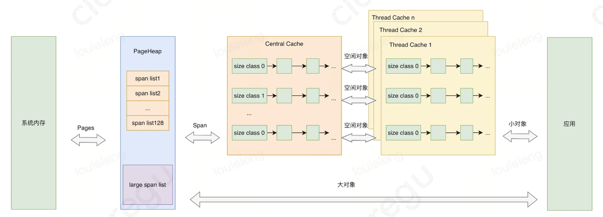

**回答**

go语言对象的分配根据对象大小的不同申请策略也不同：

- 当要分配大于 32K 的对象时，从 mheap 分配。
- 当要分配的对象小于等于 32K 大于 16B 时，从 P 上的 mcache 分配，如果 mcache 没有内存，则从 mcentral 获取，如果 mcentral 也没有，则向 mheap 申请，如果 mheap 也没有，则从操作系统申请内存。
- 当要分配的对象小于等于 16B 时（微小对象），从 mcache 上的微型分配器上分配。

## 4. Channel 分配在栈上还是堆上？哪些对象分配在堆上，哪些对象分配在栈上？

**channel分配在栈上还是堆上？**

**分析**

这个题可以看作是对上一个题理解程度的考察，可以用内存逃逸的思想来分析这个题，因为channel的作用就是用做两个goroutine之间的通信，所以在很大程度上它的生命周期并不会局限在一个函数内部，所以大概率会发生内存逃逸，就很容易得出结论，channel大概率会分配到堆上

**回答**

channel分配在堆上，Channel 被设计用来实现协程间通信的组件，其作用域和生命周期不可能仅限于某个函数内部，所以 golang 直接将其分配在堆上

**哪些对象分配在堆上，那些对象分配在栈上？**

**分析**

对象是分配在栈上还是对上跟go语言的语法没有关系，需要在编译期由编译器进行逃逸分析而决定。根据逃逸分析策略来思考

**回答**

一般而言，大的对象直接分配在堆上，如果一个局部变量会被外部引用，生命周期不确定，也会分配到堆上。其他小对象会优先分配在栈上

## 5. 介绍一下大对象小对象，什么情况下会导致GC压力大？

**分析**

首先GC压力大指的是我们GC的时候，需要占用比较高的CPU 时间和内存带宽资源，这就会影响我们用户Goroutine的执行。

而当大量小对象 逃逸到堆上，就意味着这些小对象是需要被GC回收的（可能是在某一次GC），因为栈上的对象 可以 随着栈帧的释放而回收，而堆上的对象 只能由GC来进行内存管理

同样巨大的map和slice也就意味着GC需要处理更多的数据

**回答**

- go语言中小于等于 32k 的对象就是小对象，其中小于16B 的是微小对象（而且是不含指针的对象），其它都是大对象。
- 当有大量小对象逃逸到堆上，或者有巨大的元素类型为指针的map和slice的情况下，GC压力会较大

# Go代码性能优化：​

## 1. 你知道Go的哪些性能优化手段

**分析**

Go 代码性能优化就两个：内存分配优化 和 并发优化，其余不值一提。

一般建议是  用过对象池，知道内存逃逸大概怎么定位就可以在加你里面写Go程序性能优化了，并发优化都是看场景的，不强求。

回答：

- G o内存分配优化：核心就是内存逃逸和对象池
  - 内存逃逸优化：属于那种听上去逼格很高，但是实际上效果非常有限的，将SQL优化一下，几十几百毫秒省出来了，但是Go内存分配优化来优化，可能也就优化了1毫秒。

       一般是使用  go build -gcflags '-m' 命令来看哪里发生了逃逸，然后"尝试优化掉"
  - 对象池：可以使用Go官方提供的sync.Pool，一般来说，如果你有什么接口是要处理比较大批量数据的，就可以考虑这种方案
- 并发优化 ：主要思路就是  有锁改无锁；写锁改读写锁；原子操作（CAS也可以看是乐观锁）；
  - 并发优化这个在业务开发里面比较少用

# 反射相关

## 1. 什么是反射？

反射是指计算机程序在运行时（Run time）可以访问、检测和修改它本身状态或行为的一种能力。用比喻来说，反射就是程序在运行的时候能够"观察"并且修改自己的行为。

### 2. Go语言如何实现反射？

Go语言反射是通过接口来实现的，一个接口变量包含两个指针结构：一个指针指向类型信息，另一个指针指向实际的数据。当我们将一个具体类型的变量赋值给一个接口时，Go就会把这个变量的类型信息和数据地址都存到这个接口变量里。

有了这个前提，Go语言就可以通过再由`reflect`包的`Type`和`ValueOf`这两个函数读取接口变量里的类型信息和数据信息。把这些内部信息"解包"成可供我们检查和操作的对象，完成在运行时对程序本身的动态访问和修改

### auto. Go语言中的反射应用有哪些

JSON序列化是最常见的应用，像`encoding/json`包通过反射动态获取结构体字段信息，实现任意类型的序列化和反序列化。这也是为什么我们能直接用`json.Marshal`处理各种自定义结构体的原因。

ORM框架是另一个重点应用，比如GORM通过反射分析结构体字段，自动生成SQL语句和字段映射。它能动态读取struct tag来确定数据库字段名、约束等信息，大大简化了数据库操作。

Web框架的参数绑定也大量使用反射，像Gin框架的`ShouldBind`方法，能够根据请求类型自动将HTTP参数绑定到结构体字段上，这背后就是通过反射实现的类型转换和赋值。

还有配置文件解析、RPC调用、测试框架等场景。比如Viper配置库用反射将配置映射到结构体，gRPC通过反射实现服务注册和方法调用。

### 4. 如何比较两个对象完全相同

最直接的是用reflect.DeepEqual，这是标准库提供的深度比relatively方法，能递归比较结构体、切片、map等复合类型的所有字段和元素。比如`reflect.DeepEqual(obj1, obj2)`，它会逐层比较内部所有数据，包括指针指向的值。

对于简单类型可以直接用==操作符，但这只适合基本类型、数组、结构体等可比较类型。需要注意slice、map、function这些类型是不能直接用==比较的，会编译报错。

实际项目中更推荐自定义Equal方法，根据业务需求定义相等的标准。比如对于用户对象，可能只需要比较ID和关键字段，而不需要比较时间戳这种辅助字段。这样既提高了性能，又符合业务语义。

# gin框架相关

## 1. Gin框架的路由实现原理？

**分析：**

首先来回顾一下gin框架的路由是怎么用的，下面代码介绍post请求的路由使用方式

http的请求有9种，GET，HEAD，POST，PUT，PATCH，DELETE，CONNECT，OPTIONS，TRACE

所以这里gin Engine其实有9种请求，但是每种请求的路由使用逻辑其实差不多，都是对应于明后面跟一个handler处理函数，用来处理这个域名下的对应请求

从这里就可以看出一个域名对应着一个处理handler，有一个映射关系，这就是路由。那么这种映射关系在gin的底层是怎么实现的呢？直观感受是可以用map，key是域名，value是这个域名对应的handler，http有9种请求，那么建立9个这样的map就行了

gin框架在底层实现这个映射用的并不是map，而是用的压缩前缀树这种数据结构，至于为什么不用map，后面咱们分析

**什么是前缀树**

前缀树即trie 树，是一种基于字符串公共前缀构建索引的多叉树，前缀树主要有以下特性：

- 除根节点之外，每个节点对应一个字符串
- 从根节点到某一节点，路径上经过的字符串联起来，即为该节点对应的字符串
- 尽可能复用公共前缀，如无必要不分配新的节点

假设现在有/user/info，/user/rank，/see等字符串，则可以构建以下前缀树

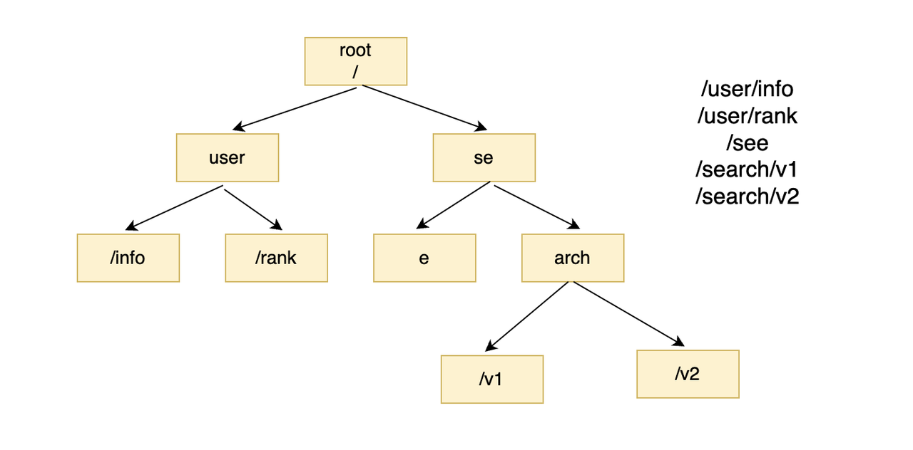

**压缩前缀树**

压缩前缀树又称基数树或 radix 树，是对前缀树的改良版本，优化点主要在于空间的节省，核心策略体现在：

倘若某个子节点是其父节点的唯一孩子，则与父节点进行合并

 在 gin 框架中，使用的正是压缩前缀树的数据结构.

**树节点**

树的每个结点的数据结构如下

可以看到每个节点其实包含了节点相对路径和完整路径，路由的时候则是根据各定的域名(字符串url)从前缀树的根节点开始找到对应的节点，然后从节点中获取完整路径和对应的处理函数列表，然后遍历这个处理函数列表，依次执行对应方法，从而完成路由请求处理逻辑

**回答**

- **gin** 的每种方法 **(POST, GET ...)** 都有自己的一颗 **路由树**。
- 当 **gin** 收到客户端的请求时, 会去 **路由树** 里根据 **URL** 找到相关的 **处理函数**（**handler）**

**推荐学习**

前缀树学习：https://leetcode.cn/problems/implement-trie-prefix-tree/

## 2. gin框架的路由数据结构**为什么使用压缩前缀树，而不用hashmap**

- path 匹配时不是完全精确匹配，比如末尾 ‘/’ 符号的增减、全匹配符号 '*' 的处理等，map 无法胜任（模糊匹配部分的代码于本文中并未体现，大家可以深入源码中加以佐证）
- •路由的数量相对有限，对应数量级下 map 的性能优势体现不明显，在小数据量的前提下，map 性能甚至要弱于前缀树
- •path 串通常存在基于分组分类的公共前缀，适合使用前缀树进行管理，可以节省存储空间

# 代码题相关

## 1. 使用三个协程，每秒钟打印cat dog fish（要求：顺序不能变化，协程1打印cat，协程2打印dog，协程3打印fish）

## 2. 实现两个协程轮流输出A 1 B 2 C 3 .... Z 26

## 3. N个 Goroutine顺序打印数字 （需要多多练习，代码不难，面对且战胜它）

版本2：

## 4.  下面函数执行结果是啥（需要知道切片底层原理）

推荐资料[ slice](https://ls8sck0zrg.feishu.cn/wiki/wikcn00HZW62D8XnOIrEqtH5Ynb)底层原理

## 5. 下面代码的输出是啥（重在学习gmp模型创建一个goroutine背后的的原理）

推荐学习：[ Golang 夜市8月14日（第一期）](https://ls8sck0zrg.feishu.cn/wiki/ZjFawrHUyintvMkbRcvcB0ESnFb)最后代码题，视频有源码走读

## 6. 有一个数组，用两个协程，一个打印所有偶数的和，一个打印所有奇数的和，要用for channel机制（腾讯一面）

## 7. 10个生产者 5个消费者，生产者总共生产1000个消费物料（编号1-1000），5个消费者并行消费

## 8. 通过协程（goroutine）和通道（channel）实现多个协程执行随机数加法，最后输出其中最大值

## 9. 使用两个goroutine交替打印1-100之间的奇数和偶数, 输出时按照从小到大输出

## 10. 创建10个goroutine,id分别是0,1,2,3...9，每个goroutine只能打印最后一位是自己id号的数字， 例如: 3号只能打印3, 13, 23, 33...编写一个程序，依次打印1-10000