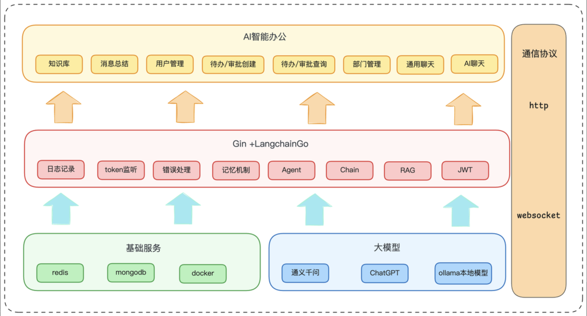

# AWH面试题

## 🥴介绍项目

AIWorkHelper 智能办公平台是基于 Go 和 LangChain 的 AI 驱动企业办公助手平台。我主要负责了四个核心模块：一是智能路由模块，用 LLM 做意图识别实现自动分发；二是 Agent 工具化体系，将业务功能封装成可组合的工具；三是 RAG 知识库系统，实现了企业文档的智能检索问答；四是 WebSocket 实时通信服务，支持并发连接。项目中遇到的关键挑战包括 LLM 路由延迟优化、Agent 死循环问题、中文 PDF 解析准确性等，都通过技术选型和架构优化得到了解决

## 一、项目架构与设计（8题）

### 1. 简单介绍整体架构

这个项目是基于 Go和 LangChain 开发的，整体分四层。

最上面是接入层，对外运行了两个服务器：HTTP（和WebSocket，HTTP 处理CRUD接口，比如待办，审批业务。WebSocket 负责聊天对话，两个服务共享 ServiceContext 来复用数据库连接和 LLM 客户端。鉴权用的JWT，HTTP 走中间件验证，WebSocket 在握手时验证。

往下是业务层，主要是用来处理办公主体业务以及AI聊天功能，可以分为审批，待办，A聊天等多个业务模块。这层按 Handler-Logic-Model 三个子层来划分。Handler 只做协议转换，Logic 封装业务规则，Model负责数据库操作。

再往下是数据层，主要是用到了 MongoDB和redis，用mongodb来持久化存储业务数据，文档模型比较灵活。Redis 用来做两件事：一是知识库的向量索引，二是 AI对话的记忆管理。

底层大模型是接入的阿里云通义千问，用LangChainGo SDK 进行封装。

可以参考这个图来进行解释：

***

### 2. 同时启动 HTTP 和 WebSocket ？

为什么要同时启动 HTTP 和 WebSocket 两个服务器？这样设计有什么好处？

主要是基于业务场景的考虑。HTTP 适合处理那些请求-响应模式的操作，比如查询待办列表、创建审批这些，一次请求一次返回，简单明了。但 AI 对话不一样，它可能需要多轮交互，Agent 执行过程中会调用多个工具，如果每次都要重新连接开销太大。WebSocket 保持长连接，服务器可以主动推送 Agent 执行的中间状态给客户端，用户体验会好很多。而且两个服务器共享同一个 ServiceContext，数据库连接、LLM 客户端这些资源只需要初始化一次，避免了重复开销。

***

### 3. 讲一下ServiceContext

你刚才提到 ServiceContext，项目中的 ServiceContext 是什么？有什么作用？

ServiceContext 可以理解为一个依赖注入容器，它在程序启动时把所有需要的依赖都初始化好，比如 MongoDB 连接、各种 Model 实例、LLM 客户端、JWT 中间件这些，然后注入到需要的地方。这样做最大的好处是资源复用，像数据库连接池和重量级资源只需要创建一次，不需要多次请求都重复创建。另外一个好处就是方便测试，我们可以在测试时注入 Mock 对象，不需要真的连接数据库或调用 LLM。从代码层面看，依赖注入让层与层之间的耦合度降低了，比如 Logic 层不需要知道 Model 层的具体实现，只需要拿到接口就行。

***

### 4. websocket 链接是怎么管理的，怎么保证并发安全？

目前的 websocket 链接是基于内存来管理的，主要用两个 Map 来管理：uidToConn（用户ID -> 连接）和 connToUid（连接 -> 用户ID），这两个 map 会被多个 goroutine 并发访问。比如用户上线要写 map，用户下线时要删 map，发消息时要读 map，这里将会通过对 map 加读写锁来保证并发安全。

***

### 5. WebSocket 连接数达到 10 万级别，当前的设计会有什么问题？怎么优化？

问题：

- 首先是内存瓶颈，每个连接的 map 条目、连接对象本身、读写缓冲区，加起来可能几 KB 到几十 KB，10 万连接就是几个 GB 的内存；
- 其次是并发问题，虽然用了读写锁，但 10 万个 goroutine 同时读写，锁的开销也不小；
- 再次是单机的 TCP 连接数限制，虽然理论上可以支持，但操作系统需要调优。

优化方案：

1. 一是连接管理服务化，专门用一个服务来管理连接映射，其他服务通过 RPC 查询，这样可以水平扩展；
2. 二是用 Redis 存储映射关系，虽然多了一次网络开销，但能支持跨机器查询。最后是优化 WebSocket 配置，调大读写缓冲区、开启压缩、适当调整心跳间隔。

***

### 6. 为什么用 MongoDB 而不是 MySQL？这个选择有什么好处？

选择 MongoDB 主要是考虑到业务模型的灵活性。我们的数据结构变化比较频繁，比如待办事项有多个执行人、多条操作记录，审批单据根据类型不同字段也不一样，如果用 MySQL，要么创建一堆关联表，要么用 JSON 字段，都不够优雅。MongoDB 的文档模型天然支持嵌套结构，一个待办的所有信息（包括执行人数组、操作记录数组）都在一个文档里，查询时一次就能拿到，不需要 join。而且 MongoDB 的 schema 很灵活，加字段不需要改表结构，适合快速迭代。

***

### 7. 项目中的用户鉴权是怎么设计的？JWT Token 是如何工作的？（核心亮点）

我们采用的是 JWT（JSON Web Token）无状态鉴权方案。整个流程是这样：用户登录时，服务端验证用户名和密码，验证通过后生成一个 JWT Token，里面包含用户 ID、签发时间、过期时间这些信息，用 HS256 算法和密钥签名。Token 返回给客户端后，客户端在后续请求中把它放到 Authorization 请求头里，格式是 Bearer  。服务端收到请求后，JWT 中间件会自动解析 Token，验证签名和过期时间，提取出用户 ID，然后通过 context.WithValue 把用户信息注入到请求上下文中。业务层通过 token.GetUid(ctx) 就能直接获取当前用户 ID，不需要查数据库。

这种设计的好处是完全无状态，服务器不需要存储 Session，天然支持水平扩展。而且 Token 本身包含了所有必要的用户信息，减少了数据库查询。缺点是 Token 一旦签发就无法撤销，除非等它过期，这个可以通过引入黑名单机制来解决。

***

### 8. 你在开发过程中有没有遇到比较大的技术挑战？是怎么解决的？

当时遇到的最大的一个问题是 LLM 路由响应很慢，平均耗时要 1s 左右，并且路由的准确率还不高，这会导致用户感觉 AI 反应迟钝。我主要采用了三项优化措施：

1. 精简 Prompt，保留 Handler 名称和核心描述，将长度从 2000 tokens 压缩到 500；
2. 引入结构化输出解析器，强制 LLM 返回固定 JSON 格式，避免 LLM 冗余输出；
3. 在 Handler 描述中增加关键词提示，提升 LLM 匹配准确度。

最终路由时间稳定在 200ms，同时准确率保持在 95% 以上。

***

## 二、AI 架构核心（15题）

### 1. 智能路由功能是怎么实现的？为什么要让 LLM 来做路由决策？（核心亮点）

由于 LangChainGo 框架是没有提供 RouterChain，这里我们自己实现了一个路由链 RouterChain 来完成智能路由。核心思路是让 LLM 来做路由决策，而不是写死规则。

具体实现上，Router 内部维护了一组 Handler 的描述信息，比如 TodoHandle 负责处理待办、ApprovalHandle 负责审批，每个 Handler 都有个 Description 方法说明自己能处理什么类型的请求。当用户输入进来时，Router 会把用户输入和所有 Handler 的描述拼成一个 Prompt，让 LLM 返回应该用哪个 Handler。

LLM 会输出一个结构化的 JSON，里面有 destination 字段指向某个 Handler 的名字。然后我们根据这个名字找到对应的 Handler 调用它。如果 LLM 返回的是 "DEFAULT" 或者找不到对应 Handler，就会调用默认的 handler 进行兜底。

***

### 2. LLM 来实现智能路由有什么好处？

- 灵活，可以接受不同的表达，LLM 都能理解并路由到 TodoHandler
- 否则，用传统的正则或者关键词匹配的话，就要来与固定的关键词，局限性很大。如果要适应很多的描述的话，就需要维护一个规则库，增加系统的复杂性。

***

### 3. Agent 是怎么实现的？？它是怎么决定调用哪些工具的？（核心亮点）

Agent 执行器采用的是 LangChain 的 ReAct 模式，也就是“推理-行动”循环。具体实现上，我们通过 LangChainGo 框架提供的用 agents.NewOneShotAgent 创建 Agent，然后用 agents.NewExecutor 包装成可执行的链。

工作流程是这样：

首先 Agent 会观察当前状态，包括用户输入、已有的工具列表、历史对话记忆这些。我们在初始化时会给 Agent 注入一个 Prompt 模板（_defaultMrklPrefix），这个模板会自动列出所有可用工具的名称和描述，比如 user_list 用于查询用户，time_parser 用于解析时间，todo_add 用于创建待办等工具。\
\
然后 LLM 进行推理，思考要完成这个任务需要哪些信息，缺少什么。接着选择一个工具执行，比如用户说“明天上午给王五创建待办”，LLM 推理出需要先解析时间，就会调用 time_parser 工具，参数是“明天上午”。\
\
工具返回结果后，LLM 观察这个结果，继续推理下一步该做什么。可能是调用 user_list 查询王五的 ID，得到 ID 后再调用 todo_add 创建待办。\
\
这样迭代下去，每一轮都是“观察 → 推理 → 行动 → 观察结果”，直到 LLM 认为收集到了足够的信息，最后调用实际的业务工具完成任务。整个过程完全是 LLM 自己决策的，我们只需要提供工具集合和每个工具的描述。

***

### 4. Agent 是一个“推理-行动”的过程，会不会陷入死循环呢？比如一直调用同一个工具？

理论上会陷入死循环，但是项目中对这个问题进行了优化。我们的防护措施有几个：

- 首先在 Agent 执行层面设置了最大迭代次数，比如 20 次，超过了就强制终止，返回“任务超时”的提示；
- 其次在 Prompt 设计上，明确告诉 LLM 如果已经获取到足够的信息，应该生成最终答案而不是继续调用工具；
- 再者可以调整检测工具调用模式，如果连续多次调用同一个工具且参数相同，说明可能陷入死循环，主动中断；
- 最后是超时控制，整个 Agent 执行过程设置一个总的超时时间，比如 30 秒，到时间强制结束。

这些措施结合起来，基本能避免死循环导致的资源耗尽。当然最根本的还是优化 Prompt 和工具设计，让 LLM 更容易做出正确决策。

***

### 5. LLM 调用失败了是怎么处理的？

最开始采用的是重试策略，用指数退避算法重试 3 次，每次间隔时间递增。

首先可以采用降级策略，如果 LLM 持续失败，可以降级到规则引擎，比如简单的关键词匹配，至少能处理一些常见场景；\
再就是熔断机制，如果失败率超过阈值，暂时停止调用 LLM，避免雪崩；\
最后是多模型容灾，可以配置主模型和备用模型，主模型挂了自动切换。

另外对于不同的 Handler，可以用不同优先级的模型，比如路由决策用小模型，复杂推理用大模型，既降低成本又提高稳定性。

***

### 6. 你们的对话记忆是怎么管理的？如何实现不同用户的会话隔离？（核心亮点）

我们基于 LangChain 的 Memory 接口封装的一个多会话管理器。核心思想是为每个用户维护独立的内存空间。

具体实现是这样：

内部维护一个 map，key 是 ChatId（通常就是用户 ID），value 是该用户的 Memory 实例；\
当需要存取对话记忆时，会先从 context 中提取 ChatId，然后从 map 里查找对应的 Memory，这样每个用户都有自己的记忆内容，不会互相干扰。

每个 Memory 内部又是一个 SummaryBuffer，它会记录最近 N 轮对话的完整历史，当对话轮数超过阈值时，会调用 LLM 生成摘要，把旧的对话压缩成一段文字。这样既保证了上下文的连贯性，又避免了超出 LLM 的 token 限制。

用户即使断线重连或换设备，只要 user_id 没变，对话历史就能保留。

***

### 7. 你这个业务其实有一些时间解析的场景，比如“下周一创建一个待办事项”，这里这个时间的描述是模糊的，实现的时候，是怎么精确这个具体时间点的呢？

解决方案是设计一个详细 Prompt，明确时间格式、时区、默认规则，让 LLM 返回 Unix 时间戳。

时间解析是专门实现了一个时间解析工具 TimeParser，用来解析用户输入的自然语言时间。

实现方式：我们调用 LLM 来做转换，把用户输入的“明天上午”、“下周五晚上8点”这些自然语言描述，连同当前时间作为上下文，让 LLM 推理出具体的时间戳。

难点主要有几个：

- 相对时间计算：比如“明天”是相对于什么时候，需要传递当前服务器时间；
- 时区问题：服务器可能是 UTC，但用户表达是北京时间；
- 模糊时间处理：比如“上午”是 9 点还是 10 点，需要默认规则；
- 特殊日期计算：比如“下个月最后一天”、“下周一”等复杂时间。

***

### 8. 这个系统中的 AI 工具是怎么调用业务逻辑的？如何保证 Token 和用户权限的正确传递？

目前的调用方式是：

用户请求通过智能路由到对应的 handler 后，内部 AI 工具通过 curl 直接向后端发送 HTTP 请求来调用业务逻辑，而不是直接调用 logic 层 API。

关键点在于权限传递：

在最开始用户的 HTTP 或 WebSocket 请求进入时，token 已经被解析并放入 context；\
后续 Agent 执行过程中，直接从 context 中获取 token，随请求一起传递，从而保证用户权限正确。

这种设计的优点：

AI 层和业务层完全解耦，已有接口无需改造；\
后续可以方便地把 AI 助手拆成独立服务。

缺点是会多一次网络开销。

***

### 9. 为什么选择通义千问而不是其他大模型？有没有做过不同模型的对比测试？

选择通义千问主要是综合考虑：

成本：价格相对便宜，适合企业内部应用；\
性能：国内访问快，没有网络问题；\
能力：支持 Function Calling，适合 Agent；\
生态：兼容 OpenAI SDK（DashScope compatible-mode），迁移成本低。

对比测试：

我们也测试过 GPT 等国外模型，效果确实更好，但：

成本更高；\
国内访问不稳定。

当前方案：

通义千问 qwen3-max 已经够用。

未来可能采用混合方案：

路由决策：qwen-turbo（便宜快速）\
复杂推理：qwen3-max\
知识检索：Embedding 模型

***

### 10. 如果要支持流式输出（像 ChatGPT 那样逐字输出），应该怎么改？

流式输出对用户体验非常有利，实际上需要在很多地方进行改造。首先 LLM 调用需要增加 API，OpenAI SDK 支持 Stream: true 参数，返回的是一个 channel，可以不断读取 token。在 Handler 层， 需要把 Agent 执行过程中的每个 token 通过 WebSocket 实时推送给客户端，这就要求用 WebSocket 而不是 HTTP。具体流程是：客户端通过 WebSocket 发起请求，服务端启动 Agent 执行 → Agent 每生成一个 token 就通过 WebSocket 推送给客户端。技术上有几个关键点：一是请求限流，客户端的多个请求需要有一个 Agent 在后端服务池中并发执行；二是用户的每个请求都会通过 WebSocket 实时推送给客户端，流式的生命周期开启，如果客户端断开连接或者出现崩溃，要保证在 LLM 调用的流程中如果出错，需发送一个特定的错误通知给客户端。另外对流式输出的保存和恢复也有特殊要求，需要流式生成过程中可恢复。

***

### 11. 知识库功能是怎么实现的？PDF 文件是如何处理并被 AI 检索的？

知识库功能能够实现基于 RAG 的方案，分上下上传索引和两个环节。上传时，用户上传文件后，系统会检查并解析出文档的内容，然后把检索到的内容和问题一起喂给 LLM，让 LLM 基于这些参考资料生成答案。

具体实现上，RAG 分三个环节：第一是离线建模，把文档切块，转索引，存储；第二是在在线检索，用用户查询的文本最相关的文档块；第三是增强生成，把检索到的内容作为嵌入向量送给 LLM，LLM 基于这些材料生成答案。

使用 RAG 主要是解决 LLM 的几个痛点：第一是知识效率低，LLM 的训练数据都是几个小时前甚至几个月前更新的知识，但 RAG 可以随时更新知识库；第二是局限于领域知识，通常大模型对企业的规章制度、业务流程这些有知识不了解，容易出现误导，通用 RAG 能通过企业知识库来解决，增强生成的答案可能是简短的，但 RAG 的答案有明确来源，可以溯源。

***

### 12. 什么是 RAG？为什么要用 RAG？

RAG 是 Retrieval-Augmented Generation 的缩写，中文叫检索增强生成，核心思路是在生成答案之前，先从外部知识库检索相关内容，然后把检索到的内容和问题一起喂给 LLM，让 LLM 基于这些参考资料生成答案。

具体实现上，RAG 分三个环节：第一是离线建模，把文档切块，转索引，存储；第二是在在线检索，用户提升时转时检索最相关的文档块；第三是增强生成，把检索到的内容作为嵌入向量送给 LLM，LLM 基于这些材料生成答案。

使用 RAG 主要是解决 LLM 的几个痛点：第一是知识效率低，LLM 的训练数据都是几个小时前甚至几个月前更新的知识，但 RAG 可以随时更新知识库；第二是局限于领域知识，通常大模型对企业的规章制度、业务流程这些有知识不了解，容易出现误导，通用 RAG 能通过企业知识库来解决，增强生成的答案可能是简短的，但 RAG 的答案有明确来源，可以溯源。

***

### 13. 文档分块参数是怎么设置的？

ChunkSize 是设置的 500，主要是为了保证语义完整不引入过多噪音，Overlap 设置的 50，避免每段语义被切割。TopK 的值设置的是， 这里进行测试设设设置时已经准备好了。因为企业文档一般还是非常清晰的，一个资源语料库找到答案就可以。

***

### 14. 项目中为什么选择 Redis 作为向量数据库？

选用 redis 来作为向量存储主要有以下三个考虑：

首先 Redis 性能很好，能够支持高并发的查询请求；\
其次 Redis 向量搜索插件（RedisSearch）提供了成熟的向量检索能力，支持余弦相似度，欧氏距离等多种相似度计算方法；\
最重要的是，Redis 本身就是我们技术栈的一部分，不需要额外引入新的组件。

***

### 15. 如果要优化知识库的检索效果，可以从哪些方面入手？

知识库的检索效果优化是个系统工程，可以从几个层面来做。首先是分块策略，即当前前端的固定大小切分可以考虑增加智能切块，比如按子字段切分，或者用滑动窗口去推测信息布局，另外 Embedding 模型和模型的接入，通用的前向 Embedding 是语言模型，如果基于存定逻辑（比如法律，医学）效果不好，可以用知识数据源调用一个专用模型，再次是检索系统，除了简单的向量相似度，可以加上 BM25 这种基于关键词的检索，然后再把两个结果融合（Hybrid Search），召回更多高分。外部是 Rerank，检索出 Top-K 后，再用一个更强的模型重新排序，最后是数据源清理，给每个文档打标签（部门、类型、时间），查找时根据这些数据的筛选，缩小检索范围，提高检索效果。