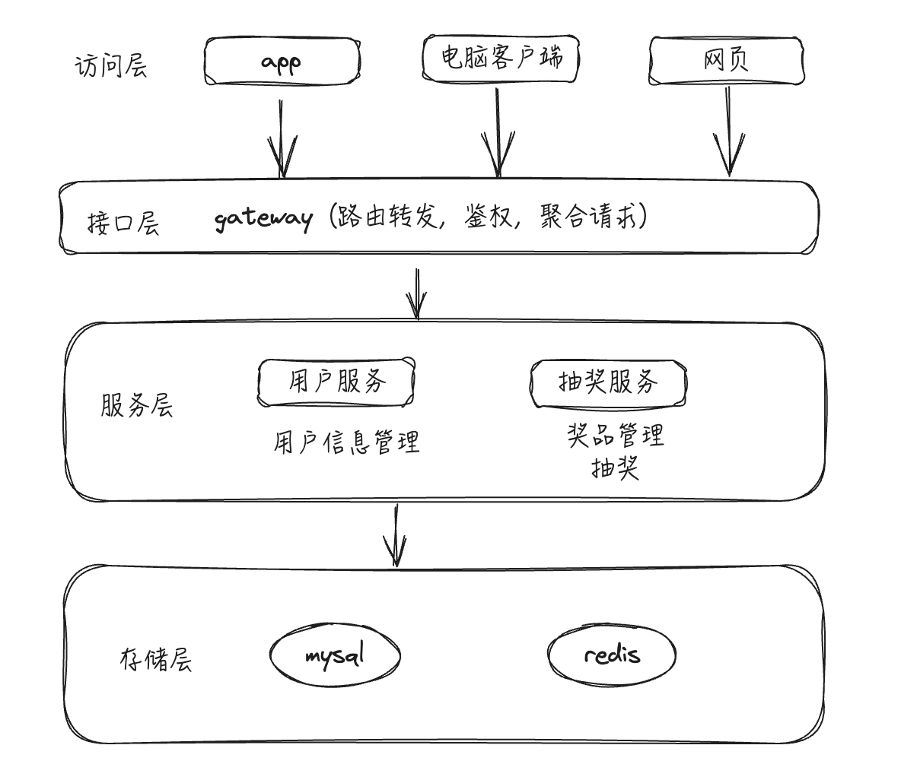

# 1. 系统架构

## 1.1 简单说一下抽奖系统的系统架构是怎样的？

抽奖系统采用的是分布式架构来完成的，由用户服务，网关服务和抽奖服务三个服务配合完成，用户服务管理用户的基本信息，网关负责路由，鉴权，信息聚合等功能，抽奖服务负责抽奖逻辑实现，抽奖服务内部氛围admin和lottery两个模块，admin负责后台奖品管理功能，lottery负责奖品匹配和发奖。抽奖请求打进来，先经过最上层网关，网关做好用户鉴权之后，解析出用户请求，将请求转发到抽奖服务完成抽奖逻辑实现，底层数据存储采用的是mysql和redis。



## 1.2 你们的系统架构提到了网关服务。在高并发抽奖场景下，网关除了路由和鉴权，还需要承担哪些关键职责来保护后端服务？

在高并发抽奖场景下，网关除了路由和鉴权，还需承担限流（如基于用户ID、IP、接口路径的QPS限制）、熔断（当下游服务故障时快速失败，防止雪崩）、黑白名单过滤（更动态的访问控制）、请求参数校验、日志聚合、以及可能的SSL卸载和响应缓存（针对非核心、可缓存的抽奖信息接口）等职责，作为整个系统的第一道防线。

## 1.3 这个抽奖系统的用户鉴权是怎么做的？（面试真题）

用户在**用户服务**完成登录，获取一个有时效性的凭证，通常是 **Token**（如 JWT, JSON Web Token）。

客户端在后续的每次请求中，通过请求头（Header）携带这个Token。

**网关服务**收到请求后，解析并验证Token的合法性、有效性。验证通过后，可以将解析出的用户信息（如 `user_id`）附加到请求头中，再转发给下游服务。

# 2. 抽奖逻辑

## 2.1 如何保证同一时间，同一个用户不会抽取到多个奖品？

同一个用户同一时间抽取到多个奖品是由于同一个用户在同一时间请求了多次抽奖接口导致，其实只要保证同一时间每个用户只能请求一次抽奖接口即可，实现上可以采用分布式锁对请求做处理，分布式锁的key设定为用户id，要调用抽奖接口，先要获取到分布式锁，获取不到所，请求拒绝掉，这样同一时间，同一个用户只会请求一次。分布式锁设定一个超时时间，另外用一个看门口狗守护线程，防止锁过期

## 2.2 抽奖系统的设计有提到公平性策略，请问是如何实现的？（面试真题）

抽奖系统主要通过一个**基于“概率区间”和“随机数”的算法**来保证中奖概率的公平性。

系统会预先设定一个固定的数字区间作为总的概率池，例如 `[0, 9999]`，总长度为10000，代表100%的概率。在活动开始前，会为每一种奖品在这个总区间内划分一个**互不相交**的独立子区间。例如，一等奖的区间可以设为 `[1, 10)`，二等奖为 `[100, 150)`，三等奖为 `[1500, 2000)`。区间的宽度决定了该奖品的中奖概率

每当有用户发起抽奖请求时，后台会生成一个落在总概率区间（即 `[0, 9999]`）内的随机数

系统会判断这个随机数落在了哪个奖品的子区间内。如果随机数落在某个奖品的区间，用户就中得对应的奖品；如果没有落在任何一个已设定的奖品区间内，则判定为未中奖

## 2.3 奖品的库存更新，怎么保证奖品不超发？

库存的更新是在db层处理的，库存扣减不超发也是通过db来保证的

```sql
update set t_prize left_num = left_num - 1 where prize_id = ? and left_num > 0;
```

在db层扣减库存sql中通过条件left_num > 0条件来控制，只有剩余数量大于0，才会进行库存扣减

## 2.4

优惠券发放过程中，怎样保证一个优惠券只能发放给一个用户？

优惠券在发放的时候需要放回给用户一个优惠券的可用编码，所以不能只扣减优惠券的库存，所以存在两个步骤

1. 查询一张可用的优惠券
2. 可用优惠券库存减1，即将这张优惠券的状态修改为已发放

这两个步骤必须要是一个整体，因为在查询出记录的时候，可能有其他的请求也会查询到这个记录，完成记录的修改，所以要保证这两个操作一体化

解决方案是用分布式锁将两个操作锁定即可，key是奖品id

## 2.5 中奖逻辑是怎么实现的？怎么保证中奖概率的公平性？

中奖逻辑主要是通过设置奖品的中奖概率区间，以及抽奖随机数来实现的。在抽奖系统的admin段，活动开始之前，会为每种奖品设置一个概率区间，区间互不相交，比如选用区间[0,9999]表示整个概率区间，总长度为10000，设置一等奖区间[1,10)，二等奖[100,150)，三等奖[1500,2000)，每次抽奖请进来后台会生成一个[0,9999]的随机数，随机数落在哪个区间内，就中了几等奖，没有落在任何区间内，就没有中奖

## 2.6 怎么保证奖品在发奖周期内的各个时段能均匀的发奖，而不是一开始就会将奖品抢光？

这里实现上是发奖计划配合奖品池来实现的。奖品池保存了每种奖品当前时刻有多少奖品，奖品池里的奖品数量是定时更新的，每分钟更新一次，定时任务会根据奖品的放奖计划，定时选取一部分奖品数量填充到奖品池中，这样就保证了每个时刻奖品池中奖品数量只有奖品总量的一部分，而不是全量奖品，在抽奖的时候，有先从奖品池扣减奖品，奖品池奖品不足了，直接返回未中奖，这样就可以保证全量奖品不会再某个时间点被抢光

## 2.7 奖品池是怎么设计实现的？没有奖品池可不可以？

奖品池基于redis的hash结构实现的，key为prize_pool字符串，field为奖品id，value为当前时间这种奖品在奖品池中的数量。没有奖品池不影响抽奖功能，但是会存在所有奖品在某个时刻被抽取抢光的情况

## 2.8 奖品池是的填充逻辑是怎么实现的？

奖品池的填充逻辑依赖于奖品的发奖计划，由定时任务完成。每种奖品都设置了一个发奖计划，每种奖品有一个发奖周期，比如一周，那么发奖计划就是在这个发奖周期一周内，具体到这个时间段的每秒钟，将奖品分散到这个周期内，对应每个时刻有多少奖品。填充逻辑是通过定时任务来将发奖计划中，位于当前时间之前的所有奖品数量都添加到品池中，然后更新对应奖品种类的发奖假话，将已经填充过的发奖时间点和数量删除

## 2.9 发奖计划是什么？发奖计划的实现逻辑是怎样的？

发奖计划简单来说就是一个时间段，在这个时间段内每个时间点应该要发多少奖品，这些奖品的数量之和就是奖品的剩余数量。发奖计划通过定时任务更新的，每5min更新一次，将剩余的奖品数量按照一定的比例分摊到发奖周期的各个时间点上。比如每天的晚上8-10点是上网的高峰期，那么发奖周期内每天这个时间段内，所分配到奖品数量就多一些。

发奖计划示例：

|时刻 |奖品数量 |
|---|---|
|2023-11-16 15:07:51 |10 |
|2023-11-16 17:08:50 |5 |
|2023-11-17 20:05:31 |3 |
|2023-11-18 21:15:25 |6 |

## 2.10 抽奖系统的数据库表设计有哪些优化点？索引是怎么设计的？

抽奖系统的数据库设计重点在于高并发场景下的查询性能和数据一致性。主要优化点包括：首先是索引设计，用户抽奖次数表在user_id和day字段上建立联合索引，因为查询用户当日抽奖次数是高频操作；中奖记录表在user_id、prize_id、create_time上建立联合索引用于奖品统计分析.最后是分库分表预留，如果后期并发较高，数据量较大，用户相关表按user_id取模分表，奖品相关表按prize_id分表，为后续扩展做准备

## 2.11 奖品池填充逻辑是定时任务将发奖计划中当前时间之前的奖品数量填充到奖品池。如果定时任务执行时，上一个周期的奖品还未完全消耗完（奖品池中仍有余量），是累加还是覆盖？这对奖品发放均匀性有何影响？

不会累加，可以认为是覆盖逻辑。这里的发奖计划在更新的时候，每次会检查发奖机会是否为空，如果不为空的话，会对指定时间段的发奖计划进行清空，然后在根据权重优先级算法对剩余的未参与抽奖的奖品重新添加到发奖计划中，更新完的发奖计划也是按照权重来设计的，并不会影响那个奖品抽取的公平性

## 2.12 发奖计划的更新，提到“将剩余的奖品数量按照一定的比例分摊到发奖周期的各个时间点上，比如每天的晚上8-10点是上网的高峰期，那么发奖周期内每天这个时间段内，所分配到奖品数量就多一些”。这个“一定的比例”是如何确定的？

这个比例在程序中根据一天中24小时内，每个小时的发奖比例权重数组来确定的，这个数组长度为100，数组中的每个元素的值为0-23中的某个数值，而数组中0-23出现的次数，为一天中对应小时段应该分配的奖品数量权重大小。这个数组是可以配置化的。目前各个小时段的分配比例是基于一个经验值，就是一个用户天中不同时间段上网的活跃度（比如如晚上8-9，下午的2点到5点权重较高）

## 2.13 奖品池基于Redis Hash实现，key为`prize_pool`，field为奖品id。如果奖品种类特别多，这个单一的Hash会不会成为热点key？如何优化？

确实可能存在这个问题，如果奖品种类特别多，所有奖品数量都存在一个名为`prize_pool`的Redis Hash中，这个单一key在高并发读写（尤其是库存预扣减）时，确实可能成为热点key，影响Redis性能。优化方式可以考虑将奖品池按奖品ID进行分片打散到多个Hash Key中，例如 `prize_pool_shard_N`，N通过奖品ID哈希取模得到。或者，如果主要瓶颈在扣减，可以针对热门奖品ID单独设置key，或者采用更细粒度的锁配合库存分段。

## 2.14 “发奖计划通过定时任务更新的，每5min更新一次，将剩余的奖品数量按照一定的比例分摊到发奖周期的各个时间点上”。如果在这5分钟的间隔内，某个奖品被大量抽中，导致剩余数量急剧减少，新的发奖计划是如何平滑过渡的？会不会导致某些时间点计划发放量为0或极少？

发奖计划是定时更新的，只是当前这个时段的奖品被抽完，如果在这个时间段内，有奖品被大量抽中，那么这个时间段内的该奖品被抽完之后，再次抽中，就会显示没中奖，不会对剩余奖品造成影响。这也是保证奖品能够在各个有效时间段内能够均匀分布的方式。后续的发奖计划则会根据剩余的奖品数量来计算。不会有影响

## 2.15

在优惠券发放的场景中（V2版），从Redis Set中`spop`预扣成功后，再扣减DB。如果DB扣减失败（如数据库连接问题），是怎么处理的？

这种情况是可接受的，直接返回未中奖即可。这是一种“少发”场景，对于业务方而言是可以接受的，但是大量的少发，在高价值优惠券或用户感知强烈的场景下，可能引起用户满意度的问题，如果是这种场景的话，可以做如下补偿措施：

1. 录此类DB扣减失败的“预扣成功”事件。
2. 设计一个后台对账流程，定期捞出这些“悬挂”的优惠券。
3. 根据情况，尝试对这些用户进行补发（需确保幂等），或发放等值的其他补偿（如积分、替代优惠券），并通知用户

## 2.16 

基于Mysql的版本实现中，发放优惠券需要两步数据库操作：1）查询一张可用的优惠券；2）将这张券的状态修改为“已发放” ()。这两步操作必须是一个原子整体。你才用的是分布式锁来保证，请简单讲一下，你的分布式锁是怎么设计的？

**锁的设计**：这里的分布式锁是基于redis实现的，锁 Key 是以**奖品ID (prize_id)** 为核心构建的 ()。key的具体格式是 `prizeID -CouponDiffLockLimit`，其中 `CouponDiffLockLimit` 是一个固定的常量字符串，`prizeID` 则是当前要发放的优惠券所属的奖品ID ，使用的是redis 的 `SETNX`方法来实现。这样可以锁定对“某一类”优惠券的发放操作，防止数据竞争，但不会影响其他类型奖品的发放。

但是在后续的 V2 缓存优化版本中，我们将可用优惠券预加载到了 Redis 的 **Set** 结构中，通过 `SPOP` 原子命令来获取券 ()()()。这个优化使得发放优惠券的操作本身就是原子性的，因此在这个场景下就不再需要分布式锁了 

## 2.17 

对于优惠券发放，V2版采用了Redis 的`spop`。`spop`是随机弹出一个元素。如果现在产品要求，价值100元的优惠券要优先发放给新用户，价值10元的优惠券对所有用户开放。如何用Redis实现这种带优先级的券池？

可以使用Redis的`ZSET`（有序集合）来代替`SET`。我们将所有优惠券ID都存入一个ZSET中，但给它们设置不同的`score`。比如，新用户专享的100元券，可以给一个较低的`score`（如10）；普通10元券，给一个较高的`score`（如100）。当需要发券时，如果是新用户，就用`ZPOPMIN`命令从低分段（10分）取券；如果是老用户，用`ZPOPMAX`则从高分段（100分）取券。这样就利用`ZSET`的排序特性，巧妙地实现了带优先级的发放策略。

## 2.18 用户抽奖次数过期时间是怎么设计的？（面试真题）

系统设定了一个定时任务，该任务在每天零点准时执行，用以“清理”或重置所有用户及IP地址在前一天的抽奖次数记录。这个抽奖次数也采用了**缓存实现**：用户的抽奖次数数据被缓存在Redis中，具体使用的是Hash数据结构 。这个零点执行的定时任务，其操作目标就是清理这些存储在Redis中的缓存数据

## 2.19 抽奖系统里的奖品池是什么？（面试真题） 

**奖品池**可以理解为一个**即时库存缓存**，它保存了在当前时刻，每种奖品可供抽取的具体数量 。在技术上，这个奖品池是基于Redis的Hash结构来实现的，其中一个固定的key（如 "prize_pool"）对应一个哈希表，哈希表中的每个字段（field）是奖品ID，对应的值（value）就是该奖品在池中的实时数量 。

当用户抽奖时，系统会优先尝试从这个Redis奖品池中扣减奖品数量；如果池中对应奖品的数量不足，系统会直接返回“未中奖” 。

## 2.20 详细讲讲你这个系统的发奖计划是什么？（面试真题）

**发奖计划**是一个核心的奖品分发控制机制。简单来说，发奖计划就是一个详细的**时间表**，它精确定义了在活动周期内的每一个具体时间点，应该发放多少数量的奖品 。它的总和等于该奖品当前剩余的总库存量

**发奖计划的**主要**目的**是：**实现奖品均匀发放**：通过预先规划，确保奖品能够在整个活动周期内平滑、均匀地发放出去，避免在活动初期就被用户迅速“抢光”

发奖计划与“奖品池”协同工作 。定时任务会根据发奖计划，将当前时间点应该发放的奖品数量填充到奖品池中，抽奖时实际扣减的是奖品池的库存 。这个计划不是一成不变的，它由一个定时任务**每5分钟更新一次** 。每次更新时，任务会获取奖品**剩余的总数量**，并按照一个预设的比例，将其重新分摊到发奖周期中未来的各个时间点上

分摊的比例也并非平均的，而是根据权重来设定的 。例如，系统会为上网高峰期（如晚上8-10点）分配更高的权重，从而在这些时段投放更多的奖品。这个权重是可以通过一个配置化的数组来灵活调整的 

## 2.21 奖品池为什么会提升性能？（面试真题）

首先奖品池用高性能的内存数据库 **Redis** 来实现，性能上比关系型数据库mysql要好得多

如果没有奖品池，每一次抽奖请求（无论中奖与否）都可能需要查询甚至更新MySQL中的库存表，在高并发下会对数据库造成巨大压力 ()。通过引入Redis奖品池，系统可以将海量的库存查询和预扣减操作拦截在速度更快的Redis层。只有当中奖且奖品池扣减成功后，才需要与更慢的MySQL进行交互，从而**显著降低了对核心数据库的访问压力，大幅提升了抽奖接口的整体QPS（每秒查询率）和响应速度**。

## 2.22 如果用抽奖和发奖两个微服务按照之前所说的异步模式，假设抽奖的微服务显示抽奖成功了，但是后面发奖的微服务失败了，那应该怎么处理 ？

这里可以利用消息队列的死信队列来处理，主消息队列用于抽奖服务将发奖请求发送给发奖服务，死信队列用于存储在发奖过程中失败的消息。对于死信队列中的消息做消息通知，通过邮件或者短信的方式通知到对应人，用人工来兜底

## 2.23 如果是发奖和抽奖采用的是同步模式的话，对于发奖微服务失败，应该怎么处理？

如果没有做异步，为了保证抽奖和发奖这两个操作的一个整体性，应该用分布式事务将两个操作包裹起来，首先允许一定次数的重试，如果依然失败的话，就利用分布式事务进行回滚，可以使用Tcc模式

- 抽奖服务

抽奖服务负责执行抽奖操作，并在Try阶段预新增一条中奖记录，状态为待确认。抽奖成功后，进入Confirm阶段确认阶段将记录改为成功。如果发奖服务未能连接上或失败，则进入Cancel阶段回滚操作，删除这条中奖记录。

- 发奖服务

发奖服务负责发放奖品，奖品库存扣减，并在Try阶段设置冻结奖品数量为1。在Confirm阶段将冻结奖品数量归0，库存减1，如果失败则在Cancel阶段库存不扣减，冻结奖品数量归0。

# 3. 性能优化

## 3.1 用redis缓存做优化的时候，对那些数据进行了优化，分别用的什么结构？为什么要选用这种结构？

redis对奖品，用户黑名单，ip黑名单，用户抽奖次数，ip抽奖次数以及优惠券都做了缓存优化

1. 奖品：string类型，

原因：

1. 奖品条目不会太多，整体的数据量不会太大
2. 因为毕竟中奖概率不会太高，抽奖用户中奖毕竟是少数，所以奖品信息在后台的更新频率不会太高，所以没有必要用hash结构或者是list结构分条目缓存奖品信息，一次性序列化保存即可
3. 用户黑名单，ip黑名单，用户抽奖次数，ip抽奖次数都是用的hash结构

原因：

1. 数据量大，整体缓存的话序列化成本高，所以采用单个条目信息各自缓存，比如单个黑名单用户，单个用户抽奖次数
2. 因为为不是类似于奖品全量一起缓存，而是单独缓存，每个条目的数据变更也是互不影响，用hash结构的话，每次更新只更新所需字段就可以了，不需要操作所有的字段，效率更高一些
3. 优惠券：set结构

原因：

1. 对于优惠券而可用优惠券都是一样的，只是code不同而已，要获取一张可用券，任意一张都可以，没有一定的规则，用set结构刚好，不用管规则，直接pop操作即可，如果用list还得考虑是从头还是尾取一张，虽然也可以实现，但是没必要
2. set结构保证了唯一性，可用券的发放是不允许重复的，用set也能满足此要求

## 3.2 从整体来看，抽奖到发奖逻辑步骤还挺多的，有什么方式可以提高抽奖接口的性能？

目前抽奖逻辑在实现上是同步的，如果要提高接口性能，可以吧抽奖和发奖做成异步的，因为用户只会关注自己是否中奖，这个需要很快返回，至于中奖之后的发奖则有一定时间的容忍度，完全可以异步话，如果是在一个服务内，可以用channel异步，为了业务逻辑更清晰，可以将抽奖和发奖做成两个微服务，通过引入消息队列来做异步，将中奖信息写入消息队列，发奖服务订阅消息队列来消费

## 3.3 分布式锁防接口幂等有什么缺点？可以怎么优化？

客户端连续发起两次请求（比如用户快速点击按钮的情况），第一次请求先到达服务端，然后第二次请求由于某些原因过了一会儿才到达服务端。等第二次请求达到服务端的时候，第一次请求已经执行完毕并且释放了锁。此时第二次请求仍然能加锁成功，并且执行业务逻辑。这种情况下幂等性失效

优化方案：可以采用防重token的方式来解决幂等问题：[ 后端场景优化-接口幂等性](https://ls8sck0zrg.feishu.cn/wiki/AFiVwuCfhiT86dkG9PyclDYOn9M?fromScene=spaceOverview)

## 3.4 防重Token防接口幂等，如何设计？

1. 用户进入抽奖页面或发起关键操作前，服务端生成一个唯一Token（如UUID），存储在Redis中（设置较短的过期时间，如几分钟到几十分钟），并将Token返回给客户端。
2. 客户端在提交抽奖请求时携带此Token。
3. 服务端接收请求后，校验Token是否存在于Redis，若存在则删除Token并处理业务逻辑；若不存在，则认为是重复请求，直接拒绝

## 3.5 抽奖系统在V1版本（纯MySQL）时，峰值QPS大概能到多少？主要瓶颈会出现在哪里？

纯MySQL版的抽奖系统，QPS压测能到2000左右，具体取决于数据库服务器的配置和SQL优化程度。主要瓶颈会集中在数据库的并发连接数、磁盘I/O以及热点数据行锁竞争，尤其是在准入校验、库存扣减和中奖记录生成这些频繁读写操作上。

## 3.6 

在优惠券发放场景，你们提到用分布式锁保证“查询可用券”和“修改券状态”两个操作的原子性，锁的key是奖品ID。如果这个奖品ID下的优惠券数量巨大，这两个操作本身耗时较长，会不会导致锁的粒度过粗，影响并发？

这里的问题其实是针对的V1版本，基于mysql实现的优惠券发放的问题，后面你采用redis优化之后，这里就没有用分布式锁实现了。先将优惠券缓存到了redis中，命中了优惠券，直接从redis pop出来，再去更改db
如果奖品ID下的优惠券数量巨大确实有可能导致操作耗时较长，以奖品ID作为锁的key确实可能导致锁粒度过粗，并发性能下降。可以考虑将优惠券预先加载到Redis的Set或List中，发券时直接从Redis中`SPOP`或`LPOP`获取，然后根据获取到的具体的优惠券id再去修改db。

## 3.7 用户抽奖次数限制和IP抽奖次数限制都用Redis Hash结构缓存。`IpFrameSize`和`UserFrameSize`设定为2，将所有IP或用户分摊到两个key上。这种分片方式是否足够分散热点？如果不够，如何改进？

`IpFrameSize`和`UserFrameSize`设定为2，对于大规模系统来说，分片数量过少，不足以有效分散热点，仍然可能导致这两个Hash Key成为性能瓶颈。改进方法是显著增大切分片数量，例如根据IP或用户ID的哈希值模一个更大的数（如128、256甚至更多），或者使用一致性哈希算法来动态管理这些分片，使得数据分布更均匀，扩展性更好。

## 3.8 Redis缓存奖品信息时，你们选用String类型一次性序列化保存所有奖品。如果奖品种类非常多（比如上万种），这个大的JSON字符串在序列化/反序列化以及网络传输上的开销如何？是否有更优方案？

如果奖品种类非常多，单个大的JSON字符串在序列化/反序列化及网络传输上确实会产生显著开销，并可能导致Redis出现bigkey问题。更优方案是将每种奖品信息单独用Hash结构存储，`key`是奖品ID，`field`是奖品属性。这样可以按需获取和修改单个奖品信息，减少不必要的开销和数据冗余，并且更利于缓存更新。

## 3.9 对于奖品库存的扣减，SQL语句 `update t_prize set left_num = left_num - 1 where prize_id = ? and left_num > 0` 是原子性的。但在高并发下，如果大量请求同时更新同一奖品库存，数据库层面会有什么潜在问题？如何进一步优化？

这条SQL本身是原子性的，但在极高并发下更新同一行数据，会产生行锁竞争，导致大量请求等待，增加响应时间，。优化方式除了引入Redis预减库存外，还可以考虑数据库层面的分段锁，或者将库存分散到多条记录中（如按库存批次），或者采用乐观锁CAS操作配合重试，减少锁冲突。

## 3.10 奖品计划 `prize_plan` 是一个JSON数组，存储了特定时间点应发出的奖品数量。当奖品数量巨大，活动周期很长时，这个JSON字段会非常大，对数据库读写性能、网络传输以及解析效率有何影响？如何优化？

`prize_plan`确实可能存在大JAON的问题。大的JSON字段会导致数据库单行数据过大，影响查询和更新效率，增加磁盘I/O和网络传输负担，并且应用层解析大JSON也消耗CPU和内存。优化可以考虑：

1. 将`prize_plan`拆分存储到独立的表中，例如`t_prize_plan_segments`，按奖品ID和时间段进行分片。

2. 对JSON内容进行压缩存储。 采用更紧凑的数据格式如Protocol Buffers代替JSON。

## 3.11 缓存设计中，你提到了用Redis Set结构存优惠券。当优惠券池巨大（千万级别）时，这个Set会成为一个Big Key。除了业务上拆分，在技术层面有什么解决方案？

当单一Set成为Big Key时，核心思路是分片。可以将一个大的优惠券池（例如`prize_id:1001`）打散到多个小的Set中，如`prize_id:1001:shard:1`, `prize_id:1001:shard:2` ... `prize_id:1001:shard:N`。发券时，随机选择一个分片进行`spop`操作。为了避免某些分片被提前抽空，还可以设计一个后台任务定期对这些分片进行“负载均衡”，将券在各个分片间重新打散，确保分配的相对较均匀。这种方式将读写压力分散到多个key上，有效规避了Big Key问题。

## 3.12 假设这抽奖系统用户量很大，抽奖记录很多，导致`t_result`数据量达到亿级别，可以怎么优化？（面试真题）

1. 核心的优化策略是进行分库分表，这里可以按照时间归档分表，例如，可以每月创建一张新的中奖记录表，并且表名中包含具体的时间信息（如 `t_result_2025_06`）
2. 除此之外，还需要进行索引优化：为了支持后续的统计分析需求，`t_result` 表本身也设计了联合索引。具体是在 `user_id`、`prize_id` 和 `create_time` 这三个字段上建立联合索引

## 3.13 对用户和IP的每日抽奖次数做了缓存优化，并提到“定时任务每天零点定时清理各个ip/用户的抽奖次数”。如果这个定时任务执行失败或延迟，会导致什么后果？可以怎么优化？

如果清理抽奖次数的定时任务执行失败或严重延迟，会导致用户/IP的抽奖次数无法在新的一天清零，从而错误地沿用前一天的计数，使得用户无法进行当天的抽奖，或者很快达到上限，严重影响用户体验和活动参与度。监控和确保可靠执行：

1. 对定时任务的执行状态（成功、失败、耗时）进行详细日志记录和监控告警。
2. 设计任务重试机制。
3. 如果任务长时间失败，应有备用手段（如手动执行脚本清理）或紧急预案。
4. 考虑使用更可靠的分布式调度平台来管理这类关键定时任务。

# 4. 拓展设计

## 4.1 如果抽奖系统需要支持多种抽奖算法（权重随机、概率递增等），你会怎么设计？

采用策略模式来实现多种抽奖算法的支持。首先定义抽奖策略接口LotteryStrategy，包含execute方法，入参是用户信息和奖品列表，返回中奖结果。然后实现不同的策略类：比如用WeightRandomStrategy实现权重随机算法，通过构建权重区间数组进行随机匹配；ProbabilityIncreaseStrategy实现概率递增算法，根据用户历史抽奖次数动态调整中奖概率；FixedProbabilityStrategy实现固定概率算法作为默认策略。在抽奖服务中通过工厂模式根据活动配置选择对应的策略实现，同时支持运行时动态切换算法。这样设计既保证了算法的可扩展性，又维护了代码的整洁性，每种算法独立演进不相互影响。

## 4.2 假设抽奖系统在双十一这种大促场景下，QPS可能达到10万+，你会怎么优化架构？

面对10万+QPS的极高并发，需要从多个维度进行架构优化。首先是接入层优化，使用CDN缓存静态资源，部署多层负载均衡，网关层采用Nginx+OpenResty实现限流和熔断。其次是应用层优化，抽奖服务采用无状态设计支持水平扩展，关键数据如奖品信息、用户黑名单全部前置到Redis集群，采用主从+哨兵模式保证高可用。数据层优化包括MySQL采用读写分离，写库用于扣减库存，读库用于查询统计，同时引入分库分表降低单表压力。最重要的是缓存策略，奖品池使用Redis哈希表实现，支持原子性扣减操作；用户限制使用滑动窗口算法控制频率；中奖概率计算结果缓存避免重复计算。最后是异步化处理，中奖后的发奖流程通过消息队列异步执行，保证抽奖响应时间在毫秒级别。

## 4.3 在奖品概率区间设计中（例如，[0,9999]），如果活动初期某些高价值奖品很快被抽走，导致概率区间出现大段空白，后续如何动态调整以维持用户参与度？

如果高价值奖品被抽走导致概率区间出现空白，一种策略是不动态调整固定概率区间以保证活动规则的透明性。但为了维持用户参与度，可以配合运营策略，比如在后续阶段通过奖品池临时增加一些吸引人的小额普发奖，或者开启新的、具有不同奖池和概率设置的短期抽奖活动来激活用户。直接修改原活动的中奖概率区间可能引发公平性质疑。

## 4.4 对于“大奖限制处理”，中大奖的用户会被加入黑名单一段时间。这个黑名单是只限制再次中同一类型大奖，还是限制所有抽奖行为？如何设计更合理？

目前黑名单筹建限制是针对所有的抽奖而设置的，就是说只要中了大奖，加入到黑名单中，剩下一段时间内就不行进行任何重抽奖。这里确实可以优化一下

抽奖限制处理的设计应权衡公平性和用户体验。更合理的做法通常是限制一段时间内再次中“同级别或更高级别的大奖”，而不是完全禁止所有抽奖行为。这样既能防止少数用户包揽大奖，也能让用户继续参与活动，抽取普通奖品，维持其活跃度。具体策略（如限制时长、限制奖品范围）应可配置，并根据活动目标调整。

## 4.5 MySQL数据库表结构设计中，像`t_user`（用户表）、`t_prize`（奖品表）、`t_result`（中奖记录表）等，当数据量达到千万甚至上亿级别时，如何进行扩展？会考虑哪些分库分表策略？

当数据量巨大时，需要考虑分库分表：

- `t_user`表：可以按用户ID进行哈希分片，将用户数据水平分散到不同的库或表中。
- `t_prize`表：奖品表本身数量可能不会特别巨大，但如果活动非常多，可以考虑按活动ID或奖品类型分片。核心奖品配置信息可能更多是全局缓存。
- `t_result`（中奖记录表）和 `t_lottery_times`（抽奖次数表）：这两张表增长会非常快。可以按时间归档分表（如每月一张表），表名包含时间信息。

## 4.6 如果抽奖和发奖是异步模式，通过消息队列解耦。发奖服务消费消息失败并进入死信队列后，你们提到人工兜底。在实际大厂环境中，完全依赖人工是否现实？有没有更自动化的补偿或重试机制？

完全依赖人工处理死信队列确实不适合大规模高并发场景。可以设置更自动化的兜底机制，比如：
1. 配置完善的监控告警，对死信队列积压进行实时告警。

2. 实现可配置的自动重试策略，比如间隔指数退避重试，并设定最大重试次数。

3. 对于持续失败的消息，可以将其持久化到特定库，并提供后台界面供运营或技术支持介入分析和手动触发重试或补偿流程。

## 4.7 对于“刷奖”行为，除了用户/IP黑名单和抽奖次数限制，还有哪些更高级的实时风控手段可以集成到抽奖系统中？例如，如何识别和处理来自模拟器或自动化脚本的请求？

可以对抽奖增加一些风控手段：

1. 设备指纹识别：收集客户端设备信息生成唯一指纹，用于识别模拟器和异常设备。

2. 行为分析：实时分析用户抽奖行为序列，如请求间隔、操作路径、中奖频率等，识别异常模式。

3. 人机校验：在关键节点（如首次抽奖、中大奖后）引入滑动验证码、图形验证码或Google reCAPTCHA等。

4. 风险评分模型：综合多种维度（IP质量、账号历史、行为特征等）给每次请求打分，高风险请求可被拦截或需要额外验证。

5. 流量清洗服务：接入专业的DDoS防护和业务风控服务提供商。

## 4.8 在整个抽奖服微服务系统中，抽奖依赖于用户服务。如果用户服务发生故障或响应非常缓慢，抽奖接口的可用性和性能会受到什么影响？抽奖服务是否有针对用户服务故障的降级或熔断策略？

如果用户服务故障或响应缓慢，抽奖服务在进行用户身份验证、信息获取等操作时会失败或超时，导致抽奖接口整体不可用或性能急剧下降。有几种控制手段：

1. 可以对对用户服务的调用设置合理的超时时间，超过指定时间，直接返回失败，此次抽奖不能进行。其实这里就是一个简单的熔断机制
2. 考虑降级，例如在用户服务不可用时，是否允许匿名抽奖（如果业务允许），或者使用缓存的用户信息进行有限服务（但需注意数据一致性风险，因为缓存可能没更新，这个用户信息可能失效）

## 4.9 基于以上这种按时间归档分表的策略，但如果现在有个需求：查询某个user_id在过去三年内的所有中奖记录，该如何高效实现？

可以再额外构建一个“用户-中奖记录”映射索引表，这是一种“以空间换时间”的思路

**设计索引表**：新建一张表，例如 `t_user_result_mapping`。这张表只存两列核心信息：`user_id` 和 `result_table_name`（或者 `result_id`，如果ID全局唯一）。

**分片策略**：这张新的映射表将**按照** `user_id` 进行分库分表。

**写入流程**：当一条新的中奖记录写入 `t_result_2025_06` 表时，同时也在 `t_user_result_mapping` 表中插入一条记录，内容为 `{user_id: xxx, result_table_name: 't_result_2025_06'}`。

**查询流程**： 

- 当需要查询某个用户三年的记录时，首先根据 `user_id` 去查询这张映射表。因为该表是按 `user_id` 分片的，所以这个查询会非常快，能迅速定位到该用户的所有中奖记录分布在哪些月度表中。
- 应用程序拿到这些具体的表名后，再发起针对性的、精确的SQL查询（`SELECT * FROM t_result_2025_06 WHERE user_id = ?`），避免了全量表的扫描。

# 5. 开放性问题

## 5.1 你的项目遇到最大难点是什么？你是怎么解决的？

项目中遇到的最大的难点是实现奖品的均匀发放，即不能让奖品在活动的初期就被抽完，在做压测的时候发现，后续的用户抽奖请求都是为中奖，然后到db里面查看发现奖品数量为0，即被抽完，既然是个活动抽奖，就要保证在活动周期的各个时段奖品的抽取概率均衡，最终是采用发奖计划配合redis实现的奖品池来实现的，二者的实现参考第9题，第10题

## 5.2 你项目遇到过最大 bug 是什么？是怎么解决的？

项目中遇到的最大bug是在进行压测的时候发现某几个用户在同一时间抽取到了多个奖品，在db里面的中奖记录表中发现出现了相同的用户中奖情况，然后去日志里面排查当前用户的中奖记录，发现该用户的抽奖请求id是相同的，说明是同一请求重复请求导致，接口未做幂等处理，这里选用了redis实现的分布式锁方式来进行幂等处理，分布式锁的key包含用户id，要调用抽奖接口，先要获取到分布式锁，获取不到所，请求拒绝掉

## 5.3 业界做的比较好的抽奖系统？跟你的系统比起来好在哪里？（面试真题）

这是个开放性的题目，业界的抽奖系统一般复杂度会高很多，功能多样性也会高很多，可以从多功能点上来分析。业界抽奖系统的抽奖交互做的更好，有h5参与，网页面，app，而这里只提供了页面端。另外业界可能利用规则引擎对抽奖业务做一层用户过滤，而这里实现计较简单，只做了用户权限校验。业界的抽奖系统可能涉及到的抽奖活动类型也比较多，这里的抽奖系统玩法相对单一，只是针对长期活动性质的持续性抽奖。抽奖活动的丰富可以作为后续的功能点去拓展