# 认识Redis

### 1. 什么是Redis？

**分析**

Redis 是一个基于内存、支持多种数据结构的存储系统，可以作为数据库、缓存和消息中间件。它支持的数据结构有字符串（strings）、哈希（hashes）、列表（lists）、集合（sets）、有序集合（sorted sets）等，除此之外还支持 bitmaps、hyperloglogs 和地理空间（ geospatial ）索引半径查询等功能。

它内置了复制（Replication）、LUA 脚本（Lua scripting）、LRU 驱动事件（LRU eviction）、事务（Transactions）和不同级别的磁盘持久化（persistence）功能，并通过 Redis 哨兵（哨兵）和集群（Cluster）保证缓存的高可用性（High availability）。

回答时候简洁明了，不用面面俱到。

**回答**

Redis是一个开源的内存数据结构存储系统，支持多种数据结构（如字符串、哈希、列表、集合等），常用于缓存、分布式锁。它通过将数据存储在内存中实现高速读写，并支持持久化到磁盘，确保数据安全。Redis还提供主从复制、事务和Lua脚本等功能，适用于高并发场景。

### 2. **使用 Redis 有哪些好处？**

**分析**

使用 Redis 有以下几个显著好处：

1. **高性能**：数据存储在内存中，读写速度极快，适合高并发场景。
2. **丰富的数据结构**：支持字符串、哈希、列表、集合、有序集合等多种数据结构，满足多样化需求。
3. **持久化**：支持 RDB 和 AOF 两种持久化方式，确保数据安全。
4. **高可用性**：通过主从复制和哨兵模式实现故障转移，保障服务连续性。
5. **分布式**：支持集群模式，可水平扩展，处理大规模数据。
6. **多功能**：提供事务、发布订阅、Lua 脚本等功能，增强灵活性。
7. **广泛应用**：适用于缓存、会话存储、消息队列、实时排行榜等场景。

这些优势使 Redis 成为高性能数据存储和缓存的理想选择，回答时候选几个点来说就行，高性能和持久化一定要提到。

**回答**

具有以下好处：

- 读取速度快，因为数据存在内存中，所以数据获取快；
- 支持多种数据类型，包括字符串、列表、集合、有序集合、哈希等；
- 还拥有其他丰富的功能，队列、主从复制、集群、数据持久化等功能。

### 3. **为什么MySQL做存储，Redis做缓存？**

**分析**

使用 Redis 作为 MySQL 的缓存有以下几个主要原因：

1. **提升性能**：Redis 将数据存储在内存中，读写速度远快于基于磁盘的 MySQL，显著减少数据库查询延迟。
2. **减轻数据库负载**：通过缓存频繁访问的数据，减少对 MySQL 的直接查询，降低数据库压力，提高系统整体性能。
3. **高并发支持**：Redis 能处理大量并发请求，适合高流量场景，避免 MySQL 成为瓶颈。
4. **灵活数据结构**：Redis 支持多种数据结构（如字符串、哈希、列表等），便于缓存复杂查询结果或中间数据。
5. **缓存失效策略**：Redis 支持设置缓存过期时间，确保数据及时更新，避免脏数据。
6. **高可用性**：Redis 提供主从复制和持久化功能，确保缓存数据的高可用性和可靠性。

综上，Redis 作为 MySQL 缓存能显著提升系统性能、降低数据库负载，并支持高并发场景。

**回答**

MySQL是数据库系统，对于数据的操作需要访问磁盘，而将数据放在Redis中，需要访问就可以直接从内存获取，避免磁盘I/O，提高操作的速度，使用Redis+MySQL结合的方式可以有效提高系统QPS。

**推荐学习**

[ 缓存基础](https://ls8sck0zrg.feishu.cn/wiki/wikcno9vxy6cFFA8VrI7uL1Kjtc)

### 4. **Redis 常用的业务场景有哪些？**

**分析**

主要常用的业务场景有：

- 对热点数据的缓存；因为 Redis 支持多种数据类型，数据存储在内存中，访问速度块，所以 Redis 很适合用来存储热点数据；
- 限时类业务的实现；可以使用 expire 命令设置 key 的生存时间，到时间后自动删除 key。例如使用在验证码验证、优惠活动等业务场景；
- 计数器的实现；因为 incrby 命令可以实现原子性的递增，所以可以运用于高并发的秒杀活动、分布式序列号的生成。例如限制一个手机号发多少条短信、一个接口一分钟限制多少请求、一个接口一天限制调用多少次等业务场景。
- 排行榜的实现；借助 Sorted Set 进行热点数据的排序。例如：下单量最多的用户排行榜，最热门的帖子（回复最多）等业务场景；
- 分布式锁实现；可以利用 Redis 的 setnx 命令进行。
- 队列机制实现；Redis 提供了 `list push` 和 `list pop` 这样的命令，所以能够很方便的执行队列操作。

**回答**

Redis常用业务场景包括缓存、计数器、分布式锁、排行榜等，其中缓存和分布式锁是最核心和广泛的应用场景。

**推荐学习**

[ 场景应用（重点是缓存和分布式锁）](https://ls8sck0zrg.feishu.cn/wiki/wikcnqC72vEd1geIyJjitu3Ks7c)

# Redis数据对象

### 5. **Redis 的数据类型有哪些？**

**分析**

Redis 提供了丰富的数据类型，常见的有五种数据类型：String（字符串），Hash（哈希），List（列表），Set（集合）、Zset（有序集合）。

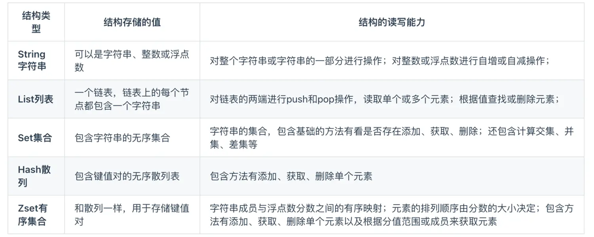

随着 Redis 版本的更新，后面又支持了四种数据类型： BitMap（2.2 版新增）、HyperLogLog（2.8 版新增）、GEO（3.2 版新增）、Stream（5.0 版新增）。

Redis 五种数据类型的应用场景：

- String 类型的应用场景：缓存对象、常规计数、分布式锁、共享 session 信息等。
- List 类型的应用场景：消息队列（但是有两个问题：1. 生产者需要自行实现全局唯一 ID；2. 不能以消费组形式消费数据）等。
- Hash 类型：缓存对象、购物车等。
- Set 类型：聚合计算（并集、交集、差集）场景，比如点赞、共同关注、抽奖活动等。
- Zset 类型：排序场景，比如排行榜、电话和姓名排序等。

Redis 后续版本又支持四种数据类型，它们的应用场景如下：

- BitMap（2.2 版新增）：二值状态统计的场景，比如签到、判断用户登陆状态、连续签到用户总数等；
- HyperLogLog（2.8 版新增）：海量数据基数统计的场景，比如百万级网页 UV 计数等；
- GEO（3.2 版新增）：存储地理位置信息的场景，比如滴滴叫车；
- Stream（5.0 版新增）：消息队列，相比于基于 List 类型实现的消息队列，有这两个特有的特性：自动生成全局唯一消息ID，支持以消费组形式消费数据。

面试能回答出五种常见的数据类型就可以，其他新的数据类型则需学习。

**回答**

Redis 支持的数据类型有：

**推荐学习**

[Redis 常见数据类型和应用场景](https://xiaolincoding.com/redis/data_struct/command.html)

### 6. **Redis有哪些底层数据结构？**

**分析**

数据对象通常指String、List、Set、Hash、ZSet这些，它们是用户直接能操作的数据类型，而他们具体实现还依托于底层数据结构，包括SDS、链表、压缩列表等，回答时候可以列举，如果特别熟悉某一种可以专门提出来，引导面试官追问。

**回答（这里是往跳表引导，根据自身掌握情况选择引导方向）**

数据对象String、List、Set、Hash、ZSet的实现都依托于底层数据结构，这些结构包括SDS、链表、压缩列表、哈希表、跳表等，比如ZSet就是利用跳表高效实现了有序集合的能力。

**推荐学习**

[ ZSet](https://ls8sck0zrg.feishu.cn/wiki/wikcnuFV22J9yTEo4N1dha3RlNf)

[ 底层数据结构跳表](https://ls8sck0zrg.feishu.cn/wiki/wikcnSYLsLh7kMET8oBSAZLv0af)

## String

### 7. Set一个已有的数据会发生什么？

**分析**

常用操作考察，答不上来会认为你没用过Redis

**回答**

Set一个已有数据会覆盖原有的值，同时会覆盖或者擦除键的过期时间

**推荐学习**

String基本操作命令，重点熟悉[ String](https://ls8sck0zrg.feishu.cn/wiki/wikcnV6H6aeW9QdbIdSvC0NG1of) 中提到的命令。

更多命令可以从[Redis 字符串(String) ](https://www.runoob.com/redis/redis-strings.html)了解

### 8. 浮点型在String是用什么表示？

**分析**

基础知识考查，只有三种编码模式，INT只针对与整型，所以浮点型必然是字符串存储。

**回答**

要将一个浮点数放入字符串对象里面，需要先将这个浮点数转换成字符串值，然后再保存转换所得的字符串值。

浮点数在字符串对象里面是用字符串值表示的，用Raw还是Embstr编码，取决于转换后字符串的长度

**推荐学习**

《Redis学习与面试》[ String](https://ls8sck0zrg.feishu.cn/wiki/wikcnV6H6aeW9QdbIdSvC0NG1of)

### 9. String可以有多大？

**分析**

基础知识考查，需要知道明确的数值，更进一步需要来源背书，再进一步需要思考为什么是这个数值。

**回答**

一个Redis字符串最大为512MB，官网有明确注明，我看源码里也是直接写死的

> 最大存储长度可以通过配置项proto-max-bulk-len控制

**推荐学习**

《Redis学习与面试》[ String](https://ls8sck0zrg.feishu.cn/wiki/wikcnV6H6aeW9QdbIdSvC0NG1of)

### 10. Redis字符串是怎么实现的？

**分析**

这个问题，首先需要分情况说出编码类型，分别应用在什么场景。

EMBSTR编码和RAW编码的选择阈值也比较重要，回答的时候，可以先说自己用的Redis版本的数值，面试官会感觉你确实有关注过编码的阈值。

如果能记得是3.2版本之前是39，3.2版本之后才是44，也可以说出来，有一定程度的加分，但是说了这个差别可能会引导面试官追问为什么，如果记不清就不要说版本差别了。

**回答**

Redis字符串底层是String对象，String对象有三种编码方式：INT型、EMBSTR型、RAW型。如果是存一个整型，可以用long表示的整数就以INT编码存储；如果存字符串，当字符串长度小于等于一个阈值，使用EMBSTR编码；字符串大于阈值，则用RAW编码。在我用的5.0.5版本中阈值是44。

**推荐学习**

《Redis学习与面试》[ String](https://ls8sck0zrg.feishu.cn/wiki/wikcnV6H6aeW9QdbIdSvC0NG1of)

### 11. 为什么EMBSTR的阈值是44？（几乎不考）

**分析**

这个问题是上个问题的追问，有以下几个要点：

1.Redis使用的是jemalloc作为内存分配器；

2.jemalloc是以64字节作为内存单元做内存分配，如果超出了64个字节就超过了一个内存单元，则会用到RAW编码；反之，如果小于等于64个字节，就认为是一个小字符串，会用到EMBSTR编码。

3.围绕64字节的关键分界来分析版本变化，Redis的字符串对象是由redisObject和sdshdr这两部分组成，redisObject大小为 4 + 4 + 24 + 32 + 64 = 128bits = 16bytes，这个是一直没变过的。

回顾sdshdr结构：

sdshdr占用的内存大小：1byte + 1byte+ 1byte + 内联数组的大小，由于内联数组中还有一个'\0'占位一个字节，所以能用的大小为 64 - 16(redisObject) - 3(sdshdr非内容属性）- 1('\0') = 44

|**不等式** |**类型** |**字符串长度** |
|---|---|---|
|20 + 字符串的长度 > 64 |大字符串 |大于44 |
|20 + 字符串的长度 <= 64 |小字符串 |小于等于44 |

**回答**

Redis是使用jemalloc内存分配器，jemalloc以64字节为阈值区分大小字符串。

所以EMBSTR的边界数值，其实是受64这个阈值影响。

redisObject占用的内存大小由redisObject和sdshdr这两部分组成，redisObject 16字节，sdshdr中已分配、已申请、标记三个字段固定占了3个字节，'\0'占了一个字节，能存放的数据就是 64-（16+4） = 44。

**推荐学习**

《Redis学习与面试》[ String](https://ls8sck0zrg.feishu.cn/wiki/wikcnV6H6aeW9QdbIdSvC0NG1of)

### 12. 你知道为什么EMBSTR曾经的阈值是39吗？（几乎不考）

**分析**

实际上一般面试官一般不会主动这么问，一般聊到这个还是因为在上面问题里提到了版本差异。要回答的话，要从SDS结构来分析，sdshdr3.2之前版本结构如下：

当时都是通用的SDS结构，非数据字段一共占据了8个字节，为了节约内存，就在3.2版本之后将SDS分为sdshdr5（这个结构不被使用）、sdshdr8、sdshdr16、sdshdr32、sdshdr64，EMBSTR使用sdshdr8节约了6个字节，但多引入了一个flags字段占据1字节，所以相比3.2版本之前的SDS多了5个字节，从这一点也能看出Redis也是不断在优化内存和性能的。

**回答**

3.2之后的版本，SDS结构进行了拆分，EMBSTR用的sdshdr8，总容量和已使用容量字段减少了6个字节，但由于增加了一个flags字段，所以最终节约了5个字节。

**推荐学习**

《Redis学习与面试》[ String](https://ls8sck0zrg.feishu.cn/wiki/wikcnV6H6aeW9QdbIdSvC0NG1of)

### 13. SDS有什么用？

**分析**

Redis是用C语言写的，SDS可以说是对C字符串的封装，一般对比普通C字符串。可以从计算长度、扩容、缩容、二进制存储这几个场景来描述。

**回答**

主要有三点：

1.SDS包含已使用容量字段，O(1)时间快速返回字符串长度，相比之下，C原生字符串需要O(n)。

2.有预留空间，在扩容时如果预留空间足够，就不用再重新分配内存，节约性能，缩容时也可以将减少的空间先保留下来，后续可以再使用。

3.不再以‘\0’作为判断标准，二进制安全，可以很方便地存储一些二进制数据。

**推荐学习**

《Redis学习与面试》[ String](https://ls8sck0zrg.feishu.cn/wiki/wikcnV6H6aeW9QdbIdSvC0NG1of)

## List

### 14. List是完全先入先出吗？

**分析**

题目所说的完全先入先出，很明显就是指只允许从尾部入队、从头部出队，而List是一个双端操作对象，所以不是完全先入先出，他也可以后入先出。

这道题就是考察是否对LIST有最基本的认识。

**回答**

List是双端操作对象，所以不是完全的先入先出，List也可以后入先出。

### 15. List对象底层编码方式是什么？

**分析**

在Redis3.2版本之前和之后，List对象的底层编码方式是不同的。面试的时候如果能对不同版本Redis的List对象底层编码方式做出分析，是一个加分项。

**回答**

在3.2版本之前，List对象的编码是ZIPLIST和LINKEDLIST。ZIPLIST适用于元素数量较少、且元素都较短的情况，否则用LINKEDLIST。

3.2版本之后，List对象的编码全部由QUICKLIST实现。QUICKLIST是一个压缩列表组成的双向链表，结合了ZIPLIST和LINKEDLIST两者的优点，在后面比较新的版本（Redis 7.0）中ZIPLIST优化为了LISTPACK。

**推荐学习**

《Redis学习与面试》[ List](https://ls8sck0zrg.feishu.cn/wiki/wikcnNp0afwpoQIzvpbWTKLYPpb)

### 16. ZIPLIST是怎么压缩数据的？

**分析**

这个问题就是对ZIPLIST数据结构本身的考察。ZIPLIST是为了节约内存而开发的，回答这个问题可以从ZIPLIST的结构入手。下图是ZIPLIST的结构：

其中entry结构为：

为了方便记忆和理解，可以将ZIPLIST分为三部分讲述：

1.结构头，即header，包括<zlbytes> <zltail> <zllen>字段。

2.数据部分，即entry列表，entry中有 <prevlen> <encoding> <entry-data>字段。

3.结尾标识，即zlend。

**回答**

压缩列表是一块连续的内存空间，元素之间是紧挨着存储的，一个压缩列表中可以包含多个节点（entry），是在连续的内存空间上实现的双端链表，
对于一个普通的双向链表，链表中每一项都占用独立的一块内存，各项之间用地址指针（或引用）连接起来。这种方式会带来大量的内存碎片，而且地址指针也会占用额外的内存。而ziplist却是将表中每一项存放在前后连续的地址空间内，一个ziplist整体占用一大块内存。

而且ziplist entry对于不同类型 会有不同长度的数据存储，保证尽可能的压缩内存

**推荐学习**

《Redis学习与面试》[ List](https://ls8sck0zrg.feishu.cn/wiki/wikcnNp0afwpoQIzvpbWTKLYPpb)

### 17. ZIPLIST下List可以从后往前遍历吗？

**分析**

首先，一切的基石，在于要知道List是一种双端数据结构，无论哪种底层编码，都需要能支持从后往前遍历。

接着，需要阐述ZIPLIST是如何做到从后往前遍历的，其实还是在考察ZIPLIST的数据结构。

ZIPLIST下entry的结构包含了上一个节点的长度，所以可以通过上一个节点的长度，找到上个节点的起始位置，这样就能实现从后往前遍历。

**回答**

可以，List是双端数据结构，无论哪种底层编码，都需要能支持从后往前遍历。ZIPLIST每个节点中都保存了上一个节点的长度，所以可以用当前节点地址减去上一个节点长度来找到上个节点起始位置，进而实现从后往前的遍历。

**推荐学习**

《Redis学习与面试》[ List](https://ls8sck0zrg.feishu.cn/wiki/wikcnNp0afwpoQIzvpbWTKLYPpb)

### 18. 在ZIPLIST数据结构下，查询节点个数的时间复杂度是多少？

**分析**

由于ZIPLIST的header中定义了记录节点数量的字段zllen，所以通常是可以在O(1)时间复杂度直接返回，为什么说通常呢？是因为zllen是2个字节的，当zllen大于65535时，zllen就存不下了，所以真实的节点数量需要遍历来得到。

**回答**

在ZIPLIST编码下，查询节点个数的时间复杂度是O(1)，因为ZIPLIST中的header定义了记录节点数量的字段，但是这里也有个限制，记录节点数量的字段只有2字节，也就说如果节点数量超过65535，就失效了，此时只能通过O(n)复杂度的遍历来查节点总数。

**推荐学习**

《Redis学习与面试》[ List](https://ls8sck0zrg.feishu.cn/wiki/wikcnNp0afwpoQIzvpbWTKLYPpb)

### 19. LINKEDLIST编码下，查询节点个数的时间复杂度是多少？

**分析**

这个问题我们可以回顾一下LINKEDLIST的表头结构：

LINKEDLIST的表头结构中定义了链表所包含节点数量的字段len，所以LINKEDLIST编码下，查询节点个数的时间复杂度是O(1)。

**回答**

LINKEDLIST编码下，查询节点个数的时间复杂度是O(1)。因为LINKEDLIST的表头结构中定义了链表所包含节点数量的字段len。

**推荐学习**

《Redis学习与面试》[ List](https://ls8sck0zrg.feishu.cn/wiki/wikcnNp0afwpoQIzvpbWTKLYPpb)

## Set

### 20. Set编码方式？

**分析**

Set底层使用了两种编码，一种是整数集合，另一种是字典。成员的数据结构和成员数量会触发Set更改底层编码，当Set同时满足元素都是整数 且 元素个数不超过512这两个条件，会使用整数集合编码，否则使用字典编码。

**回答**

Set使用整数集合和字典作为底层编码，当元素都是整数同时元素个数不超过512个，会使用整数集合编码，否则使用字典编码。

**推荐学习**

《Redis学习与面试》[ Set](https://ls8sck0zrg.feishu.cn/wiki/wikcn2xQ19Lq8RNLIkS2ddynIhe?appStyle=UI4&domain=www.feishu.cn&locale=zh-CN&refresh=1&tabName=space&theme=light&userId=7172816008439414785)

### 21. Set是有序的吗？

**分析**

Set的底层实现是整数集合或字典，前者是有序的，后者是无序的。

**回答**

Set的底层实现是整数集合或字典，前者是有序的，后者是无序的。整体来看，但是不应该依赖SET的顺序，业务使用适合始终应该按无序来用

**推荐学习**

《Redis学习与面试》[ Set](https://ls8sck0zrg.feishu.cn/wiki/wikcn2xQ19Lq8RNLIkS2ddynIhe?appStyle=UI4&domain=www.feishu.cn&locale=zh-CN&refresh=1&tabName=space&theme=light&userId=7172816008439414785)

### 22. Set为什么要用两种编码方式?

**分析**

我们可以从编码转换的条件来进行思考，Set的底层编码从INTSET到HASHTABLE的条件是元素个数或者元素类型的变化。所以采用两种编码方式的原因是INTSET更节约内存，所以在小数据量时使用，而数据多起来了，需要HASHTABLE的查找性能。

实际上如果Set中保存的所有元素都是整数，而且元素个数不是特别多的情况下，使用intset会比较节约内存，Redis用一个含有三个字段的结构体来表示intset，分别是编码方式、元素数量和实际存储元素的有序柔性数组：

intset用来保存元素的数组默认情况下是int16编码，后续如果插入更大的整数，才会升级到int32或者int64编码。这种策略可以尽可能的节约内存以及提升整数集合的灵活性。

但是升级也有弊端，升级之后，整个数组的编码会变成与最大元素的类型一致。假如这个时候，元素的数量非常多，就不那么节约内存了，而且数组查找的平均时间复杂度是`O(logn)`，不如使用字典编码。

**回答**

Set的底层编码是整数集合和字典，当元素数量小并且全部是整数的时候，会使用整数集合编码，更加的节约内存。元素数量变大会使用字典编码，查找元素的速度会更快。

**推荐学习**

《Redis学习与面试》[ Set](https://ls8sck0zrg.feishu.cn/wiki/wikcn2xQ19Lq8RNLIkS2ddynIhe?appStyle=UI4&domain=www.feishu.cn&locale=zh-CN&refresh=1&tabName=space&theme=light&userId=7172816008439414785)

## Hash

### 23. Hash的编码方式是什么？

**分析**

Hash底层有两种编码结构，一个是ZIPLIST，一个是HashTable。ZIPLIST适用于元素较少且单个元素长度较小的情况，这里的阈值分别是元素个数少于512个，值和键长度都小于64字节。

**回答**

一个是ZIPLIST，一个是HashTable。ZIPLIST适用于元素较少且单个元素长度较小的情况，其它情况使用HashTable。

**推荐学习**

《Redis学习与面试》[ Hash](https://ls8sck0zrg.feishu.cn/wiki/wikcnMYGXA9PcGMk6QODiYZPbwg)

### 24. Hash查找某个key的平均时间复杂度是多少？

**分析**

这种问对象复杂度的，要考虑多种底层编码。ZIPLIST需要遍历，平均复杂度为O(N)，HashTable是字典，可以O(1)找到对应key。

**回答**

Hash有两种底层结构，ZIPLIST时是O(N)，HashTable则是O(1)

**推荐学习**

《Redis学习与面试》[ Hash](https://ls8sck0zrg.feishu.cn/wiki/wikcnMYGXA9PcGMk6QODiYZPbwg)

### 25. Redis中HashTable查找元素总数的平均时间复杂度是多少?

**分析**

这题考察的是Redis字典的表头结构，如果表头结构中有储存键值对个数的字段，那么查找元素总数的平均时间复杂度就是O(1)，而如果没有这个字段，那字典就需要去遍历所有的键值对。

下面是Redis字典的表头结构：

可以发现字典的表头结构中的used，就记录了当前键值对数量的字段。

**回答**

HashTable查找元素总数的平均时间复杂度是O(1)，因为HashTable的表头结构中有储存键值对数量的字段，这个字段我记得叫used。

**推荐学习**

《Redis学习与面试》[ 底层结构HASHTABLE](https://ls8sck0zrg.feishu.cn/wiki/wikcnf09sLEEIaQb4IU6VptnxEc)

### 26. 一个数据在HashTable中的存储位置，是怎么计算的?

**分析**

当一个新的键值对要插入到HashTable中时，首先会使用哈希函数计算这个key的哈希值，Redis使用的哈希算法是MurmurHash2哈希算法，然后把哈希值和哈希掩码做与运算得到索引值，哈希掩码其实就是哈希表数组的大小减去1。然后程序会根据索引值把键值对插入到相应的位置。

**回答**

首先会通过哈希函数计算出key的哈希值，然后与哈希掩码做与运算得到索引值，索引值就是这个数据在HashTable中的存储位置。

**推荐学习**

《Redis学习与面试》[ 底层结构HASHTABLE](https://ls8sck0zrg.feishu.cn/wiki/wikcnf09sLEEIaQb4IU6VptnxEc)

### 27. HashTable怎么扩容?

**分析**

HashTable的扩容通过渐进式rehash操作来完成。

**回答**

首先程序会为HashTable的1号表分配空间，空间大小是第一个大于等于0号表大小*2的2 ^ n。在rehash进行期间，标记位rehashidx从0开始，每次对字典的键值对执行增删改查操作后，都会将rehashidx位置的数据迁移到1号表，然后将rehashidx加1，随着字典操作的不断执行，最终0号表的所有键值对都会被rehash到1号表上。之后，1号表会被设置成0号表，接着在1号表的位置创建一个新的空白表。

**推荐学习**

《Redis学习与面试》[ 底层结构HASHTABLE](https://ls8sck0zrg.feishu.cn/wiki/wikcnf09sLEEIaQb4IU6VptnxEc)

### 28. HashTable怎么缩容?

**分析**

HashTable的缩容也通过渐进式rehash操作来完成。

**回答**

首先程序会为HashTable的1号表分配空间，新表大小为第一个大于等于原表used的2次方幂。在rehash进行期间，标记位rehashidx从0开始，每次对字典的键值对执行增删改查操作后，都会将rehashidx位置的数据迁移到1号表，然后将rehashidx加1，随着字典操作的不断执行，最终0号表的所有键值对都会被rehash到1号表上。之后，1号表会被设置成0号表，接着在1号表的位置创建一个新的空白表。

**推荐学习**

《Redis学习与面试》[ 底层结构HASHTABLE](https://ls8sck0zrg.feishu.cn/wiki/wikcnf09sLEEIaQb4IU6VptnxEc)

### 29. HashTable什么时候扩容，什么时候缩容

**分析**

这是问扩容时机，HashTable的扩容与缩容由哈希表的负载因子决定，负载因子 = 键值对数量 / 哈希表大小。

**回答**

我先说扩容，当以下两个条件中的任意一个被满足时，哈希表会自动开始扩容：

第一个是服务器目前没有在执行BGSAVE或者BGREWRITEAOF，并且负载因子 >= 1

第二个是服务器目前正在执行BGSAVE或者BGREWRITEAOF，并且负载因子 >= 5

缩容的话也是负载因子影响，当哈希表的负载因子小于0.1时，程序会自动开始对哈希表进行收缩操作。

**推荐学习**

《Redis学习与面试》[ 底层结构HASHTABLE](https://ls8sck0zrg.feishu.cn/wiki/wikcnf09sLEEIaQb4IU6VptnxEc)

## ZSet

### 30. ZSet底层有几种编码方式？

**分析**

ZSet即有序列表，这个问题是基础知识考查，ZSet的底层编码可以是 ziplist 或者 skiplist+字典 ，需要分情况说出不同的编码类型。

ziplist 和 skiplist + 字典 编码的选择阈值不一定可以记得清，记不清说大概是128或者256也可。

当有ZSet对象可以同时满足以下两个条件时，对象使用ziplist编码：

- ZSet保存的元素数量小于128个
- ZSet保存的所有元素成员的长度都小于64字节

不能满足以上两个条件的有序集合对象将使用 skiplist + 字典 编码。

**回答**

ZSet就是有序集合对象，ZSet对象的底层有两种编码方式：ziplist 或者 skiplist+字典。

如果一个ZSet对象中的所有元素同时满足：元素数量小于128个 以及 所有元素成员的长度都小于64字节，那么会使用ziplist编码，否则使用 skiplist+字典 编码。

**推荐学习**

《Redis学习与面试》[ ZSet](https://ls8sck0zrg.feishu.cn/wiki/wikcnuFV22J9yTEo4N1dha3RlNf)

### 31. 跳表编码模式下，查询节点总数的平均时间复杂度是多少？

**分析**

这个问题是对Redis跳表数据结构的考察，首先我们可以想想跳表的表头结构：

跳表的表头结构中定义了保存节点数量的字段：`length`，所以对Redis跳表查询节点总数的平均时间复杂度应该为`O(1)`。我们也可以进一步查看相关的API底层源码：

查询有序集合成员总数的API是`zsetLength`，而当编码模式是`REDIS_ENCODING_SKIPLIST`，源码中会直接返回跳表表头结构的length字段，平均时间复杂度是`O(1)`。

**回答**

跳表编码模式下，查询节点总数的平均时间复杂度是`O(1)`，因为跳表的表头结构中定义了一个保存节点数量的字段length，源码中调用查询节点总数的API时会直接返回这个字段。

**推荐学习**

《Redis学习与面试》[ 底层数据结构跳表](https://ls8sck0zrg.feishu.cn/wiki/wikcnSYLsLh7kMET8oBSAZLv0af)

### 32. 跳表插入一条数据的平均时间复杂度是多少

**分析**

这个问题同样是对跳表这种数据结构本身的考察，跳表实际上就是在一维链表上建立多层索引的二维链表，多出来的层数可以让跳表实现类似二分查找的算法。所以跳表的插入平均时间复杂度是`O(logn)`。

**回答**

跳跃表是一种支持多级索引的结构，查询效率可以媲美二分查找，它插入一条数据也是需要先查找，找到之后会进行索引的重建，整体平均时间复杂度是`O(logN)`。

**推荐学习**

[ 底层数据结构跳表](https://ls8sck0zrg.feishu.cn/wiki/wikcnSYLsLh7kMET8oBSAZLv0af)

[数据结构与算法——跳表](https://zhuanlan.zhihu.com/p/68516038)

### 33. 为什么跳表和HashTable要配合使用

**分析**

使用了两种数据结构来实现自然是，为了让有序集合拥有这两种数据结构的优势。可以结合跳表和字典相较于各自的优势来进行回答。

**回答**

为了结合这两种数据结构各自的优势，当ZSet要根据成员来查找分值的时候，将使用字典来实现，时间复杂度为`O(1)`。而当ZSet要执行范围操作时，比如`ZRANK`、`ZRANGE`等命令时，将使用原本就有序的跳跃表来实现。

**推荐学习**

《Redis学习与面试》[ 底层数据结构跳表](https://ls8sck0zrg.feishu.cn/wiki/wikcnSYLsLh7kMET8oBSAZLv0af)

### 34. 跳表中一个节点的层高是怎么决定的？

**分析**

这个问题是对跳表这种数据结构本身的考察，跳表中插入一个节点之前会选择一个随机化的层数，因为如果跳表的层数从下至上呈一定的比例关系，那么后期插入和删除的时候就又需要去维护这种比例关系，会使时间复杂度退化。所以跳表选择在插入节点的时候，选择一个随机化的层数。

但是生成的随机层数得遵循一个算法，使得生成小数值层数的概率很大，而生成大数值层数的概率很小，这个算法就是幂次定律。跳表在插入新节点之前，会利用这个幂次定律算法生成一个随机层数。

**回答**

跳表在插入新节点之前会计算一个随机的层高，具体来说，跳表的每一个节点一开始默认都是1层，然后每增加一层的概率都是 25%，最高为32层

**推荐学习**

《Redis学习与面试》[ 底层数据结构跳表](https://ls8sck0zrg.feishu.cn/wiki/wikcnSYLsLh7kMET8oBSAZLv0af)

25%源码：<https://github.com/redis/redis/blob/7.0/src/t_zset.c>

### 35. zset**为什么用跳表而不用平衡树？**

**分析**

对于[这个问题](https://news.ycombinator.com/item?id=1171423)，Redis的作者 @antirez 是怎么说的：

> There are a few reasons:
>
> 1. They are not very memory intensive. It's up to you basically. Changing parameters about the probability of a node to have a given number of levels will make then less memory intensive than btrees.
> 2. A sorted set is often target of many ZRANGE or ZREVRANGE operations, that is, traversing the skip list as a linked list. With this operation the cache locality of skip lists is at least as good as with other kind of balanced trees.
> 3. They are simpler to implement, debug, and so forth. For instance thanks to the skip list simplicity I received a patch (already in Redis master) with augmented skip lists implementing ZRANK in O(log(N)). It required little changes to the code.

简单翻译一下，主要是从内存占用、对范围查找的支持、实现难易程度这三方面总结的原因：

- 它们不是非常内存密集型的。基本上由你决定。改变关于节点具有给定级别数的概率的参数将使其比 btree 占用更少的内存。
- Zset 经常需要执行 ZRANGE 或 ZREVRANGE 的命令，即作为链表遍历跳表。通过此操作，跳表的缓存局部性至少与其他类型的平衡树一样好。
- 它们更易于实现、调试等。例如，由于跳表的简单性，我收到了一个补丁（已经在Redis master中），其中扩展了跳表，在 O(log(N) 中实现了 ZRANK。它只需要对代码进行少量修改。

**回答**

- 跳表的实现非常灵活，可以通过改变索引构建策略，有效平衡执行效率和内存消耗。
- 跳表的代码实现比平衡树来说，实现要简单多了，平衡树插入和删除都会导致树的旋转，实现起来很复杂，而跳表就简单很多，跳表插入就比普通的链表插入节点稍复杂一点。
- 按照区间来查找数据这个操作（比如查找值在[100, 200]之间的数据），平衡树的效率没有跳表高。对于按照区间查找数据这个操作，跳表可以做到 O(logn) 的时间复杂度定位区间的起点，然后在原始链表中顺序往后遍历就可以了，这样做非常高效。

总体来说，主要是为了代码的简单、易读、不容易出错，比起平衡树复杂性，Redis 选择用了跳表。

**推荐学习**

[跳表:为什么Redis一定要用跳表来实现有序集合？](https://syt-honey.github.io/2019/03/23/17-跳表：为什么Redis一定要用跳表来实现有序集合？/)

# Redis执行

Redis对使用者而言，最常见的还是用命令来操作各种数据对象以达到存储数据的目的，这些操作命令在Redis中具体是怎么运行的，是非常关键的。我们学习过程中需要聚焦整体的执行流程、同时部分细节也需要有所了解。

### 36. Redis是单线程还是多线程

**分析**

核心处理逻辑，Redis一直都是单线程的，其它辅助模块也会有一些多线程、多进程的功能，比如：

复制模块用的多进程；

某些异步流程从4.0开始用的多线程，例如 UNLINK、FLUSHALL ASYNC、FLUSHDB ASYNC 等非阻塞的删除操作。

网络I/O解包从6.0开始用的是多线程；

但是这种分支模块，都只是辅助，最核心的还是处理架构，这块Redis始终是单线程的。

**回答**

Redis核心处理是单线程的，在6.0中使用了多线程进行I/O解包、回包。其他一些边缘点的，比较使用多线程进行删除数据等异步任务，这个倒是4.0就引入了。

### 37. Redis为什么选择单线程做核心处理

**分析**

为什么用单线程，潜台词其实对应的是为什么不用多线程。

很多同学只说多线程有多大成本、多复杂，这样就容易被追问多线程这么多问题，那为什么MySQL等很多组件都是用多线程呢，总有优势吧？为啥Redis不利用这种优势？

所以这里需要从投入产出比分析，我们先看产出：

首先Redis的定位，是内存k-v存储，是做短平快的热点数据处理，一般来说执行会很快，执行本身不应该成为瓶颈，而瓶颈通常在网络I/O，处理逻辑多线程并不会有太大收益。

再看投入：

引入多线程带来极大的复杂度，比如原来的顺序执行特性就不复存在，为了支持事务的原子性、隔离性，Redis就不得不引入一些很复杂的实现，多线程模式也使得程序调试更加复杂和麻烦，会带来额外的开发成本及运营成本，也更容易犯错。同时，也带来上下文切换成本、同步机制的开销、线程本身也占据内存大小等投入成本。

**回答**

我们从投入产出来看。首先如果引入多线程，主要是希望充分利用多核的性能，但Redis的定位，是内存k-v存储，是做短平快的热点数据处理，一般来说执行会很快，执行本身不应该成为瓶颈，而瓶颈通常在网络I/O，处理逻辑多线程并不会有太大收益。同时，支持多线程的话，我们需要付出更大的复杂度、以及多线程上下文切换、同步机制的开销等成本。这样综合来看，成本高且收益不大，所以最终选择了不做，事实也证明，单线程的Redis也确实足够高效

### 38. Redis单线程性能如何？

**分析**

这个主要考察直观的认知，Redis实际表现为单机（普通8核16G的机器）读10多万，写几万，非常炸裂。可以说自己也用过redis-benchmark来测试过。

**回答**

Redis单线程的性能是很好的，在普通机器每秒能10多万的读性能、几万的写性能。我在我自己的mac上也用redis-benchmark来测试过，写性能高达11万，读性能高达15万。

### 39. redis 为什么单线程这么快

**分析**

这里很多同学都能答到内存存储、高效的数据结构，但是遗漏I/O多路复用，其实某种意义上I/O复用是非常核心的，因为Redis使用单线程的核心，是瓶颈在I/O而不是CPU，那I/O复用正好能对症下药。

- **基于内存操作**：Redis的绝大部分操作在内存里就可以实现，数据也存在内存中，与传统的磁盘文件操作相比减少了IO，提高了操作的速度。
- **高效的数据结构**：Redis有专门设计了STRING、LIST、HASH等高效的数据结构，依赖各种数据结构提升了读写的效率。
- **采用单线程**：单线程操作省去了上下文切换带来的开销和CPU的消耗，同时不存在资源竞争，避免了死锁现象的发生。
- **I/O多路复用**：采用I/O多路复用机制同时监听多个Socket，根据Socket上的事件来选择对应的事件处理器进行处理。

**回答**

我认为有三点，一个是内存存储，这是Redis的定位也是快的前提，一个是高效的数据结构，Redis的数据结构可以说是追求极致，持续调优，最后一个是I/O多路复用，Redis的瓶颈在I/O而不是CPU，那I/O复用正好能对症下药。

### 40. Redis6.0之后引入了多线程原因（redis瓶颈）

**分析**

其实大多数面试官，并不知道哪个版本引入了啥东西，除了6.0引入多线程，因为这个事情噱头很大，而且是动了核心处理逻辑的一部分。

要回答这个问题，就要回归到Redis瓶颈所在：是I/O而不是CPU，但是随着互联网发展，请求量巨大的时候单线程在进行同步读写I/O的时间，单核CPU有时候也是不够用了。

**回答**

Redis主要瓶颈是I/O而不是CPU，但随着互联网的高速发展，在部分高并发场景，单核CPU也不见得处理得过来了，所以针对核心处理流程中的解包、发包这两个CPU耗时操作，进行了多线程优化，充分发挥多核优势

### 41. Redis6.0的多线程是默认开启的吗？

**分析**

这个主要是想看你是否真的了解过6.0多线程。

如果能答出对默认关闭的看法，可能会加分

**回答**

默认是关闭的，如果想要开启需要用户在 redis.conf 配置文件中修改。默认关闭1是为了兼容以前的，毕竟很多用户的认知中，Redis是单线程的，第二可能也是认为多线程并不是必要的，在大多数场景不开启也是完全够用的。

### 42. Redis6.0的多线程主要负责命令执行的哪一块

**分析**

Redis主要瓶颈是I/O而不是CPU，但随着互联网的高速发展，在部分高并发场景，单核CPU也不见得处理得过来了，所以针对核心处理流程中的解包、发包这两个CPU耗时操作，进行了多线程优化，充分发挥多核优势

**回答**

原来核心流程中的I/O处理，包括解包和回包，也就是读写客户端socket的I/O，这两部分都消耗CPU时间，多线程的引入主要也是为了解决单核CPU在大数据下还是不够用的问题。

# Redis持久化

### 43. RDB和AOF本质区别是什么？

**分析**

本质区别就是RDB是使用快照进行持久化，AOF是日志。

其他可以列举的区别点  都是能从 快照 与 日志 中的对比找出的

- 文件类型：RDB生成的是 二进制文件（快照），AOF生成的是 文本文件（追加日志）
- 安全性：缓存宕机时，RDB容易丢失较多的数据，AOF根据策略决定（默认的everysec可以保证最多有一秒的丢失）
- 文件恢复速度：由于RDB是二进制文件，所以恢复速度也比 AOF更快
- 操作的开销：每一次RDB保存都是一次全量保存，操作比较重，通常设置至少5分钟保存一次数据。而AOF的刷盘是一次追加操作，操作比较轻，通常设置策略为每一秒进行一次刷盘

**回答**

本质区别就是 RDB 是保存快照进行持久化，而 AOF 则是 追加日志文件进行持久化。因为这个本质区别，所以还会有文件恢复速度、安全性、操作开销等区别，需要展开讲吗？（这里其实摸不准面试官想法，所以可以询问一下）

### 44. 如果RDB和AOF只能选一种，你选哪个？

**分析**

两个方向分析：

1.性能 和  可靠 之间做一个选择

2.分析Redis为什么默认打开的是RDB，以及在只开一个情况，实际是更推荐RDB的

**回答**

如果从业务需要来看，如果我们能接受分钟级别的数据丢失，可以考虑选择RDB，如果需要尽量保证数据安全，可以考虑混合持久化，如果只用AOF，那么优先选择everysec策略进行刷盘（在可靠和性能之间有一个平衡）。

从持久化理念来看，始终开启快照是一个推荐的方式，这也是Redis官方为什么默认开启RDB，而不开启AOF，同时官网也明确不推荐只开AOF

### 45. 介绍一下AOF的三种写回策略？

**分析**

当我们设置的appendfsync策略不同，刷盘的情况也是不同的

- always

Redis在每个事件循环都会将 aof_buf 缓冲区里的所有内容通过 write 写入 AOF 文件描述符，并且调用 fsync 同步它（是在主线程中进行同步刷盘的），所以 always 的效率也是最慢的（主线程直接跟磁盘 IO 打交道，单线程的 redis 会被阻塞，有个慢速的落盘操作），但是从安全性角度来讲它也是最安全的。因为即使出现故障停机，AOF 持久化也只会丢失一个事件循环中所产生的命令数据（可以很多也可以很少，always 将变更都写入文件和同步，才能回复客户端响应成功）

- everysec

  服务器在每个事件循环都要将 aof_buf 缓冲区的所有内容通过 write 写入到 AOF 文件描述符，并且每隔超过一秒就要在子线程中对 AOF 文件进行一次 fsync 同步（注意是在子线程中异步刷盘的，如果主线程发现子线程还在 fsync，会推迟本秒的 fsync）。从效率上来讲，everysec 足够快（后台线程进行fsync，主线程只进行write），并且就算出现故障停机，也只会丢失一秒钟的数据（实际上看源码是最多会丢失两秒多的数据）everysec 是一种折中的取舍，也是默认值，也是推荐值
- no

  no 策略下 redis 不会进行任何主动的 fsync aof 刷盘操作，所以它的效率对于 redis 来说也是最高的，不过因为把同步权交由给操作系统，所以 no 模式下的单次同步时长也是最长的，它会在系统缓冲区中积累一段时间的写入数据，然后才会真的被『落盘』。从平摊操作的角度来讲，no 跟 everysec 的效率应该都是差不多的，但是从安全性来讲，如果出现故障停机，使用 no 会丢失上次同步 AOF 文件之后的所有命令数据。通常情况下如果使用 no 策略 Linux 会每隔 30s 刷盘，不过这取决于内核的具体配置

**回答**

Always、Everysec 和 No，这三种策略在可靠性上是从高到低，而在性能上从低到高。

**Always** 是每次写操作命令执行完后，同步将 AOF 日志数据写回硬盘；**Everysec** 每次写操作命令执行完后，先将命令写入到 AOF 文件的内核缓冲区，然后每隔一秒将缓冲区里的内容写回到硬盘；**No** 就是不控制写回硬盘的时机。每次写操作命令执行完后，先将命令写入到 AOF 文件的内核缓冲区，再由操作系统决定何时将缓冲区内容写回硬盘。

### 46. 为什么先执行Redis命令，再把数据写入AOF日志呢？

**分析**

好处：

- **保证正确写入**：如果当前的命令语法有问题，错误的命令记录到 AOF 日志里后可能还会进行语法检查。先执行Redis命令，再把数据写入AOF日志可以保证写入的都是正确可执行的命令。
- **不阻塞当前写操作**：因为当写操作命令执行成功后才会将命令记录到AOF日志，避免写入阻塞。

**缺陷**：

- **数据可能会丢失：** 执行写操作命令和记录日志是两个过程，Redis还没来得及将命令写入到硬盘时发生宕机，数据会有丢失的风险。
- **阻塞其他操作：** 不会阻塞当前命令的执行，但因为 AOF 日志也是在主线程中执行，所以当 Redis 把日志文件写入磁盘的时候，还是会阻塞后续的操作无法执行。

针对这个问题，我们主要强调好处。

**回答**

有2点好处。1.**保证正确写入**：如果当前的命令语法有问题，错误的命令记录到 AOF 日志里后可能还会进行语法检查。先执行Redis命令，再把数据写入AOF日志可以保证写入的都是正确可执行的命令。2.**不阻塞当前写操作**：因为当写操作命令执行成功后才会将命令记录到AOF日志，避免写入阻塞。

### 47. AOF子进程的内存数据跟主进程的内存数据不一致怎么办？

**分析**

Redis 的重写 AOF 过程是由后台子进程 bgrewriteaof 来完成的，这有两个好处：

- 子进程进行 AOF 重写期间，主进程可以继续处理命令请求，从而避免阻塞主进程；
- 子进程带有主进程的数据副本，使用子进程而不是线程，因为如果是使用线程，多线程之间会共享内存，那么在修改共享内存数据的时候，需要通过加锁来保证数据的安全，而这样就会降低性能。创建子进程时，父子进程是共享内存数据的，不过这个共享的内存只能以只读的方式，而当父子进程任意一方修改了该共享内存，会发生写时复制，于是父子进程就有了独立的数据副本，不用加锁来保证数据安全。

AOF子进程产生的时刻，数据和主进程是一致的，这里面试官是想问重写过程中主进程数据增加了，如何保持最后结果一致，回答的关键在AOF重写缓冲区。

**回答**

Redis设置了一个 **AOF 重写缓冲区**，这个缓冲区在创建 bgrewriteaof 子进程之后开始使用。在重写 AOF 期间，当 Redis 执行完一个写命令之后，它会**同时将这个写命令写入到AOF 缓冲区和AOF 重写缓冲区**。当子进程完成 AOF 重写工作后，会向主进程发送一条信号。主进程收到该信号后，会调用一个信号处理函数，将 AOF 重写缓冲区中的所有内容追加到新的 AOF 的文件中，使得新旧两个 AOF 文件所保存的数据库状态一致；新的 AOF 的文件进行改名，覆盖现有的 AOF 文件。

### 48. RDB 在执行快照的时候，数据能修改吗？

**分析**

推荐学习官网对RDB行为的说明

注意最后一句话：

> This method allows Redis to benefit from copy-on-write semantics.

就是说这种方式让Redis从写时复制技术受益，Redis官方文档基本没废话，这句话看似无关轻重，实际上说明了：执行 RDB持久化过程中，Redis 依然可以继续处理操作命令的，也就是数据是能被修改的，这就是通过写时复制技术实现的。

**回答**

可以。执行 bgsave 过程中，Redis 依然**可以继续处理操作命令**的，数据是能被修改的，采用的是写时复制技术（Copy-On-Write, COW）。执行 bgsave 命令的时候，会通过 fork（）创建子进程，此时子进程和父进程是共享同一片内存数据的，因为创建子进程的时候，会复制父进程的页表，但是页表指向的物理内存还是一个，由于共享父进程的所有数据，可以直接读取主线程里的内存数据，并将数据写入到 RDB 文件。此时如果主线程执行读操作，则主线程和 bgsave 子进程互相不影响。如果主线程要修改共享数据里的某一块数据，就会发生写时复制，数据的物理内存就会被复制一份，主线程在这个数据副本进行修改操作。与此同时，子进程可以继续把原来的数据写入到 RDB 文件。

### 49. Redis用RDB持久化时对过期键会如何处理的？

**分析**

在 Redis 使用 **RDB（Redis Database Backup）持久化** 时，**过期键** 的处理方式取决于 **RDB 生成和恢复的阶段**，具体情况如下：

- Redis 在 生成 RDB 快照时，不会 直接删除过期的键，而是检查每个 key 的 TTL，如果某个 key 已经过期，则 不会写入 RDB 文件；如果 key 未过期，则会 连同其 TTL 一起写入 RDB。这样，生成的 RDB 文件中 不会包含已过期的键，避免存储无用数据。
- 当 Redis 重启并加载 RDB 文件 时：Redis 会 正常加载所有 key 及其 TTL，但不会立即清理所有过期 key，而是由数据清理机制来保证（在客户端访问 key 时，Redis 发现 key 已过期，则立即删除。Redis 运行时的定期清理机制 可能也会被触发，主动删除过期 key）

**回答**

RDB分为生成阶段和加载阶段，生成阶段会对key进行过期检查，过期的key不会保存到RDB文件中；加载阶段在载入 RDB 文件时，Redis 会 正常加载所有 key 及其 TTL，而过期Key的删除，是由专门的数据清理机制来保证，和RDB无关。

### 50. Redis用AOF持久化时对过期键会如何处理的？

**分析**

总结为下表：

|**阶段** |**AOF 处理方式** |
|---|---|
|**AOF 追加日志** |记录 EXPIRE 命令，过期后不自动删除，只有触发惰性删除或定期清理时才写入 DEL |
|**AOF 重写** |过滤掉已过期的 key，生成更精简的 AOF 文件 |
|**AOF 恢复** |加载 AOF 时仍然恢复所有 key，过期 key 需要等待惰性删除或定期清理 |

**回答**

恢复时会恢复所有 过期key，等待惰性删除或定期清理，写入时会记录EXPIRE命令，当此过期键被删除后，Redis 会向 AOF 文件追加一条 DEL 命令来显式地删除该键值。重写阶段会对 Redis 中的键值对进行检查，已过期的键不会被保存到重写后的 AOF 文件中。

### 51. AOF模式下，Redis主从模式中，对过期键会如何处理？

**分析**

主库会记录一条del指令到AOF文件，从库也会同步这条指令

**回答**

从库不会进行过期扫描，从库的过期键处理依靠主服务器控制，**主库在 key 到期时，会在 AOF 文件里增加一条 del 指令，同步到所有的从库**，从库通过执行这条 del 指令来删除过期的 key。

如果主从同步发生意外，原本主库的 key 过期了，但是 del 指令没有同步给从库成功，导致从库内存中存在已经过期但没有删除的 key，这时候有客户端访问从库时，即使 key 还是内存的，但是从库发现 key 是过期的，就不会返回 key 的数据给客户端了。

### 52. RDB持久化的触发时机？（简单了解）

**分析**

- 从源码来看，RDB持久化函数整体上在这几个地方会被使用
  - Redis Shutdown（Redis关闭之前进行一次持久化）
  - 客户端发送save命令
  - 客户端发送bgsave命令
  - 每一次事件循环ServerCron检查是否需要bgsave（也就是判断我们的RDB配置）
  - 主从全量复制发送RDB文件（也进行一次RDB持久化）
  - 客户端执行数据库清空命令FLUSHALL
- 虽然RDB的触发条件有很多，但实际执行过程很简单，而区别点在于是子进程来执行 还是 主进程执行这个流程
  - 打开一个临时的RDB文件（c语言库函数fopen）
  - 将执行命令这一时刻数据库数据写入到 IO缓冲区（c语言库函数fwrite）
  - 会将这一时刻的数据 按照RDB对应的版本格式 进行写入
  - 执行fflush（将 IO 缓冲区里的数据刷新到内核缓冲区）
  - 执行fsync（可以将内核缓冲区里的数据刷到磁盘***）***
  - 执行fclose （关闭这个临时文件）
  - 修改临时文件名字，并让咱们的后台线程BIO_LAZY_FREE 去删除旧的RDB（到此，一次RDB过程结束）
- 简单来说RDB的流程就是 触发RDB持久化时，让主进程或子进程（区分条件）来 将这一时刻的 数据库数据写到一个新的RDB文件中

**回答**

主要有这么几个地方，一个是调用save或者bgsave命令，一个是根据我们配置周期进行，一个是Redis关闭之前，这三个是比较常见的，其它边缘一点的还有主从全量复制发送RDB文件等。（如果追问可以再说还有客户端执行数据库清空命令FLUSHALL）

**推荐学习**

分析中比较全面了

部分细节还可以看看[ RDB详解](https://ls8sck0zrg.feishu.cn/wiki/wikcnXHrfrVrApXogya3rL81cQf)

### 53. AOF刷盘的触发时机（几乎不考）

- 首先一定要弄清楚AOF的流程是怎样的
  - 整个 AOF 的流程可以分为三个过程：命令追加（append到aod_buf）、文件写入（write进内核缓冲区）、文件同步（fsync让内核缓冲区数据进入磁盘文件 ）
- 从源码来看，AOF刷盘函数在三个地方会被触发
  - Redis Shutdown的时候
  - 每一次事件循环 钩子函数 beforeSleep()
  - 每一次事件循环的时间事件对应的handler——servercron()
  - 通过配置指令关闭AOF功能时
- 而当我们设置的appendfsync策略不同，刷盘的情况也是不同的
  - always

    Redis在每个事件循环都会将 aof_buf 缓冲区里的所有内容通过 write 写入 AOF 文件描述符，并且调用 fsync 同步它（是在主线程中进行同步刷盘的），所以 always 的效率也是最慢的（主线程直接跟磁盘 IO 打交道，单线程的 redis 会被阻塞，有个慢速的落盘操作），但是从安全性角度来讲它也是最安全的。因为即使出现故障停机，AOF 持久化也只会丢失一个事件循环中所产生的命令数据（可以很多也可以很少，always 将变更都写入文件和同步，才能回复客户端响应成功）
  - everysec

    服务器在每个事件循环都要将 aof_buf 缓冲区的所有内容通过 write 写入到 AOF 文件描述符，并且每隔超过一秒就要在子线程中对 AOF 文件进行一次 fsync 同步（注意是在子线程中异步刷盘的，如果主线程发现子线程还在 fsync，会推迟本秒的 fsync）。从效率上来讲，everysec 足够快（后台线程进行fsync，主线程只进行write），并且就算出现故障停机，也只会丢失一秒钟的数据（实际上看源码是最多会丢失两秒多的数据）everysec 是一种折中的取舍，也是默认值，也是推荐值
  - no

    no 策略下 redis 不会进行任何主动的 fsync aof 刷盘操作，所以它的效率对于 redis 来说也是最高的，不过因为把同步权交由给操作系统，所以 no 模式下的单次同步时长也是最长的，它会在系统缓冲区中积累一段时间的写入数据，然后才会真的被『落盘』。从平摊操作的角度来讲，no 跟 everysec 的效率应该都是差不多的，但是从安全性来讲，如果出现故障停机，使用 no 会丢失上次同步 AOF 文件之后的所有命令数据。通常情况下如果使用 no 策略 Linux 会每隔 30s 刷盘，不过这取决于内核的具体配置

**回答**

- AOF触发流程主要有3个，一个是Redis关闭的时候，另一个是每一次事件循环钩子函数 beforeSleep()，最后一个是每一次事件循环函数servercron里面（这个问题比较复杂，如果追问需要根据分析 理清楚AOF流程是怎样的，不同appendfsync策略是如何执行的，酌情回答）

**推荐学习**

[ AOF详解](https://ls8sck0zrg.feishu.cn/wiki/wikcnzIaD8C0QLJ4Ld6zEjmBN7f)

### 54. RDB对主流程有什么影响？（几乎不考）

**分析**

主要从RDB的整个流程来寻找一些明显 或 潜在 的风险

**回答**

- 当执行阻塞式持久化的时候，由主进程进行 RDB快照保存，会阻塞主进程
- 当执行后台持久化时，由fork出的子进程来进行RDB快照保存
  - 如果数据量比较大的时候，会导致fork子进程 这个操作比较耗时，从而阻塞主进程
  - 由于采用了 写时复制技术，如果在进行RDB快照保存的时候，有大量的写入操作执行，会导致主进程多拷贝一份数据，消耗大量额外的内存

**推荐学习**

《Redis学习与面试》[ RDB详解](https://ls8sck0zrg.feishu.cn/wiki/wikcnXHrfrVrApXogya3rL81cQf)

### 55. AOF对主流程有什么影响？(几乎不考)

**分析**

- 明显的影响：使用AOF持久化，如果我们选择always的策略，每当Redis命令执行之后，需要由主进程进行write + fsync的操作，如果数据过大的话，主进程就会花费较大的时间 用于写AOF日志，对后续请求影响较大（阻塞直到写AOF完成，才能响应客户端执行成功）
- 潜在的影响
  - 如果我们选择 everysecond策略，虽然fsync是交给后台线程BIO_AOF_FSYNC来完成，但是主进程还需要进行write操作，如果后台线程上一轮fsync没有完成，那么主进程进write的时候仍然会阻塞（因为 write 作用在一个正在 fsync 的 fd 上，会阻塞）
  - AOF 重写 是由 fork出的子进程进行的，类似于上面提到的风险，fork子进程这个操作有可能阻塞主进程

**回答**

- 当appendfsync使用always，如果AOF写入日志压力过大 会 导致主进程 处理其他请求很慢
- 当appendfsync使用everysec，如果后台线程上一轮的fsync没有完成，会导致我们本轮主线程执行write被阻塞（直到fsync完成）
- 当AOF重写发生时，如果数据量比较大，会导致fork子进程 这个操作比较耗时，从而阻塞主进程

### 56. AOF混合持久化方案是什么？

**分析**

- 需要记住的时，AOF混合持久化，就是在AOF重写的基础上 做了一些改动

**回答**

- AOF混合持久化 会使用RDB持久化函数  将内存数据写入到新的AOF文件中 （数据格式也是RDB格式）
- 而重写期间 新的写入命令 追加到  新的AOF文件 仍然是AOF格式
- 此时新的AOF文件 就是 由 RDB格式 和 AOF格式组成的 日志文件

### 57. 简单描述AOF重写流程

**分析**

- AOF重写就三个关键点
  1. 子进程读取Redis DB中的数据以字符串命令的格式（也可以看作AOF文件格式）写入到新AOF文件中
  2. 如果有新数据，由主进程将数据写入到aof重写缓冲区（aof_rewrite_buf）
  3. 当子进程完成重写操作后，主进程通过管道将aof重写缓冲区中的数据传输给子进程，然后子进程追加到新aof文件中

**回答：**

当aof重写触发那一刻，主进程就会fork出一个子进程，然后这个子进程读取Redis DB中的数据，以字符串命令的格式写入到新AOF文件中

如果这个时候Redis接收到了新的写入命令，那么主进程会将这些"增量数据"写入到AOF重写缓冲区中

在子进程将数据都写入到新AOF文件后，主进程会通过管道将AOF重写缓冲区里面的数据发送给子进程，子进程再将这一份数据追加到新AOF文件中，保证新AOF文件的完整性

**推荐学习**

《Redis学习与面试》[ AOF详解](https://ls8sck0zrg.feishu.cn/wiki/wikcnzIaD8C0QLJ4Ld6zEjmBN7f) 重写部分

### 58. AOF重写你觉得有什么不足之处么？

**分析**

- 重写期间 新的写命令，会将数据写入到两处地方（AOF缓冲和AOF重写缓冲）中，这是额外的CPU和内存开销；

  重写时会将AOF 缓冲 和 AOF重写缓冲 分别 写入到 旧日志 和 新日志中，这是额外的磁盘开销
- 除了清楚 AOF的不足之处，如果还知道改进方案，那么会令面试官刮目相看，Redis 7.0就对此做了新的改进。

**回答**

我认为主要有3点不足之处：

1. 额外的CPU开销：
   1. 在重写时，主进程需要将新的写入数据 写入到 AOF重写缓冲(aof_rewrite_buf)
   2. 主进程 需要通过管道向子进程发送AOF重写缓冲的数据
   3. 子进程还需要将这些数据 写入到新的AOF日志中
2. 额外的内存开销：在重写时，AOF缓冲 和 AOF重写缓冲 中的数据都是一样的（浪费了一份）
3. 额外的磁盘开销：在重写时，AOF缓冲需要刷入 旧的AOF日志，AOF重写缓冲也需要刷入 到新的AOF日志，导致在重写时磁盘多占一份数据

Redis在7.0版本也做了对应的优化，我可以讲一下吗？（如果可以跳到下道题）

**推荐学习**

《Redis学习与面试》[ AOF详解](https://ls8sck0zrg.feishu.cn/wiki/wikcnzIaD8C0QLJ4Ld6zEjmBN7f) 重写部分

[Redis持久化 · 语雀](https://www.yuque.com/enjoy-binbin/blog/ggm40d)

### 59. 针对AOF重写的不足，你有什么优化思路呢？

**分析**

改进之处：

- 在Redis 7.0版本，对AOF重写作出了优化，提出了 MP-AOF 方案，原来的AOF重写缓冲被移除，AOF日志也分成了 Base AOF日志 ，Incr AOF日志

  > MP-AOF: Multi Part AOF = one BASE AOF + many INCR AOFs
- Base AOF日志 记录重写之前的命令；Incr AOF 日志记录 重写时 新的写入命令（正常AOF刷盘的时候写的是Incr AOF）
- 当重写发生时，主进程fork出一个 子进程，对Base AOF日志 进行重写（将当前内存数据写入到新的Base AOF日志）；如果此时有新的写入命令，会由主进程 写入到aof_buf，再将缓冲数据刷入 新的Incr AOF日志。这样 新的Incr AOF日志 + 新的Base AOF日志 就构成了完整的新的AOF日志
- 子进程重写 结束时，主进程会负责更新 manifest 文件，将新生成的 BASE AOF 和 INCR AOF 信息加进清单，并将之前的 BASE AOF 和 INCR AOF 标记为 HISTORY。

> mianfest 用于追踪管理AOF文件

- 这些 HISTORY 文件默认会被 Redis 异步删除（unlink），一旦 manifest 文件更新完成，就代表着整个 AOFRW 流程结束

**回答**

其实在Redis 7.0版本，就使用MP-AOF 方案对AOF重写做了优化，核心其实就是去掉原来的重写缓冲，同时将AOF日志拆分为 Base AOF日志 ，Incr AOF日志，由manifest来管理。重写时，还是开一个子进程，对Base AOF日志 进行重写，但是新命令会往 新的Incr AOF日志写，Incr AOF日志 + 新的Base AOF日志 就构成了完整的新的AOF日志。

**推荐学习**

《Redis学习与面试》[ AOF详解](https://ls8sck0zrg.feishu.cn/wiki/wikcnzIaD8C0QLJ4Ld6zEjmBN7f)  重写部分

[Redis持久化 · 语雀](https://www.yuque.com/enjoy-binbin/blog/ggm40d)

《Redis学习与面试》[ AOF优化-MP方案(不要求看，但面试可以吹)](https://ls8sck0zrg.feishu.cn/wiki/wikcnN0BRkgwBVhqvcN2V9YmVJh)

# Redis过期删除策略和内存淘汰策略

### 60. Redis 是怎么删除过期 key 的？

**分析**

Redis 是可以对 key 设置过期时间的，因此需要有相应的机制将已过期的键值对删除，而做这个工作的就是过期键值删除策略。

常见的三种过期删除策略：定时删除、惰性删除、定期删除。

- **定时删除策略**：该策略的作用是给 key 设置过期时间的同时，给 key 创建一个定时器，定时器在 key 的过期时间来临时，对这些 key 进行删除。 这样做的好处是保证内存空间得以释放。但是缺点是给 key 创建一个定时器会有一定的性能损失。如果 key 很多，删除这些 key 占用的内存空间也会占用 CPU 很多时间。
- **惰性删除策略**：每次从数据库取 key 的时候检查 key 是否过期，如果过期则删除，并返回 null，如果 key 没有过期，则直接返回数据。这样做的好处是占用 CPU 的时间比较少。但是缺点是如果 key 很长时间没有被获取，将不会被删除，容易造成内存泄露。
- **定期删除策略：**该策略的作用是每隔一段时间执行一次删除过期 key 的操作，该删除频率可以在 redis.conf 配置文件中设置。这样做的好处是可以避免惰性删除时出现内存泄露的问题，通过设置删除操作的时长频率，可以减少 CPU 时间的占用。但是缺点是相对内存性能友好来说，该策略不如定时删除策略，相对 CPU 性能友好来说，该策略不如惰性删除策略。

三种过期删除策略，每一种都有优缺点，仅使用某一个策略都不能满足实际需求。

所以， Redis 选择「惰性删除+定期删除」这两种策略配和使用，以求在合理使用 CPU 时间和避免内存浪费之间取得平衡。

**回答**

Redis 采用的删除策略是将**惰性删除策略和定期删除策略**组合使用。

- **惰性删除策略**：每次从数据库取 key 的时候检查 key 是否过期，如果过期则删除，并返回 null，如果 key 没有过期，则直接返回数据。这样做的好处是占用 CPU 的时间比较少。但是缺点是如果 key 很长时间没有被获取，将不会被删除，容易造成内存泄露。
- **定期删除策略：**该策略的作用是每隔一段时间执行一次删除过期 key 的操作，这样做的好处是可以避免惰性删除时出现内存泄露的问题，通过设置删除操作的时长频率，可以减少 CPU 时间的占用（从过期字典中随机抽取 20 个 key；检查这 20 个 key 是否过期，并删除已过期的 key；已过期 key 的数量占比随机抽取 key 的数量大于 25%，则继续重复步骤直到比重小于25%。）

**推荐学习**

[Redis 过期删除策略和内存淘汰策略有什么区别？](https://xiaolincoding.com/redis/module/strategy.html)

### 61. Redis有几种内存回收策略？

**分析**

太多了，有8种，建议如图所示，分类阐述

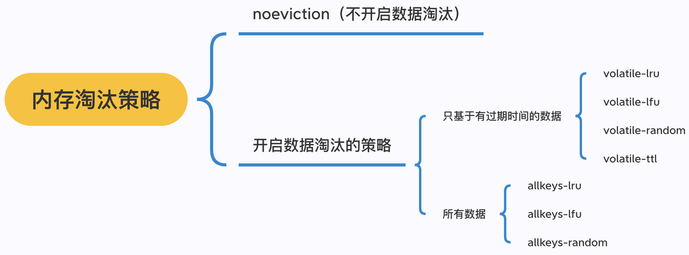

**不进行数据淘汰的策略**

- **noeviction**（Redis3.0之后，默认的内存淘汰策略） ：它表示当运行内存超过最大设置内存时，不淘汰任何数据，这时如果有新的数据写入，会报错通知禁止写入，不淘汰任何数据，但是如果没用数据写入的话，只是单纯的查询或者删除操作的话，还是可以正常工作。

**进行数据淘汰的策略**

针对「进行数据淘汰」这一类策略，又可以细分为「在设置了过期时间的数据中进行淘汰」和「在所有数据范围内进行淘汰」这两类策略。

在设置了过期时间的数据中进行淘汰：

- **volatile-random**：随机淘汰设置了过期时间的任意键值；
- **volatile-ttl**：优先淘汰更早过期的键值。
- **volatile-lru**（Redis3.0 之前，默认的内存淘汰策略）：淘汰所有设置了过期时间的键值中，最久未使用的键值；
- **volatile-lfu**（Redis 4.0 后新增的内存淘汰策略）：淘汰所有设置了过期时间的键值中，最少使用的键值；

在所有数据范围内进行淘汰：

- **allkeys-random**：随机淘汰任意键值;
- **allkeys-lru**：淘汰整个键值中最久未使用的键值；
- **allkeys-lfu**（Redis 4.0 后新增的内存淘汰策略）：淘汰整个键值中最少使用的键值。

**回答**

一种是不开启淘汰策略，此时如果内存满了，写入操作失败，但是不会淘汰已有数据。

另一种是开启淘汰策略，这时候有两个大的分支，一个是基于有过期时间的数据淘汰，一个是基于所有数据，他们都支持LRU、LFU、RANDOM算法，过期时间还支持按ttl大小淘汰。

**推荐学习**

[Redis 过期删除策略和内存淘汰策略有什么区别？](https://xiaolincoding.com/redis/module/strategy.html)

### 62. 内存回收是什么时候发起

**分析**

知道触发时机即可，实际上，每次进行读写的时候，都会调用processCommand函数，processCommand函数又会调用freememoryIfNeeded，这个时候就会尝试去释放一定的内存。函数名不需要去记

**回答**

实际上，每次进行读写的时候，都会去检查是否需要释放内存，如果需要则会触发。

**推荐学习**

《Redis学习与面试》[ 内存满了怎么办](https://ls8sck0zrg.feishu.cn/wiki/CRDnwiWdOizj6EkDRGNc5eOMnnc)

### 63. 介绍下Redis LRU回收算法

**分析**

谈谈LRU概率，这里问题是Redis的LRU算法，可以提一下是近似的。

**回答**

LRU，即最近最久未使用，记录每个key的最近访问时间，淘汰最久未没访问到的数据。但是Redis并不是标准的

LRU算法，而是做了优化，这块我可以展开讲讲么？

> PS：面试官说可以的话，也就是下面这题的回答

**推荐学习：**

《Redis学习与面试》[ 内存满了怎么办](https://ls8sck0zrg.feishu.cn/wiki/CRDnwiWdOizj6EkDRGNc5eOMnnc)

### 64. Redis LRU算法是标准的吗？为什么不用标准的

**分析**

关键点在近似LRU，以及内存池优化

**回答**

标准LRU需要维护双链表，内存成本巨大，所以Redis采用近似LRU采样来做淘汰，具体步骤是随机采样 n 个 key，这个采样个数默认为 5，然后根据时间戳淘汰掉最旧的那个 key，如果淘汰后内存还是不足，就继续随机采样来淘汰。

在3.0之后，Redis还针对近似LRU算法做了淘汰池优化，也就是维护一个候选池，池中的数据根据访问时间进行排序。第一次随机选取的key都会放入池中，然后淘汰掉最久未访问的，比如第一次选了5个，淘汰了1个，剩下4个继续留在池子里。

如果池子满了，每次随机选取的key只有空闲时间  大于 当前池子里面最小空闲时间的key时才会放入池中，然后将池中空闲时间最大的key进行淘汰

**推荐学习：**

《Redis学习与面试》[ 内存满了怎么办](https://ls8sck0zrg.feishu.cn/wiki/CRDnwiWdOizj6EkDRGNc5eOMnnc)

### 65. 什么是LFU算法，为什么Redis要引入LFU算法

**分析**

LRU的一个弊端是只看最近访问时间，而忽略了频率，比如下图

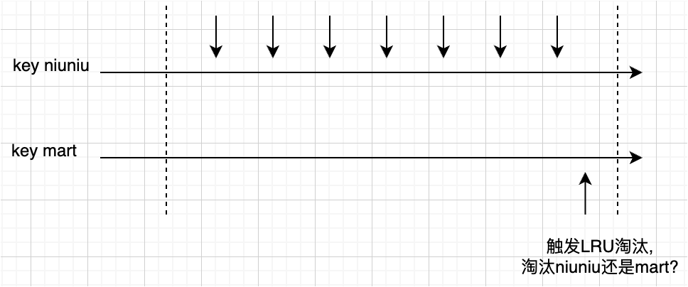

**回答**

LFU，即将访问频率也加入到影响因素中，具体而言，LFU下同时记录了上一次访问时间戳和访问计数，访问计数同时受上一次访问时间和访问频率的影响，因为每次访问都可能会增加计数。

**推荐学习：**

《Redis学习与面试》[ 内存满了怎么办](https://ls8sck0zrg.feishu.cn/wiki/CRDnwiWdOizj6EkDRGNc5eOMnnc)

# Redis场景

### 66. 你有实际使用过Redis做什么应用么？

**分析**

有些同学回答没做过，这种肯定不行。只要了解相关应用场景，就可以说有实验过。

一般而言，没经验的同学说2个场景会比较好，太多容易被质疑，太少觉得单薄。

如果实际情况应用多于2个，按实际说就行。

**回答**

有在实习中/工作中/实验室中涉及过Redis缓存场景、Redis分布式锁场景

**推荐学习**

《Redis学习与面试》[ 场景应用（重点是缓存和分布式锁）](https://ls8sck0zrg.feishu.cn/wiki/wikcnqC72vEd1geIyJjitu3Ks7c)

### 67. Redis缓存是如何应用的？

**分析**

一般都是旁路缓存，这里面试官不特别问的话，没必要背一堆缓存模式，只说旁路缓存就行。

**回答**

我们是用作旁路缓存，在我们订单项目中，是先查询Redis，没有查MySQL并将数据加载到Redis。

**推荐学习**

《Redis学习与面试》[ 缓存基础](https://ls8sck0zrg.feishu.cn/wiki/wikcno9vxy6cFFA8VrI7uL1Kjtc)

### 68. **Redis经常作为MySQL的缓存来使用，为什么？**

**分析**

有几个要点：

1.MySQL是磁盘操作，性能不高

2.Redis内存操作，性能非常高

3.缓存本质是高速存储临时存储低速存储的数据

**回答**

MySQL是关系型数据库系统，操作数据需要访问磁盘，性能不高，通常就几千QPS，而Redis基于内存并做了很多优化，性能高达10W QPS，一些热点数据就可以缓存到Redis，查询时先查Redis，不存在才查MySQL，这种Redis+MySQL结合的方式可以有效提高系统QPS。

**推荐学习**

[ 缓存基础](https://ls8sck0zrg.feishu.cn/wiki/wikcno9vxy6cFFA8VrI7uL1Kjtc)

### 69. **Redis和Memcached有哪些共同点和不同点**

**分析**

两者都是缓存中常用组件，所以容易拿来比较。

**共同点**

1. **内存存储**：
   - 两者都使用 **内存** 作为主要存储方式，访问速度极快，适用于缓存场景。
2. **键值存储（Key-Value Store）**：
   - 两者都以 **键值对（key-value）** 形式存储数据，并支持 TTL（过期时间）。
3. **高性能**：
   - 由于存储在内存中，都能在 **毫秒级** 响应数据请求，适用于高并发环境。
4. **分布式扩展**：
   - 两者都支持分布式部署（但 Redis 需要依赖外部 **Cluster** 方案，而 Memcached 原生支持分布式）。
5. **应用场景**：
   - 都用于 **缓存** 热点数据、降低数据库压力、提升网站响应速度。

**不同点**

**回答**

Memcached适合 纯字符串缓存场景，数据结构只支持字符串，超高并发下性能较优，适用于 CDN、页面缓存、数据库查询结果缓存等。

Redis适合更广泛的场景，支持持久化、多数据结构、事务、分布式锁等，适用于 排行榜、消息队列、实时统计 等。

理论上来说如果只是简单的 高性能缓存，选 Memcached；如果需要 更多功能，选 Redis，但是后端实际生产过程中，现在基本都是Redis，因为场景全面、实践经验完善性能也足够高了。

### 70. Redis做旁路缓存，如果MySQL更新了，此时何去何从？

**分析**

经典的缓存一致性问题，从八股上来就是：

**Cache Aside**

- **原理**：先从缓存中读取数据，如果没有就再去数据库里面读数据，然后把数据放回缓存中，如果缓存中可以找到数据就直接返回数据；更新数据的时候先把数据持久化到数据库，然后再让缓存失效。
- **问题**：假如有两个操作一个更新一个查询，第一个操作先更新数据库，还没来及删除缓存，查询操作可能拿到的就是旧的数据；更新操作马上让缓存失效了，所以后续的查询可以保证数据的一致性；还有的问题就是有一个是读操作没有命中缓存，然后就到数据库中取数据，此时来了一个写操作，写完数据库后，让缓存失效，然后，之前的那个读操作再把老的数据放进去，也会造成脏数据。
- **可行性**：出现上述问题的概率其实非常低，需要同时达成读缓存时缓存失效并且有并发写的操作。数据库读写要比缓存慢得多，所以读操作在写操作之前进入数据库，并且在写操作之后更新，概率比较低。

**Read/Write Through**

- **原理**：Read/Write Through原理是把更新数据库（Repository）的操作由缓存代理，应用认为后端是一个单一的存储，而存储自己维护自己的缓存。
- **Read Through**：就是在查询操作中更新缓存，也就是说，当缓存失效的时候，Cache Aside策略是由调用方负责把数据加载入缓存，而Read Through则用缓存服务自己来加载，从而对调用方是透明的。
- **Write Through**：当有数据更新的时候，如果没有命中缓存，直接更新数据库，然后返回。如果命中了缓存，则更新缓存，然后再由缓存自己更新数据库（这是一个同步操作）。

**Write Behind**

- **原理**：在更新数据的时候，只更新缓存，不更新数据库，而缓存会异步地批量更新数据库。这个设计的好处就是让数据的I/O操作非常快，带来的问题是，数据不是强一致性的，而且可能会丢。

但是这里需要结合实际经验回答，不能回答的太八股，要展现自己的思考和能力

**回答**

我在项目中使用过期时间来兜底，并且在更新DB后删除缓存来提升一致性的方式。另外，在做方案设计时候我还考虑过订阅binlog的方式，但这种方案额外引入了消息队列和消费服务，成本太高而收益不足，所以还是选择了前者。

我也调研过业界一些团队，包括腾讯云xx团队，字节跳动飞书团队，在大部分场景也是相同的选择，甚至一部分连删除都不用，本身对缓存一定程度不一致的容忍还是有的。

**推荐学习**

《Redis学习与面试》[ 缓存一致性怎么保证](https://ls8sck0zrg.feishu.cn/wiki/wikcnEJdzUmS3CgUHXUCjJY5Iad)

### 71. **如何保证删除缓存操作一定能成功？**

**分析**

缓存删除是一次Redis操作，可能因为网络波动等原因执行失败，提高删除成功率有2种思路，一个是失败就扔入重试队列，但是扔入队列这步也可能失败，所以只能说是提高，第二种就是绕过这个问题，缓存删除一般是为了数据同步，可以使用订阅MySQL BinLog的方式来同步数据。

**回答**

可以引入消息队列，删除缓存的操作由消费者来做，删除失败的话重新去消息队列拉取相应的操作，超过一定次数没有删除成功就像业务层报错。

如果是MySQL、Redis缓存同步场景，为了保证成功率，可以用一个消费服务订阅 MySQL binlog 日志，拿到具体要操作的数据，然后再向Redis执行缓存同步操作。

**推荐学习**

[ 缓存一致性怎么保证](https://ls8sck0zrg.feishu.cn/wiki/wikcnEJdzUmS3CgUHXUCjJY5Iad)

### 72. **业务缓存一致性要求高怎么办？**

**分析**

既然用了缓存，就始终存在不一致性的时间，只能说尽可能减少这个时间，不可能完全一致，如果需要完全一致就不应该用缓存。

**回答**

延迟双删是提高一致性的方案，先删除缓存，然后更新数据库，等待一段时间再删除缓存。保证第一个操作再睡眠之后，第二个操作完成更新缓存操作。但是具体睡眠多久其实是个**玄学**，很难评估出来，这个方案也只是**尽可能**保证一致性而已，依然也会出现缓存不一致的现象。

**推荐学习**

[ 缓存一致性怎么保证](https://ls8sck0zrg.feishu.cn/wiki/wikcnEJdzUmS3CgUHXUCjJY5Iad)

### 73. **如何避免缓存失效？**

**分析**

缓存正常来说都是有过期时间的，过期时间到了，这时候缓存就会被删除，对于MySQL（或其它数据源）而言也就是缓存失效了

**回答**

首先业务发现缓存失效，是会去读MySQL数据重新加载进去的，但是为了尽可能避免缓存失效，我们

可以由后台线程频繁地检测缓存是否有效，检测到即将失效了马上从数据库读取数据，并更新到缓存。

另外，在业务刚上线的时候，最好提前把数据缓起来，而不是等待用户访问才来触发缓存构建，这就是所谓的缓存预热**。**

### 74. Redis做秒杀场景可以吗？讲讲思路

**分析**

Redis在秒杀场景主要的应用方式是两个。

一个是把Redis当消息队列用，用于削峰，一个是用Redis记录库存，进行库存的加减。

**回答**

Redis可以用来记录库存，利用Redis的高性能进行库存的扣减，一个Redis处理6W的请求问题不大，100W/s流量就20台Redis来支撑，当然，每个节点都要做主从容灾。

另一个方式就是把Redis作为轻量级消息队列，来接受请求，但是不如kafka这种可靠。

**推荐学习**

《Redis学习与面试》[ 秒杀](https://ls8sck0zrg.feishu.cn/wiki/wikcnMjrBLhw661kReWXuLYDJJh)

### 75. **Redis管道有什么用？**

**分析**

Redis管道（Pipeline）是一种优化客户端与Redis服务器之间通信的机制，主要用于减少网络往返时间（RTT，Round-Trip Time），从而提升性能。

管道的工作原理：

管道技术本质上是客户端提供的功能，而非 Redis 服务器端的功能。

1. **客户端**：
   - 客户端将多个命令缓存到本地，而不是立即发送到服务器。
   - 当缓存达到一定数量或显式调用`EXEC`时，客户端一次性将所有命令发送到服务器。
2. **服务器**：
   - 服务器按照接收到的顺序依次执行所有命令。
   - 执行完成后，服务器将所有结果一次性返回给客户端。
3. **结果返回**：
   - 客户端接收到所有命令的执行结果，并按顺序处理。

管道的使用场景：

- **批量写入**：
  - 需要一次性写入大量数据时（如初始化缓存、批量插入数据），使用管道可以显著提高性能。
  - 示例：批量设置多个键值对。
- **批量读取**：
  - 需要一次性读取多个键的值时，使用管道可以减少网络延迟。
  - 示例：批量获取多个用户的信息。
- **高并发场景**：
  - 在高并发场景下，使用管道可以减少客户端与服务器之间的通信次数，降低系统负载。
- **事务优化**：
  - 在事务（`MULTI/EXEC`）中，使用管道可以避免多次网络往返。

**回答**

管道技术是客户端提供的一种批处理技术，用于一次处理多个 Redis 命令，从而提高整个交互的性能。

Pipeline的本质，是将请求在客户端打包，然后一次发送给服务端，服务端处理完成之后，会将结果存起来，等Pipeline中所有命令都完成了，再一起回包，这样可以节约很多网络交互的时间。

但使用管道技术也要注意避免发送的命令过大，或管道内的数据太多而导致的网络阻塞。

**推荐学习**

[ Pipeline](https://ls8sck0zrg.feishu.cn/wiki/wikcnnivZurWCheIioVXzZTH6fh?fromScene=spaceOverview)

### 76. 什么是热key？

**分析：**

讲清楚热key的定义和常见场景

**回答：**

热Key，也称为热点Key或热门Key，就是在Redis中，访问频率极高、请求量特别大的某些特定Key。由于这些Key的访问量远远高于其他Key，就可能会导致以下问题：

1. 资源集中消耗 ：大量请求集中在少数几个Key上，可能导致某个节点负载过高，影响系统的整体性能。
2. 单点瓶颈 ：在分布式缓存系统中，如果热Key集中在某一个节点上，可能会导致该节点成为性能瓶颈，甚至崩溃。
3. 网络带宽压力 ：频繁访问热Key会占用较多的网络带宽，可能引发网络拥塞。

常见场景：

- 电商促销活动 ：例如秒杀商品的库存信息可能成为热Key。
- 社交平台 ：例如某个爆款帖子的点赞数或评论数。
- 游戏领域 ：例如排行榜Top 1玩家的分数。

### 77. 热key问题如何发现和解决？

**分析**

热key的发现需结合**Redis本身的命令操作和业务统计完成**，解决则需通过**分散压力**和**多级缓存**策略。

**回答：**

发现热key一般有以下几种方案：

1. 使用redis-cli 的**hotkeys** 参数可以统计出热Key信息
2. 通过Redis的**MONITOR**命令找出热Key
3. 通过业务层定位热Key，在业务层增加相应的代码，埋点统计高频访问的key

而对于热key的解决核心是**降低单点压力**

1. **分散请求：**
   - **负载均衡：**将热key加上前缀或者后缀，把热key的数量从1个变成实例个数，利用分片特性将这n个key分散在不同节点上，这样就可以在访问的时候，采用客户端负载均衡的方式，随机选择一个key进行访问，将访问压力分散到不同的实例中。这个方案有个明显的缺点，就是缓存的维护成本大：假如有n为100，则更新或者删除key的时候也需要操作100个key。
   - **读写分离**：通过主从复制的方式，增加slave节点来实现读请求的负载均衡。
   - **集群扩容**：增加Redis实例，利用分片机制分摊压力
2. **多级缓存**
   - 将热key缓存到本地，构成多级缓存存储结构

### 78. 什么是大key？

**分析：**

讲清楚大key的定义和常见场景

**回答：**

大Key是指在Redis中，存储了大量数据的Key。具体来说，大Key通常包含非常大的Value值，例如一个巨大的字符串、列表、哈希表或集合等。这些Key占用的内存资源较多，可能会对系统的性能和稳定性造成影响。

而且大Key也会导致这些问题：

1. 内存占用过高 ：大Key会占用大量的内存空间，可能导致缓存系统内存不足，进而引发性能问题或OOM（Out of Memory）。
2. 删除或操作耗时 ：当删除大Key或对其进行操作（如遍历、更新）时，可能会阻塞主线程，导致Redis响应变慢甚至无响应。
3. 网络传输压力 ：如果需要将大Key的数据从缓存中读取到应用层，可能会占用较多的网络带宽，增加延迟。

大Key的常见场景：

- 粉丝列表：ZSet存储千万级用户ID
- 用户行为记录 ：将某个用户的长时间行为记录存储在一个Key中。
- 缓存大对象：比如直接用String来存储图片/视频元数据

**推荐学习**

[ Redis对象](https://ls8sck0zrg.feishu.cn/wiki/UqMDwgsdSiB2Hgkq0YrcFxkinlh)

### 79. 大key问题怎么排查和解决？

**分析：**

考察面试者是否有使用过一些工具来排查大Key问题，以及是否知道场景的解决手段

**回答：**

**排查大key问题常见的手段有：**

1. **使用redis-cli的参数**
   - **bigkeys**：统计大Key信息，集合或列表类型返回元素个数。
   - **memkeys**：统计大Key信息，返回所有数据类型所占内存大小。
2. **第三方工具**
   - 通过开源项目redis-rdb-tools分析RDB快照文件进行灵活查询，按照业务需求分析定制化地找出大key
   - RedisInsight​（官方工具）：提供图形化大 Key 分析。
3. **慢查询日志分析**
   - 大 Key 可能触发慢查询

**解决方法**

1. **数据拆分**
   - 将大key拆分为多个小key，如将一个大List拆分为多个小List。
   - 使用Hash结构存储数据，将相关字段分开存储。
2. **定期清理**
   - 设置过期时间，自动删除不再需要的数据。
   - 定期运行脚本清理历史数据。
3. **优化存储策略**
   - 使用压缩算法减少数据大小
   - 将大文件或数据存储在文件系统或对象存储中，Redis仅存储引用或元数据

   > 比如图片存储到OSS(对象存储服务)里面，Redis里面只存对应的访问URL

### 80. **Redis如何处理大key？**

**分析**

一般而言String 类型的值大于 10 KB；Hash、List、Set、ZSet 类型的元素的个数超过5000个；

**影响**：

- **客户端超时阻塞**：由于 Redis 执行命令是单线程处理，然后在操作大 key 时会比较耗时。客户端认为很久没有响应。
- **引发网络阻塞**：每次获取大 key 产生的网络流量较大。
- **阻塞工作线程**：如果使用 del 删除大 key 时，会阻塞工作线程，这样就没办法处理后续的命令，一般要用unlink去异步删除
- **内存分布不均**：集群模型在 slot 分片均匀情况下，会出现数据和查询倾斜情况，部分有大 key 的 Redis 节点占用内存多，QPS 也会比较小。

**处理**：

- 当vaule是string时，比较难拆分，则使用序列化、压缩算法将key的大小控制在合理范围内，但是序列化和反序列化都会带来更多时间上的消耗。
- 当value是string，压缩之后仍然是大key，则需要进行拆分，一个大key分为不同的部分，记录每个部分的key，使用multiget等操作实现事务读取。
- 也可以针对string 大key的场景，把stirng的value分拆成几个key-value，存储在一个hash中，每个field代表一个具体的属性，使用hget，hmget来获取部分的value，使用hset，hmset来更新部分属性
- 当value是list/set等集合类型时，根据预估的数据规模来进行分片，不同的元素计算后分到不同的片。

### 81. **Redis支持事务回滚吗？**

**分析**

Redis不具备完整的ACID特性，执行的命令都没有回滚之说，无论是事务还是LUA脚本中的命令，都是一样的。

**回答**

不支持，Redis不具备完整的ACID特性，执行的命令都没有回滚之说，Redis 提供的 DISCARD 命令只能用来主动放弃事务执行，把暂存的命令队列清空，起不到回滚的效果。至于LUA脚本也是一样，比如LUA里面有2个写操作，执行了第一个如果Redis挂掉，那么第二个不会执行，第一个也不回撤回。

**推荐学习**

[ 事务(不是很重要，但Lua要知道怎么用)](https://ls8sck0zrg.feishu.cn/wiki/wikcnMmCIJ56EHTFmX7W9LKfWhd?fromScene=spaceOverview)

### 82. Redis**如何实现延迟队列？**

**分析**

首先要指什么什么是延迟队列：

> 延迟队列是指把当前要做的事情，往后推迟一段时间再做：
>
> - 在淘宝、京东等购物平台上下单，超过一定时间未付款，订单会自动取消
> - 打车的时候，在规定时间没有车主接单，平台会取消你的单并提醒你暂时没有车主接单
> - 点外卖的时候，如果商家在10分钟还没接单，就会自动取消订单

知道延迟队列是什么之后，不难发现Redis中ZSet最适合模拟这个功能

**回答**

使用ZSet，ZSet 有一个 Score 属性可以用来存储延迟执行的时间。使用 zadd score1 value1 命令，再利用 zrangebysocre 查询符合条件的所有待处理的任务，通过循环执行队列任务。

### 83. Redis可以做消息队列吗？什么时候能用Redis做消息队列？

**分析**

在某些场景，其实我们并不是一定需要有多可靠、多完善的消息队列，比如发用消息队列发短信，我们肯定也经常遇到过，短信没收到的场景吧？没收到重试就行了。

所以，轻量级消息队列也有了市场需要，Redis就很适合来做一个不那么完善的消息队列。

**回答**

Redis可以作为轻量级消息队列。如果是本身业务轻量级，且团队没有已经接入完备的消息队列，这个时候没有必要引入一个重量消息队列，使用Redis即可满足要求，没有不能用的组件，只有不合适的场景。

**推荐学习**

《Redis学习与面试》[ 消息队列](https://ls8sck0zrg.feishu.cn/wiki/wikcnWjrJFp9tkJ3DC6oMaPXB7f)

## Redis 分布式锁

### 84. 什么是分布式锁？

**分析**

分布式锁是用于分布式环境下并发控制的一种机制，用于控制某个资源在同一时刻只能被一个应用所使用。如下图所示：

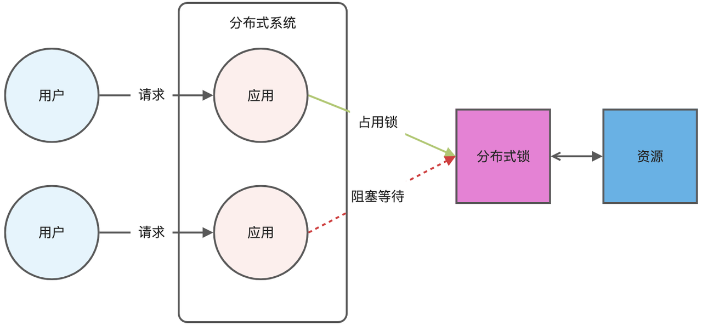

**回答**

分布式锁是控制分布式系统之间同步访问共享资源的一种方式。在多线程或者多进程并发的情况下，使用锁来保证一个代码块在同一时间内只能由一个线程执行。

**推荐学习**

《Redis学习与面试》[ 分布式锁(很重要)](https://ls8sck0zrg.feishu.cn/wiki/wikcnKKNts4CaeJ5rAGn7XW4x3d)

[ 分布式锁优化](https://ls8sck0zrg.feishu.cn/wiki/HOrdwMqsTi67ujkZFICcdRpwnCG)

### 85. **如何理解Redis原子性操作原理？**

**分析**

Redis 原子性操作的原理：

1. **单线程模型** 保证单条命令原子性。
2. **内置命令**（INCR、HSET、LPUSH）本身不可分割。
3. **MULTI / EXEC** 确保事务性操作不会被中断（可以不提这个，很少后端真的用Redis事务，都是用LUA）
4. **Lua 脚本** 执行过程中不可被其他命令插入，确保整体原子性。

这些特性让 Redis 在高并发场景下能够安全、高效地执行原子操作

**回答**

Redis提供的API都是单线程串行处理的，所以我们用单条对象操作命令都不用担心被中断，如果是多条命令要实现原子性，通常都是用LUA脚本来支持。

### 86. 分布式锁实现要点是什么（其实就是怎么加锁、怎么解锁、怎么用）？

**分析**

redis分布式锁的加锁命令（一行命令实现互斥效果+过期时间，原子性）：

要注意 setnx 这个命令，是没办法携带过期时间参数的！如果 setnx + expire 2 个命令，就没办法保证加锁的原子性了！ 所以要用 set 命令 ，携带  nx 和 px  参数，才能保证加锁的原子性！

而解锁的过程就是将 lock_key 键删除（del lock_key），但不能乱删，要保证执行操作的客户端就是加锁的客户端。所以，解锁的时候，我们要先判断锁的 unique_value 是否为加锁客户端，是的话，才将 lock_key 键删除。

可以看到，解锁是有两个操作，这时就需要 Lua 脚本来保证解锁的原子性，因为 Redis 在执行 Lua 脚本时，可以以原子性的方式执行，保证了锁释放操作的原子性。

这样一来，就通过使用 SET 命令和 Lua 脚本在 Redis 单节点上完成了分布式锁的加锁和解锁。

回答的两种讲述思路：

- 一种是直接说有几个要点，要设置owner，要设置ttl，释放时需要用lua。
- 另一种思路是直接说最重要的是加锁、解锁流程，其中加锁是怎样的命令，解锁是怎样的命令。

相对比较建议第二个思路，说出来比如自然，推进式回答可以在讲述时帮助思考

**回答**

分加锁解锁来说。

- 加锁是用SET命令，然后带上NX参数，key是锁名字，value是持有者id，再加一个过期时间，这里value要用持有者id的原因是谁申请、谁释放的原则，会在解锁时进行检查，过期时间是为了兜底，防止异常情况下锁被永久占据。
- 解锁的话，主要涉及两步操作，一个是查看是不是自己的锁，如果是接着就是释放锁，为了保证原子性，解锁需要用LUA脚本进行。

**推荐学习**

《Redis学习与面试》[ 分布式锁(很重要)](https://ls8sck0zrg.feishu.cn/wiki/wikcnKKNts4CaeJ5rAGn7XW4x3d)

[ 分布式锁优化](https://ls8sck0zrg.feishu.cn/wiki/HOrdwMqsTi67ujkZFICcdRpwnCG)

### 87. 为什么需要引入owner的概念呢？

**分析**

这个问题本质是问为什么分布式锁要这种对称性，对称性也就是说同一个锁，加锁和解锁必须是同一个竞争者。不能把其他竞争者持有的锁给释放了（超时自动释放除外）。

回答没有对称性会怎样，举个场景说明。

**回答**

分布式锁需要保证对称性，假设没有这种对称性，会有问题，举个例子，服务A获取了锁，由于业务流程比较长，或者网络延迟、GC卡顿等原因，导致锁过期，而业务还会继续进行。这时候，业务B已经拿到了锁，准备去执行，这个时候服务A恢复过来并做完了业务，就会释放锁，而B却还在继续执行，等B完成下次释放的可能又是别人的锁，这种情况是需要避免的。

**推荐学习**

《Redis学习与面试》[ 分布式锁(很重要)](https://ls8sck0zrg.feishu.cn/wiki/wikcnKKNts4CaeJ5rAGn7XW4x3d)

### 88. 你提到了lua，用lua一定能保证原子性？

**分析**

考察lua的掌握情况。

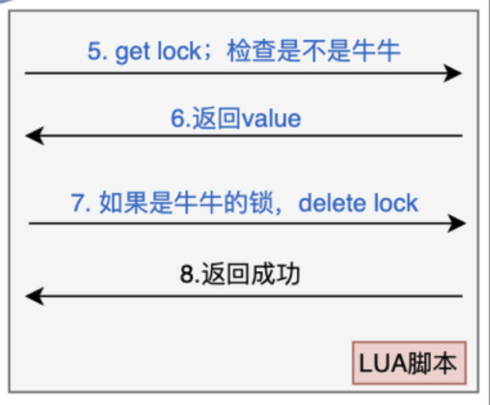

**回答**

lua本身不具备原子性，上面提到用lua来保证原子性是因为Redis是单线程执行，一个流程放进lua来执行，相当于是打包在一起，Redis执行他的过程中不会被其他请求打断，所以说保证了原子性。

这里我们也提到，我们是在释放的时候将查询key，删除key打包到一起，其中只有最后删除是写操作，所以这个流程本身是保证了原子性的。

**推荐学习**

《Redis学习与面试》[ 分布式锁(很重要)](https://ls8sck0zrg.feishu.cn/wiki/wikcnKKNts4CaeJ5rAGn7XW4x3d)

### 89. 基于 Redis 实现分布式锁有什么优缺点？

**分析**

基于 Redis 实现分布式锁的优点：

- 性能高效（这是选择缓存实现分布式锁最核心的出发点）。
- 实现方便。很多研发工程师选择使用 Redis 来实现分布式锁，很大成分上是因为 Redis 提供了 setnx 方法，实现分布式锁很方便。
- 避免单点故障（因为 Redis 是跨集群部署的，自然就避免了单点故障）。

基于 Redis 实现分布式锁的缺点：

- **超时时间不好设置**：如果锁的超时时间设置过长，会影响性能，如果设置的超时时间过短会保护不到共享资源。比如在有些场景中，一个线程 A 获取到了锁之后，由于业务代码执行时间可能比较长，导致超过了锁的超时时间，自动失效，注意 A 线程没执行完，后续线程 B 又意外的持有了锁，意味着可以操作共享资源，那么两个线程之间的共享资源就没办法进行保护了。
  - 那么如何合理设置超时时间呢？ 我们可以基于续约的方式设置超时时间：先给锁设置一个超时时间，然后启动一个守护线程，让守护线程在一段时间后，重新设置这个锁的超时时间。实现方式就是：写一个守护线程，然后去判断锁的情况，当锁快失效的时候，再次进行续约加锁，当主线程执行完成后，销毁续约锁即可，不过这种方式实现起来相对复杂。
- **Redis 主从复制模式中的数据是异步复制的，这样导致分布式锁的不可靠性：**如果在 Redis 主节点获取到锁后，在没有同步到其他节点时，Redis 主节点宕机了，此时新的 Redis 主节点依然可以获取锁，所以多个应用服务就可以同时获取到锁。

**回答**

Redis实现分布式锁的主要优点在于其性能高效、实现简单和被业界成熟应用。但是也有其局限性，首先是Redis的可用性直接影响到锁的可靠性，如果Redis服务出现故障，可能会导致锁服务不可用，虽然Redis提供了持久化机制，但在极端情况下，如Redis突然崩溃，可能会导致锁信息的丢失，从而引发锁失效的问题。

**推荐学习**

《Redis学习与面试》[ 分布式锁(很重要)](https://ls8sck0zrg.feishu.cn/wiki/wikcnKKNts4CaeJ5rAGn7XW4x3d)

### 90. **使用Redis实现分布式锁的优点？**

**分析**

优点挺多的，核心是高性能、简单易用和广泛应用，面试时候一定要提到这两点，其它酌情应对即可。

1. **高性能**
   - Redis是内存数据库，读写速度极快，适合高并发场景。
   - 单线程模型避免了锁竞争问题，操作具有原子性。
2. **简单易用**
   - Redis提供了简单的命令（如`SET key value EX seconds NX`）来实现分布式锁，开发成本低。
   - 支持多种客户端（如Java的Redisson、Python的redis-py），易于集成。
3. **自动释放锁**
   - 通过`EX`参数设置超时时间，锁会在超时后自动释放，避免死锁。
4. **灵活性**
   - 支持动态调整锁的超时时间。
   - 可以通过Lua脚本实现复杂的原子操作（如锁的释放和续期）。
5. **高可用性**
   - 结合Redis Sentinel或Redis Cluster，可以实现高可用性和容错性，避免单点故障。
6. **轻量级**
   - 相比于Zookeeper等分布式协调服务，Redis更加轻量，部署和维护成本较低。

**回答**

Redis是最常用的分布式锁，核心优势我认为在于3点，第一是性能高，速度非常快；第二是简单易用、简单意味着容易接入和不易出错；第三是广泛应用，即有丰富的实践经验。

**推荐学习**

《Redis学习与面试》[ 分布式锁(很重要)](https://ls8sck0zrg.feishu.cn/wiki/wikcnKKNts4CaeJ5rAGn7XW4x3d)

### 91. **使用Redis实现分布式锁的缺点？**

**分析**

Redis分布式锁其实很好用了，但是一切事务都有正反两面，要找缺点肯定能说不少，比如：

1. **非强一致性**
   - Redis的异步复制机制可能导致锁数据在主从节点之间不一致，极端情况下可能出现多个客户端同时持有锁。
   - 即使使用Redis Cluster，也无法完全避免脑裂问题。
2. **单点故障**
   - 在单节点Redis模式下，如果Redis宕机，分布式锁将完全失效。
   - 虽然可以通过Sentinel或Cluster提高可用性，但增加了部署和运维的复杂性。
3. **竞争问题**
   - 在高并发场景下，多个客户端可能频繁竞争锁，导致Redis性能下降。
   - 需要实现合理的重试机制（如指数退避）来缓解竞争。

**回答**

Redis分布式锁足够简单好用，但是也存在一些局限，比如Redis锁不具备强一致性，主从节点数据有不一致的情况，可能会因此出现多个客户端同时持有锁的情况，导致业务不必要的重复执行。

**推荐学习**

《Redis学习与面试》[ 分布式锁(很重要)](https://ls8sck0zrg.feishu.cn/wiki/wikcnKKNts4CaeJ5rAGn7XW4x3d)

### 92. **如何为Redis分布式锁设置合理的超时时间？**

**分析**

两个方面，核心是**评估业务逻辑：**

- **正常情况下业务耗时**：估算分布式锁保护的代码块或任务执行时间，包括数据库操作、外部API调用等。
- **分布式锁访问耗时：**Redis操作通常很快，但在高延迟环境中，需考虑客户端与Redis服务器之间的通信时间。
- **考虑最坏情况**：确定任务在最坏情况下的执行时间（如网络抖动、资源竞争等）

**回答**

核心是根据业务逻辑来评估，其次是网络延迟等交互消耗，比如业务最大执行时间是3s，网络延迟为200毫秒，多给1s缓冲，则超时时间可设置为4.2秒，向上取整为5秒。

**推荐学习**

《Redis学习与面试》[ 分布式锁(很重要)](https://ls8sck0zrg.feishu.cn/wiki/wikcnKKNts4CaeJ5rAGn7XW4x3d)

### 93. **除了 Redis 实现分布式锁，还有哪些方案可以实现分布式锁？各有什么优缺点？**

**分析**

实现方式很多，大多数组件都可以被利用为分布式锁，常见的如下：

**基于数据库（比如MySQL）的实现**

- **实现方式**：
  - 利用数据库的唯一约束或乐观锁机制（如版本号）来实现分布式锁。
  - 例如，创建一个锁表，通过插入一条唯一记录（如锁名称）来获取锁，删除记录来释放锁。
- **优点**：
  - 实现简单，直接利用现有数据库，无需引入额外组件。
  - 对于已经依赖数据库的系统，可以避免额外的依赖。
- **缺点**：
  - 性能较差，数据库的读写操作在高并发场景下可能成为瓶颈。
  - 过期时间实现比较麻烦

***

**基于 ZooKeeper 的实现**

- **实现方式**：
  - 利用 ZooKeeper 的临时顺序节点（Ephemeral Sequential Node）实现分布式锁。
  - 客户端创建一个临时顺序节点，判断自己是否是最小节点，如果是则获取锁；否则监听前一个节点的删除事件。
- **优点**：
  - 可靠性高，ZooKeeper 的设计保证了强一致性和高可用性。
  - 锁的释放由 ZooKeeper 自动处理（临时节点在客户端断开时自动删除），避免死锁。
  - 支持公平锁（按顺序获取锁）。
- **缺点**：
  - 性能较低，ZooKeeper 的写操作需要集群多数节点确认，延迟较高。
  - 部署和维护 ZooKeeper 集群的成本较高。
  - 对网络分区敏感，可能出现脑裂问题。

***

**基于 Etcd 的实现**

- **实现方式**：
  - 类似于 ZooKeeper，利用 Etcd 的分布式一致性特性实现锁。
  - 通过创建带有 TTL（Time-To-Live）的键值对来获取锁，并通过租约机制保证锁的自动释放。
- **优点**：
  - 强一致性，Etcd 基于 Raft 协议，保证数据一致性。
  - 性能优于 ZooKeeper，适合高并发场景。
  - 支持自动释放锁（通过 TTL 机制）。
- **缺点**：
  - 需要额外部署和维护 Etcd 集群。
  - 对网络分区敏感，可能出现锁失效的情况。

***

**基于 Consul 的实现**

- **实现方式**：
  - 利用 Consul 的 Key-Value 存储和会话机制实现分布式锁。
  - 客户端在 Consul 中创建一个 Key 并绑定会话，会话失效时 Key 自动删除，释放锁。
- **优点**：
  - 支持高可用和一致性。
  - 锁的自动释放机制避免死锁。
  - Consul 提供了健康检查和服务发现功能，适合微服务架构。
- **缺点**：
  - 性能较低，适合低频锁场景。
  - 部署和维护 Consul 集群的成本较高。

**回答**

Redis性能高，并被最广泛应用，最为推荐；数据库如MySQL优势在于不依赖额外组件，缺点是性能差；ZooKeeper可靠但性能低；Etcd强一致但部署复杂；Consul集成服务发现但性能一般；在具体开发工作中，我们需要根据场景选择合适方案。

**推荐学习**

|方案 |优点 |缺点 |适用场景 |
|---|---|---|---|
|Redis |性能高，实现简单 |可靠性依赖 Redis 的持久化和高可用配置 |高并发、对一致性要求不高的场景 |
|数据库 |无需额外组件 |性能差，过期时间实现比较麻烦 |不想引入数据之外其它组建+低频锁场景 |
|ZooKeeper |可靠性高，支持公平锁 |性能较低，部署维护成本高 |对一致性要求高的场景 |
|Etcd |强一致性，性能较好 |部署维护成本高，对网络分区敏感 |高并发、强一致性场景 |
|Consul |支持健康检查和服务发现 |性能较低，适合低频锁场景 |微服务架构 |

### 94. 怎么用Redis实现可重入的分布式锁？

可重入锁即同一个线程或客户端可以多次获取同一把锁，核心目的是允许同一客户端多次获取锁，减少不必要的等待，提升效率，比较适用于嵌套调用或递归场景。

Redis 实现可重入的分布式锁的实现思路如下：

**基本思路**

- **锁标识**：使用 Redis 的 `SET` 命令设置一个键值对，键为锁的名称，值为持有锁的客户端标识（如 UUID）。
- **可重入性**：维护一个计数器，记录锁的重入次数。

**实现步骤**

- **获取锁：**使用 `SET` 命令设置键值对，并设置过期时间，如果键已存在且值为当前客户端标识，则增加重入计数。
- **释放锁**：减少重入计数，如果计数为 0，则删除键。

**回答**

可重入锁的核心是计数，即额外维护一个计数器，记录锁的重入次数，我们拿加锁流程举例，即先尝试Set命令（结合NX参数），如果不存在就Set成功，存在的话则查询是否是自己的id，是的话就增加计数，解锁也是一个思路，加锁解锁都需要用LUA保证原子性。

### 95. 对 Redisson 分布式锁了解多少？（Java）

**分析**

Redisson 是一个基于 Redis 的 Java 客户端，提供了封装好的分布式锁功能，这里既然是问了解，我们可以提下他的可重入、自动续期特性，不用主动展开，面试官有兴趣会追问。

**回答**

我对 **Redisson** 分布式锁的实现有深入了解。Redisson 是一个基于 Redis 的 Java 客户端，提供了丰富的分布式数据结构和服务，其中分布式锁是其核心功能之一。Redisson 的分布式锁不仅支持可重入，还实现了锁的自动续期（Watchdog 机制）。

### 96. Redisson是怎么实现锁自动续期的？（Java）

**分析**

- 加锁成功后，Redisson 会启动一个后台线程（Watchdog），定期检查锁的状态并续期。
- 默认情况下，Watchdog 每隔 `lockWatchdogTimeout / 3` 时间（默认 10 秒）执行一次续期操作；
- 续期逻辑：

**回答**

本质就是一个后台线程，我们可以称之为看门狗，定期检查锁的状态并续期，即使不用Redisson我们也可以自己通过线程来实现，只是说Redisson封装好了这个能力。

### 97. Redis Redisson看门狗续期，是用一个后台线程去续期的，如果发生了GC停顿，导致这个线程无法执行，导致锁没有续期，这时候怎么办（Java）

**分析**

Redis 的看门狗（Watchdog）机制通过后台线程定期续期锁，但如果发生 **GC 停顿** 或 **线程阻塞**，可能导致续期失败，进而引发锁过期，影响系统的可靠性。针对这个问题，Redisson 和其他分布式锁的实现通常会采取以下策略来缓解或解决：

**回答**

可以有多种策略来应对这个问题：

- 使用多个线程同时监控和续期锁，避免单点故障。例如，Redisson 可以为每个锁实例启动多个 Watchdog 线程，确保即使一个线程被阻塞，其他线程仍能续期。
- 将锁的默认过期时间设置得足够长（例如 30 秒或更长），以减少因 GC 停顿导致锁过期的概率。
- 调整 JVM 参数，减少 Full GC 的频率和时间，但是这种方式影响比前两种方式大，因为会对整个Java程序的运行造成影响

### 98. **Redis 如何解决集群情况下分布式锁的可靠性？**

**分析**

可以了解红锁算法：

分布式锁算法 Redlock（红锁）。基于**多个 Redis 节点**的分布式锁，即使有节点发生了故障，锁变量仍然是存在的，客户端还是可以完成锁操作。官方推荐是至少部署 5 个 Redis 节点，而且都是主节点，它们之间没有任何关系，都是一个个孤立的节点。

**基本思路**：**是让客户端和多个独立的 Redis 节点依次请求申请加锁，如果客户端能够和半数以上的节点成功地完成加锁操作，那么就认为，客户端成功地获得分布式锁，否则加锁失败**。即使有某个 Redis 节点发生故障，锁的数据在其他节点上也有保存，客户端仍然可以正常地进行锁操作，锁的数据也不会丢失。

> Redlock 算法加锁三个过程：
>
> - 第一步是，客户端获取当前时间（t1）。
> - 第二步是，客户端按顺序依次向 N 个 Redis 节点执行加锁操作：加锁操作使用 SET NX，EX/PX 选项，以及带上客户端的唯一标识。如果某个 Redis 节点发生故障了，为了保证在这种情况下，Redlock 算法能够继续运行，需要给「加锁操作」设置一个超时时间，加锁操作的超时时间需要远远地小于锁的过期时间。
> - 第三步是，一旦客户端从超过半数（大于等于 N/2+1）的 Redis 节点上成功获取到了锁，就再次获取当前时间（t2），然后计算计算整个加锁过程的总耗时（t2-t1）。如果 t2-t1 < 锁的过期时间，此时，认为客户端加锁成功，否则认为加锁失败。
>
> 加锁成功要同时满足两个条件：有超过半数的 Redis 节点成功的获取到了锁，并且总耗时没有超过锁的有效时间，那么就是加锁成功。
>
> 加锁成功后，客户端需要重新计算这把锁的有效时间，计算的结果是「锁最初设置的过期时间」减去「客户端从大多数节点获取锁的总耗时（t2-t1）」。如果计算的结果已经来不及完成共享数据的操作了，可以释放锁，以免出现还没完成数据操作，锁就过期了的情况。加锁失败后，客户端向**所有 Redis 节点发起释放锁的操作**，执行释放锁的 Lua 脚本就可以。

**回答**

Redlock可以增强可靠性，他的思路就是通过多个节点加锁，在超过一半的节点成功才算获得锁。Redlock相对比较麻烦，但是也无法完全保证可靠，可以说没有完全可靠的分布式锁，实际上，在我接入过的业务中，几乎没有用Redlock做分布式锁的，引入更大的复杂度，也无法彻底解决问题。

## Redis 缓存异常

### 99. 缓存穿透是什么？怎么解决？

**分析**

当用户访问的数据，**既不在缓存中，也不在数据库中**，导致请求在访问缓存时，发现缓存缺失，再去访问数据库时，发现数据库中也没有要访问的数据，没办法构建缓存数据，来服务后续的请求。那么当有大量这样的请求到来时，数据库的压力骤增，这就是**缓存穿透**的问题。

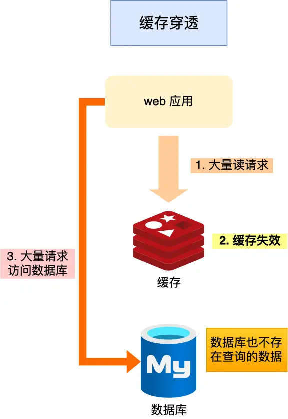

最常见的场景就是有攻击者伪造了大量的请求，请求某个不存在的数据。这会造成两个后果。

- 缓存里面没有对应的数据，所以查询会落到数据库上。
- 数据库也没有数据，所以没有办法回写缓存，下一次请求同样的数据，请求还是会落到数据库上。

解决手段：

1. **回写特殊值 ：**在缓存未命中，而且数据库里也没有的情况下，往缓存里写入一个特殊的值。这个值就是标记数据不存在，那么下一次查询请求过来的时候，看到这个特殊值，就知道没有必要再去数据库里查询了。但如果如果攻击者每次都用不同的且都不存在的 key 来请求数据，那么"回写特殊值"这种手段会丧失它的效果，而且因为要回写特殊值，会浪费不少 Redis 的内存。这可能会进一步引起另外一个问题，就是 Redis 在内存不足，执行淘汰的时候，把其他有用的数据淘汰掉，而更好的就是考虑使用布隆过滤器
2. **使用布隆过滤器**：布隆过滤器是一种快速判断元素是否存在的数据结构，它可以在很小的内存占用下，快速判断一个元素是否在一个集合中。将所有可能存在的数据哈希到一个足够大的位数组中，当一个请求过来时，可以先通过查询布隆过滤器快速判断数据是否存在，如果不存在，则直接返回，避免对数据库的查询
3. **限流策略**：针对频繁请求的特定数据，可以设置限流策略，例如使用令牌桶算法或漏桶算法，限制对这些数据的请求频率，减轻数据库的压力。

**回答**

缓存穿透是指查询一个不存在的数据，由于缓存未命中，请求直接穿透到数据库，导致数据库压力骤增。这种现象通常由恶意攻击或错误查询引发。

有很多解决策略，比如：

1. **布隆过滤器**：在缓存层前设置布隆过滤器，快速判断数据是否存在，避免无效查询。
2. **缓存空对象（回写特殊值）**：即使查询结果为空，也往缓存里写入一个特殊的值，这个值就是标记数据不存在，设置较短过期时间，防止重复查询冲击数据库。
3. **限流策略**：针对频繁请求的特定数据，可以设置限流策略

通过这些措施，可以有效缓解缓存穿透问题，保护数据库不受过度查询的压力。

**推荐学习**

[ 缓存异常场景](https://ls8sck0zrg.feishu.cn/wiki/wikcnsGZtqqLic5wv5dDEqVml2I)

### 100. **布隆过滤器是怎么工作的？**

布隆过滤器由**初始值都为0的位图数组**和**N个哈希函数**两部分组成。在写入数据库数据时，在布隆过滤器里做个标记，这样下次查询数据是否在数据库时，只需要查询布隆过滤器，如果查询到数据没有被标记，说明不在数据库中。

- 第一步，使用 N 个哈希函数分别对数据做哈希计算，得到 N 个哈希值
- 第二步，将第一步得到的 N 个哈希值对位图数组的长度取模，得到每个哈希值在位图数组的对应位置
- 第三步，将每个哈希值在位图数组的对应位置的值设置为 1

举个例子，假设有一个位图数组长度为 8，哈希函数 3 个的布隆过滤器。

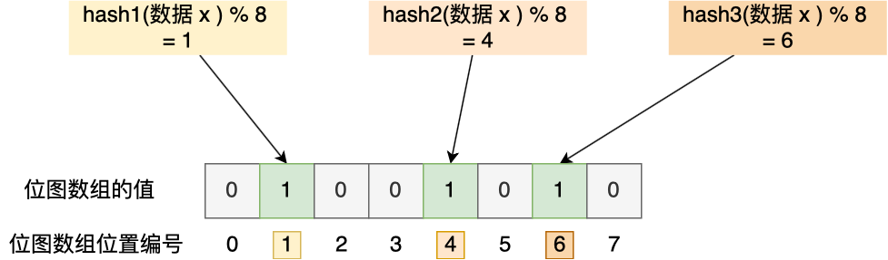

在数据库写入数据 x 后，把数据 x 标记在布隆过滤器时，数据 x 会被 3 个哈希函数分别计算出 3 个哈希值，然后在对这 3 个哈希值对 8 取模，假设取模的结果为 1、4、6，然后把位图数组的第 1、4、6 位置的值设置为 1。当应用要查询数据 x 是否数据库时，通过布隆过滤器只要查到位图数组的第 1、4、6 位置的值是否全为 1，只要有一个为 0，就认为数据 x 不在数据库中。

布隆过滤器由于是基于哈希函数实现查找的，高效查找的同时存在哈希冲突的可能性，比如数据 x 和数据 y 可能都落在第 1、4、6 位置，而事实上，可能数据库中并不存在数据 y，存在误判的情况。

所以，查询布隆过滤器说数据存在，并不一定证明数据库中存在这个数据，但是查询到数据不存在，数据库中一定就不存在这个数据。

### 101. **布隆过滤器有什么缺陷？**

**分析**

布隆过滤器特性：

1.高效存储：相比哈希表，布隆过滤器可以用很小的空间存储大规模数据。
2.无误判删除：无法删除元素（除非使用变体，如计数布隆过滤器）。
3.存在误判率：可能误判元素存在，但不会误判不存在。
4.无法获取原始数据：只能用于查询，不能存储数据本身。

其中布隆过滤器最重要的缺陷就在于无法确定一个数据是一定存在，只能判断数据一定不存在，所以适用场景也受这个缺陷（特性）的制约，所以这个缺陷（特性）一定要提到，其它的比如无法删除可以酌情扩展。

**回答**

- 布隆过滤器由于是基于哈希函数实现查找的，会存在哈希冲突的可能性，数据可能落在相同位置，存在误判的情况。查询布隆过滤器说数据存在，并不一定证明数据库中存在这个数据，但是查询到数据不存在，数据库中一定就不存在这个数据。
- 不支持一个关键字的删除，因为一个关键字的删除会牵连其他的关键字。改进方法就是counting Bloom filter，用一个counter数组代替位数组，就可以支持删除了。

### 102. 缓存击穿是什么？怎么解决？

**分析**

如果缓存中的**某个热点数据过期**了，此时大量的请求访问了该热点数据，就无法从缓存中读取，直接访问数据库，数据库很容易就被高并发的请求冲垮。

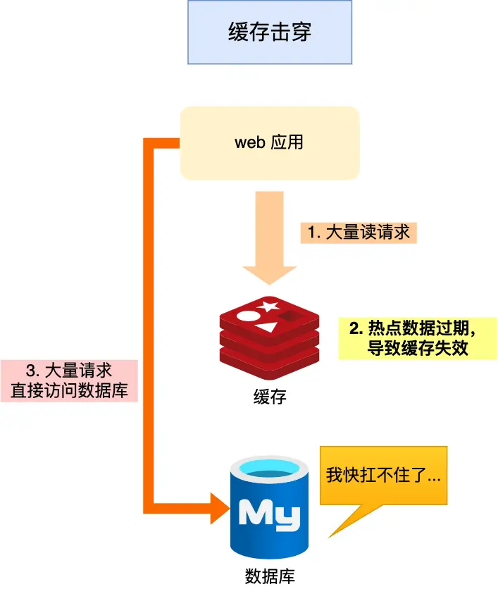

缓存击穿的关注点是热点数据不存在于缓存上，因为如果是普通数据，那就是正常的缓存未命中，反之热点数据不在缓存中了，容易导致大量请求落到数据库上

解决手段：

1. **设置热点数据的热度时间窗口**：对于热点数据，可以设置一个热度时间窗口，在这个时间窗口内，如果一个数据被频繁访问，就将其缓存时间延长，避免频繁刷新缓存导致缓存击穿。
2. **使用互斥锁或分布式锁**：在缓存失效时，只允许一个线程去查询数据库，其他线程等待查询结果。可以使用互斥锁或分布式锁来实现，确保只有一个线程能够查询数据库，其他线程等待结果，避免多个线程同时查询数据库造成数据库压力过大。
3. **缓存永不过期**：对于一些热点数据，可以将其缓存设置为永不过期，避免缓存击穿。
4. **异步更新缓存**：在缓存失效时，可以异步地去更新缓存，而不是同步地去查询数据库并刷新缓存。这样可以减少对数据库的直接访问，并且不会阻塞其他请求的响应。

**回答**

如果缓存中的**某个热点数据过期**了，此时大量的请求访问了该热点数据，就无法从缓存中读取，直接访问数据库，数据库很容易就被高并发的请求冲垮。

我们可以通过延长热点数据过期时间、使用互斥锁或分布式锁控制查询频率、缓存永不过期等手段来解决这个问题。

**推荐学习**

[ 缓存异常场景](https://ls8sck0zrg.feishu.cn/wiki/wikcnsGZtqqLic5wv5dDEqVml2I)

### 103. 缓存雪崩是什么？怎么解决？

**分析**

缓存雪崩一般有两个常见场景，当大量缓存数据在同一时间过期（失效）或者 Redis 故障宕机时，如果此时有大量的用户请求，都无法在 Redis 中处理，于是全部请求都直接访问数据库，从而导致数据库的压力骤增，严重的会造成数据库宕机，从而形成一系列连锁反应，造成整个系统崩溃，这就是缓存雪崩的问题。

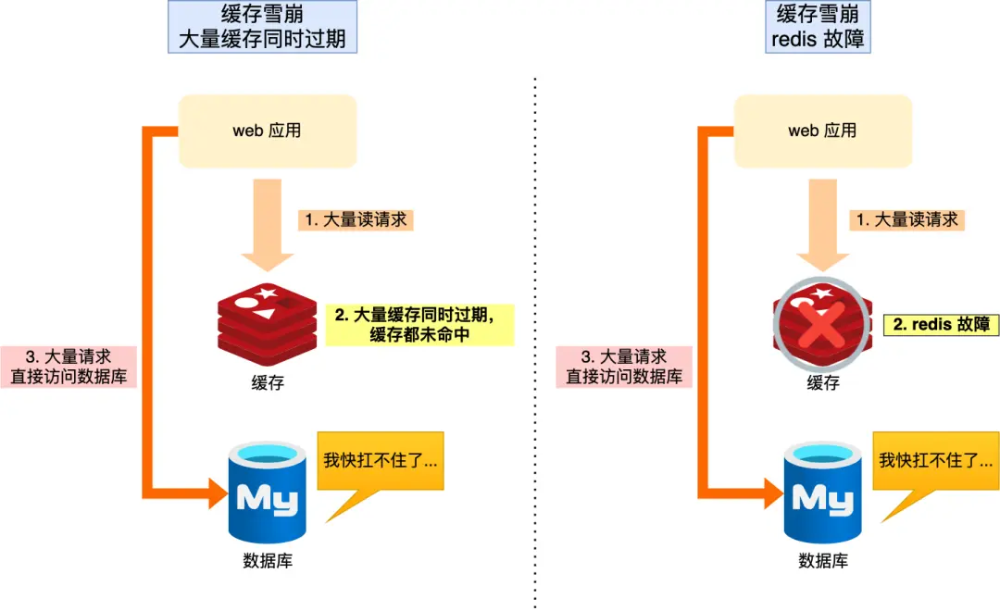

- 场景1：缓存集中失效。比如为了双十一，将一批商品放入到缓存中，设置两小时过期，凌晨2点过期了，导致对这一批商品的访问都落到了数据库，数据库就会产生压力波峰。
- 场景2：当然缓存雪崩一个最严重特殊情况是，在流量高峰，一个缓存节点直接出现问题，甚至扩大到缓存集群出现问题，那么就会导致本应该访问缓存的流量透传到数据库上。

**解决手段：**

- **大量数据同时过期的解决手段：**
  - **设置缓存数据的随机过期时间**：在设置缓存数据的过期时间时，加上一个随机值，使得不同的缓存数据在过期时刻不一致。这样可以避免大量数据同时过期，减轻数据库负荷。
  - **分布式锁或互斥锁**：在缓存失效时，使用分布式锁或互斥锁来保证只有一个请求可以重新加载缓存。其他请求等待该请求完成后，直接从缓存中获取数据。这样可以避免多个请求同时访问数据库。
  - **数据预热**：在系统启动或者非高峰期，提前将热点数据加载到缓存中，预热缓存。这样即使在高并发时，也能够从缓存中获取到数据，减轻数据库的压力。
  - **后台更新缓存**：业务线程不再负责更新缓存，缓存也不设置有效期，而是让缓存“永久有效”，并将更新缓存的工作交由后台线程定时更新。
  - **数据库优化**：对于缓存雪崩问题，除了缓存层面的应对策略，还可以从数据库层面进行优化，如提升数据库性能、增加数据库的容量等，以应对大量请求导致的数据库压力。
- **Redis故障宕机的解决手段：**
  - **服务熔断或请求限流机制**：启动服务熔断机制，暂停业务应用对缓存服务的访问，直接返回错误，所以不用再继续访问数据库，保证数据库系统的正常运行，等到 Redis 恢复正常后，再允许业务应用访问缓存服务。服务熔断机制是保护数据库的正常允许，但是暂停了业务应用访问缓存服系统，全部业务都无法正常工作。也可以启用请求限流机制，只将少部分请求发送到数据库进行处理，再多的请求就在入口直接拒绝服务。
  - **提高缓存本身的可用性**：通过主从节点的方式构建 Redis 缓存高可靠集群，如果 Redis 缓存的主节点故障宕机，从节点可以切换成为主节点，继续提供缓存服务，避免了由于 Redis 故障宕机而导致的缓存雪崩问题。

**回答**

缓存雪崩是指缓存中大量数据同时过期，导致所有请求直接访问数据库，造成数据库压力激增甚至崩溃。解决方法包括：1. 设置缓存过期时间的随机值，避免同时过期；2. 使用分布式锁或队列控制数据库访问，防止瞬间高并发；3. 实现缓存高可用，如主从复制或集群部署，确保缓存服务不中断；4. 热点数据永不过期，定时异步更新缓存；5. 提前预加载缓存，确保数据在过期前已更新。通过这些措施，可以有效缓解缓存雪崩问题。

**推荐学习**

[ 缓存异常场景](https://ls8sck0zrg.feishu.cn/wiki/wikcnsGZtqqLic5wv5dDEqVml2I)

# Redis集群

### 104. **Redis 集群架构模式有哪几种？**

**分析**

Redis 提供了三种集群模式：**主从架构、哨兵集群、切片集群**。

> **主从复制**

主从复制是 Redis 高可用服务的最基础的保证，实现方案就是将从前的一台 Redis 服务器，同步数据到多台从 Redis 服务器上，即一主多从的模式，且主从服务器之间采用的是「读写分离」的方式。

主服务器可以进行读写操作，当发生写操作时自动将写操作同步给从服务器，而从服务器一般是只读，并接受主服务器同步过来写操作命令，然后执行这条命令。

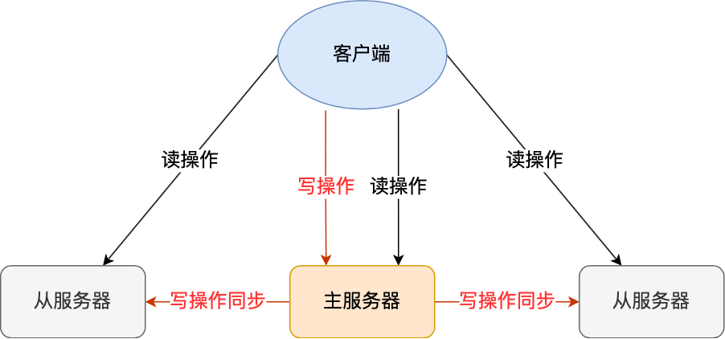

也就是说，所有的数据修改只在主服务器上进行，然后将最新的数据同步给从服务器，这样就使得主从服务器的数据是一致的。

注意，主从服务器之间的命令复制是**异步**进行的。

具体来说，在主从服务器命令传播阶段，主服务器收到新的写命令后，会发送给从服务器。但是，主服务器并不会等到从服务器实际执行完命令后，再把结果返回给客户端，而是主服务器自己在本地执行完命令后，就会向客户端返回结果了。如果从服务器还没有执行主服务器同步过来的命令，主从服务器间的数据就不一致了。

所以，无法实现强一致性保证（主从数据时时刻刻保持一致），数据不一致是难以避免的。

> **哨兵集群**

在使用 Redis 主从服务的时候，会有一个问题，就是当 Redis 的主从服务器出现故障宕机时，需要手动进行恢复。

为了解决这个问题，Redis 增加了哨兵模式（Redis Sentinel），因为哨兵模式做到了可以监控主从服务器，并且提供主从节点故障转移的功能。

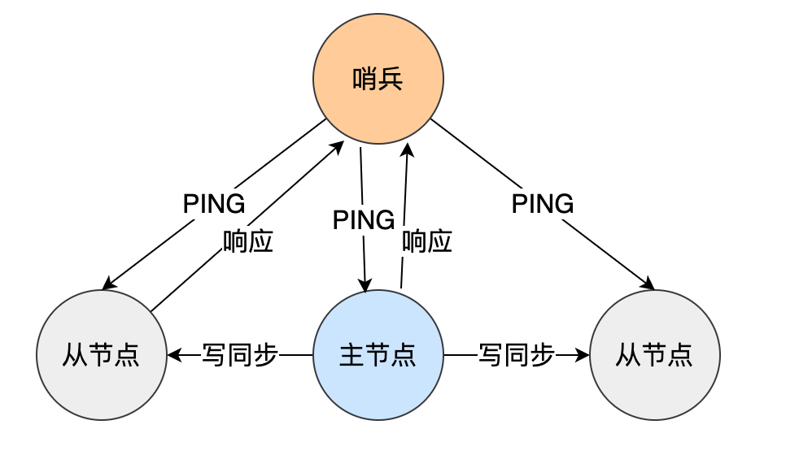

> **切片集群**

当 Redis 缓存数据量大到一台服务器无法缓存时，就需要使用 Redis 切片集群（Redis Cluster ）方案，它将数据分布在不同的服务器上，以此来降低系统对单主节点的依赖，从而提高 Redis 服务的读写性能。

Redis Cluster 方案采用哈希槽（Hash Slot），来处理数据和节点之间的映射关系。在 Redis Cluster 方案中，一个切片集群共有 16384 个哈希槽，这些哈希槽类似于数据分区，每个键值对都会根据它的 key，被映射到一个哈希槽中，具体执行过程分为两大步：

- 根据键值对的 key，按照 CRC16 算法计算一个 16 bit 的值。
- 再用 16bit 值对 16384 取模，得到 0~16383 范围内的模数，每个模数代表一个相应编号的哈希槽。

接下来的问题就是，这些哈希槽怎么被映射到具体的 Redis 节点上的呢？有两种方案：

- 平均分配： 在使用 cluster create 命令创建 Redis 集群时，Redis 会自动把所有哈希槽平均分布到集群节点上。比如集群中有 9 个节点，则每个节点上槽的个数为 16384/9 个。
- 手动分配： 可以使用 cluster meet 命令手动建立节点间的连接，组成集群，再使用 cluster addslots 命令，指定每个节点上的哈希槽个数。

为了方便你的理解，我通过一张图来解释数据、哈希槽，以及节点三者的映射分布关系。

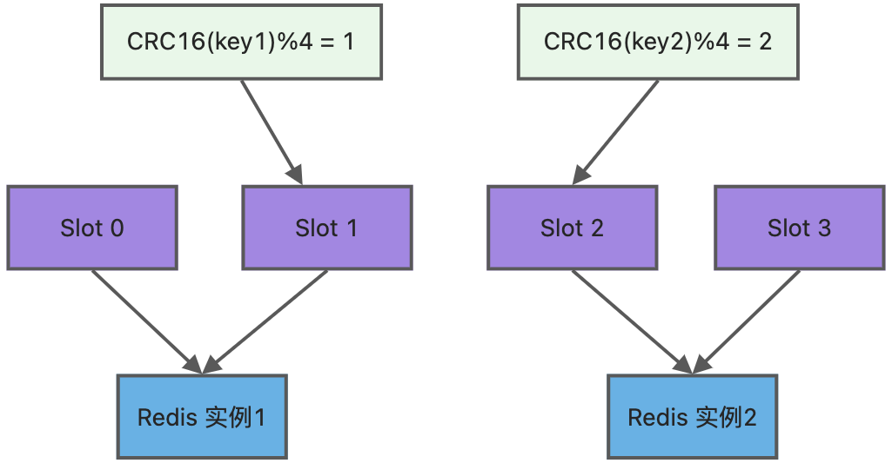

上图中的切片集群一共有 2 个节点，假设有 4 个哈希槽（Slot 0～Slot 3）时，我们就可以通过命令手动分配哈希槽，比如节点 1 保存哈希槽 0 和 1，节点 2 保存哈希槽 2 和 3。

然后在集群运行的过程中，key1 和 key2 计算完 CRC16 值后，对哈希槽总个数 4 进行取模，再根据各自的模数结果，就可以被映射到哈希槽 1（对应节点1） 和 哈希槽 2（对应节点2）。

需要注意的是，在手动分配哈希槽时，需要把 16384 个槽都分配完，否则 Redis 集群无法正常工作。

**回答：**

Redis 提供了三种集群模式：**主从架构、哨兵集群、切片集群**。

- **主从**：选择一台作为主服务器，将数据同步多台从服务器上，构建一主多从的模式，主从之间读写分离。主服务器可读可写，发生写操作会同步给从服务器，而从服务器一般是只读，并接受主服务器同步过来写操作命令。主从服务器之间的命令复制是**异步**进行的，所以无法实现强一致性保证（主从数据时时刻刻保持一致）。
- **哨兵**：当 Redis 的主从服务器出现故障宕机时，需要手动进行恢复，为了解决这个问题，Redis 增加了哨兵模式，哨兵监控主从服务器，并且提供**主从节点故障转移的功能。**
- **切片集群**：当数据量大到一台服务器无法承载，需要使用Redis切片集群(Redis Cluster)方案，它将数据分布在不同的服务器上，以此来降低系统对单主节点的依赖，提高 Redis 服务的读写性能。

**推荐学习：**

[ Redis 学习指引](https://ls8sck0zrg.feishu.cn/wiki/wikcnhADyULUGn6ZtleWm45rqvc)（集群）

### 105. Redis**主从复制过程是怎样的？**

**分析：**

Redis 集群支持的主从复制，数据同步主要有两种方法：一种是全量同步，一种是增量同步。

1. **全量同步**

刚开始搭建主从模式时，从机需要从主机上获取所有数据，这时就需要 Slave 将 Master 上所有的数据进行同步复制。复制的步骤为：

- 从服务器发送 SYNC 命令，链接主服务器；
- 主服务器收到 SYNC 命令后，进行存盘的操作，并继续收集后续的写命令，存储缓冲区；
- 存盘结束后，将对应的数据文件发送到 Slave 中，完成一次全量同步；
- 主服务数据发送完毕后，将进行增量的缓冲区数据同步；
- Slave 加载数据文件和缓冲区数据，开始接受命令请求，提供操作。
- **增量同步**

从节点完成了全量同步后，就可以正式的开启增量备份。当 Master 节点有写操作时，都会自动同步到 Slave 节点上。Master 节点每执行一个命令，都会同步向 Slave 服务器发送相同的写命令，当从服务器接收到命令，会同步执行。

**回答：**

**当从节点初次连接到主节点，或者掉线重连后进度落后较多时会进行一次全量数据同步**。此时，主节点会生成 RDB 快照并传输给从节点，在此期间，主节点接受到的增量命令将会先写入 `replication_buffer` 缓冲区，等到从节点加载完 RDB 快照的数据后，再将缓冲区的命令传输给从节点，以此完成初次同步。

**当从节点掉线重连后，如果进度落后的不多，将会进行增量同步**。主节点内部维护了一个环形的固定大小的 `repl_backlog_buffer` 缓冲区，它用于记录最近传播的命令。其中，主节点和从节点会分别在该缓冲区维护一个 offset ，用于表示自己的写进度和读进度。当从节点掉线重连后，将会检查主节点和从节点 offset 之差是否小于缓冲区大小，如果确实小于，说明从节点同步进度落后不多，则主节点将该缓冲区中的两 offset 之间的增量命令发送给从节点，完成增量同步。

**当主从节点完成初次同步后，将会建立长连接进行命令传播**。简单的来说，就是每当主节点执行一条命令，它就会写入 `replication_buffer` 缓冲区，随后再将缓冲区的命令通过节点间的长连接发送给对应的从节点。

**推荐阅读：**

[主从复制是怎么实现的？](https://xiaolincoding.com/redis/cluster/master_slave_replication.html)

### 106. **Redis 的主从复制模式有什么优缺点？**

**分析**

对于讲Redis主从复制模式优缺点，需要讲出Redis主从复制优缺点是什么，和其他方案的对比。

**一、优点：**

1. **读写分离**：主节点处理写请求，从节点分担读请求，提升系统吞吐量（适合读多写少场景）。
2. **数据冗余**：从节点实时备份主节点数据，降低数据丢失风险。
3. **高可用基础**：主节点故障时，从节点可快速切换为主（需配合哨兵或手动操作）。
4. **扩展性**：通过增加从节点横向扩展读能力，成本较低。

**二、缺点：**

1. **数据不一致**：异步复制存在延迟，可能读到旧数据（金融等强一致场景需额外方案）。
2. **写瓶颈**：所有写操作集中在主节点，高并发写入时易成为性能瓶颈。
3. **运维复杂度**：故障转移需人工干预或依赖哨兵，大规模集群管理成本高。
4. **资源开销**：每个从节点需完整数据副本，内存/存储成本随节点数线性增长。

**三、与其他方案对比：**

- **vs 哨兵模式**：哨兵提供自动故障转移，主从需手动或依赖哨兵实现高可用。
- **vs 集群模式**：集群通过分片支持海量数据和高并发写，主从仅扩展读能力，写仍受限于主节点。

**回答**

Redis主从复制通过数据冗余和读写分离提高了可用性和读性能，但存在数据一致性延迟、写操作无法扩展、故障转移复杂等缺点；相比哨兵模式缺乏自动故障转移能力，相比集群模式无法水平扩展写能力，适合读多写少且对一致性要求不高的场景。

**推荐学习**

[ 数据同步技术](https://ls8sck0zrg.feishu.cn/wiki/wikcnUbQvfpueKvmU7GdUymOKDc)

[ 机器故障了怎么办 ](https://ls8sck0zrg.feishu.cn/wiki/Pw98w5nvGifry5kkgg7cVoMDnBe)

### 107. **哨兵机制是什么？**

**分析**

Redis **哨兵（Sentinel）机制** 是一种高可用解决方案，用于监控主从节点、自动检测故障并执行主节点切换（**failover**），确保Redis服务持续可用。

**核心功能**

1. **监控**：持续检查主节点和从节点是否正常运行。
2. **自动故障转移（Failover）**：主节点宕机时，哨兵会选举新主节点并让其他从节点复制它。
3. **配置管理**：客户端可通过哨兵获取最新的主节点地址，避免手动修改配置。
4. **通知**：可集成告警系统（如邮件、API）通知管理员故障情况。

**对比主从复制**

- **主从复制**：仅数据备份，无自动故障恢复能力。
- **哨兵模式**：在主从复制基础上，增加自动故障检测和主节点切换，提升高可用性。

适用于需要 **自动容灾** 但无需 **数据分片（写扩展）** 的场景。

说明为什么需要哨兵，哨兵起到什么样的作用即可

**回答**

因为在主从架构中读写是分离的，如果主节点挂了，将没有主节点来响应客户端的写操作请求，也无法进行数据同步。

哨兵作用是实现主从节点故障转移。哨兵会监测主节点是否存活，如果发现主节点挂了，会选举一个从节点切换为主节点，并且把新主节点的相关信息通知给从节点和客户端。

**推荐学习**

[ 机器故障了怎么办 ](https://ls8sck0zrg.feishu.cn/wiki/Pw98w5nvGifry5kkgg7cVoMDnBe?from=from_copylink)

### 108. **哨兵机制的工作原理？**

**分析**

讲明哨兵机制故障转移的原理即可，哨兵工作原理主要是以下步骤：

1. **判断节点是否存活**

哨兵会周期性给所有主节点发送PING命令来判断其他节点是否正常运行。如果PING命令响应失败哨兵会将节点标记为**主观下线**，然后该哨兵会向其他节点发出投票命令，当票数达到设定的阈值之后这个主节点就被标记为**客观下线**。然后哨兵会从从节点中选择一个作为主节点。

- **投票**

哨兵集群中会选择一个leader来负责主从切换，选举是一个投票过程：判断主节点为**客观下线**的是候选者，候选者向其他哨兵发送命令表示要成为leader，其他哨兵会进行投票，每个哨兵只有一票，可以投给自己或投给别人，但是只有候选者才能把票投给自己。候选者之后拿到半数以上的赞成票并且票数大于设置的阈值，就会成为leader。

- **选出新主节点**

把网络状态不好的从节点给排除：先把已经下线的从节点过滤掉，然后把以往网络连接状态不好的从节点排除掉。接下来要对所有从节点进行三轮考察：**优先级、复制进度、ID号**。在进行每一轮考察的时候，哪个从节点优先胜出，就选择其作为新主节点：

- 第一轮考察：哨兵首先会根据从节点的优先级来进行排序，优先级的值越小排名越靠前。
- 第二轮考察：如果优先级相同，则查看复制的下标，哪个接收的复制数据多哪个就靠前。
- 第三轮考察：如果优先级和下标都相同，选择ID较小的那个。
- **更换主节点**

选出新主节点之后，哨兵leader让已下线主节点属下的所有从节点指向新主节点。

- **通知客户的主节点已更换**

客户端和哨兵建立连接后，客户端会订阅哨兵提供的频道。主从切换完成后，哨兵就会向 `+switch-master` 频道发布新主节点的 IP 地址和端口的消息，这个时候客户端就可以收到这条信息，然后用这里面的新主节点的 IP 地址和端口进行通信了。

- **将旧主节点变为从节点**

继续监视旧主节点，当旧主节点重新上线时，哨兵集群就会向它发送SLAVEOF命令，让它成为新主节点的从节点。

**回答**

哨兵机制通过周期性PING检测节点存活，若主节点主观下线则发起投票，达到阈值后标记为客观下线并选举哨兵Leader；Leader基于优先级、复制进度和ID从从节点中选出新主节点，切换从节点指向新主并通知客户端，旧主恢复后降级为从节点，实现自动故障转移和高可用。

**推荐学习**

[ 机器故障了怎么办 ](https://ls8sck0zrg.feishu.cn/wiki/Pw98w5nvGifry5kkgg7cVoMDnBe?from=from_copylink)

### 109. **Redis sentinel（哨兵）模式优缺点有哪些？**

**分析**

对于讲Redis sentinel（哨兵）模式优缺点，需要讲出Redis sentinel（哨兵）优缺点是什么，为什么要这么设计（对比redis的其他两种高可用方案）。

**回答**

优点：

- 哨兵模式基于主从复制模式，所以主从复制模式有的优点，哨兵模式也有
- 哨兵模式下，master挂掉可以自动进行切换，系统可用性更高

缺点：

- Redis的容量受限于单机配置，
- 以及主从切换过程可能会出现丢失数据的问题

### 110. **说说 Redis 哈希槽的概念？**

**分析**

对于讲Redis哈希槽概念，需要讲出Redis哈希槽是什么，哈希槽的工作原理，以及为什么要这么设计。

 1. 核心概念

Redis 哈希槽（Hash Slot）​ 是 Redis Cluster 实现数据分片的核心机制，本质上是将整个 Key 空间划分为 16384 个固定逻辑单元（槽）​。

- 数据分片规则​：每个 Key 通过 `CRC16(key) % 16384` 计算哈希槽编号，决定存储在哪个槽中。
- 槽分配​：集群中的每个节点负责管理一部分哈希槽（例如 Node1 管理 0-5000 号槽，Node2 管理 5001-10000 号槽等）。
- 去中心化路由​：客户端可直接计算 Key 对应的槽编号，无需依赖中心化的元数据服务。

2. 工作原理

- 
  1. 客户端请求：客户端计算 key 的哈希槽，若连接节点不负责该槽，返回 `MOVED` 重定向响应，引导客户端访问正确节点。
- 
  2. 节点间通信：节点通过 Gossip 协议交换槽分配信息，维护全局路由表。
- 
  3. 槽迁移：管理员可手动将槽从一个节点迁移到另一个节点，迁移过程中新旧节点同时服务该槽的请求，确保平滑过渡。

3. 关键设计细节

- 为什么是16384个槽？\
  Redis 作者 Antirez 解释：

  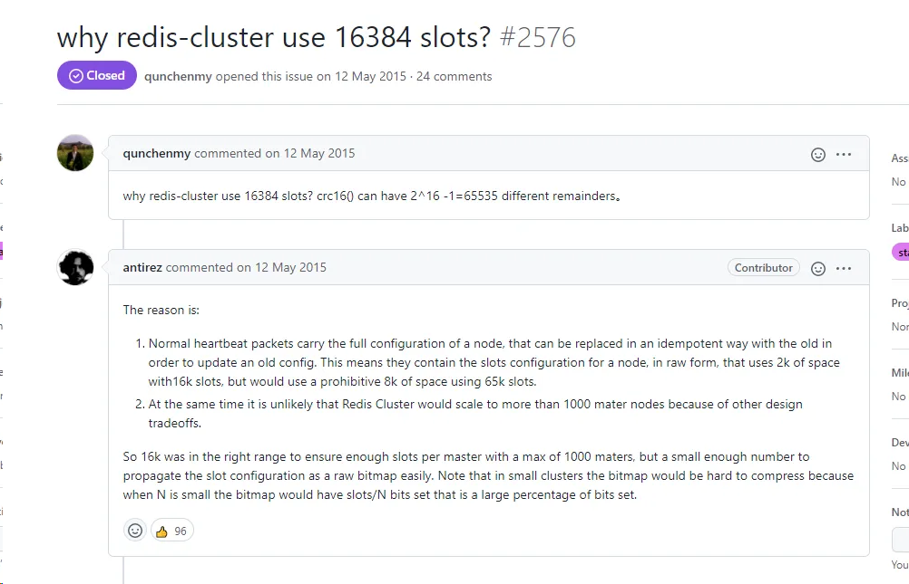

- 网络开销：节点间需同步槽分配信息，16384个槽仅需 2KB 内存（每个槽用2字节表示），若使用65536槽则需4KB，在心跳包中占比过大。
- 实际规模：16384槽足够支持上千节点，远超实际需求。
- 对比一致性哈希优势

**回答**

Redis 哈希槽是 Redis Cluster 数据分片的核心机制，整个集群有 16384 个固定槽位，每个键通过 CRC16 算法计算后取模 16384 分配到特定槽位。集群将槽位均匀分布在不同节点，节点只负责自己持有的槽位数据。客户端访问时直接路由到目标节点，若请求的槽位不属于当前节点，则返回 MOVED 重定向响应。哈希槽支持动态迁移，可通过重新分配槽位实现集群扩容缩容，迁移过程中采用 ASK 临时重定向保证可用性。这种设计实现了数据均匀分布、高效路由和弹性扩展，相比一致性哈希减少数据迁移量，是 Redis Cluster 高可用和水平扩展的基础架构。

### 111. **哈希槽和Redis节点是如何对应的？**

**分析**

在创建集群的时候，我们可以为cluster中每个节点，划分指责，也就是给他们分配负责的数据区间，这里Redis使用的是一个叫Hash槽的概念，即将数据分为了多个槽，每个节点负责一些槽。

如果想自动平均分配，也可以使用 CLUSTER REBALANCE 命令。

**回答**

主要有自动分配和手动分配两种方式。自动分配是集群创建或者节点添加减少时，Redis自动将哈希槽平均分配到集群节点上；手动分配是使用命令指定每个节点上面的哈希槽数目，使用手动分配时要把16384个槽位给分完，否则集群不会正常工作。

**推荐学习**

[ Redis集群](https://ls8sck0zrg.feishu.cn/wiki/wikcnOaxB2WCY2QLbdAQaoX2Dud?fromScene=spaceOverview)

[ Redis哈希槽](https://ls8sck0zrg.feishu.cn/wiki/wikcnecstNu4EjXeMwdOXv0xYNe?fromScene=spaceOverview)

### 112. **主从模式的同步过程？**

**分析**

Redis主从复制流程主要分为以下三个核心步骤：

1. 连接协商阶段
   - 从服务器向主服务器发送PSYNC命令，携带主服务器的runID和复制偏移量（offset）参数
   - 主服务器响应从服务器，返回自身的runID和当前复制偏移量
   - 从服务器接收并持久化存储这两个关键参数，为后续数据同步建立基础
2. 数据全量同步阶段
   - 主服务器执行BGSAVE生成RDB快照文件
   - 从服务器接收RDB文件后，会先清空现有数据集，再加载RDB文件完成全量数据同步，为确保数据一致性，主服务器在此期间将新写入操作暂存至复制缓冲区（replication buffer）
3. 增量同步阶段
   - 主服务器将复制缓冲区中的写操作按顺序发送至从服务器
   - 从服务器依次执行接收到的写命令，完成最终数据同步
   - 至此，首次主从数据同步完整流程执行完毕，进入增量数据同步阶段，也就是Redis主节点利用缓冲区将写入操作持续同步给Redis从节点

**回答**

主要分为建立**连接协商、主从数据同步、发送新操作**三个步骤，连接协商主要确定复制偏移量等关键数据，为同步建立基础；首次主从同步数据是通过RDB文件传递来同步，期间的命令是利用复制缓冲区同步，完成首次同步之后，后续写入操作持续同步给Redis从节点，保证增量数据也是同步的。

### 113. 从服务重新上线之后，**主服务器如何知道要将哪些增量数据发送给从服务器？**

**分析**

这里主要要点明如何决策是增量同步还是全量同步，这个决策取决于读的数据是不是在repl_backlog_buffer中。

> 什么是repl_backlog_buffer？
>
> - **repl_backlog_buffer**是一个**环形**缓冲区，用于主从服务器断连后，从中找到差异的数据；**replication offset**标记缓冲区的同步进度。

**回答**

网络断开从服务器重新上线之后，会发送自己的复制偏移量到主服务器，主服务器根据偏移量之间的差距判断要执行的操作：如果从服务器要读的数据在repl_backlog_buffer中，则采用增量复制；如果不在，采用全量复制。

### 114. Redis**如何减少主从数据的不一致？**

**分析**

Redis从节点会向主节点同步数据，但是同步总有延迟，有延迟就有一段时间的不一致，回答要点是如何减少不一致时间，或者对外屏蔽不一致的从节点数据。

**回答**

为了优化Redis主从节点不一致的问题，可以采取以下措施：

1. **同机房部署**：将主从节点部署在同一机房，以降低网络延迟，减少数据同步的时间差。
2. **外部监控程序**：通过外部程序实时监控主从节点的复制进度。计算主从节点之间的复制进度差，如果复制进度差超过预设阈值，客户端将不再从该从节点读取数据，从而减少数据不一致对业务的影响，进度差阈值设置不宜太小，确保在主从同步延迟较高时，客户端仍能正常访问部分从节点。

### 115. **主从模式是同步复制还是异步复制？**

**分析**

搞清楚同步复制和异步复制的区别，就不难判断，Redis是异步复制。

> **同步复制（Synchronous Replication）**
>
> - **定义**：主服务器在执行写操作时，必须等待所有从服务器成功写入数据并返回确认后，才向客户端返回成功响应。
> - **特点**：
>   - **强一致性**：主从数据完全一致，确保数据的可靠性。
>   - **高延迟**：由于需要等待从服务器的响应，写操作的延迟较高。
>   - **可靠性高**：即使主服务器宕机，从服务器也能提供完整的数据。
>   - **性能开销大**：网络延迟或从服务器性能不足会拖慢整体性能。
> - **适用场景**：
>   - 对数据一致性要求极高的场景，如金融交易、支付系统。
>   - 允许较高延迟但对数据可靠性要求严格的场景。
>
> **异步复制（Asynchronous Replication）**
>
> - **定义**：主服务器执行写操作后，立即向客户端返回成功响应，而不等待从服务器的写入确认。数据复制在后台异步进行。
> - **特点**：
>   - **弱一致性**：主从数据可能存在短暂的不一致（复制延迟）。
>   - **低延迟**：主服务器无需等待从服务器，写操作响应速度快。
>   - **性能高**：适合高并发、低延迟的场景。
>   - **可靠性较低**：如果主服务器在数据复制完成前宕机，可能导致数据丢失。
> - **适用场景**：
>   - 对性能要求高、允许短暂数据不一致的场景，如社交网络、日志系统。
>   - 数据丢失风险可接受的场景。

**回答**

异步复制。因为主节点收到写命令之后，先写到内部的缓冲区，然后再异步发送给从节点。这样做的好处是对主流程影响小，不干扰Redis的高性能。

### 116. 如何保证Redis的高可用性？

**分析：**

Redis的高可用性指的是在节点故障时快速恢复服务，核心方案有三种(主从复制，集群模式)，可根据业务规模选择

**回答:**

在面试中，可以按以下结构清晰回答：

1. **主从复制**

Redis支持主从复制机制，其中一个Redis实例（主节点）负责写操作，而其他实例（从节点）复制主节点的数据。如果主节点发生故障，结合哨兵，可以让从节点顶替成为主节点，提供读写功能，从而实现故障转移和高可用性。

- **集群模式（大规模场景）**

Redis Cluster是一种分布式Redis解决方案，它可以将数据分片存储在多个节点上，并自动管理节点间的数据分布和故障转移。Redis Cluster提供了高可用性和扩展性，允许在集群中添加或删除节点而不会影响整个系统的可用性。

- **监控和警报**

建立有效的监控和警报系统可以及时发现问题并采取行动。监控Redis的关键指标，如内存使用、连接数和响应时间，可以在问题发生时快速响应。

**补充方案**

- **持久化**​：开启RDB快照和AOF日志，宕机后可从磁盘恢复数据（不是高可用，是兜底）。
- **云服务**​：直接用阿里云、AWS的托管Redis服务（多可用区部署）。

**推荐学习**

[ Redis 学习指引](https://ls8sck0zrg.feishu.cn/wiki/wikcnhADyULUGn6ZtleWm45rqvc)(集群相关)

[ 多机部署](https://ls8sck0zrg.feishu.cn/wiki/wikcnZ4y9QFwk0IZDjNiXIw8eFd)

[主从复制是怎么实现的？](https://xiaolincoding.com/redis/cluster/master_slave_replication.html)

### 117. Redis cluster注重CAP哪两者？为什么？

**分析**

Redis Cluster 作为分布式缓存系统，遵循 CAP 理论，但需要在三者中做出取舍。其核心设计目标是高性能、高可用性和水平扩展，因此在 **AP（可用性+分区容错性）** 之间做了明确选择，牺牲了强一致性（C）。

**具体来说，Redis Cluster 优先保证以下两者**：

1. **分区容错性（P）**
   - 数据分片：数据被划分为 16384 个哈希槽，分布在多个节点上。即使发生网络分区（如部分节点失联），各分区仍能独立处理自己负责的槽位请求。
   - Gossip 协议：节点间通过 Gossip 协议自动发现和同步状态，确保网络分区后仍能维护集群元数据。
2. **可用性（A）**
   - 主从自动故障转移：主节点宕机时，从节点通过选举机制快速晋升为新主节点，客户端无感知。
   - 异步复制：主节点写入成功后立即返回响应，数据异步复制到从节点，避免同步复制导致的延迟。

**为什么牺牲一致性？**

**一致性（C）与可用性（A）的权衡**：Redis Cluster在默认情况下更倾向于可用性（A）。在数据复制过程中，Redis采用了异步复制机制，这意味着主节点写入数据后，不会等待所有从节点确认就返回操作成功的结果。这样做提高了系统的响应速度和可用性，但在极端情况下（如主节点宕机且未完成数据同步）可能会导致数据丢失，即牺牲了强一致性（C）。

这种对一致性的权衡让Redis Cluster 更符合 AP 系统的特点。

**回答**

Redis Cluster在CAP中明确选择AP（可用性+分区容错性），牺牲强一致性（C）。通过16384哈希槽分片和Gossip协议保障分区容错性（P），即使网络分区各节点仍能独立工作。采用主从自动故障转移和异步复制确保高可用性（A），写入快速响应但可能丢失未同步数据。这种设计优先保证高性能和扩展性，接受最终一致性，典型符合AP系统特征。

**推荐学习**

[ 分布式系列](https://ls8sck0zrg.feishu.cn/wiki/ECYSwPIs9i5VM6kdF1yctUwMnpe)

### 118. cluster集群原理，客户端是怎样知道该访问哪个分片的

Redis Cluster 将数据按照键哈希分配到 16384 个哈希槽 slot 上，这个问题其实是问如何找到Key对应的哈希槽的

**回答:**

1. 首先客户端会计算key所在的哈希槽是哪个(如果使用哈希tag的话，就只会对{}包裹的内容进行哈希)
2. 把请求发给一个Redis节点，节点会检查自己是否负责这个slot
3. 若哈希槽不是由自身节点负责，就返回MOVED重定向
4. 若哈希槽确实由自身负责，且key在slot中，则返回该key对应结果
5. 若Redis key不存在此哈希槽中，检查该哈希槽是否正在迁出（MIGRATING）
6. 若Redis key正在迁出，返回ASK错误重定向客户端到迁移的目的服务器上
7. 若哈希槽未迁出，检查哈希槽是否导入中
8. 若哈希槽导入中且有ASKING标记，则直接操作，否则返回MOVED重定向
9. 大部分的客户端通常实现会缓存集群节点和槽的映射关系，并且在遇到 MOVED 错误的时候才进行缓存的更新。

### 119. 哨兵主节点是怎么选举出来的？如果主节点宕机了，客户端发来的请求怎么知道自己要请求的新的主节点是哪个端口？

**分析**

回答这个问题，需要清楚哨兵主观下线和客观下线判断的流程，以及哨兵向客户端广播新主节点信息的流程：

**哨兵主节点的选举过程是：**

1. 主观下线判断：哨兵会每隔 1 秒给所有主从节点发送 PING 命令，当主从节点收到 PING 命令后，会发送一个响应命令给哨兵，以此判断它们是否在正常运行。如果主节点或者从节点没有在规定的时间内响应哨兵的 PING 命令（由down-after-milliseconds参数设定，单位是毫秒），哨兵就会将它们标记为「主观下线」。
2. 客观下线判断：客观下线只适用于主节点。当一个哨兵判断主节点为「主观下线」后，就会向其他哨兵发起命令，其他哨兵收到这个命令后，会根据自身和主节点的网络状况，做出赞成投票或者拒绝投票的响应。当这个哨兵的赞同票数达到哨兵配置文件中的quorum配置项设定的值后，这时主节点就会被该哨兵标记为「客观下线」 。例如，3 个哨兵，quorum配置为 2，那么一个哨兵需要 2 张赞成票（包括自己的一张），就可以标记主节点为 "客观下线"。
3. 选举哨兵 leader：哪个哨兵节点判断主节点为「客观下线」，这个哨兵节点就是候选者。候选者会向其他哨兵发送命令，表明希望成为 Leader 来执行主从切换，并让所有其他哨兵对它进行投票。每个哨兵只有一次投票机会，可以投给自己或投给别人，但是只有候选者才能把票投给自己。在投票过程中，任何一个「候选者」，要满足两个条件：拿到半数以上的赞成票；拿到的票数同时还需要大于等于哨兵配置文件中的quorum值。例如，3 个哨兵节点，quorum设置为 2，想成为 Leader 的哨兵只要拿到 2 张赞成票，就可以选举成功。如果没有满足条件，就需要重新进行选举。
4. 选择新主节点：选举出哨兵 leader 后，哨兵 leader 在已下线主节点属下的所有「从节点」中挑选新主节点。先过滤掉已经下线的从节点和以往网络连接状态不好的从节点（通过down - after - milliseconds * 10配置项判断，若在down-after-milliseconds毫秒内主从节点未联系上则认为断连，断连次数超过 10 次则网络状况不好 ）。然后对剩余从节点进行三轮考察：
   1. 第一轮考察：根据从节点的优先级排序，优先级由slave - priority配置项设置，优先级越小排名越靠前，优先级最高的从节点胜出。
   2. 第二轮考察：如果优先级相同，则查看复制下标，哪个从「主节点」接收的复制数据多（即slave_repl_offset最接近master_repl_offset），哪个就靠前。
   3. 第三轮考察：如果优先级和复制下标都相同，就选择从节点 ID 较小的那个。

**客户端获取新主节点端口的方式：**

主要通过 Redis 的发布者 / 订阅者机制来实现。每个哨兵节点提供发布者 / 订阅者机制，客户端可以从哨兵订阅消息。主从切换完成后，哨兵就会向+switch-master频道发布新主节点的 IP 地址和端口的消息，客户端和哨兵建立连接后，会订阅哨兵提供的频道，此时客户端就可以收到这条信息，然后用这里面的新主节点的 IP 地址和端口进行通信。

**回答**

当 Redis 主节点挂了，哨兵（Sentinel）会从剩下的从节点里挑一个当新主节点。挑选规则主要是看谁的数据新、网络稳，然后几个哨兵投票决定。

客户端一开始是连哨兵问主节点在哪儿的，所以主节点换了之后，哨兵会告诉客户端新的主节点地址（比如新 IP 和端口 6379）。客户端收到后就会自动切过去，不用手动改配置。整个过程是自动的，业务基本无感。

**推荐学习**

[为什么要有哨兵？](https://xiaolincoding.com/redis/cluster/sentinel.html#为什么要有哨兵机制)

### 120. Cluster 集群与主从相比有什么好处

**分析**

首先要了解什么是主从模式和Cluster集群，然后根据Cluster集群的优点和主从的缺点进行分析。

Redis Cluster 相比主从架构的核心优势体现在四方面：

1. **数据分片**

主从架构数据集中存储，存在单点瓶颈；Cluster 通过哈希槽（16384 slots）自动分片，数据均匀分布到多个节点，实现负载均衡，突破单机容量限制。

2. **读写性能**

主从架构写操作集中在主节点，读操作可能因同步延迟不一致；Cluster 所有节点均可读写，请求智能分配，避免单节点过载，提升高并发场景下的吞吐量。

3. **高可用性**

主从架构依赖哨兵或人工切换，故障恢复慢；Cluster 内置自动故障转移，节点故障时秒级迁移数据槽（slot），确保服务无中断。

4. **弹性扩展**

主从架构扩容需停机或复杂操作；Cluster 支持在线横向扩展，通过迁移数据槽平滑增删节点，适应业务动态增长。

总结：Redis Cluster 通过分布式架构天然解决主从的性能、可用性和扩展性瓶颈，更适合大规模高并发场景。

**回答**

Redis Cluster相比主从模式的核心优势在于：1) **数据分片**：通过16384个哈希槽自动分散数据，避免单机瓶颈；2) **读写性能**：所有节点均可读写，智能分配请求提升并发能力；3) **高可用**：内置自动故障转移，节点宕机时秒级切换；4) **弹性扩展**：支持在线增删节点，通过槽迁移实现平滑扩容。主从架构存在单点性能瓶颈、同步延迟、依赖哨兵切换和扩容复杂等问题，而Cluster的分布式设计天然解决了这些痛点，特别适合大规模高并发场景。

**推荐学习**

[ 多机部署](https://ls8sck0zrg.feishu.cn/wiki/wikcnZ4y9QFwk0IZDjNiXIw8eFd)

[主从复制是怎么实现的？](https://xiaolincoding.com/redis/cluster/master_slave_replication.html)

### 121. Cluster 的主节点是怎么选举出来的？

**分析**

Cluster的主节点选举，其实就是问当主节点出问题，Cluster是怎么进行故障转移的：

当一个从节点发现主节点宕机（处于 FAIL 状态），想要发起故障转移时，会先向集群里的其它节点发送数据包用于拉票，集群主节点收到这样的包后，如果在当前选举纪元中没有投过票，确认要给对方投票的话，就会发送响应包。

从节点如果在一段时间内收到大部分主节点的投票，则表示选举成功，之后就可以升级为主节点，并接管老主节点所负责的槽位，并将这种变化广播给其它所有集群节点，让它们感知到这个变化，并修改自己过时的配置。

从节点升级成主节点，还需要

- 遍历 16384 个槽，接管老主节点所负责的所有槽位
- 更新集群状态（下线 -> 上线）
- 向集群所有节点广播 PONG 包，将本节点上任以及接管槽位的信息通知给它们

自此一个新的主节点就重新选举出来了

**回答**

当Redis Cluster主节点宕机时，故障转移流程如下：从节点发现主节点FAIL后发起选举，向其他主节点拉票；获得多数主节点投票后即选举成功。新主节点会接管原主节点的所有负责的槽位，更新集群状态为上线，并向全网广播PONG消息通知变更。整个过程确保槽位分配一致，集群快速恢复可用。故障转移完全自动，无需人工干预，保证服务高可用。

### 122. cluster 为什么不用一致性哈希算法？

**分析**

首先需要了解什么是一致性哈希算法（推荐学习会给出学习链接），然后分析下cluster的hash槽比起一致性哈希算法有什么优点即可。

**回答**

- 维护很简单（代码简单，原理简单，实现简单）
- 减少 rehash 期间涉及的参与者数量
- Redis客户端库例如 redis-py 这些，使用一致性哈希也会更复杂，因为我们希望客户端知道哪个 master 负责哪些 slots，以便客户端可以直接往 master 发送请求

**推荐学习**

[9.4 什么是一致性哈希？](https://xiaolincoding.com/os/8_network_system/hash.html)

### 123. Redis Cluster中如何保证一致性问题？

**分析**

其实就是问gossip协议原理

**回答**

Redis Cluster解决一致性问题，可以理解为每个人(Cluster中的每一个节点)都会说流言蜚语，每个节点会向它知道的节点广播一些数据包，例如 PING 包，对方会回复 PONG 包，双方都会带上它知道的节点信息，就这样相互交换信息，最终整个集群会达到最终一致性。

### 124. Redis Cluster扩缩容期间是否可以持续提供服务？底层机制是什么？

**分析**

Redis Cluster 扩容、缩容的本质其实是 slot 的迁移，分析下slot迁移的过程即可。

**回答**

可以提供服务。

Redis Cluster 扩容、缩容的本质其实是 slot 的迁移。在 `slot` 迁移过程，如果客户端给当前 Redis 节点发送请求，则有两种情况：

- 如果该 key 所对应的 `slot` 还在当前 Redis 节点，则直接处理，并返回处理结果。
- 如果该 key 所对应的 `slot` 还在迁移过程中，则该节点返回一个 ASK 重定向错误，告诉客户端该请求对应的 slot 正在进行迁移，请去目标节点发送请求吧。客户端接受 ASK 响应后，则先向目标节点发送一个 ASKING 指令，告诉目标节点，接下来的这条指令，你必须执行，然后紧接着发送原请求。
- 如果该 key 所对应的 `slot` 不在当前 Redis 节点，或者已经被迁移到其他目标节点了，则该节点返回一个 MOVED 重定向错误，客户端接受响应后，直接向目标节点发送指令即可，同时会更新客户端的 `slot` 缓存

### 125. redis cluster新增节点怎么扩容和迁移数据？

**分析**

需要回答新增节点如何正确的加入到集群，以及数据正确的迁移到新节点中：

当一个节点加入到Redis Cluster中时，会通过Gossip 协议来传播集群状态信息，确保所有节点都知道新节点的存在

对于每个需要迁移的哈希槽，Redis Cluster 会在源节点和目标节点之间进行以下操作：

- 目标节点向源节点发送 `MIGRATE` 命令，请求迁移指定哈希槽中的键值对。
- 源节点将指定的键值对逐个发送给目标节点。
- 目标节点接收到数据后，将其写入本地存储。

**回答**

新节点加入Redis Cluster时，首先通过CLUSTER MEET命令加入集群，Gossip协议会同步集群状态。数据迁移通过以下步骤完成：1) 新节点被分配部分哈希槽；2) 源节点和目标节点建立迁移通道；3) 目标节点发送MIGRATE命令请求迁移指定槽位数据；4) 源节点逐个键值迁移，目标节点接收并存储；5) 迁移完成后更新集群配置，广播新槽位分配。整个过程保证数据一致性，服务不中断，支持在线扩容。

**推荐学习**

[ 多机部署](https://ls8sck0zrg.feishu.cn/wiki/wikcnZ4y9QFwk0IZDjNiXIw8eFd)