> 操作系统学习指引：[ 操作系统学习指引](https://ls8sck0zrg.feishu.cn/wiki/wikcnMfJXrpBI3Po7HHKfsDoUKr)

## 1. 为什么操作系统会有虚拟内存？（重要）

**分析**

先从没有虚拟地址空间的时候说起吧！没有虚拟地址空间的时候，**程序直接访问和操作的都是物理内存** 。

但是这样有什么问题呢？

1. 用户程序可以访问任意内存，寻址内存的每个字节，这样就很容易（有意或者无意）破坏操作系统，造成操作系统崩溃。

2. 想要同时运行多个程序特别困难，比如你想同时运行一个微信和一个 QQ 音乐都不行。为什么呢？举个简单的例子：微信在运行的时候给内存地址 1xxx 赋值后，QQ 音乐也同样给内存地址 1xxx 赋值，那么 QQ 音乐对内存的赋值就会覆盖微信之前所赋的值，这就造成微信这个程序会崩溃。

总结来说：如果直接把物理地址暴露出来的话会带来严重问题，比如可能对操作系统造成伤害以及给同时运行多个程序造成困难。

我们可以把进程所使用的地址「隔离」开来，即让操作系统为每个进程分配独立的一套「**虚拟地址**」，人人都有，大家自己玩自己的地址就行，互不干涉。

操作系统会提供一种机制，将不同进程的虚拟地址和不同内存的物理地址映射起来。

**程序在访问相同虚拟地址的时候，由操作系统转换成不同的物理地址，这样不同的进程运行的时候，写入的是不同的物理地址，这样就不会冲突了**。

* 我们程序所使用的内存地址叫做「虚拟内存地址」；

* 实际存在硬件里面的空间地址叫「物理内存地址」；

操作系统引入了虚拟内存，进程持有的虚拟地址会通过 CPU 芯片中的内存管理单元（MMU）的映射关系，来转换变成物理地址，然后再通过物理地址访问内存，如下图所示：

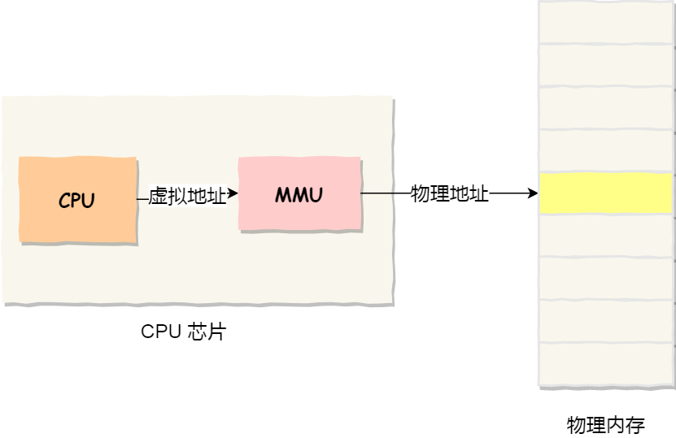

**回答**

如果没有虚拟内存，程序直接操作物理内存的话，多个进程会相互干扰彼此的内存数据，一个进程可能会访问或修改另一个进程的内存数据，从而破坏系统的稳定性和安全性。

有了虚拟内存后，进程只能操作虚拟内存，不能操作物理内存，每个进程的虚拟地址空间是相互独立的，进程不能访问其他进程的虚拟地址，这就解决了多进程之间地址冲突的问题。

还有虚拟内存可以使得进程对运行内存超过物理内存大小，通过将没有被经常使用到的内存，我们可以把它换出到物理内存之外，比如硬盘上的 swap 区域，只在需要时再将数据加载到内存中。

**推荐资料**

[为什么要有虚拟内存？](https://xiaolincoding.com/os/3_memory/vmem.html)

## 2. 虚拟内存有什么作用？（重要）

**分析**

主要有 3 个作用：

* 可以让程序运行的内存超过物理内存大小

* 可以避免多进程之间地址冲突

* 可以进行权限控制

**回答**

* 第一，虚拟内存可以使得进程对运行内存超过物理内存大小，因为程序运行符合局部性原理，CPU 访问内存会有很明显的重复访问的倾向性，对于那些没有被经常使用到的内存，我们可以把它换出到物理内存之外，比如硬盘上的 swap 区域。

* 第二，由于每个进程都有自己的页表，所以每个进程的虚拟内存空间就是相互独立的。进程也没有办法访问其他进程的页表，所以这些页表是私有的，这就解决了多进程之间地址冲突的问题。

* 第三，页表里的页表项中除了物理地址之外，还有一些权限控制的属性，比如控制一个页的读写权限，标记该页是否存在等。在内存访问方面，操作系统提供了更好的安全性。比如，当通过 fork 创建子进程的时候，子进程会复制父进程的页表，这时候父子进程的页表的属性是只读状态，此时父子进程的页表都是指向同一片物理内存，当任意一个进程进行了写操作，CPU发现页表的属性是只读，就会触发写保护中断，接着就会发生写时复制，复制物理内存，然后页表的属性改为可读可写。

**推荐资料**

[为什么要有虚拟内存？](https://xiaolincoding.com/os/3_memory/vmem.html)

## 3. 什么是内存分段？

**分析**

分段是为了满足程序员在编写代码的时候的一些逻辑需求(比如数据共享，数据保护，动态链接等)。

分段内存管理当中，地址是二维的，一维是段号，二维是段内地址；其中每个段的长度是不一样的，而且每个段内部都是从0开始编址的。由于分段管理中，每个段内部是连续内存分配，但是段和段之间是离散分配的，因此也存在一个逻辑地址到物理地址的映射关系，相应的就是段表机制。

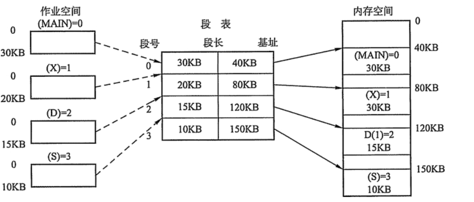

**回答**

内存分段是操作系统将进程地址空间按逻辑功能划分为不同段（如代码段、数据段、栈段）的机制。每个段有独立的基址（起始地址）和限长（最大长度），通过段表管理映射关系。进程访问虚拟地址时，硬件将地址拆分为段号和段内偏移，通过段表查询段基址并与偏移相加得到物理地址，同时检查偏移是否越界。分段符合程序的逻辑结构，支持内存保护（如设置代码段只读）和共享（如多个进程共享库代码），但可能导致外部碎片（段与段之间的空闲空间难以利用）。

**推荐资料**

[为什么要有虚拟内存？](https://xiaolincoding.com/os/3_memory/vmem.html)

## 4. 什么是内存分页？

**分析**

把内存空间**划分为大小相等且固定的块**，作为主存的基本单位。因为程序数据存储在不同的页面中，而页面又离散的分布在内存中，因此需要一个**页表**来记录映射关系，以实现从页号到物理块号的映射。

访问分页系统中内存数据需要两次的内存访问 (一次是从内存中访问页表，从中找到指定的物理块号，加上页内偏移得到实际物理地址；第二次就是根据第一次得到的物理地址访问内存取出数据)。

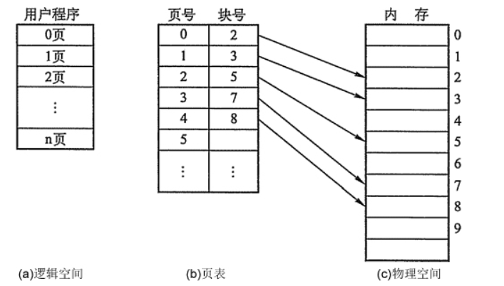

**回答**

内存分页是操作系统将物理内存和虚拟内存划分为固定大小页框和页面的机制。

通过将进程地址空间拆分为多个页，物理内存拆分为页框，系统借助页表实现虚拟页到物理页框的映射。当进程访问虚拟地址时，硬件自动解析为页号和页内偏移，通过页表查询对应物理页框号，再拼接偏移形成物理地址。若页不在内存中，触发缺页中断从磁盘加载。

分页机制解决了连续分配的碎片问题，支持虚拟内存，实现进程隔离，并通过按需加载提升内存利用率。

**推荐资料**

[为什么要有虚拟内存？](https://xiaolincoding.com/os/3_memory/vmem.html)

## 5. 段式管理和页式管理会出现内存碎片吗？

**分析**

* 段式管理没有内部碎片，但是有外部碎片

* 页式管理有内部碎片，但是没有外部碎片。

**回答**

段式管理可以做到根据段根据实际需求分配空间，所以有多少需求就分配多大的段，那么在段的内部就不会产生空间浪费，也就是没有碎片，但是**由于每个段的长度不是固定的，所以段与段之间会产生碎片，这种称为外部碎片。**

而页则是固定大小的，通常是 4k，假设我们要为代码准备空间，即使这一段机器码不足4k，我们也要为它分配 4k，因为一个页的大小就是 4k，我们最少只能分配一个页，所以页式管理，页与页之间紧密排列，但是**页内出现内存浪费，也就是内存碎片，这种称为内部碎片。**

## 6. 页面置换有哪些算法？

**分析**

页面置换算法是用于确定哪些页面应该从物理内存中置换出去，以便为新的页面腾出空间。以下是一些常见的页面置换算法：

* 最佳置换算法（OPT），置换在「未来」最长时间不访问的页面。假设一开始有 3 个空闲的物理页，然后有请求的页面序列，那它的置换过程如下图：

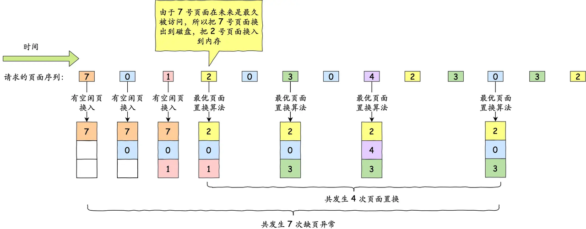

* 先进先出算法（FIFO），置换掉最早进入内存的页面

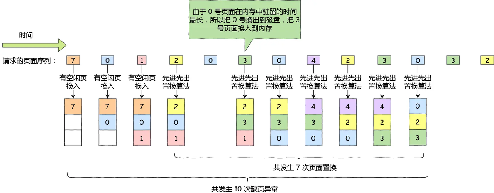

* 最近最久未使用算法（LRU），选择最长时间没有被访问的页面进行置换，算法的实现是给每个页面设置一个时间戳，记录最近一次访问的时间，如果发生缺页错误，则从所有页面中淘汰时间戳最久远的一个。

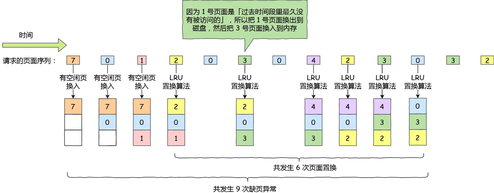

* 时钟算法（Clock），每页设置一个访问位，再将内存中的所有页面都通过链接指针链接成一个循环队列。当某个页面被访问时，其访问位置1。淘汰时，检查其访问位，如果是0，就换出；若为1，则重新将它置0，然后检查下一个页面，如果到队列中的最后一个页面时，若其访问位仍为1，则再返回到队首再去检查第一个页面。

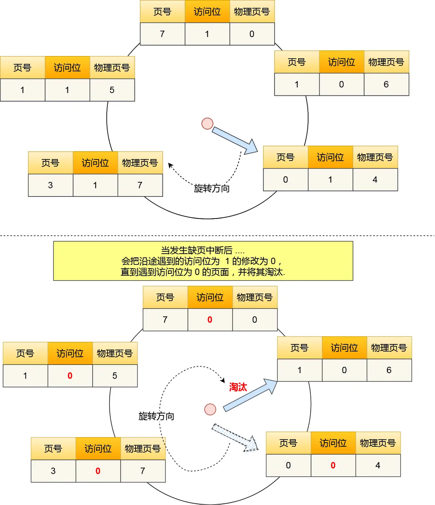

* 最少使用算法（LFU），置换掉访问频率最少的内存页面，实现方式是，对每个页面设置一个「访问计数器」，每当一个页面被访问时，该页面的访问计数器就累加 1。在发生缺页中断时，淘汰计数器值最小的那个页面。然而，当一个页面在进程的初始阶段大量使用但是随后不再使用时，会出现问题。由于被大量使用，它有一个大的计数，即使不再需要却仍保留在内存中。一种解决方案是，定期地将计数右移 1 位，以形成指数衰减的平均使用计数。

**回答**

页面置换算法主要这几种：

* 最佳置换算法（OPT）：置换掉未来永远不会被访问，理论上这种算法效果最好，但是在实际中无法得知未来进程的行为，所以无法实现。

* 先进先出算法（FIFO）：置换掉最早进入内存的页面。这个算法简单，易于实现，但可能导致"先进入"的页面是常用页面而被频繁置换，造成性能下降。

* 最近最久未使用算法（LRU）：置换掉最近一段时间内最久未被使用的页面，算法的实现是给每个页面设置一个时间戳，记录最近一次访问的时间，如果发生缺页错误，则从所有页面中淘汰时间戳最久远的一个。

* 时钟算法（Clock）：每页设置一个访问位，再将内存中的所有页面都通过链接指针链接成一个循环队列。当某个页面被访问时，其访问位置1。淘汰时，检查其访问位，如果是0，就换出；若为1，则重新将它置0，然后检查下一个页面，如果到队列中的最后一个页面时，若其访问位仍为1，则再返回到队首再去检查第一个页面。

* 最少使用算法（LFU）：置换掉访问频率最少的内存页面，实现方式是对每个页面设置一个访问计数器，每当一个页面被访问时，该页面的访问计数器就累加 1，如果发生缺页错误，淘汰计数器值最小的那个页面。

**推荐资料**

[页面置换算法及其优缺点详解](https://www.xinbaoku.com/archive/decLF4uz.html)

[6.1 进程调度/页面置换/磁盘调度算法](https://xiaolincoding.com/os/5_schedule/schedule.html)

## 7. 数组的物理空间连续吗？

**分析**

数组的虚拟地址是连续的，但是物理地址并不一定连续的。

**回答**

不是的，数组的虚拟地址是连续的，但是虚拟地址映射到物理地址是由操作系统负责的，操作系统并不会保证映射的物理地址也是连续的。

## 8. 进程的虚拟内存的布局是怎么样的？（重要）

**分析**

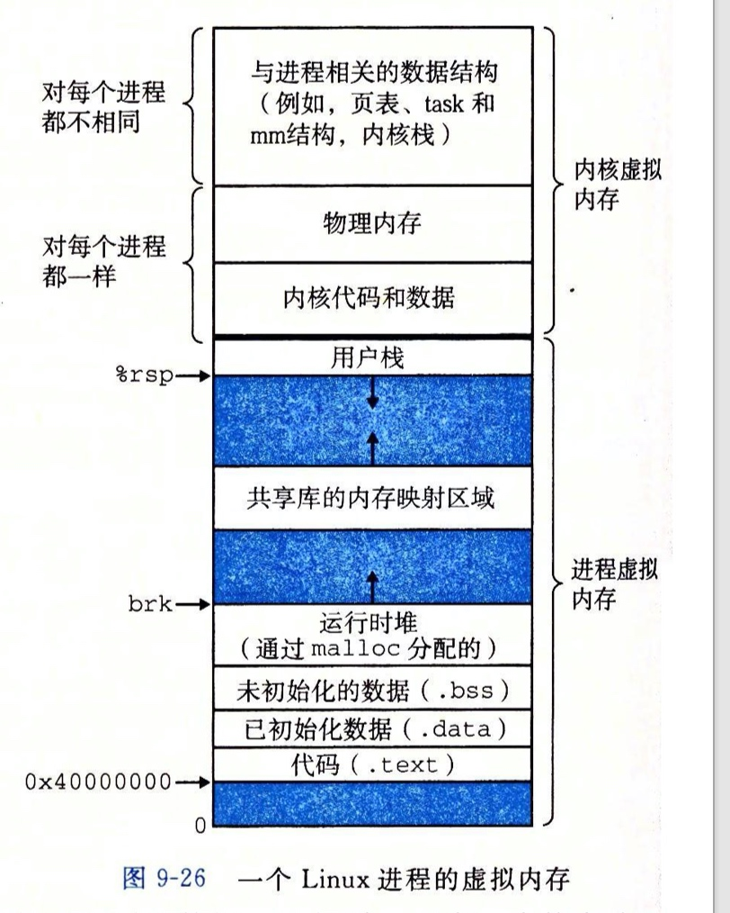

**回答**

操作系统将每个进程的虚拟地址空间划分成两个部分：内核空间和用户空间。内核空间存放的是内核代码和数据，用户空间存放的是用户程序的代码和数据。

进程的虚拟内存空间，从高地址到低地址分别是：

* 内核虚拟内存：所有进程共享内核的代码和数据，独享与进程相关的数据结构

* 栈段：包括局部变量和函数调用的上下文等，栈的大小是固定的，一般是 `8 MB`

* 文件映射段：包括动态库、共享内存等

* 堆段：包括动态分配的内存

* BSS 段：包括未初始化的静态变量和全局变量；

* 数据段：包括已初始化的静态常量和全局变量；

* 代码段：包括二进制可执行代码；

**推荐资料**

[深入理解 Linux 虚拟内存管理](https://xiaolincoding.com/os/3_memory/linux_mem.html)

## 9. 栈的增长趋势是什么？

**分析**

栈的增长趋势是向内存地址减小的方向增长。也就是说，栈的底部在较高的内存地址，而栈的顶部在较低的内存地址。当新的元素被添加到栈中时，栈的顶部会向较低的内存地址方向移动，栈的大小会增加。当元素从栈中被移除时，栈的顶部会向较高的内存地址方向移动，栈的大小会减小。因此，栈的增长趋势是由内存布局决定的，向内存地址减小的方向增长。

**回答**

栈是从内存高地址往低地址增长。

**推荐资料**

[函数调用栈分析](https://zhuanlan.zhihu.com/p/376988726)

## 10. 堆区和栈区有什么区别？

**分析**

* 增长方向：栈向低地址方向增长，堆向高地址方向增长

* 申请回收：栈自动分配和回收，堆需要手动申请和释放

* 生命周期：栈的数据仅存在于函数运行过程中，堆的数据只要不释放就一直存在

* 连续分配：栈是连续分配的，堆是不连续的，容易产生内存碎片

* 空间大小：栈的大小是有限的（如默认 8M，Linux 上通过 `ulimit -s` 查看），而堆的空间较大，受限于系统中有效的虚拟内存

**回答**

栈区的内存用于函数调用栈，主要保存函数的入参、局部变量、返回值等，栈区内存不可被其他线程共享，栈区的内存管理是由编译器自动完成的，编译时就确定了变量的生命周期，不需程序员来分配内存和释放内存，当函数执行结束时，栈区中的数据会自动被释放。

堆区内存需要通过动态内存分配函数来申请，堆区的内存可被其他线程共享，堆区内存的生命周期是由程序员控制的，需要进行显示分配和释放内存，如果反复向操作系统申请堆内存而不释放，会导致内存泄露。在 C / C++ 中，必须由程序员手动释放堆内存。而 Java / Golang 中有垃圾回收器，会定期主动回收内存。但是即使有垃圾回收器，也有内存泄漏的风险，比如长期持有某个大对象的引用。

堆区可分配的大小会比栈大很多，因为栈的内存是限的，通常是 8MB 大小，而堆的空间较大，受限于系统中有效的虚拟内存，比如 32 位系统，虚拟内存最大 4GB，64 位操作系统就 128TB。

栈区的内存分配效率会比堆区分配内存效率高，因为分配栈区内存，只需要移动栈指针即可，而分配堆区内存需要在堆中找到可用的内存块。

**推荐资料**

[一文搞懂堆和栈的区别](https://cloud.tencent.com/developer/article/1688327)

## 11. 在栈上的数据操作比堆上快很多的原因？

**分析**

* 内存访问方式：有寄存器直接对栈进行访问（esp，ebp），因此内存访问是非常快速的。而堆上的数据需要通过指针进行访问，将指针地址放到寄存器，然后取出这个地址的值，这里涉及到间接寻址的过程，相对较慢。

* 空间局部性：栈上的数据存储在连续的内存区域上。这样可以利用处理器的高速缓存（Cache）机制，提高数据的访问速度。而堆上的数据分布相对分散，无法充分利用缓存，导致缓存命中率较低，访问速度相对较慢。

**回答**

我觉得主要原因是：

* 访问栈上的数据是可以直接访问，因为 CP&#x55;**&#x20;**&#x6709;栈相关的寄存器直接对栈进行访问，而堆上的数据需要通过指针进行访问，是一个间接寻址的过程，访问速度相对较慢。

* 还有栈上的数据是连续存在，这样可以更好的利用 CPU 的 CPU Cache，访问栈上的数据缓存命中率比较高，而堆上的数据分布是散乱的，无法充分利用 CPU 缓存，导致缓存命中率较低，访问速度相对较慢。

## 12. 32 位操作系统，4G物理内存，程序可以申请 8GB内存吗？

**分析**

应用程序通过 malloc 函数申请内存的时候，实际上申请的是虚拟内存，此时并不会分配物理内存。

当应用程序读写了这块虚拟内存，CPU 就会去访问这个虚拟内存， 这时会发现这个虚拟内存没有映射到物理内存， CPU 就会产生缺页中断，进程会从用户态切换到内核态，并将缺页中断交给内核的 Page Fault Handler （缺页中断函数）处理。

缺页中断处理函数会看是否有空闲的物理内存：

* 如果有，就直接分配物理内存，并建立虚拟内存与物理内存之间的映射关系。

* 如果没有空闲的物理内存，那么内核就会开始进行[回收内存](https://xiaolincoding.com/os/3_memory/mem_reclaim.html)的工作，如果回收内存工作结束后，空闲的物理内存仍然无法满足此次物理内存的申请，那么内核就会放最后的大招了触发 OOM （Out of Memory）机制。

32 位操作系统和 64 位操作系统的虚拟地址空间大小是不同的，在 Linux 操作系统中，虚拟地址空间的内部又被分为内核空间和用户空间两部分，如下所示：

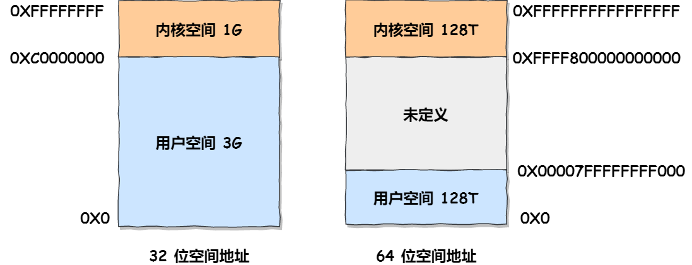

通过这里可以看出：

* `32` 位系统的内核空间占用 `1G`，位于最高处，剩下的 `3G` 是用户空间；

* `64` 位系统的内核空间和用户空间都是 `128T`，分别占据整个内存空间的最高和最低处，剩下的中间部分是未定义的。

**回答**

程序申请的内存实际上是虚拟内存，32 位操作系统中用户空间的虚拟内存大小是 3 GB，进程最多只能申请 3 GB 大小的虚拟内存空间，所以进程申请 8GB 内存的话，在申请虚拟内存阶段就会失败。

**推荐资料**

[在 4GB 物理内存的机器上，申请 8G 内存会怎么样？](https://xiaolincoding.com/os/3_memory/alloc_mem.html)

## 13. 64 位操作系统，4G物理内存，程序可以申请 8GB内存吗？

**分析**

如果程序申请的内存，没有被访问或者初始化，这时候申请的是虚拟内存，在 64 位操作系统下，即使物理内存只有 4GB，申请 8 GB 内存是没问题的。

但是如果后续对这个虚拟内存进行读写操作的话，操作系统就需要分配物理内存了，这时候需要看系统有没有 swap 分区，如果没有 swap 分区，就会发生 OOM，如果有 swap 分区，即使物理内存只有4GB，程序也可以正常使用这 8GB 内存。

**回答**

在 64位 位操作系统，因为进程理论上最大能申请 128 TB 大小的虚拟内存，即使物理内存只有 4GB，申请 8G 内存也是没问题，因为申请的内存是虚拟内存。如果这块虚拟内存被访问了，要看系统有没有 Swap 分区：

* 如果没有 Swap 分区，因为物理空间不够，进程会被操作系统杀掉，原因是 OOM（内存溢出）；

* 如果有 Swap 分区，即使物理内存只有 4GB，程序也能正常使用 8GB 的内存，进程可以正常运行；

**推荐资料**

[ 在 4GB 物理内存的机器上，申请 8G 内存会怎么样？](https://xiaolincoding.com/os/3_memory/alloc_mem.html)

## 14. fork 的写时复制是如何实现的？

**分析**

fork 函数（创建子进程）的原理：

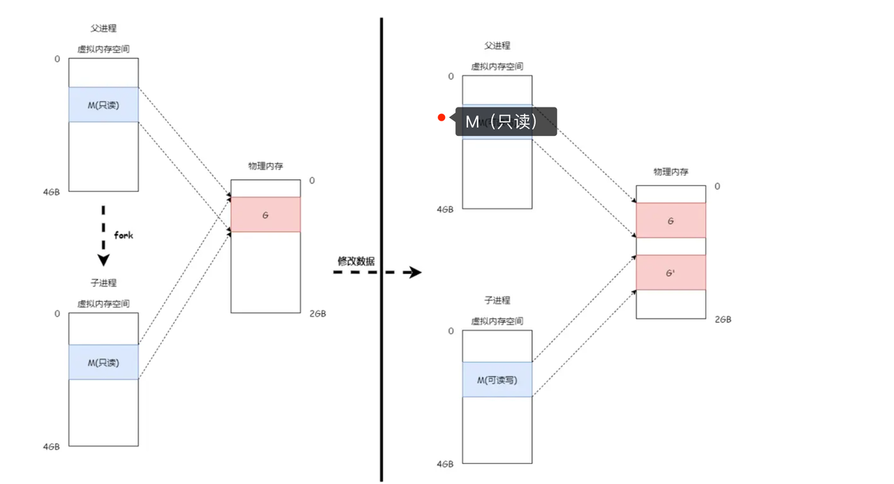

* 当一个进程调用`fork()`系统调用创建子进程时，操作系统会复制父进程的页表，初始状态下，父进程和子进程共享相同的物理内存页，这些页在页表中被标记为共享，所以创建子进程的时候，实际上是复制父进程的页表（虚拟内存），这时候并不是复制物理内存，而是共享物理内存。

* 父进程和子进程都可以读取共享内存页中的数据，而不会触发写时复制机制，读取操作不会导致物理内存页的复制。

* 当父进程或子进程尝试修改共享内存页中的数据时，由于页表项属性是只读，这时候会发生写保护中断，内核会为写操作的一方分配新的物理页，并将原来共享的物理页内容拷贝到新页，然后建立新页的页表映射关系，将新页的页表项改成可写状态（被复制的页表还是只读状态），这样写操作的进程就可以继续执行，不会影响另一方，至此父子进程的物理内存就是相互独立的了。

下面给出实验代码案例：程序中有一全局变量num=10 打印num的值, 然后fork子进程，在子进程中修改全局变量num=100 然后打印num的值,父进程中睡眠1s故意等待子进程先执行完， 然后再次打印num的值

大家可以思考一下：第13，22, 27分别得出的num是多少？

我们编译执行：

可以发现父进程中的全局变量num =10, 当fork子进程后对这个全局变量进行了修改使得num =100，实际上fork的时候已经将父子进程的num这个全局变量所在的页修改为了只读，然后共享这个页，当子进程写这个全局变量的时候发生了COW缺页异常，然而这对于应用程序来说是透明的，内核却在缺页异常处理中做了很多工作：主要是为子进程分配物理页，将父进程的num所在的页内容拷贝到子进程，然后将子进程的va所对应的的页表条目修改为可写和分配的物理页建立了映射关系，然后缺页异常就返回了（从内核空间返回到了用户空间），这个时候处理器会重新执行赋值操作指令，这个时候属于子进程的num才被改写为100，但是要明白这个时候父进程的num变量所在的页的读写属性还是只读，父进程再去写的时候依然会发生COW缺页异常。

最后我们用图说话来理解COW的整个过程：

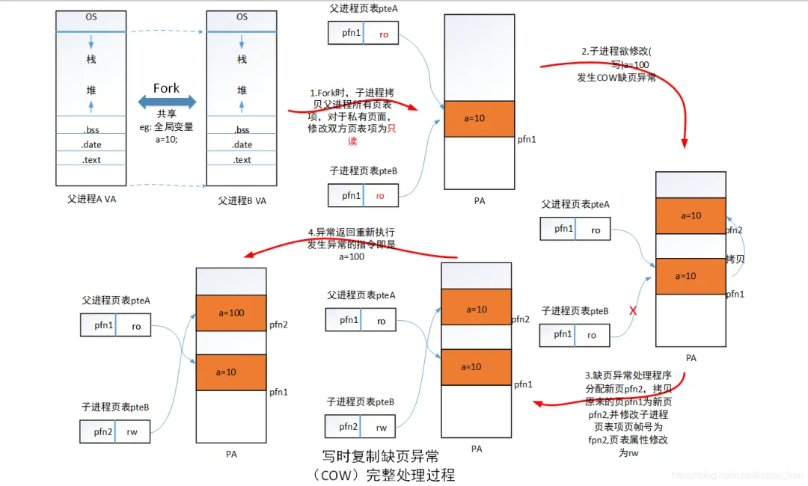

**回答**

fork 是创建进程的系统调用， 执行 fork 的时候，子进程会复制父进程的 PCB 复制一份，这里包含页表、文件资源等，并且将页表的权限设置为只读，但是并不会复制物理内存，所以这时候父子进程的页表指向的物理内存的是同一片区域，此时父子进程的内存数据都是共享的。

当父进程或者子进程对这片共享的内存数据进行了写操作，发现页表是只读的属性，这时候就会发生写保护中断，内核就会为发生中断的进程分配新的物理内存，把老的物理页的数据拷贝进这个新的物理页，然后把发生中断的虚拟地址映射到新的物理页，同时该进程的页表的权限设置为可读写，最后将最新的数据写入到这个新的物理页，这就完成了一次写时复制。

**推荐资料**

[Linux 写时复制机制原理](https://segmentfault.com/a/1190000039869422)

## 15. malloc会陷入内核态吗？malloc的底层原理是什么？

**分析**

malloc() 并不是系统调用，而是 C 库里的函数，用于动态分配内存。

malloc 申请内存的时候，会有两种方式向操作系统申请堆内存。

* 方式一：通过 brk() 系统调用从堆分配内存

* 方式二：通过 mmap() 系统调用在文件映射区域分配内存；

方式一实现的方式很简单，就是通过 brk() 函数将「堆顶」指针向高地址移动，获得新的内存空间。如下图：

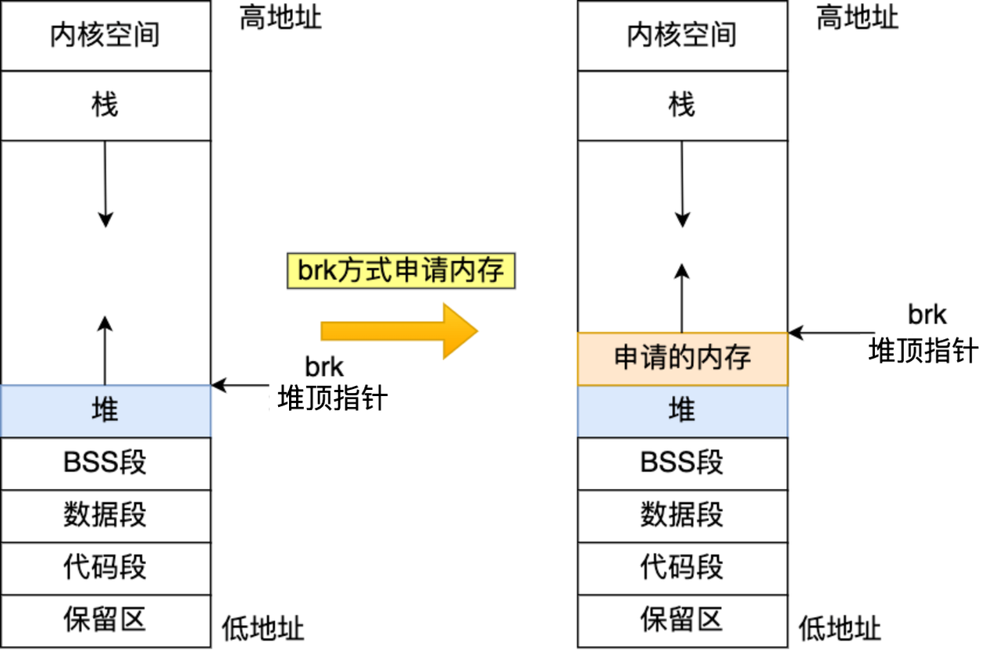

方式二通过 mmap() 系统调用中「私有匿名映射」的方式，在文件映射区分配一块内存，也就是从文件映射区“偷”了一块内存。如下图：

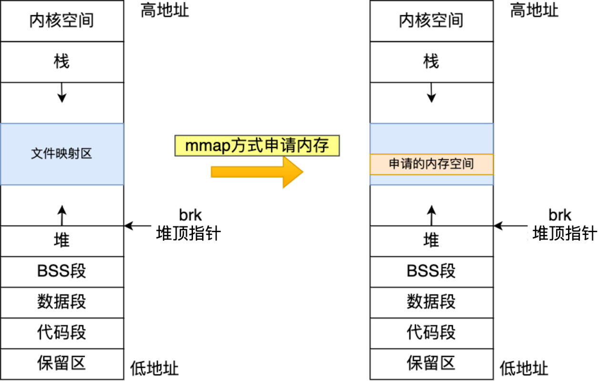

**回答**

malloc 不是系统调用函数，不会陷入到内核态，malloc 申请内存的时候，会通过 brk 或者 mmap 这两个系统调用来申请内存。为了避免频繁向操作系统申请内存，malloc 还实现了内存池化技术，先申请一大块内存，然后将内存分成不同大小的内存块，然后用户申请内存时，直接从内存池中选择一块相近的内存块即可，这样就减少系统调用的开销。

**推荐资料**

[malloc 是如何分配内存的？](https://xiaolincoding.com/os/3_memory/malloc.html#linux-%E8%BF%9B%E7%A8%8B%E7%9A%84%E5%86%85%E5%AD%98%E5%88%86%E5%B8%83%E9%95%BF%E4%BB%80%E4%B9%88%E6%A0%B7)

[malloc和free的实现原理解析](https://jacktang816.github.io/post/mallocandfree/)

