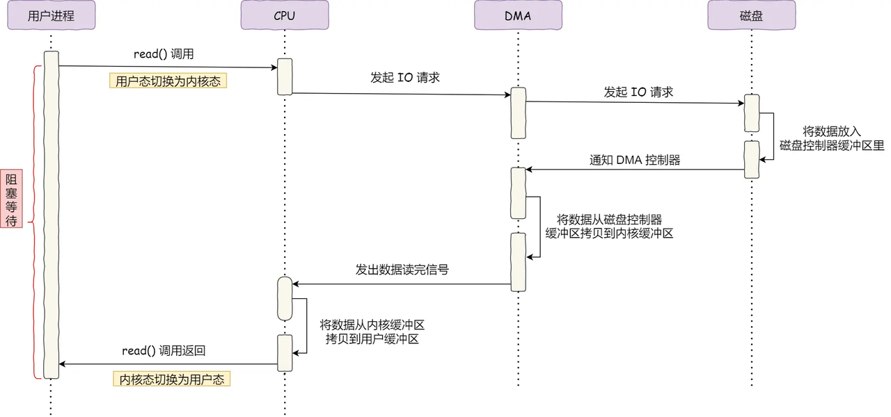
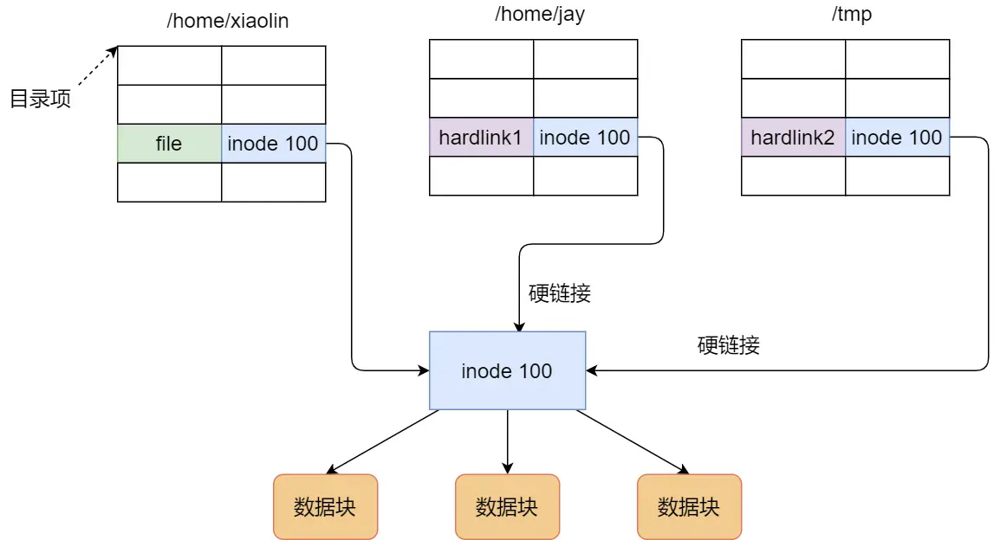
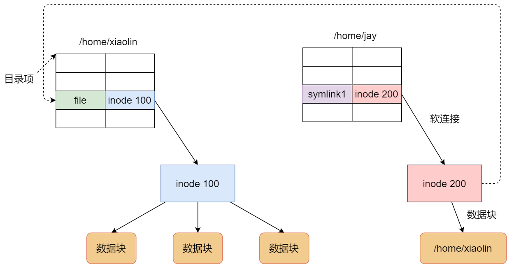
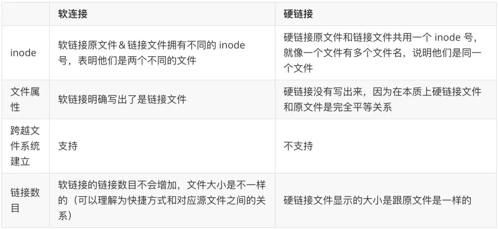

> 操作系统学习指引：[ 操作系统学习指引](https://ls8sck0zrg.feishu.cn/wiki/wikcnMfJXrpBI3Po7HHKfsDoUKr)

## 1. 读取一个文件的时候，操作系统会发生什么？

**分析**

关键点：

* CPU 不会去读磁盘数据，而是通过 DMA 控制器来完成将数据从磁盘控制器缓冲区搬运到内核空间的工作

* 从磁盘读到的数据，会缓存在内核中 PageCache（内核缓冲区）

读取一个文件的过程：

**回答**

读取磁盘文件的时候，CPU 不会负责从磁盘读取数据的过程，而是将磁盘数据搬运到内存的工作全部交给 DMA 控制器，CPU 不再参与任何与数据搬运相关的事情，这样 CPU 就可以去处理别的工作，不会阻塞住。

具体的过程是这样的：

* 用户进程调用 read 方法，向操作系统发出 I/O 请求，然后进程进入阻塞状态；

* 操作系统收到请求后，进一步将 I/O 请求发送 DMA，然后 CPU 会执行其他任务；

* DMA 进一步将 I/O 请求发送给磁盘，磁盘收到 DMA 的 I/O 请求，把数据从磁盘读取到磁盘控制器的缓冲区中，当磁盘控制器的缓冲区被读满后，向 DMA 发起中断信号，告知自己缓冲区已满；

* DMA 收到磁盘的信号，将磁盘控制器缓冲区中的数据拷贝到内核缓冲区中，数据准备好后，然后就会发送中断信号给 CPU，CPU 收到 DMA 的信号，于是将数据从内核拷贝到用户空间，read 系统调用返回；

**推荐资料**

[9.1 什么是零拷贝？](https://xiaolincoding.com/os/8_network_system/zero_copy.html#%E4%B8%BA%E4%BB%80%E4%B9%88%E8%A6%81%E6%9C%89-dma-%E6%8A%80%E6%9C%AF)

[read 文件一个字节实际会发生多大的磁盘IO？](https://cloud.tencent.com/developer/article/1964473)

## 2. 操作系统复制一个文件的流程是怎么样的？

**分析**

打开源文件，读取数据，打开目标文件，写入数据

**回答**

复制文件的流程：

* 打开源文件，调用 read 系统调用读取源文件的数据，这时候会通过 DMA 将磁盘数据拷贝到内核缓冲区，然后 CPU 再将内核缓冲区的数据拷贝到用户缓冲区，然后 read 系统调用返回。

* 打开目标文件，调用 write 系统调用将从源文件读到的数据，写入到目标文件，这时候 CPU 会将用户缓冲区的数据拷贝到内核缓冲区， 然后write函数返回，后续操作系统会将内核缓冲区的数据刷入磁盘。

**推荐资料**

[read 文件一个字节实际会发生多大的磁盘IO？](https://cloud.tencent.com/developer/article/1964473)

[write文件一个字节后何时发起写磁盘IO？](https://cloud.tencent.com/developer/article/1964457)

## 3. 软链接和硬链接有什么区别？

**分析**

有时候我们希望给某个文件取个别名，那么在 Linux 中可以通过硬链接（*Hard Link*） 和软链接（*Symbolic Link*） 的方式来实现，它们都是比较特殊的文件，但是实现方式也是不相同的。

硬链接是多个目录项中的「索引节点」指向一个文件，也就是指向同一个 inode，但是 inode 是不可能跨越文件系统的，每个文件系统都有各自的 inode 数据结构和列表，所以硬链接是不可用于跨文件系统的。由于多个目录项都是指向一个 inode，那么只有删除文件的所有硬链接以及源文件时，系统才会彻底删除该文件。

软链接相当于重新创建一个文件，这个文件有独立的 inode，但是这个文件的内容是另外一个文件的路径，所以访问软链接的时候，实际上相当于访问到了另外一个文件，所以软链接是可以跨文件系统的，甚至目标文件被删除了，链接文件还是在的，只不过指向的文件找不到了而已。

**回答**

软链接和硬链接都是给文件取一个别名，区别主要有：

* 软链接文件有独立的 inode 节点，文件的内容是目标文件的路径，不存储实际的文件数据，支持跨文件系统建立，而且目标文件删除了，软链接还是存在的，只不过指向的文件找不到了

* 硬链接文件和目标文件都共用一个 inode 节点，说明他们是用一个文件，不支持跨文件系统建立，删除文件的时候，要除文件的所有硬链接以及源文件时，系统才会彻底删除该文件。

**推荐资料**

[5分钟让你明白“软链接”和“硬链接”的区别](https://www.jianshu.com/p/dde6a01c4094)

[面试 | Linux 下软链接和硬链接的区别](https://zhuanlan.zhihu.com/p/88891362)

