> 操作系统学习指引：[ 操作系统学习指引](https://ls8sck0zrg.feishu.cn/wiki/wikcnMfJXrpBI3Po7HHKfsDoUKr)

# 系统命令

## 1. Linux怎么看进程占用的 CPU?

**分析**

ps 命令可以看到

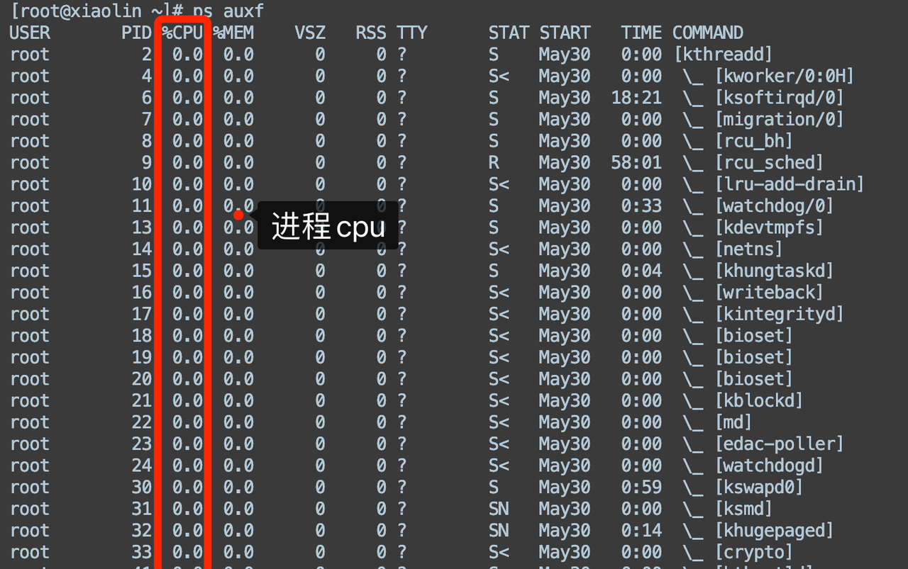

Top 命令也可以看的到，可以看到各个进程的相关信息，包括进程ID（PID）、进程名、CPU使用率等。默认情况下，进程按照CPU使用率的降序排列，最占用CPU的进程会显示在列表的顶部。

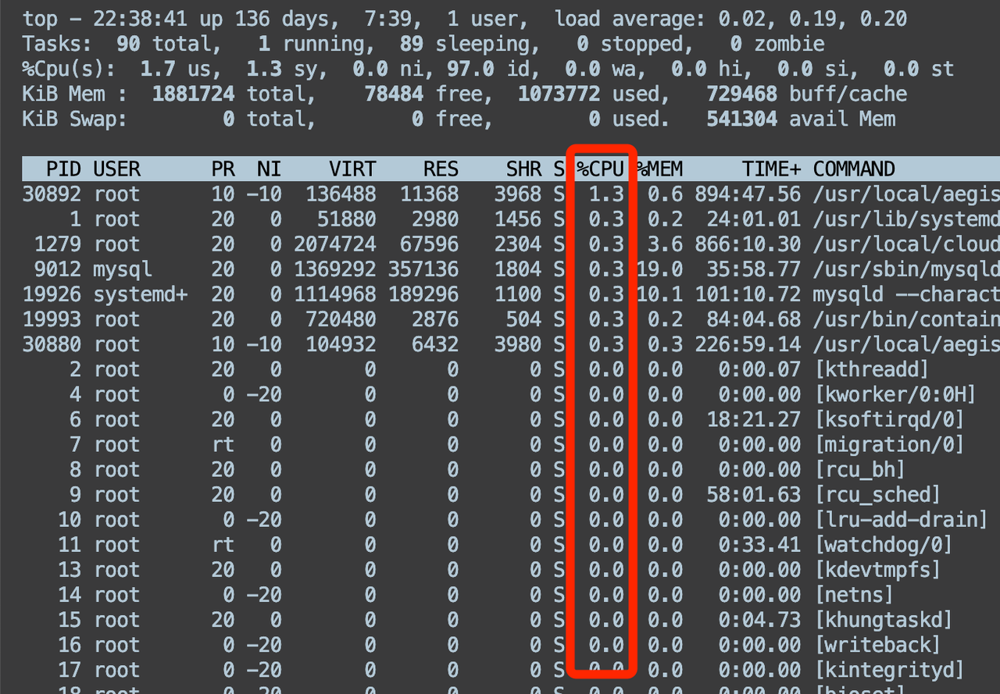

**回答**

ps 和 top 命令都能查看进程占用的的 CPU。

**推荐资料**
[Linux ps 命令](https://www.runoob.com/linux/linux-comm-ps.html)

[Linux top 命令 ](https://www.runoob.com/linux/linux-comm-top.html)

## 2. Linux怎么查看一个进程的进程号？

**分析**

top 可以查看到进程的进程号：&#x20;

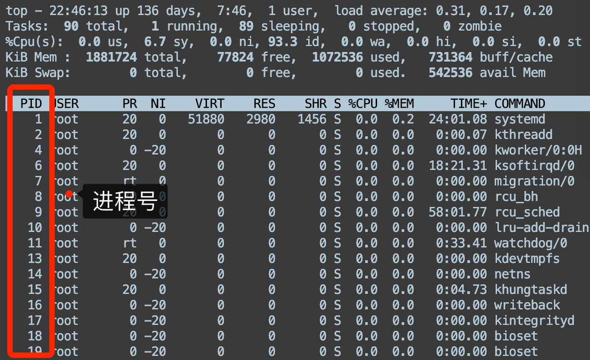

Ps 也可以看到：

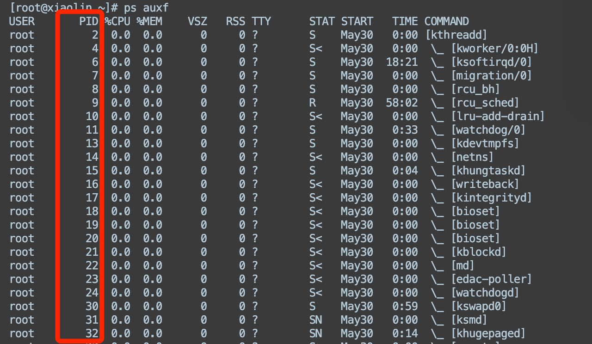

**回答**

ps 和 top 命令都能查看进程的PID。

**推荐资料**

[Linux ps 命令](https://www.runoob.com/linux/linux-comm-ps.html)

[Linux top 命令 ](https://www.runoob.com/linux/linux-comm-top.html)

## 3. Linux怎么看进程中的线程？

**分析**

* 方式一：ps

在ps命令中，“-T”选项可以开启线程查看。下面的命令列出了由进程号为\<pid>的进程创建的所有线程。

“SPID”栏表示线程ID，而“CMD”栏则显示了线程名称。

* 方式二：top

top命令可以实时显示各个线程情况。要在top输出中开启线程查看，请调用top命令的“-H”选项，该选项会列出所有Linux线程。在top运行时，你也可以通过按“H”键将线程查看模式切换为开或关。

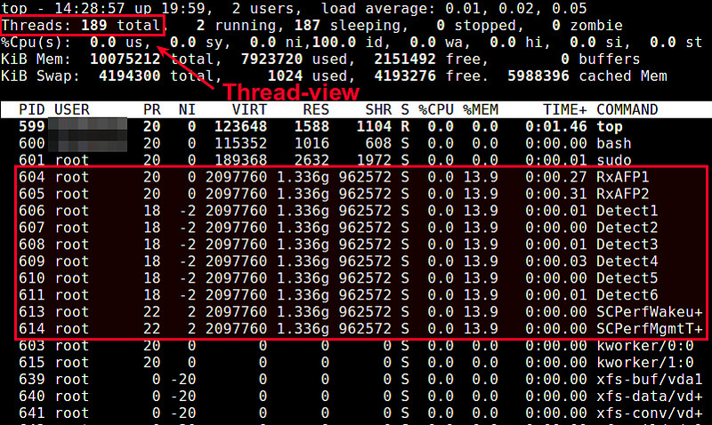

要让top输出某个特定进程\<pid>并检查该进程内运行的线程状况：

**回答**

先通过 ps 命令找到进程的 pid 号之后，通过 ps -T -p \<pid>，就可以显示进程种的线程了。或者 top -H -p \<pid> 命令也可以。

**推荐资料**

[Linux查看进程的线程信息](https://blog.csdn.net/lovedingd/article/details/120784528)

## 4. Linux怎么看端口被哪个进程占用了？

**分析**

netstat 命令可以看到端口被哪个进程占用了。

比如查看 443 端口被哪个进程占用了，可以看到是被 nginx 占用了。

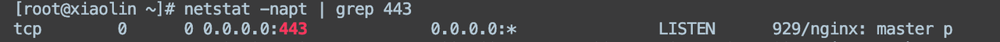

或者 lsof 命令也可以：lsof -i :&lt;端口号&gt;

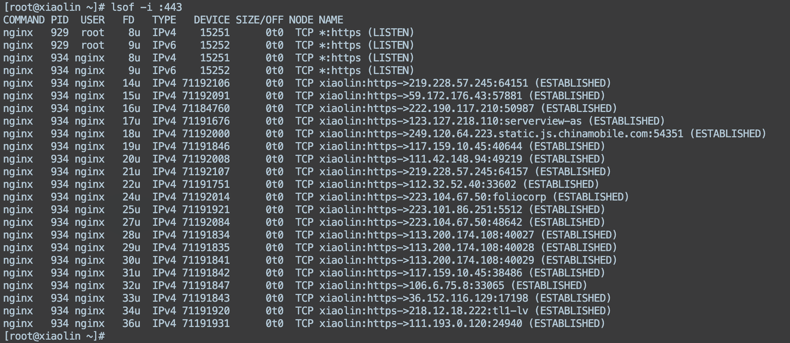

**回答**

通过 netstat 或者 lsof 命令都可以知道端口被哪个进程占用了。

**推荐资料**

[Linux netstat命令](https://www.runoob.com/linux/linux-comm-netstat.html)

[Linux下 lsof 命令详解 - Linux开发那些事儿 ](https://www.cnblogs.com/wanng/p/lsof-cmd.html)

## 5. 怎么查看一个进程占用的端口号？

**分析**

可以使用 `netstat` 命令或者 `lsof` 命令来实现。

查看一个进程的端口的命令如下：

使用 `netstat` 命令：

使用 `lsof` 命令：

在这两个命令中，`<进程号>` 是您要查看的进程的进程号。通过这些命令，您可以查看指定进程正在使用的端口信息。

**回答**

通过 netstat 或者 lsof 命令输出的内容之后，通过 grep 指定的进程号，然后就可以过滤出进程占用的端口号。

**推荐资料**

[Linux netstat命令](https://www.runoob.com/linux/linux-comm-netstat.html)

[Linux下 lsof 命令详解 - Linux开发那些事儿 ](https://www.cnblogs.com/wanng/p/lsof-cmd.html)

## 6. Linux怎么看tcp状态？

**分析**

使用命令 `netstat -nat` 可以显示所有的 TCP 连接和监听状态。

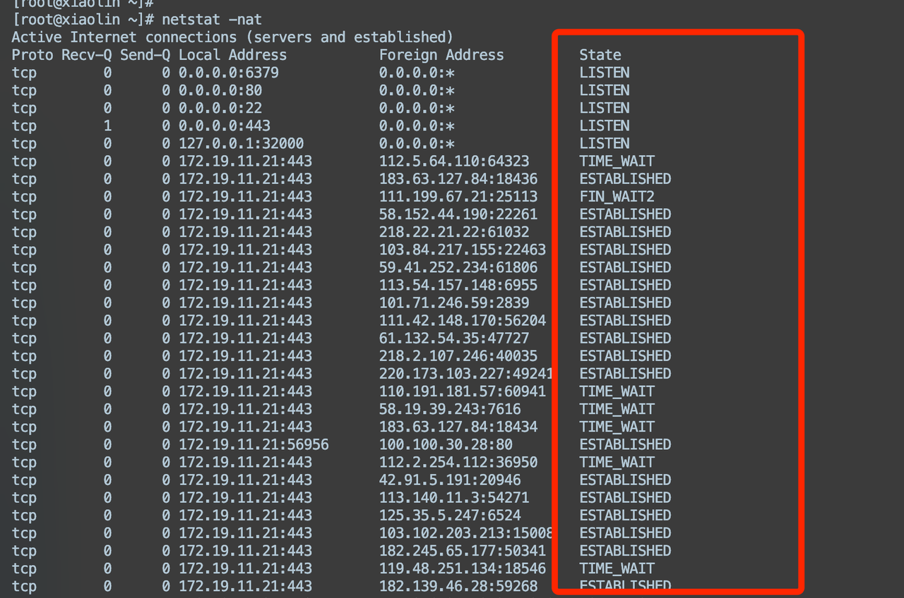

使用命令 `ss -t` 可以显示当前的 TCP 连接状态。

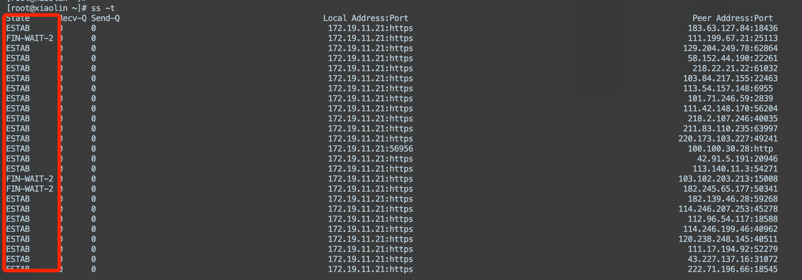

**回答**

Netstat 或者 ss 命令可以查看到 tcp 连接的状态

**推荐资料**

[Linux netstat命令](https://www.runoob.com/linux/linux-comm-netstat.html)

## 7. 如何判断远端端口是否开启？

**分析**

* nc 命令探测远程端口

在下面的例子中，我们将检查远程 Linux 系统中的 22 端口是否开启。假如端口是开启的，你将获得类似下面的输出。

当检测到端口没有开启，将获得如下输出：

* telnet 命令探测远程端口

假如探测成功，你将看到类似下面的输出：

假如探测失败，你将看到类似下面的输出：

**回答**

可以用 nc 或者 telnet 来判断远程端的端口是否开启

**推荐资料**

[技术|查看远程 Linux 系统中某个端口是否开启的 3 种方法](https://linux.cn/article-10675-1.html)

## 8. Linux查看TCP连接数

**分析**

通过运行下面命令，可以查看当前系统上处于 `ESTABLISHED` 状态的连接数。

* `-nat`：显示所有tcp连接状态，并以数字形式显示端口号和IP地址，而不进行主机名解析。

* `grep ESTABLISHED`：通过 `grep` 命令筛选出处于 `ESTABLISHED` 状态的连接。

* `wc -l`：`wc` 命令用于统计输出的行数，`-l` 参数表示只统计行数。

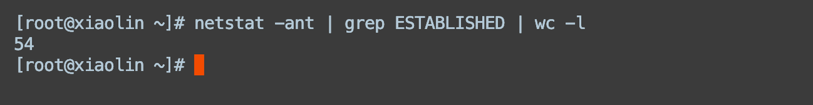

**回答**

先通过 netstat -nat 命令显示 tcp 连接信息，然后用 grep 过滤出处于 ESTABLISHED 状态的 tcp 连接，最后用 wc -l 统计连接个数，就可以查看当前系统上处于 `ESTABLISHED` 状态的连接数了

**推荐资料**

[Linux netstat命令](https://www.runoob.com/linux/linux-comm-netstat.html)

## 9. Linux top 命令有哪些信息？

**分析**

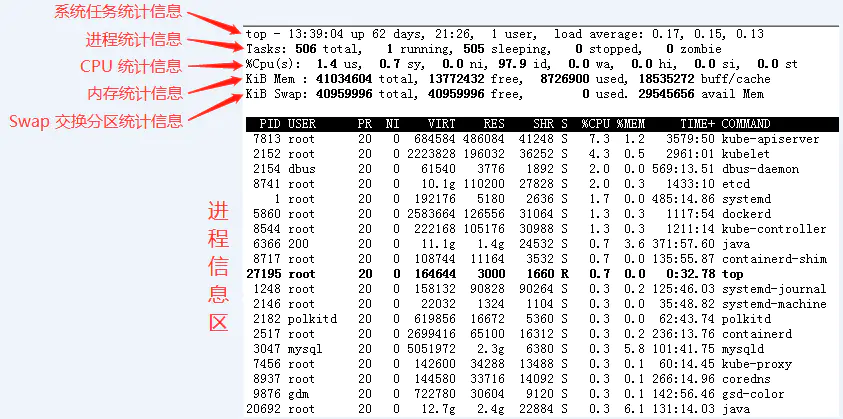

1. Load Average（负载均衡）：显示系统在最近1、5、15分钟内的平均负载情况。

2. CPU使用情况：显示总体的CPU使用率以及每个CPU核心的使用率。

3) 内存使用情况：显示物理内存的总量、使用量、空闲量等信息。

4) Swap使用情况：显示交换空间（swap）的总量、使用量、空闲量等信息。

5. 运行进程数量：显示当前运行的进程数量和总的进程数量。

6. 进程列表：显示当前运行的进程的详细信息，包括进程ID（PID）、CPU使用率、内存使用率、进程优先级等。

7) 系统运行时间：显示系统的运行时间。

8) 用户信息：显示当前登录系统的用户数量和用户的相关信息。

9. 系统负载信息：显示系统的负载情况，包括运行队列长度、上下文切换次数等。

**回答**

主要有系统的负载均衡情况、 CPU使用情况、内存使用情况、运行进程数量，还有进程列表，进程列表主要会显示当前运行的进程的详细信息，包括进程ID（PID）、CPU使用率、内存使用率、进程优先级等。

**推荐资料**

[Linux top 命令 ](https://www.runoob.com/linux/linux-comm-top.html)

## 10. **CPU使用率达到100%呢？怎么排查？**

**分析**

1. 通过`top`找到占用率高的进程。

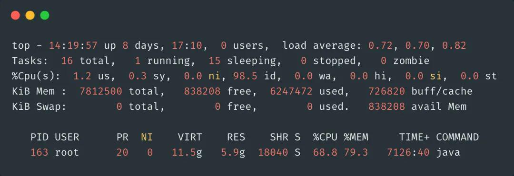

1. 通过`top -Hp pid`找到占用CPU高的线程ID。这里找到958的线程ID

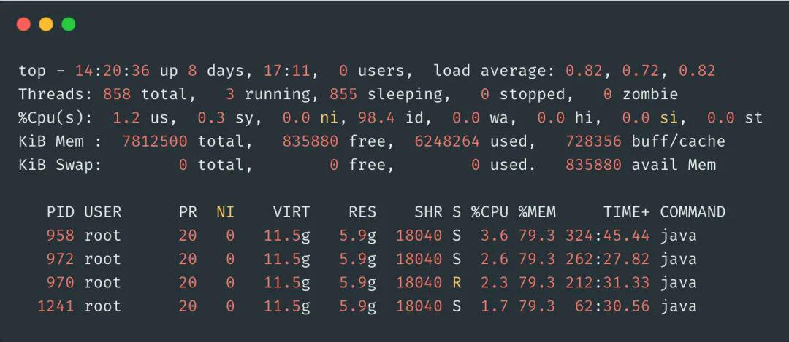

1. 再把线程ID转化为16进制，`printf "0x%x\n" 958`，得到线程ID`0x3be`

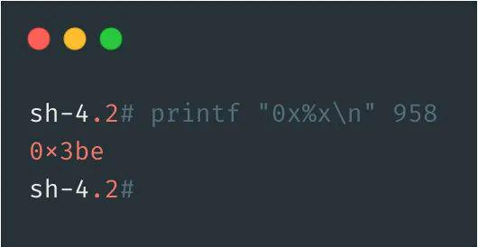

1. 通过命令`jstack 163 | grep '0x3be' -C5 --color` 或者 `jstack 163|vim +/0x3be -` 找到有问题的代码

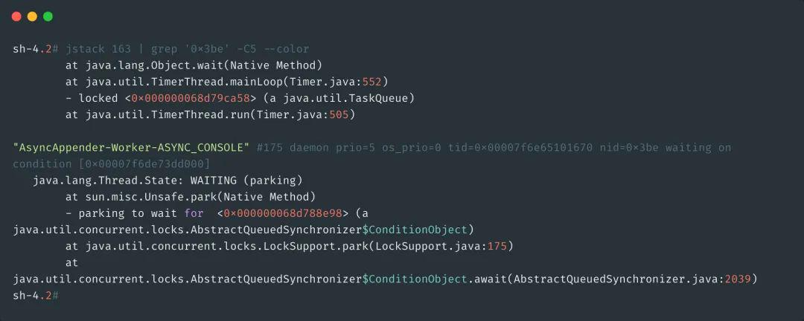

**回答（Java 版本）**

首先先通过 top 命令找到占用CPU最高的进程，然后通过 top -Hp 命令找到进程中占用CPU最高的线程，记录这个线程的 id 号，接着通过 jstack 打印这个线程的堆栈信息，通过这些信息定位到具体的代码位置去排查问题。

**回答（Go 版本）**

排查Golang服务占用CPU过大的问题，首先在服务中引入net/http/pprof和runtime/pprof包，启动pprof HTTP服务器。使用go tool pprof连接到服务器获取性能分析数据，通过pprof交互模式查看占用CPU最多的函数。或者借助go-torch生成火焰图，直观可视化性能瓶颈，进一步分析SVG火焰图，定位潜在问题的代码段。最后，根据分析结果优化或修复代码逻辑，重新测试确保CPU占用得到有效减轻，解决Golang服务性能问题。

**推荐资料**

* [ Java线上CPU飙升问题如何排查 ](https://ls8sck0zrg.feishu.cn/wiki/OHGBwScKxiMmACkD1O1cCj4Lnzh)

* [ Go程序pprof性能排查调优实战 ](https://ls8sck0zrg.feishu.cn/wiki/TSq4wbzEQi7AzFkdhjGc5EMIn2b)

## 11. 怎么用top 命令查看是多少个 CPU 核心？

**分析**

执行 top 命令之后，按数字 1，就能显示 CPU 有多少个核心了。

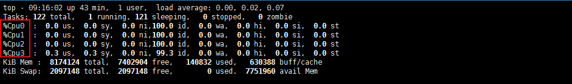

**回答**

执行 top 命令之后，然后按键盘的数字 1，就能显示服务器有多少个 cpu 核心了。

**推荐资料**

[Linux CPU使用率超过100%的原因](https://www.jianshu.com/p/caffcb1ebf35)

## 12. Linux top结果CPU占用会超过100%吗？

**分析**

top 显示的 CPU 占用率是所有 CPU 核心占用CPU的数值累加，比如说 CPU1的 CPU 占用率是 80%，CPU2的 CPU 占用率是 80%，那么 top 显示的 CPU 占用率就是 160%。

通过在top的情况下按大键盘的1，查看的cpu的核数为4核。

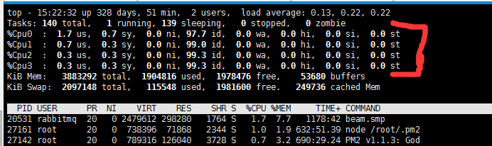

top命令显示的是所有 cpu 占用的总数，也就是说如果你是4核cpu那么cpu最高占用率可达400%，top里显示的是把所有使用率加起来。

**回答**

top命令显示的是所有 cpu 占用的总数，如果 cpu 是多核心的，那么是会观察到 cpu 显示超过 100%的，可以通过按键盘数字 1，来显示每个 cpu 的 cpu 占用率。

**推荐资料**

[Linux CPU使用率超过100%的原因](https://www.jianshu.com/p/caffcb1ebf35)

## 13. Linux如何查看内存使用情况？

**分析**

可以用 free 命令查询操作系统的内存情况。

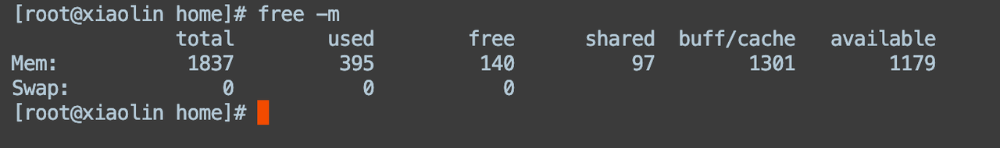

1. `total`：表示系统总共的内存大小。

2. `used`：表示已使用的内存大小。

3) `free`：表示空闲的内存大小。

4) `shared`：表示被共享使用的内存大小。

5. `buff/cache`：表示被缓存和缓冲的内存大小。

6. `available`：表示系统当前可用的内存大小。

**回答**

可以用 free 命令来看

**推荐资料**

[linux free命令输出的每一列的含义](https://blog.csdn.net/qq_35462323/article/details/105724468)

## 14. Linux怎么查看磁盘剩余多少

**分析**

使用命令 `df -h` 可以显示磁盘空间的使用情况，包括已使用、可用和总共的磁盘空间

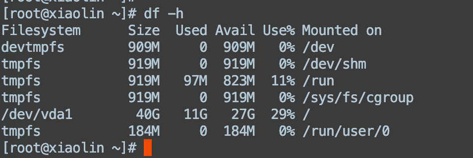

**回答**

df -h 就能查看磁盘的空间大小了

**推荐资料**

[Linux df 命令 | 菜鸟教程](https://www.runoob.com/linux/linux-comm-df.html)

## 15. Linux 服务器当中如何查看负载情况？通过什么指标进行查看？

**分析**

通常我们发现系统变慢时，我们都会执行top或者uptime命令，来查看当前系统的负载情况，比如像下面，我执行了uptime，系统返回的了结果，最后一个就是系统平均负载的情况。

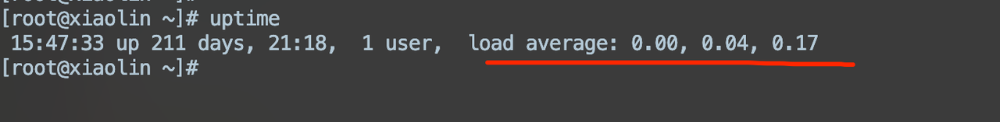

Load Average的三个数字，依次则是过去1分钟、5分钟、15分钟的平均负载。可以通过观察这三个数字的大小，可以简单判断系统的负载是下降的趋势还是上升的趋势。**负载值一般不超过cpu核数的1-1.5倍，如果超过1.5倍，那就要重视，此时会严重影响系统。**

* 如果 load average: 1.00, 5.00, 10.00 三个数字依次增大，则说明在过去的 1 分钟系统的负载比过去 15 分钟系统的负载小，表明系统的负载是下降的趋势。

* 如果 load average: 10.00, 5.00, 1.00 三个数字依次降低，则说明在过去的 1 分钟系统的负载比过去 15 分钟系统的负载大，表明系统的负载是上升的趋势。

* 如果 load average: 0.07, 0.04, 0.0 三个数字基本相同，或者相差不大， 表明系统的负载是平稳的。

平均负载是指单位时间内，处于可运行状态和不可中断状态的进程数。所以，它不仅包括了正在使用 CPU 的进程，还包括等待 CPU 和等待 I/O 的进程。

而 CPU 使用率，是单位时间内 CPU 繁忙情况的统计，跟平均负载并不一定完全对应。比如：

* CPU 密集型进程，使用大量 CPU 会导致**平均负载升高**，此时这两者是一致的；

* I/O 密集型进程，等待 I/O 也会导致**平均负载升高**，但 CPU 使用率不一定很高；

* 大量等待 CPU 的进程调度也会导致**平均负载升高**，此时的 CPU 使用率也会比较高。

**回答**

可以通过 top 命令或者 uptime 命令，会有一个平均负载的情况，主要有三个数字，依次则是过去1分钟、5分钟、15分钟的平均负载，可以通过观察这三个数字的大小，可以简单判断系统的负载是下降的趋势还是上升的趋势。

**推荐资料**

[Linux性能调优 | 01 平均负载的理解和分析](https://blog.csdn.net/qq_34827674/article/details/102923671)

# 文件相关的命令

## 16. Linux查看文件的命令有哪些？

**分析**

在 Linux 系统中，查看文件内容常用的命令是 `cat`、`more`、`less` 和 `head`、`tail`

1. `cat` 命令：显示整个文件内容。

2. `more` 命令：逐页显示文件内容，可以使用空格键向下翻页。

3) `less` 命令：与 `more` 类似，但提供更多功能，如向前/向后翻页、搜索等。

4) `head` 命令：显示文件的开头部分，默认显示头部 10 行。

5. `tail` 命令：显示文件的末尾部分，默认显示末尾 10 行。

**回答**

查看文件内容常用的命令是：

* &#x20;`cat`，可以显示文件的所有内容

* `head`，显示文件的开头部分，默认显示头部 10 行。

* `tail`：显示文件的末尾部分，默认显示末尾 10 行。

* `more：`逐页显示文件内容，只能向后翻页，无法向前滚动

* `less` ：与 `more` 类似，提供更多功能，如向前/向后翻页、搜索等。

**推荐资料**

[技术|在 Linux 上查看文件内容的 5 种方法](https://linux.net.cn/article-12340-1.html)

## 17. Linux查看文件大小命令

**分析**

1. `ls -l`：显示文件的详细信息，包括文件大小（以字节为单位）。

示例：`ls -l filename`

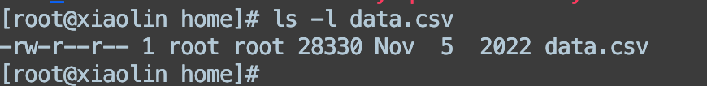

2. `du -h`：显示目录或文件的大小，以人类可读的方式（例如 KB、MB）显示。

示例：`du -h filename`

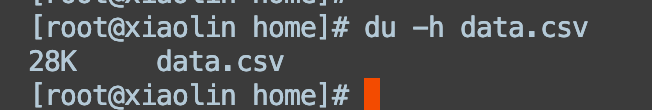

3. `stat`：显示文件的详细信息，包括文件大小和其他属性。

示例：`stat filename`

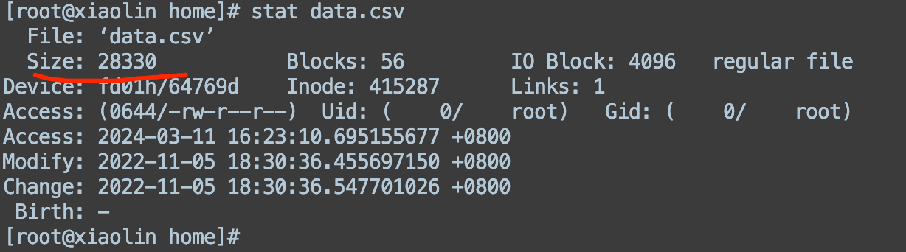

**回答**

可以用 ls -l 或者 du -h 命令查看文件的大小。

**推荐资料**

[查看文件、目录、文件系统大小](https://zj-linux-guide.readthedocs.io/zh-cn/latest/tool-use/%E6%9F%A5%E7%9C%8B%E6%96%87%E4%BB%B6%E3%80%81%E7%9B%AE%E5%BD%95%E3%80%81%E6%96%87%E4%BB%B6%E7%B3%BB%E7%BB%9F%E5%A4%A7%E5%B0%8F/)

## 18. Linux查询当前所在目录的语句

**分析**

使用 `pwd` 命令：`pwd` 可以显示当前工作目录的绝对路径。

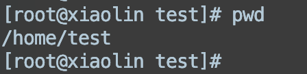

**回答**

pwd 命令

**推荐资料**

[Linux pwd命令 | 菜鸟教程](https://www.runoob.com/linux/linux-comm-pwd.html)

## 19. Linux创建文件夹和文件的语句是什么？

**分析**

* 创建文件夹（目录）：使用 `mkdir` 命令，`mkdir your_directory_name` 可以创建一个新的目录。

* 创建文件：使用 \`touch\` 命令：\`touch your\_file\_name\` 可以创建一个新的空文件。

**回答**

创建文件夹用 mkdir 命令， 创建文件用 touch 命令

**推荐资料**

[Linux mkdir 命令 | 菜鸟教程](https://www.runoob.com/linux/linux-comm-mkdir.html)

[Linux touch命令 | 菜鸟教程](https://www.runoob.com/linux/linux-comm-touch.html)

## 20. Linux如何删除一个文件？

**分析**

可以使用 `rm` 命令，可以使用以下语句来删除一个文件：rm your\_file\_name

**回答**

rm 命令可以用来删除文件

**推荐资料**

[Linux rm 命令 | 菜鸟教程](https://www.runoob.com/linux/linux-comm-rm.html)

## 21. Linux如何删除一个目录（文件夹）？

**分析**

可以使用 \`rm\` 命令结合 \`-r\` 参数来递归地删除目录，命令如下：

在这个命令中，`rm` 是删除命令，`-r` 是递归删除的参数，`directory_name` 是要删除的目录名称。

**回答**

rm -r 命令来递归删除目录

**推荐资料**

[Linux rm 命令 | 菜鸟教程](https://www.runoob.com/linux/linux-comm-rm.html)

## 22. Linux怎么创建、复制、移动一个文件？

**分析**

创建一个文件，可以用 touch 命令：

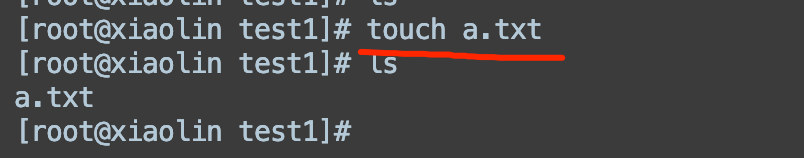

复制文件，可以用 cp 命令：

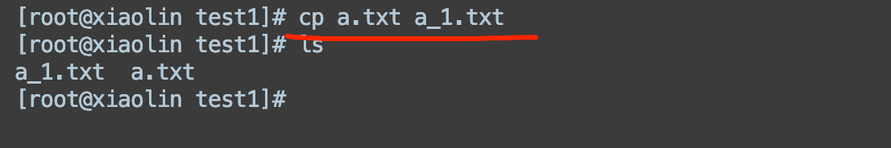

移动一个文件，可以用 mv 命令：

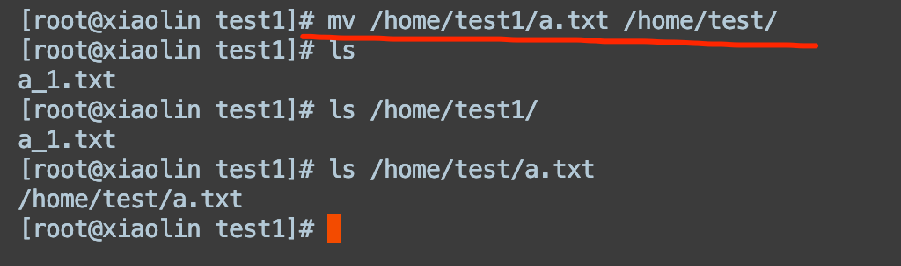

**回答**

创建文件用 touch 命令、复制文件用 cp 命令、移动文件用 mv 命令。

**推荐资料**

[Linux touch命令](https://www.runoob.com/linux/linux-comm-touch.html)

[Linux cp 命令](https://www.runoob.com/linux/linux-comm-cp.html)

[Linux mv 命令](https://www.runoob.com/linux/linux-comm-mv.html)

## 23. Linux cp 命令怎么复制整个文件夹？

**分析**

可以使用 `-r` 选项来进行递归复制。

复制整个文件夹的命令如下：

在这个命令中，`-r` 表示递归复制，`/path/to/source` 是要复制的源文件夹路径，`/path/to/destination` 是要将源文件夹复制到的目标路径。

**回答**

可以用 cp 命令结合 -r 参数，进行递归复制，这样就能复制整个文件夹了。

**推荐资料**

[Linux cp 命令](https://www.runoob.com/linux/linux-comm-cp.html)

## 24. Linux如何文件重命名

**分析**

可以使用 `mv` 命令。可以使用以下语句来重命名文件：mv old\_file\_name new\_file\_name

**回答**

可以用 mv 命令将文件重命名

**推荐资料**

[Linux mv 命令 | 菜鸟教程](https://www.runoob.com/linux/linux-comm-mv.html)

## 25. Linux 文件夹中如何查看最近被修改的文件？

**分析**

可以使用 `ls` 命令结合 `-lt` 参数来按照修改时间的顺序列出文件和目录，并且最近修改过的文件会显示在最上面。

查看文件夹中最近被修改的文件的命令如下：

在这个命令中，`ls` 是列出文件和目录的命令，`-l` 是以列表方式显示文件和目录的详细信息，`-t` 是按照文件修改时间排序，最近修改的文件将会显示在最上面。

**回答**

可以用 ls 命令结合 -lt 参数，按照文件修改时间排序显示，这样最近修改的文件将会显示在最上面。

**推荐资料**

[Linux ls命令 | 菜鸟教程](https://www.runoob.com/linux/linux-comm-ls.html)

## 26. Linux怎么修改文件的权限？

**分析**

chmod命令用于更改文件或目录的访问权限，chmod命令的基本语法如下：

其中，选项可以是：

* -c：显示修改的详细信息。

* -R：递归地修改目录及其子目录下的文件权限。

权限模式可以使用数字或符号两种方式表示。

* 数字方式：每个权限用一个数字表示，分别对应读（r）、写（w）和执行（x）权限。数字1表示执行权限，数字2表示写权限，数字4表示读权限。将这三个数字相加，即可得到对应的权限模式。例如，权限模式为rwxr-xr--可以用数字表示为754。

* 符号方式：使用u（所有者）、g（所属组）和o（其他人）表示权限的对象，加上+、-、=表示添加、删除或设置权限。例如，将文件的所有者权限设置为读写，可以使用命令`chmod u+rw 文件名`。

**回答**

通过 chmod 命令来修改文件权限，如果这个文件需要执行权限，可以通过 `chmod u+x 文件名`命令来实现。

**推荐资料**

[Linux chmod 命令](https://www.runoob.com/linux/linux-comm-chmod.html)

## 27. chmod + x是给哪个属性赋予权限

**分析**

在 Linux 系统中，文件和目录的权限包括读取（r）、写入（w）、执行（x）权限，这些权限可以分为三类：文件所有者（owner）、文件所属组（group）、其他用户（others）。

授权的方法有两种：1数字表示法 和 符号表示法。

1. 数字表示法：

* 读取（r）权限的值为 4

* 写入（w）权限的值为 2

* 执行（x）权限的值为 1

例如，给文件所有者赋予读取、写入和执行权限，给文件所属组赋予读取和执行权限，给其他用户赋予读取权限的命令为 \`chmod 754 filename\`。

2. 符号表示法：

* &#x20;u 表示文件所有者（user）

* g 表示文件所属组（group）

* &#x20;o 表示其他用户（others）

* a 表示所有用户（all）

权限操作符号：

* \+ 表示添加权限

* \- 表示移除权限

* &#x20;\= 表示设定权限

例如，使用符号表示法给文件所有者添加写入权限的命令为 \`chmod u+w filename\`。

**回答**

赋予了执行权限

**推荐资料**

[Linux chmod 命令](https://www.runoob.com/linux/linux-comm-chmod.html)

## 28. Linux中如何查找一个文件

**分析**

查找一个文件的命令如下：

在这个命令中，`find` 是用来搜索文件的命令，`/path/to/search` 是您要搜索的目录路径，`-name "filename"` 表示要查找的文件名。

**回答**

可以适用 find 命令来查找目标文件

**推荐资料**

[Linux find 命令](https://www.runoob.com/linux/linux-comm-find.html)

## 29. Linux 怎么查看实时滚动日志？

**分析**

查看日志最好用 tail 的方式，而不是 cat。因为 cat 是读取所有文件数据，如果日志文件很大，可能会影响系统性能，而 tail 命令只显示文件的尾部内容，只显示部分数据。

比如当你想查看倒数 5 行的内容，你可以使用这样的命令：

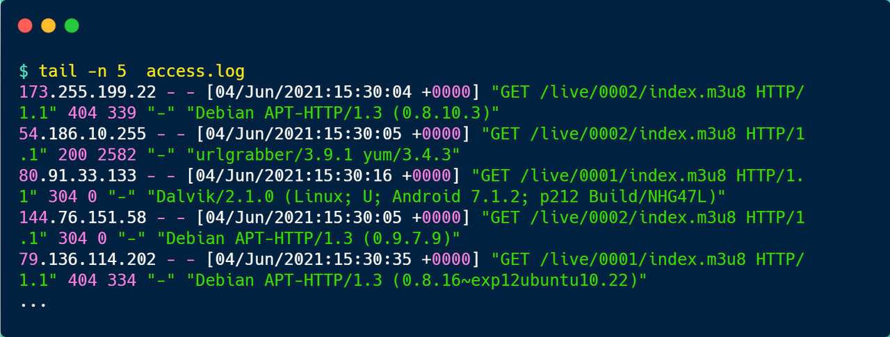

如果要看实时滚动的数据的话，用这个命令：tail -f，这样你看日志的时候，就会是阻塞状态，有新日志输出的时候，就会实时显示出来。

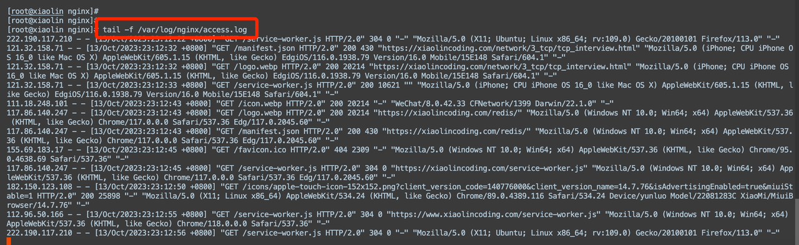

**回答**

可以用 tail 命令，再加一个 -f 的参数，来查看实时滚动日志

**推荐资料**

[Linux tail 命令](https://www.runoob.com/linux/linux-comm-tail.html)

## 30. 现在有一个txt文件，如何查看后三行

**分析**

可以使用 `tail` 命令。可以使用以下语句来查看一个 txt 文件的后三行：tail -n 3 your\_file.txt

**回答**

可以用 tail 命令，再加上 -n 3 的参数，就可以查看文件最后三行的内容了

**推荐资料**

[Linux tail 命令](https://www.runoob.com/linux/linux-comm-tail.html)

## 31. 查找一个字符串是否在文件中

**分析**

可以使用grep命令来查找一个字符串是否在文件中出现。grep命令用于在文件中搜索指定的字符串模式，并输出匹配的行。命令的基本语法如下：

其中，选项可以是：

* -i：忽略大小写。

* -r：递归地搜索指定目录及其子目录下的文件。

* -n：显示匹配行的行号。

* &#x20;-l：仅显示包含匹配字符串的文件名。

下面是一些常用的示例：

* 在单个文件中搜索字符串：

* 在多个文件中搜索字符串，并显示匹配行的行号：

* 递归地在指定目录及其子目录下的文件中搜索字符串，并仅显示包含匹配字符串的文件名：

**回答**

可以用 grep 命令

**推荐资料**

[Linux grep 命令](https://www.runoob.com/linux/linux-comm-grep.html)

## 32. Linux怎么查找一个文件里的某一个字符串的位置

**分析**

`grep -n "your_string" your_file`，这将显示包含指定字符串的行数。

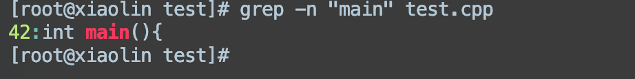

**回答**

可以用 grep -n命令，查找一个文件中某个字符串的位置。

**推荐资料**

[Linux grep 命令](https://www.runoob.com/linux/linux-comm-grep.html)

## 33. Linux查看文件行数命令

**分析**

使用 `wc -l` 命令：`wc -l your_file` 可以显示文件中的行数。

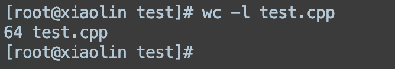

**回答**

可以使用 `wc -l` 命令，查看文件的行数。

**推荐资料**

[Linux wc命令](https://www.runoob.com/linux/linux-comm-wc.html)

## 34. 在一个目录下寻找含有字符串“admin”的文件

**分析**

在上述命令中，`grep`命令用于在文件中搜索指定的字符串，`-r`选项表示递归地搜索指定目录下的所有文件，而不仅仅是当前目录。

执行命令后，命令会在指定的目录及其子目录中搜索含有字符串"admin"的文件，并显示匹配的文件名和匹配的行内容。

**回答**

可以通过 `grep -r  "admin" 目录名`命令来实现，-r 是表示递归地搜索指定目录下的所有文件。

**推荐资料**

[Linux grep 命令](https://www.runoob.com/linux/linux-comm-grep.html)

## 35. 统计一个文件中某一个字段的次数

**分析**

可以使用 `grep` 命令结合 `wc` 命令来统计一个文件中某一个字段的出现次数。假设要统计文件中某一个字段（例如字段A）的次数，可以按照以下步骤进行：

这条命令的含义是：首先使用 `grep -o '字段A' filename` 来匹配文件中所有包含字段A的内容，并将其输出；然后使用 `wc -l` 来统计匹配到的行数，即字段A出现的次数。

**回答**

可以通过 grep -o 过滤出字段之后，然后用 wc -l 统计出现的次数。

**推荐资料**

[Linux grep 命令](https://www.runoob.com/linux/linux-comm-grep.html)

## 36. 如何替换一个文件中的字符串？

**分析**

可以使用sed命令。以下是一个示例：

在上面的命令中：

* -i选项表示直接在原始文件中进行修改，而不是输出到标准输出。

* s/旧字符串/新字符串/g是替换操作的模式，其中旧字符串是要替换的字符串，新字符串是替换后的新字符串。

* g表示全局替换，即一行中出现多次的旧字符串都会被替换。

请注意，这将直接修改原始文件，如果需要备份原始文件，可以在-i选项后面指定一个备份文件的扩展名，例如-i.bak，这将在替换前备份原始文件。

例如，假设要将文件example.txt中的字符串Hello替换为Hi，可以运行以下命令：

**回答**

可以用 sed 命令，比如使用 sed -i &#39;s/旧字符串/新字符串/g&#39; 文件名  命令

**推荐资料**

[Linux sed 命令](https://www.runoob.com/linux/linux-comm-sed.html)
