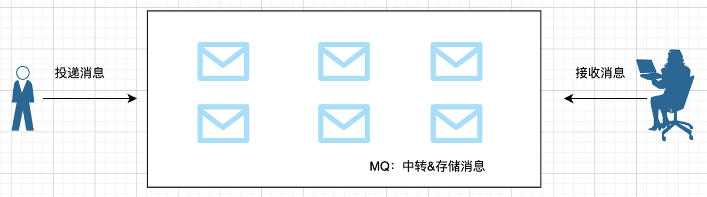
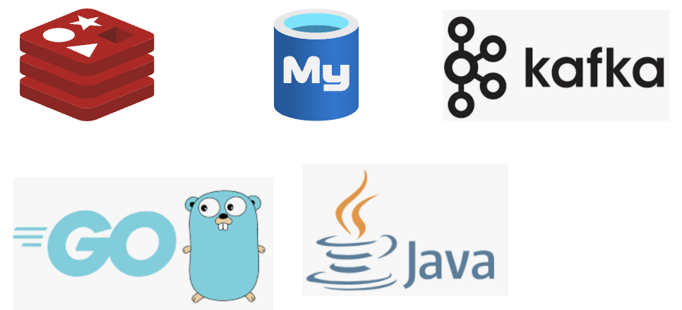

## **消息队列是什么？**

消息队列，顾名思义就是传递消息的队列，有着先入先出的特性，既然是队列，自然遵循先入先出的原则，同时，消息队列具备可靠性、高性能等特点。

消息队列是大型分布式系统不可缺少的中间件，一般用于异步流程、消息分发、流量削峰等问题，可以通过消息队列实现高性能、高可用、高扩展的架构。

## 消息队列的重要性

后端四大件一般来说就是编程语言、MySQL、Redis、项目，他们是后端面试的必备技能，缺一不可。

如果说要排个第五出来，那一定是消息队列，其重要程度紧贴四大件之后。

从工作角度来看，稍微复杂点的业务，是很容易用到消息队列的，应该把消息队列看作一个必须掌握的技能。

从面试角度来看，对于校招属于加分项，对一些概念有一定了解即可，当然校招现在也越来越卷，要是你时间比较充裕，肯定是理解得越深入，优势越大；对于社招则属于必备项，需要对其应用非常熟悉，并且对原理也要有一定掌握。

## **消息队列重点**

消息队列是实践类的技术，会应用大于懂原理，在工作中一般而言只要能使用消息队列优化架构就完全够了。

即使是面试的话掌握的原理要求也不用像MySQL那么高，因为消息队列解决的问题从结构上来说是比较简单清晰的，就是解决传递消息的问题，结构其实抽象点来就是一个数组，核心能力无非就是收消息、存储消息、消费消息，不像MySQL要支持复杂的查询能力，还有联表之类的复杂应用，并且底层还是个B+树结构，所以消息队列在生产环境，也是很少出现问题的，即使出现问题一般也是找对应的运维处理，对开发者掌握原理的要求就会弱一些。

## 要学多少种**消息队列**

业界比较出名的消息队列有ActiveMQ、RabbitMQ、ZeroMQ、Kafka、MetaMQ、RocketMQ。

那大家就会问了，这么多消息队列，我选谁好呢？这么多消息队列，又怎么学得过来呢？

其实人的精力是有限的，深入学习一种消息队列就够了，因为消息队列的使用都是相通的，只要你掌握了其中一种消息队列，你就可以说你会消息队列了，这就如同你无论掌握Java还是Go或者其它语言，你都可以说自己会写代码了。

而在选型时，正常的团队也只会应用一种自己熟悉的选型，不会说一个团队里用几种不同的消息队列，因为大多数业务场景无论用哪一种消息队列，都是满足需要的，自然哪个用得顺手用哪个，以上是我们从实用角度来分析的。

但是如果从技术视野或者从应对面试角度来看，我们还是需要对常见队列有个基础的认识，也就是知道这些消息队列有什么优点或者缺点，这样也可以做横向对比。

后面我们也会深入理一理消息队列的应用场景，以及每个队列的特色，知道这些信息，才好在选型时做出合理决策。

## 我们学习的思路

第一章：也就是本章，目的是扫盲，知道消息队列是什么、有哪些应用场景、如何安装

第二章：场景应用，解决怎么用的问题，消息队列是应用型技术，只要会使用，就可以说会消息队列了

第三章：了解架构，对架构有所理解，增加底蕴，但也不用过分扣细节

第四章：实践经验，前面学会了怎么用，这里其实是解决怎么用得好的问题，这章也是面试重点

第五章：高可用，消息队列作为一个消息传递中间件，可靠性要求很高，要大概能理解原理，面试也会问到，但是频率小于第四章

第六章：高性能，消息队列作为一个消息传递中间件，快是必须的，要大概能理解原理，面试也会问到，但是频率小于第四章，略大于第五章

