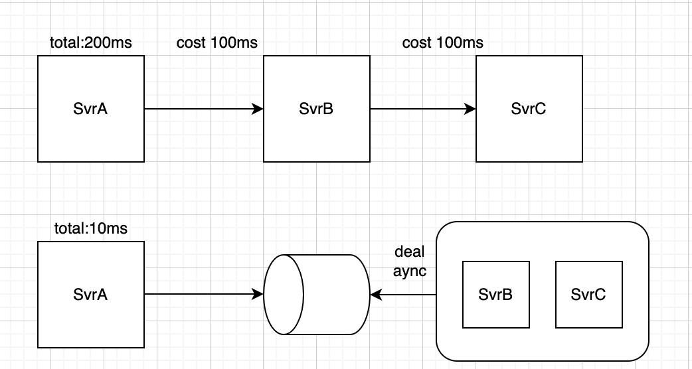
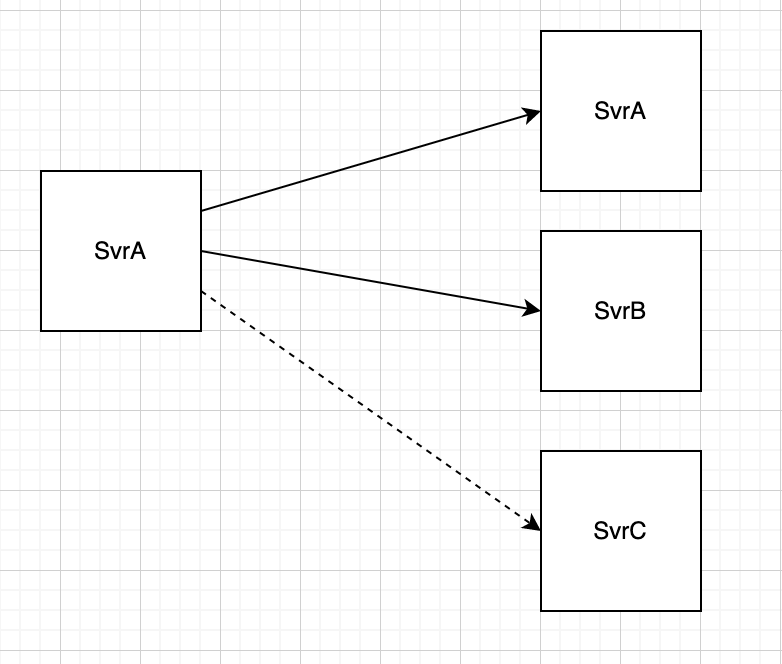
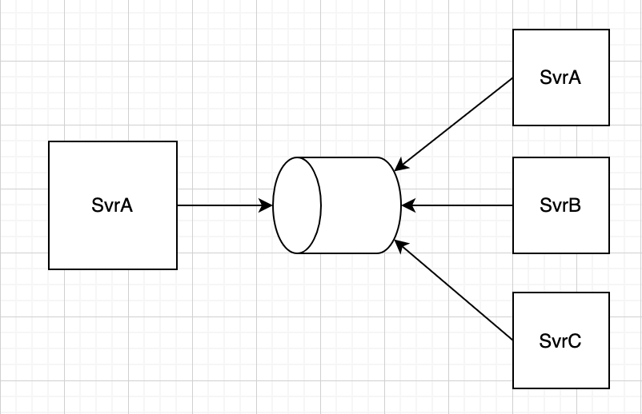
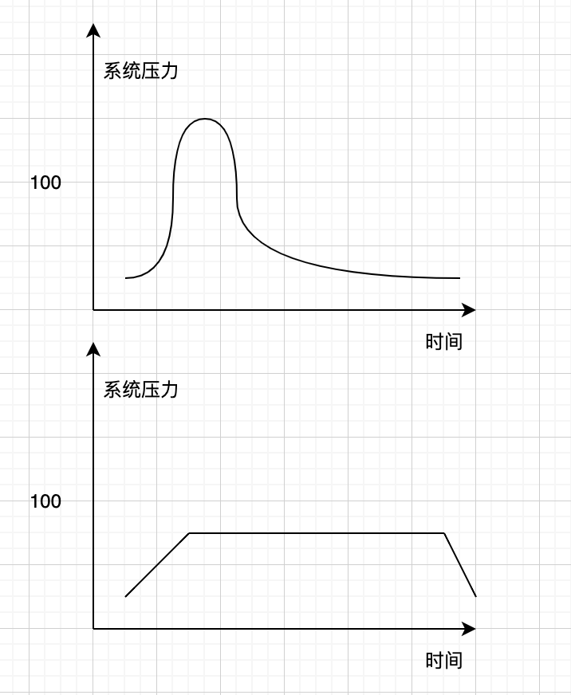

消息队列本质是解决消息传递的问题，其它场景都是扩展出来的。

可能你会问，一条消息不能直接传递吗？比如服务A不总是能将消息直接传给服务B吗？为啥还要引入一个消息队列？

有一些时候是不能的，举几个例子：

1.接收方处理不过来的时候，比如接收方每秒只能处理1000条消息，但是你因为搞活动，瞬间1s有10000条，这时候打过去接收方也扛不住啊，通过消息队列可以让接收方按自己的能力来协调，把消息压力摊平，这就是削峰

2.发送一个通知到短信服务，让短信服务发一条短信给客户，这时候如果要等待短信发完，发送方就会慢，不需要关注结果，就可以实现解耦，解耦的好处后面我们会展开来讲。

3.相同消息要发给10个服务，如果直接发，要写10次发送的代码，新增加1个服务来接收的话，发布者还需要改代码发布。

所以有不少场景是没法或者不太适合直接发送的，那怎么办呢？后端领域有一句名言，没什么事是引入一个中间层解决不了的，如果有，那就引入两个。这里就是引入消息队列作为中间层，来解决某些场景下消息传递的问题，这就是消息队列的意义。

下面我们会详细展开消息队列的应用场景，每种应用场景都会有一个例子进行实战演示，到时候会有更深认知。

## **消息队列的应用场景**

### **解耦**

解耦就是解除耦合，比如两个服务SvrA如果需要等待SvrB的返回，关注返回的结果和数据，或者就是单纯要B服务处理了，A才能给更前端回包，这就是耦合。

比如发送短信场景，假设服务SvrA发送消息给SvrB，SvrB发送短信给客户，很多时候业务是允许SvrA不需要得到SvrB发送完成的回应，只需要消息发送到SvrB就行了，这种情况下，如果还让SvrA等待SvrB的返回，显然会导致性能变低，同时还要去关注SvrB的运行结果。

所以，如果业务上可以去除这种依赖，那么就会获得性能、可靠性等的提升。

### **异步**

如果一个接口，处理时间很长，而且不能通过水平扩容来解决，就需要异步，那么，什么情况下不能通过水平扩容解决呢？

有很多，比如视频处理，涉及到视频下载，那受限于网络带宽等因素，扩容无用；比如区块链这种共识场景，只有单机才能出块，扩容也没有用；还有更常见的，比如一个业务流程，过了10多个微服务，单个也许不长，加起来就很难接受。

以上的情况下，用户很难通过同步接口长时间等待结果，那就应该做成异步，先扔进消息队列，后续再进行消费，和解耦一样可以收获更高的性能，以及获得更好的可靠性。

异步和解耦最大的区别在于，解耦是业务上本身就不需要依赖，异步是可能还是需要关注结果，但是不一定干等，可以回头再找。

### **消息分发**

假设一个核心服务A，是用来发布某种信号的，发布之后，需要通知到下游服务B、C，这种模式在只有B、C两兄弟的时候，没啥问题。

但随着业务需要，可能会有D、E、F等更多的打工人出现，这时候A服务就需要更改代码，将消息也传递给这些新加入的兄弟，每次增加打工人，就需要更改一次代码。

而引入消息队列，则可以解决这个问题，实现能力复用，业务解耦，拥有了高扩展性。

### **削峰**

每天要被人打48拳，1小时之内打完48拳可能人就挺不过去了，但是分散到24小时，1小时两拳，就能存活，这就是削峰。

我们经常遇到的秒杀场景就需要削峰的能力，一般而言就是将扣减库存操作均匀化处理，以防止瞬时流量打崩MySQL，如下所示（上面的图是削峰前，下面的图是削峰后）：

其实在架构上，削峰和上面的异步场景是相同的架构，都是将请求扔入队列中，再慢慢消费。

但要注意异步场景更偏向于单个请求，本身处理时间很长。削峰针对是单个请求ok，但是流量突发扛不住的场景。

## 总结

消息队列本质是解决消息传递的问题，后端设计领域其实不是组件用得越多越好，而是非必要尽量简化，所以一定要有合适的特定场景，才引入消息队列，常见场景有解耦、异步、消息分发、与削峰。

