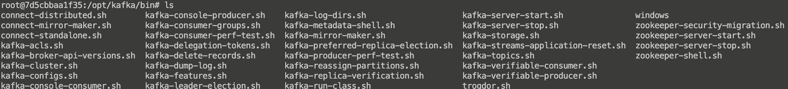
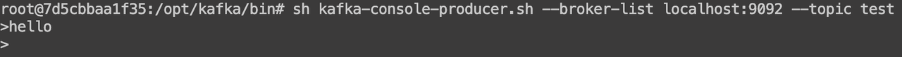
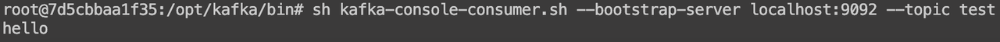

作为后端开发，其实进入公司之后一般是不需要你来安装Kafka的，要么就是有专门的运维，要么就是直接使用一些云厂商提供的消息队列，但是我们平常做实验的时候，最好还是得安装一下，这里选择最简单的方式来安装单机版的Kafka，目的就是做实验，

## docker安装（推荐）

首推docker安装，打包好了各个依赖组件，十分方便，如果你时间比较充足，对docker又有兴趣，可以看看这个分享：

[ Docker 夜市](https://ls8sck0zrg.feishu.cn/wiki/VYAEwS70xi2BT2kRA6ucplQunYg?fromScene=spaceOverview)

docker安装kafka单机版直接参考这篇文章，亲测可行：

https://ken.io/note/kafka-standalone-docker-install

安装完成之后，这个命令可以进入kafka容器：

docker exec -it kafka-test /bin/bash

> 操作系统使用Linux或者Mac，如果是Windows不排除会遇到问题，可以网上搜搜Windows安装方式，建议有条件的同学还是搞个Linux类似的环境，在生产环境，基本都是用Linux在跑程序。

## Mac直接安装单机版

如果你是Mac环境，并且docker安装方式没走通，可以参考下面这篇文章，用brew这个工具直接安装Mac单机版Kafka：

https://cloud.tencent.com/developer/article/1780636

## Windows直接安装单机版

如果你是Windows环境，并且docker安装方式没走通，可以参考下面这篇文章，安装Windows单机版Kafka：

https://blog.51cto.com/u\_15346009/3665880

建议有条件的同学还是搞个Linux类似的环境，在生产环境，基本都是用Linux在跑程序。

## Linux直接安装单机版

如果你是Linux环境，并且docker安装方式没走通，可以参考下面这篇文章：

https://blog.csdn.net/weixin\_41846320/article/details/101069551

## 实在安装不上怎么办

如果上面所有安装的方式始终成功不了，可以尝试在网上搜索其它方式安装，安装环境其实就是花时间折腾；

或者一开始其实也可以先跳过安装，先学把后面的内容学起来，边学边再慢慢想办法给自己配置一个可用的安装环境，不要卡在这个环节。

## 工具准备

无论是如何安装的，我们都需要要找到kafka的工具目录，以便后面的学习和测试。

如果是按上面所说用docker安装的kafka，工具目录是在/opt/kafka/bin

里面包含了很多常用的脚本工具，比如可以快速生产任务，快速消费任务，快速查询主题，快速修改主题等，有了这些工具，我们就算不去集成Java或者Golang的库也能操作Kafka，对入门学习而言非常友好，我们可以简单理解为Redis或者MySQL的命令行。

下面，我们通过这些工具，做一做简单测试：

1.打开一个终端，用命令启动一个生产者：

sh kafka-console-producer.sh --broker-list localhost:9092 --topic test

2.打开另一个终端，用命令开启一个消费者，此时生产消费者就都就绪了：

sh kafka-console-consumer.sh --bootstrap-server localhost:9092 --topic test

3.在生产者（也就是第一个终端）发送一条消息“hello”

4.在消费者（也就是第二个终端）应该要能收到这条消息：

以上流程如果都符合预期，就说明你Kafka的安装是成功的，可以进入下个章节的学习了🎉🎉🎉

## 总结

安装其实就是折腾和常见，一种方式不对换另一种方式，时间如果充裕的同学最好还是整一套环境，时间如果比较紧张又半天搞不好环境的同学，特别是时间紧张的校招同学，也可以先跳过安装继续往后学习，我们的内容都是有截图和解释的，倒也不会学不下去。
