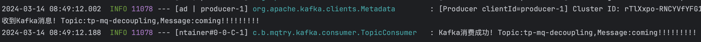

# 场景

### 演示场景

一个模块A接受前端请求，收到请求之后需要调用另一个模块B，以完成后续事项。一开始需要B做完之后，才回包给前端，这是第一种流程，这种流程很明显会很依赖模块B的运作情况。

但是如果业务允许，我们还可以有第二种流程：

模块A不用等模块B把事情做完，只用将信息传递到一个中转站，B从中转站感知到这件事，再自己去做就可以了，这个中转站，就是消息队列，可以起到解耦的作用。

### 生产中的实际场景

1.发送短信场景，模块A发送消息给B，模块B发送短信给客户，A不需要得到回应，对于A而言只需要触达B就行了。

2.工作流场景，比如审批，组长审批之后审批流程传递给总监，总监审批之后传递给总经理，而更后面的上级是不需要审批完之后再汇报给下级的，比如总监审批完之后他是不用通知组长的。

# 业务代码

解耦的好处有很多，这里我们可以先关注响应时间。

解耦前：

```java
@PostMapping(value = "/decoupling", consumes = "application/json; charset=utf-8")
public ResponseEntity<String> decoupling(@RequestBody IncrCountReq data) {
    countService.incrManyTimes(10000000);
    return ResponseEntity.ok();
}

public void incrManyTimes(Integer num) {
    for (int i = 0; i < num; i++) {
        incrCountAtomic(num);
    }
}
```

收到请求后，countService计数1000万次，我们调用一遍，看看多久能回包。

curl -w "\n cost %{time\_total}s" -H "Trace-ID: niuge123" -H "Content-Type: application/json; charset=utf-8" -H "User-ID: 77"  http://localhost:8081/demo/decoupling  -d '{"num":1}'

返回如下：

> {"code":0,"message":"ok","datetime":null,"data":null}&#x20;
>
> cost 0.185057s


解耦后：

```java
@PostMapping(value = "/decoupling_with_mq", consumes = "application/json; charset=utf-8")
public ResponseEntity<String> decouplingWithMQ(@RequestBody IncrCountReq data) {
    String msg = "coming!!!!!!!!!";
    kafkaTemplate.send("tp-mq-decoupling",msg);
    return ResponseEntity.ok();
}
```

没有直接计算，而是把消息传递给了kafka，由kafka消费者来处理：

```java
@KafkaListener(topics = "tp-mq-decoupling", groupId = "TEST_GROUP",concurrency = "1", containerFactory = "kafkaManualAckListenerContainerFactory")
public void topic_test(ConsumerRecord<?, ?> record, Acknowledgment ack, @Header(KafkaHeaders.RECEIVED_TOPIC) String topic) {
    Optional message = Optional.ofNullable(record.value());
    if (message.isPresent()) {
        Object msg = message.get();
        System.out.println("收到Kafka消息! Topic:" + topic + ",Message:" + msg);
        try {
            couontSerivce.incrManyTimes(10000000);
            ack.acknowledge();
            log.info("Kafka消费成功! Topic:" + topic + ",Message:" + msg);
        } catch (Exception e) {
            e.printStackTrace();
            log.error("Kafka消费失败！Topic:" + topic + ",Message:" + msg, e);
        }
    }
}
```

现在我们同样做一次调用，看看多久能回包

curl -w "\n cost %{time\_total}s" -H "Trace-ID: niuge123" -H "Content-Type: application/json; charset=utf-8" -H "User-ID: 77"  http://localhost:8081/demo/decoupling\_with\_mq  -d '{"num":1}'

返回如下：

> {"code":0,"message":"ok","datetime":null,"data":null}&#x20;
>
> cost 0.055067s

并且Kafka消费者也成功收到了消息：



我们可以看到，响应时间从0.185057s 降低到 0.055067s，也就是说从0.1秒级，降低到了0.01秒这个级别，降低了一个量级，计算次数越多，这个对比还会更明显。

> 这里有同学会有疑惑，整体处理时间并没有变短，为何说性能提升了？这里主要是要站在调用方A的角度。
>
> 比如A服务调用了B服务做一件事，这个事情要20s，现在异步化了，先丢进Kafka，这个同步接口的时间是不是缩短到非常低了，就几十ms。这就可以说，在同步调用环节，减少了接口响应时间。
>
> 甚至，考虑这种情况，A本来就不用关心结果，比如B是一个消息推送，类似于B可以发消息给微信、企业微信等等，A只用把消息传递给B，B再推送给哪个第三方，推送给几个第三方，都是B的事，这种情况，就可以说对于A而言，丢给Kafka之后，后续流程它就不关心了，也就意味着站在A的角度，整个流程的时间缩短了。

# 总结

我们前面重点通过观察响应时间，感受到了解耦的好处，其实不止于此，解耦的好处有很多：

1.可维护性增加，不用关注下游的返回结果，比如调用下游的话总得检查有无相关异常，有些异常又是和下游业务相关的，就算A服务感知到了也解决不了，而解耦后你就只用关心消息队列调用是否异常；

2.可靠性增加，下游挂了也不影响前面的处理流程，前端调用方可以拿到正常的返回，等下游恢复之后可以继续处理积累的消息；

3.响应时间变快，这个也就是我们本次重点演示的，这点应该没什么疑问了；

4.模块测试更方便，不用部署下游业务也可以测试了


最后我们抽象下，解耦其实本质就是A不用再关心B的事情，以及不再受B本身变动的影响。

