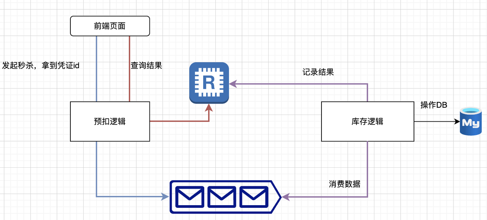
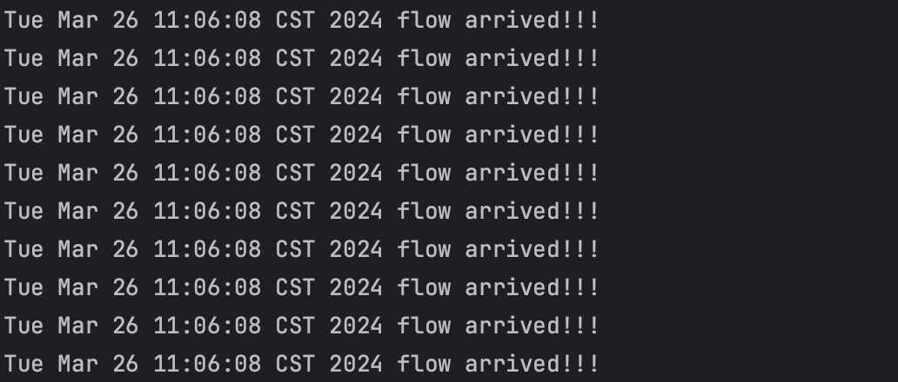
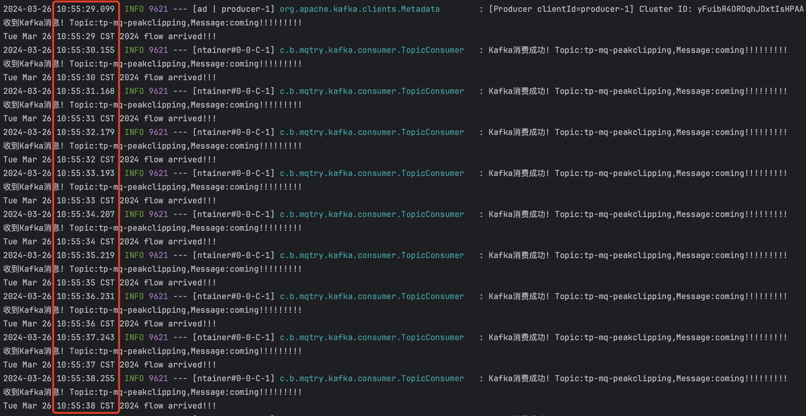

# 场景

### 演示场景

一个模块A接受一波流量，收到之后，立刻调用另一个模块B，那么此时B承担了基本相同的流程，举个例子，模块A一瞬间收到100个请求，那么B基本也是一瞬间收到100个请求，如果B的承压能力非常差，或者B有什么资源限制，那么这100个请求下来，B可能就挂了或者报错了。

面对这种下游扛不住的场景，我们还可以有第二种流程：

模块A不用一次性把消息打给B，而是只用将信息传递到一个中转站，B按自身的消费能力从中转站拉取消息，再自己去做就可以了，这个中转站，就是消息队列，可以起到削峰的作用。

### 生产中的实际场景

1.秒杀场景，一般会用Redis预抢名额，处理之后发给MySQL，因为一般商品秒杀总数都很少，几百，甚至几千。也就是说，大部分流量都没法在Redis抢到名额，从某种意义上来说，Redis已经实现了流量过滤，所以只会有商品数量的请求打到MySQL，正常来说瞬时流量不会太高，比如原本1亿个请求，抢1000个商品，那么最终总共到达MySQL的请求量就在1000左右。

但是如果商品数量是2w呢，这时候一瞬间秒完打到MySQL，MySQL就扛不住了，所以，请求量小于5k，可以直接扔过来，MySQL抗的住，大于5000的话我们就得考虑削峰了，也就是用消息队列。

2.凌晨数据录入场景，有些业务会晚上跑脚本，向统计服务发送数据，如果数据量非常大，这时候也是需要用消息队列进行削峰

# 业务代码

我们重点观察一瞬间有多少流量到达模块B。

### 削峰前

收到请求后，countService会打印"flow arrived!!!"表示流量已经到达。

现在我们要向这个接口连续发送10次调用，来观察流量到达情况，具体测试流程：

1.需要把下方脚本保存成peak\_clip\_many\_with\_mq.sh文件

2.然后sh peak\_clip\_many\_with\_mq.sh，注意，需要是linux或者mac环境下

我们可以看到，1s内有10次流量打到B模块，也就是说B模块一瞬间承受了A模块带来的所有压力。

### 削峰后

削峰之后就不是直接处理请求，而是把消息传递给了kafka，最后由kafka消费者来处理。

假设我们消费者每秒就只能消费一条消息，我们主动sleep以简单模拟这种情况：

现在我们要向削峰后的接口连续发送10次调用，来观察流量到达情况，具体测试流程：

1.需要把下方脚本保存成peak\_clip\_many\_with\_mq.sh文件

2.然后sh peak\_clip\_many\_with\_mq.sh，注意，需要是linux或者mac环境下

我们可以看到，Kafka消费者可以成功收到消息，并且每次间隔一秒才处理下一条消息，也就是说1S内就会处理了一条消息，这就证明了通过消息队列，消费者可以根据自身的情况，选择消费频率，消费不过来的压力可以在消息队列得到有效缓冲。

# 总结

削峰本质是减少了对下游的流量冲击，扩展来说好处有很多，比如更安全，更可控，更高的承载能力。

最后要注意的就是削峰一定是用于突发流量，而不是持续流量，如果流量一直很大，那么如果单机性能达到了优化瓶颈，最后还是需要业务服务水平扩容去支持。

