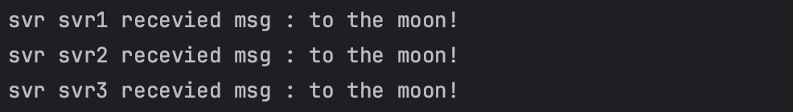
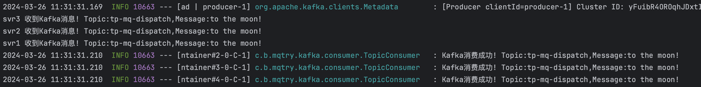

# 场景

### 演示场景

一个模块A需要发送同一条消息给模块B、C、D

### 生产中的实际场景

1.信息更新场景，比如某个用户信息更新了，而B、C、D三个模块都需要缓存这个信息，那么用户信息更新之后就可以发一条信息到消息队列，B、C、D只要订阅了相关主题，就都可以收到这条信息。

2.数据分析场景，假设一个用户请求进到模块A，这类请求非常重要，需要找3个不同的风控模块B、C、D去处理，3家都认为没问题了，才放行，这时候也可以发一条信息到消息队列，B、C、D只要订阅了相关主题，就都可以收到这条信息。

# 业务代码

我们来看下使用消息队列进行分发前的代码是怎样的：

```java
@PostMapping(value = "/dispatch", consumes = "application/json; charset=utf-8")
public ResponseEntity<String> dispatch(@RequestBody IncrCountReq data) {
    String msg = "to the moon!";
    countService.msgAll("svr1", msg);
    countService2.msgAll("svr2", msg);
    countService3.msgAll("svr3", msg);
    return ResponseEntity.ok();
}

public void msgAll(String svrName, String msg) {
    System.out.println("svr " + svrName + " recevied msg : " + msg);
}
```

svr1、svr2、svr3就可以看作B、C、D三个模块。

收到请求后，svr1、svr2、svr3会打印日志表示请求已经收到。我们来测试一遍：

curl -w "\n cost %{time\_total}s" -H "Trace-ID: niuge123" -H "Content-Type: application/json; charset=utf-8" -H "User-ID: 77"  http://localhost:8081/demo/dispatch -d '{"num":1}'

结果如下：



功能上是没有任何问题的，但是这样3个模块，我们就得写3个对应的代码， 那如果20个模块要感知到这条消息，我们不得写20个？同时每增加一个，我们A模块就得升级一次代码，很麻烦。


所以我们可以用消息队列进行分发：

```java
@PostMapping(value = "/dispatch_with_mq", consumes = "application/json; charset=utf-8")
public ResponseEntity<String> dispatchWithMQ(@RequestBody IncrCountReq data) {
    String msg = "to the moon!";
    kafkaTemplate.send("tp-mq-dispatch",msg);
    return ResponseEntity.ok();
}
```

对应要有消费者逻辑：

```java
@KafkaListener(topics = "tp-mq-dispatch", groupId = "TEST_GROUP1",concurrency = "1", containerFactory = "kafkaManualAckListenerContainerFactory")
public void dispatchForSvr1(ConsumerRecord<?, ?> record, Acknowledgment ack, @Header(KafkaHeaders.RECEIVED_TOPIC) String topic) {
    Optional message = Optional.ofNullable(record.value());
    if (message.isPresent()) {
        Object msg = message.get();
        System.out.println("svr1 收到Kafka消息! Topic:" + topic + ",Message:" + msg);
        try {
            couontSerivce.incrManyTimes(10000);
            ack.acknowledge();
            log.info("Kafka消费成功! Topic:" + topic + ",Message:" + msg);
        } catch (Exception e) {
            e.printStackTrace();
            log.error("Kafka消费失败！Topic:" + topic + ",Message:" + msg, e);
        }
    }
}

@KafkaListener(topics = "tp-mq-dispatch", groupId = "TEST_GROUP2",concurrency = "1", containerFactory = "kafkaManualAckListenerContainerFactory")
public void dispatchForSvr2(ConsumerRecord<?, ?> record, Acknowledgment ack, @Header(KafkaHeaders.RECEIVED_TOPIC) String topic) {
    Optional message = Optional.ofNullable(record.value());
    if (message.isPresent()) {
        Object msg = message.get();
        System.out.println("svr2 收到Kafka消息! Topic:" + topic + ",Message:" + msg);
        try {
            couontSerivce.incrManyTimes(10000);
            ack.acknowledge();
            log.info("Kafka消费成功! Topic:" + topic + ",Message:" + msg);
        } catch (Exception e) {
            e.printStackTrace();
            log.error("Kafka消费失败！Topic:" + topic + ",Message:" + msg, e);
        }
    }
}

@KafkaListener(topics = "tp-mq-dispatch", groupId = "TEST_GROUP3",concurrency = "1", containerFactory = "kafkaManualAckListenerContainerFactory")
public void dispatchForSvr3(ConsumerRecord<?, ?> record, Acknowledgment ack, @Header(KafkaHeaders.RECEIVED_TOPIC) String topic) {
    Optional message = Optional.ofNullable(record.value());
    if (message.isPresent()) {
        Object msg = message.get();
        System.out.println("svr3 收到Kafka消息! Topic:" + topic + ",Message:" + msg);
        try {
            couontSerivce.incrManyTimes(10000);
            ack.acknowledge();
            log.info("Kafka消费成功! Topic:" + topic + ",Message:" + msg);
        } catch (Exception e) {
            e.printStackTrace();
            log.error("Kafka消费失败！Topic:" + topic + ",Message:" + msg, e);
        }
    }
}
```

看到这里可能会问，消费者代码不也是不断在增加么？对，但是这是消费端的事情，A模块的维护者就需要升级，并且这里我们为了简单起见，模块都在同一个服务内，事实上，在生产环境生产端和消费端基本都是不同的服务，甚至是不同的团队在维护。


我们验证一次功能：

curl -w "\n cost %{time\_total}s" -H "Trace-ID: niuge123" -H "Content-Type: application/json; charset=utf-8" -H "User-ID: 77"  http://localhost:8081/demo/dispatch\_with\_mq -d '{"num":1}'

结果如下，同一条消息被多个消费者消费了，分发逻辑符合预期：



# 总结

分发适合多个消费者关注同一条消息的场景，原本需要维护和多个消费者的关系，用消息队列分发之后，就只用和消息队列打交道，完全不用去关心消费者在做什么，从角度来看，分发其实可以看作是群发场景下的解耦方案。

