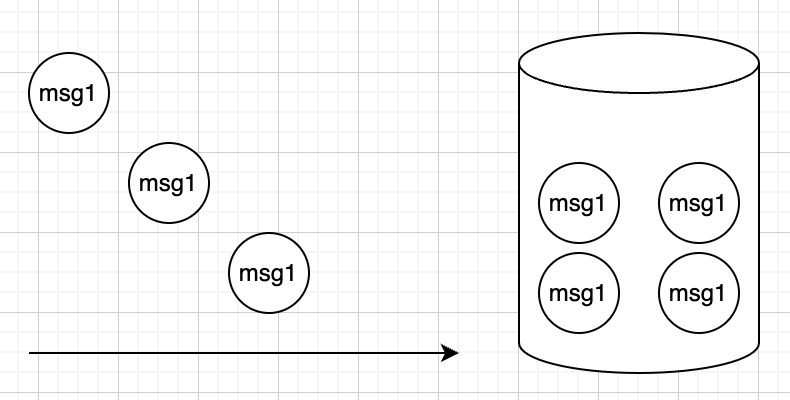
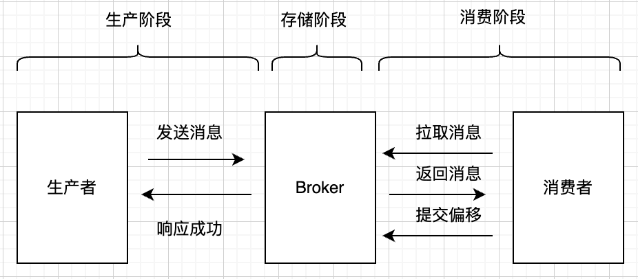
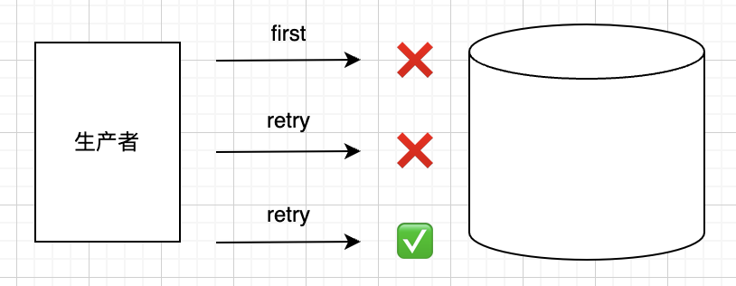
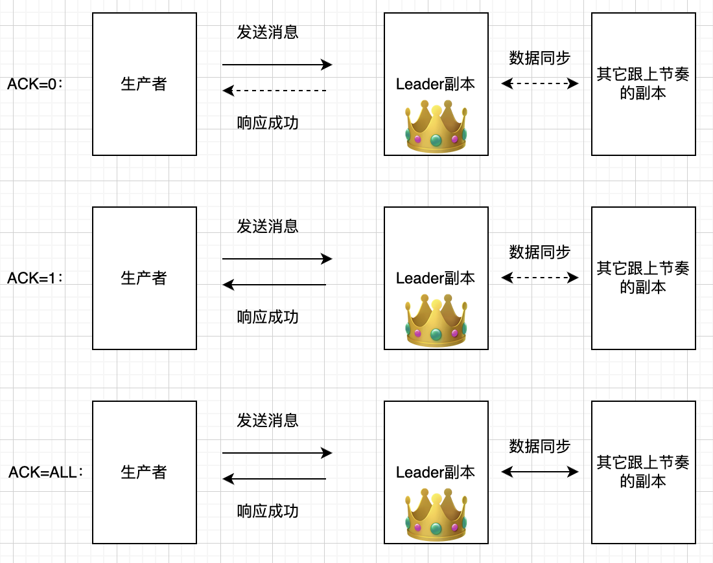
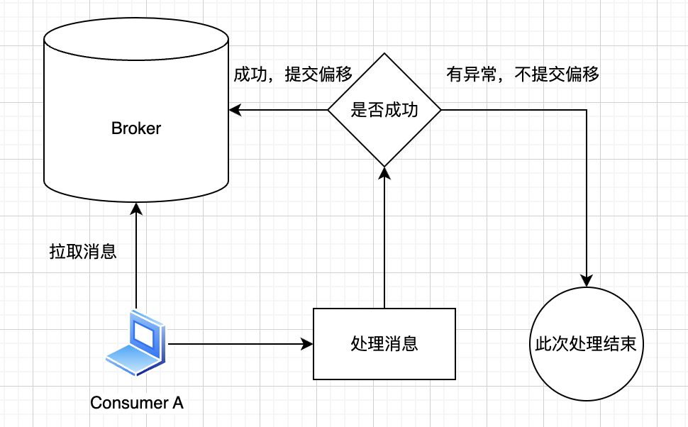

消息队列作为消息传递的中枢，承担着不同业务的消息数据，这些消息如果在链路中丢失了，可能会带来严重的影响，所以消息队列需要保证消息不丢失。

大家回顾一下上一节我们介绍的消费语义，并思考哪一种消费语义，就能满足我们不丢失的诉求。显然，是at least once，即最少一次语义，消息一定不丢，但是有可能重复。

怎么实现at least once呢？我们可以反过来想，什么情况下消息会丢失呢？实际上，消息丢失有如下几个环节：

1.生产环节

2.存储环节

3.消费环节

要保证消息不丢失，就得从这三个环节分析。

# 生产环节

消息生产环节，也就是生产端把消息发到Broker这个环节，先说结论，这个环节跟Kafka这个应用关系不大，毕竟发消息是在Kafka客户端，所以Kafka很难保证完全可靠，唯一能做的一点就是发送消息之后必须得到响应，不然就反复重试。

但是如果没重试生产服务就挂掉了，那么还是会丢消息。

要解决这个问题，只有从消息源入手，比如你的数据是从数据库拿过来发，那么发完就得记录下来，没有记录的数据还会再次发送，比如你的数据是来自某个磁盘文件里，那么同样的，你得去记录结果，或者记录你发到了第几行，这样挂掉恢复之后，你是知道上一次消息还没真正确认。

这里可能稍微有点绕，就一个结论，Kafka本身是没有什么机制能保证生产一定成功的 ，需要有额外的确认机制才可以，原因是这个环节是在数据进入消息队列之前，甚至可能因为某些原因都没发送过数据，所以不该由消息队列来保证，所以这个结论也不影响消息队列的可靠性。

# 存储环节

存储数据不丢失，也就是进去消息队列之后的数据，是持久的，Kafka这种消息队列，是非常可靠的，只要写入了队列，就不会丢消息，这个依托于**持久化存储**：Kafka的消息确认机制还依赖于其持久化存储能力。一旦消息被写入并确认（根据所选的确认级别），它就会被持久化存储到磁盘中。这意味着即使系统发生故障或重启，已经确认的消息也不会丢失。它就可以被消费者至少消费一次。

当然，这里还有个生产者侧的写入策略配置。这里稍微扩展一下，如下表：

| acks   | 行为                                                                            | 可靠         | 性能         |
| ------ | ----------------------------------------------------------------------------- | ---------- | ---------- |
| 0      | 生产者在发送消息后不会等待来自服务器的确认，所以生产者实际是不知道消息是否成功，也就无从去重试，生产可靠性是最低的                     | 不可靠        | 最高         |
| 1      | 生产者会在消息发送后等待主节点（主节点可以理解为：Leader节点所在的Broker机器）的确认，但不会等待所有副本的确认                 | 相对可靠  | 还是比较高的     |
| all或-1 | 只有在所有副本（准确说是所有ISR副本，ISR是什么会在后面高可用章节介绍）都成功写入消息后，生产者才会收到确认。这确保了消息的可靠性，但延迟显然是最高的 | 可靠         | 会低一些  |

文字看策略可能会比较枯燥，我们可以进一步结合下面这个图来理解，其中实线箭头表示需要操作完成，虚线箭头表示不用等待操作完成：

如果不主动设置，acks默认为1，丢失数据的情况会很少，几乎可以忽略，同时性能也是很高的。当然要完全可靠的话，就得设置为all。

这里再扩展下，Kafka实际上还通过副本机制，让持久化数据更可靠，即将每个主题划分为多个分区，并为每个分区创建多个副本。这确保了即使部分Broker发生故障，消息仍然可以从其他副本中恢复，并被消费者消费。

> 每个主题在Kafka中被划分为多个分区，每个分区可以有多个副本。 其中一个是Leader副本，用于接收读写请求，而其他的是Follower副本，用于备份数据。当生产者发送消息到某个分区时，消息首先被写入Leader副本，并等待确认。根据所选的确认级别，生产者可能会等待Leader确认或所有ISR确认。

关于消息队列高可用，后面还会有单独章节讲解，这里逻辑上能理解即可。

# 消费环节

Kafka提供了偏移量管理功能：Kafka消费者通过提交每个分区的偏移量来跟踪已经消费的消息，即使消费者在处理消息时发生故障，重新启动后它仍然可以从最后一个提交的偏移量处继续消费，确保消息至少被处理一次。

相比于自动提交，另一种方式是手动提交，也就是由消费者业务代码自己控制提交时机，主动调用函数来提交。

简单来说，为了保证消费最终被处理过，只有在消费端处理成功之后，才提交偏移到Broker，否则不进行偏移提交，这样下次拉取还能拉取到这条消息。

这种模式下，即使发生消费者宕机，重启恢复之后也不会发生消息丢失，其本质就类似于平常我们去餐厅吃饭，吃满意之后再付钱，要是饭菜有问题，就不付钱。

# 总结

要保证消息不丢失，无非是在生产阶段、存储阶段、消费阶段做手脚，具体一点就是：

生产阶段要有重试和确认流程；

存储阶段依托于写入时的ACK策略，需要选择所有副本都写入的策略；

消费阶段则是消费成功来提交确认，如此就可以保证消息不丢失。

但是事实上，大多数业务没必要追求绝对不丢失：

* 生产环节一般用多次重试即可

* 写入策略通常选择主节点确认而不是所有副本都确认

* 消费阶段倒是一般会成功再提交

这种模式下的可靠性已经能满足大多数场景了，以上就是本小结内容，下一节会给大家讲解如何让消息不重复。

