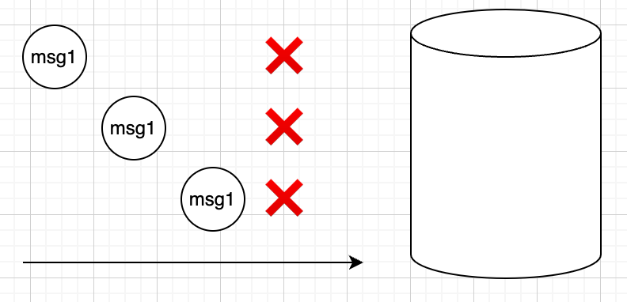
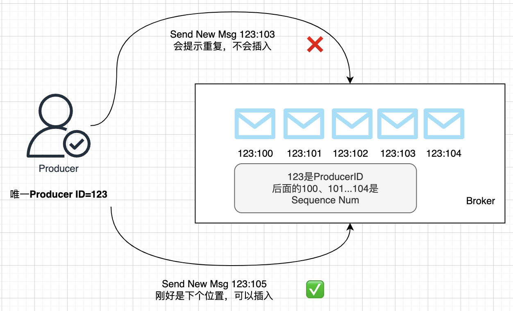
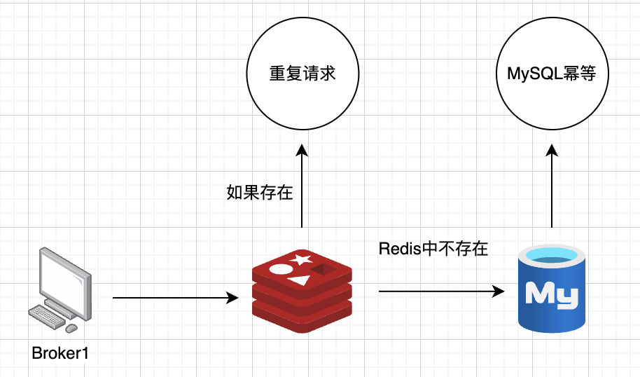
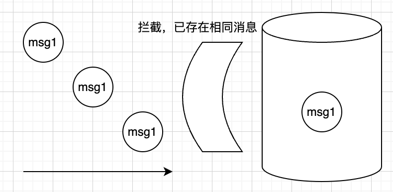

不重复很好理解，就是让消息不被重复接受消费。

大家回顾一下之前我们介绍的消费语义，并思考哪一种消费语义，就能满足我们不重复的诉求。显然，是at most once，即最多一次语义，这种模式下消息就不会重复。

我们先来看看，什么场景下消息会重复消费：

1.生产阶段：发送时就重复了，比如网络波动，生产者重试发送，2次其实都发到了Broker

2.存储阶段：在Kafka中存储的阶段，是不会重复的

3.消费阶段：业务收到消息之后因为各种原因没有及时提交偏移，后面又拉到了相同消息

实际上，因为有网络波动，我们基本不可能让消息真的不重复，本质上不重复是手段，不重复产生影响才是目的。

所以一般会通过实现幂等性来支持可重入消费，在讲幂等性消费之前，我们先看看在生产阶段有没有什么事是可以做的。

# 幂等性生产

Kafka 的幂等性生产是指在相同的Producer实例中，同一条消息（相同的消息内容和唯一的消息 ID）即使被多次发送到 Kafka 也只会被写入一次。这是为了防止因网络问题、重试等原因导致的消息重复。

## 如何启用幂等性生产

要启用幂等性生产，只需在生产端设置enable.idempotence为true，即在创建 Kafka 生产者时使用以下配置：

## 幂等性生产的工作原理

Kafka 的幂等性生产通过以下几个关键机制来实现：

1. **Producer ID (PID)：**&#x4B;afka 为每个生产者实例分配一个唯一的 Producer ID。这个 ID 在整个生产者生命周期内保持不变，用于标识该生产者，以区分不同的生产者实例。

2. **Sequence Number：**&#x5BF9;于每个 Topic Partition，Kafka生产者为每条消息分配一个递增的序列号。Kafka 该序列号是递增的，表示消息的顺序，Broker 会跟踪每个 Topic Partition 的最后一个已提交的序列号。

   当 Kafka 接收到消息时，会检查这个序列号，以确保同一条消息不会被写入多次。

3. **消息去重：**&#x5F53;生产者发送消息时，Broker 会检查消息的序列号是否在对应分区已经处理过，具体而言就是Kafka针对每条接收到的消息，都会检查它的序列号是否比Broker所维护的值严格+1，只有这样才是合法的，其他情况都会丢弃，从而实现幂等性。

## 幂等生产的局限性

**1.只能同一台机器才有用**

比如一个生产者因为网络波动，三次重复发送，这种情况就有效果。

但是如果重复消息是由不同生产者者发出，那就无法达到去重的效果，比如我们多台机器从数据库里拉定时任务来发，2台机器拉到了相同的任务，都发给Kafka，此时因为他们属于不同生产者，**Producer ID是不一样的，**&#x6240;以无法达到去重的效果。

**2.同一台生产者机器，如果发生了重启也不行**

就算是同一台生产者机器，如果发生了重启，其实在Kafka眼里也是不同生产者了，**Producer ID是不一样的，**&#x6240;以无法达到去重的效果。

**3.同一台生产者机器，消息丢失也不行**

由于开启了幂等生产，在同一分区中，同一生产者消息的编号需要是连续的，也就意味着中间不能丢消息，所以通常情况下，开启幂等性也会启用 acks=all 和 retries 设置，来尽可能确保消息是可以连续的，不然如果中间出现空洞，整个流程就会卡住，需要有专门的程序或者人工介入。

> retries 参数被设置为一个较大的值（例如 100万），以确保消息发送的重试次数足够多
>
> acks 参数被设置为 all，以确保消息被所有副本确认后才认为发送成功，不然因为副本切换导致了空洞也会让流程卡住

综上所述，幂等性生产是比较有局限性的，他只能减少重复的概率，而无法杜绝重复，同时还会带来更严格的连续性限制，是否开启要看具体场景。

实际上，一般后端开发中，最后依赖的，都是幂等性消费。即如果你真的希望消息不重复，无论你是否开启幂等性生产，最后都是靠幂等消费来兜底，下面的内容我们会展开介绍幂等性消费。

# 幂等性消费

Kafka是没办法解决重复消费的问题，我们只能引入别的机制来解决了，也就是可重入消费，换句话说就是幂等性消费。

在数学中，幂等函数为f(x) = f(f(x))。举个例子，求绝对值的函数就是幂等函数abs(x) = abs(abs(x))。

可以看到这个函数无论执行多少次，结果都是一样的。

在计算机领域，幂等性也是相似的含义：简单来说，即同样的操作无论执行多少次，结果都一样，也就是说只有第一次造成了数据的改变。

拿转账举例，同一笔转账请求，即使因为网络波动或者失败重试重发了多次，但最终实际的金额流转只会有一次。

幂等性是后端设计一个重要原则，因为网络是不可靠的，前置操作（比如请求到MySQL，MySQL之前的流程就是前置操作，也不知道有哪些环节会重复）也是不可靠的，也就是说一个相同的请求，总有概率会重放到你的服务，这种情况是需要考虑的。

一般而言，我们从接口层面来保证幂等性，一个接口可重入的基础，就是它底层操作都是可重入的。

这里要着重理解下，幂等性消费和Kafka其实没有太大关系，实际是业务通用手段，下面给大家介绍一下Redis、MySQL中的幂等处理方法，这两个组件也是业务消费阶段最常打交道的，理解了它们的幂等手段，也就基本理解了幂等性是怎么玩的。

## 如果存储是Redis，如何进行幂等处理

Redis常见实现幂等性的思路有如下三种：

1. **唯一标识符**：为每个消息分配一个全局唯一的标识符（如UUID）。

2. **Redis Set**：将已消费的消息ID存储在Redis的Set数据结构中。每次消费消息前，检查该消息ID是否已存在于Set中。

3. **原子操作**：使用Redis的原子操作（如`SISMEMBER`和`SADD`）来检查和添加消息ID，确保操作的原子性。

## 如果存储用MySQL，如何进行幂等处理

MySQL常见实现幂等性的思路有如下三种：

1. **唯一约束**：在MySQL表中为消息ID创建一个唯一约束。

2. **INSERT IGNORE**：使用 INSERT IGNORE 或 ON DUPLICATE KEY UPDATE 语句来尝试插入消息记录。如果消息ID已存在，则忽略或更新该记录。

3. **事务**：在需要的情况下，使用事务来确保多个操作的原子性。

## MySQL幂等处理的例子

我们举一个唯一约束的例子，即我们可以定义唯一Key，如果是Key已经存在，这时候会有特别的错误信息，

通过这个错误信息就可以知道：“哦，这个事情我已经做过了”，然后根据业务需要进行返回。

这里举个例子来说明：

比如这么一张表：

做如下测试：

可以看到通过唯一Key限制，是不能重入插入数据的，并且是有鲜明的报错，无论是Java还是Go，都会暴露出对应鲜明的错误或封装。

## 流量优化

如果业务是用MySQL做存储，那就可以参考上面MySQL幂等处理的思路，另外这里其实有个小的优化点，如果重复请求过多，那么MySQL凭白无故会多承担这部分压力，而MySQL这个数据库的性能是比较宝贵的，所以可以加一层Redis过滤来优化：

简单来说，在Redis中缓存已经处理过的唯一Key，压力到MySQL之前，先做一次检查，如果存在于Redis，那么就不用到MySQL了，如果不存在，请求就继续打到MySQL，依赖MySQL的幂等做最后兜底。

## 精准一次消费

讲到这里，我们知道了如何实现消息不重复消费，结合上一节的如何实现消息不丢失，相当于我们同时拥有了两种语义：at least once 和 at most once，这两种语义加一起，其实就是exactly once，精准一次消费。

# 总结

本节我们讲解了如何结合业务的幂等性，介绍了幂等性生产，以及更重要的幂等性消费，当然，实现幂等性的手法还有很多种，不局限于上面例子里的方法，有兴趣的同学可以看看训练营的夜市分享：[ 后端场景优化-接口幂等性](https://ls8sck0zrg.feishu.cn/wiki/AFiVwuCfhiT86dkG9PyclDYOn9M?fromScene=spaceOverview)。

这里重点要理解实际光靠消息队列是做不到的不重复消费的，需要消息队列与业务逻辑配合完成。
