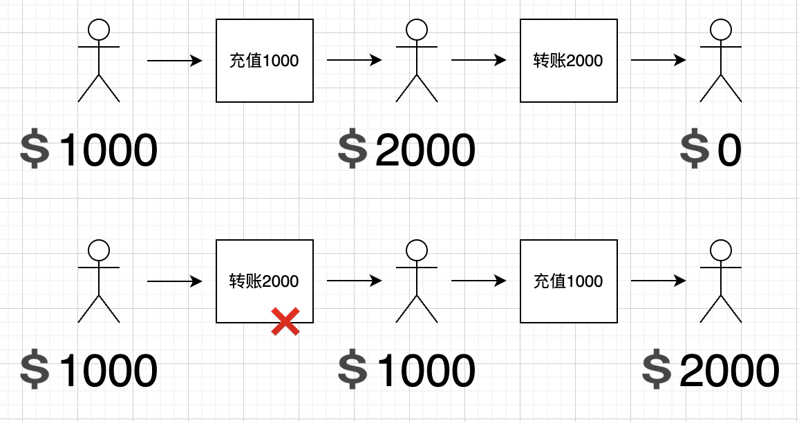
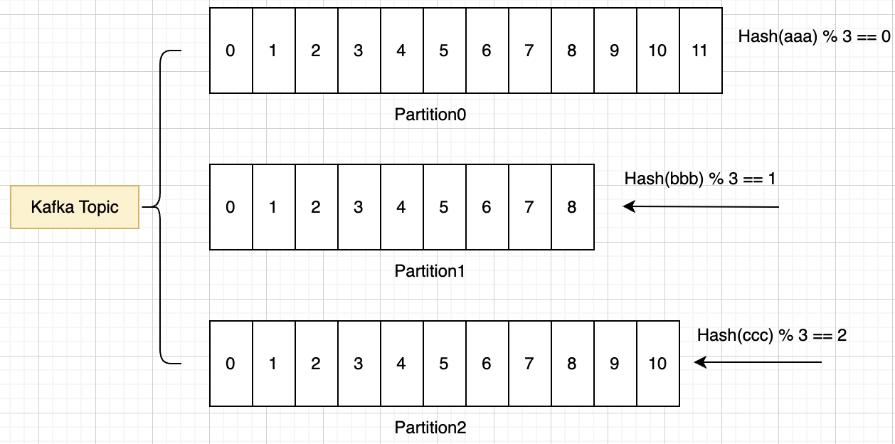
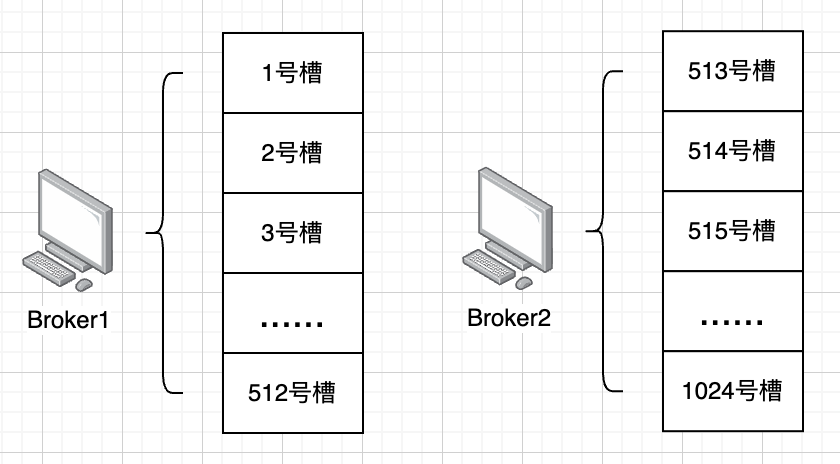

前面几个小节，我们讲解了消费语义相关话题，本节我们聊另一个话题：如何让消息有序？

可能有同学会问，什么场景要消息有序，这就多了去了，只要有前后依赖的消息，就需要有序，比如我们最简单的一个资金系统，假设一个用户的资金本来是1000，他先充值1000，再转账2000。

如果按正确的顺序，充值1000，账面变成2000，再转账2000，是不是两个操作都是成功的？

假设执行顺序反了，就变成先转账2000，此时账面上才1000，显然是会失败的，顺序对结果产生了影响，这就是为什么需要消息有序。

要解决消息队列如何让消息有序的问题，我们先复习下前面这张图：

Kafka一个主题的全局可以看作是无序的，因为有很多不同Partition用于存储，但是在同一个Partition的消息显然是有序的。

所以如果我们希望业务上消息有序，那么就需要在Partition的路由上动手脚。

## 简单粗暴

一种最简单的做法，就是根据业务确定分区，即每类业务自己一个分区，这样就可以实现业务消息有序。

具体而言，即将业务所有消息都指定同一个分区Key，这样一来所有消息都会添加至同一个Partition，这样就达到了我们的目的，比如秒杀业务像下面这样向tp-seckill这个Topic发送消息，都用分区Key：“aaabbbccc”来发送。

潜在的不足之处在于这样做性能的扩展性就低了很多，当单个业务增长比较快，最后压力都给到了同一个Partition，无法发挥多Partition的优势，所以一般而言还会根据情况进一步地业务内分区。

## 业务内分区

我们前面说了，可以根据业务分区，而如果单个业务压力过大，我们就要考虑业务内再次切分。

这里可以类比一下MySQL的分表，其实会发现差不多，本质都是将集合进一步做切片，以寻求更大的并发能力和吞吐量。

下面我们就讲一下消息队列怎么以分表的思路做分区。

# 分区思路

### 子业务分区

同一个团队下，可能有不同的服务，比如金融服务，消息服务等，假设他们都要传递消息给消息队列，按前面我们所说，显然可以金融服务一个分区，消息服务一个分区。

按业务分了之后，我们其实还可以深挖是否可以按子业务拆分，比如金融服务分为风控子业务一个分区，支付子业务一个分区，消息服务分为短信通知分区，微信通知分区。

总结来说，即探索将大颗粒拆得更小更细，以便进一步扩展，这就是子业务分区。

### 客户分区

如果对于客户而言，数据是比较独立的，客户之间没什么交互，我们还可以按客户来分区。

比如消息是记录某个客户的减肥记录，里面包含了日期和减了多少斤，消费之后希望按投递的顺序记录进某个文件或数据库。这种场景就是客户自己有序即可，客户不用关心别的客户减肥情况，也就是说客户之间不需要依赖。

符合这种场景的业务，就可以按客户来进行分区，比如最简单的，按用户id % 100来分，这样就可以划出来100个分区，比如用户1001就用分区Key：user-mod-1，用户2002就用分区Key：user-mod-2。

这种方式有一个缺点，增减节点会对原有的路由分布会造成冲击，比如原来9个分区，用户id是10，那算出来就是10 % 9 = 1 号分区，假设增加一个分区，该用户就路由到10 % 10 = 0号分区，也就是说，当节点增加或减少，原来的路由基本上是全乱了。&#x20;

如果要解决这个问题，可以考虑参考Redis哈希槽（有兴趣可入传送门[ Redis哈希槽](https://ls8sck0zrg.feishu.cn/wiki/wikcnecstNu4EjXeMwdOXv0xYNe)）的做法：引入槽的概念，比如约定16384个槽，用用户id进行Hash计算，然后 % 16384，这样就可以关联到算法关联到某个槽。

> 注意，16384只是举个例子，实际中你的服务肯定没这么多节点，不见得需要这么多，可以定的偏小一些，比如1024

每个节点负责一部分槽，用户id算出来在哪个槽，就应该去负责这个槽的节点进行交互。

这种模式下，我们新增节点，就可以有选择性地分配一些槽给新节点，而不用全局都打乱。同时，因为槽比较好腾挪，如果在运营过程中发现流量不均匀，也可以选择性地直接调整热点槽到相对有余力的节点。

除了用Hash槽，还可以用一致性Hash来解决这个问题，有兴趣的同学可以跳转到这篇文章[一致性哈希](https://xiaolincoding.com/os/8_network_system/hash.html#%E5%A6%82%E4%BD%95%E5%88%86%E9%85%8D%E8%AF%B7%E6%B1%82)看看。

> 如果是在面试中，能引入简单的Hash槽就已经是扩展了，没必要做得太复杂，堆砌越多被挑战得越多，甚至如果一上来就说Hash槽或一致性Hash两种方式的话，会被怀疑是否真的实践过，还有可能被认为是在背东西。因为真实生产中，业务团队自己实现得会很简单，引入Hash槽都算少见了。

### 大小客户分区

还是以客户之间没有依赖、但是客户内部需要有序来为前提。

如果单纯按客户来分，能解决大多数的问题，但是我们设想这么一种场景，某个业务有100个客户，90个客户每天产生100条消息，剩下10个客户，每天产生1000 0000条消息，也就是发生了大客户扎堆现象，这样压力还是集中在同一个Partition。

这种情况就可以考虑给大客户提供单独的分区，比如我们知道ID为user-123的用户是一个大客户，就单独为它指定一个分区user-big，不和其它客户的user-common一起卷，相当于是VIP通道了。

> 这里可能会问怎么能感知到user-123就是大客户，一般而言是2个大的方向：
>
> 1.提前就知晓，比如很多To B业务，合作都是签订协议的，是不是大客户一目了然，所以可以提前为其独立一个分区；
>
> 2.实际运作中发现它是大客户，这种情况下就是发现之后，再迁移新的消息的独立分区。

# 总结

在部分场景，是需要消息有序的。对于Kafka而言，一个主题的全局是无序的，但是在同一个Partition的消息的是有序的，所以如果我们希望业务上消息有序，那么就把消息路由到同一个Partition。

同时，为了保持更大的并发度，我们可以根据业务进行分区，尽量只让需要排序的消息在一个Partition，而没有依赖的消息则分离开来，这样就能同时兼顾业务需求和性能需要。
