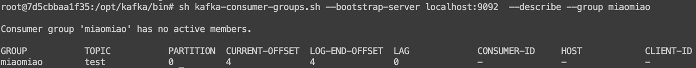

消息积压即消息太多，短时间内处理不过来了，比如你的消费端处理速度是100/s，但是现在消息队列里已经累计了1000万条数据待消费，那么需要10万秒才能消费完，相当于要1天多，在很多业务场景里，这就算是积压了。

> 注意，积压与否，其实并不是一个严格的概念，根据业务不一样，对积压的理解是不一样的，比如要是有一个特定的场景，消费端就是每天凌晨2点拉任务消费，1s能消费10000笔，那么每天积累1000万条数据也可以吃下来，也许在这个团队看来，这就不是积压


针对积压问题，其实乐观一点是在发生前避免，也就是尽可能不让积压发生：

比如做压测，摸清业务的承载能力，合理部署资源，留一定程度的BUFFER；

比如做好相应优化性能，让吞吐能进一步提高，消费能力更高了，积压的可能性自然就更小了；

比如在一些大型活动来临之前，提前安排资源扩容，不打没有准备的仗。

当然，在问题未发生前解决，是比较理想化的，在生产环境中，总会有意想不到的突发情况导致积压，所以积压之后也得有对应的处理手段，首先就是能及时发现。


## 监控告警

通过监控要能自动发现积压，第一时间感知到，比如通过定时服务监测Kafka的队列信息，通过队列信息计算积压情况，具体步骤：

1.在Kafka脚本目录下执行如下脚本

```java
//PS：注意消费者组要提前创建
sh kafka-consumer-groups.sh --bootstrap-server localhost:9092  --describe --group miaomiao
```

即在localhost:9092对应的Kafka服务查看test主题的信息

2.查看结果：



3.分析结果，观察LOG-END-OFFSET和CURRENT-OFFSET这两个字段，LOG-END-OFFSET表示最新消息的偏移量，CURRENT-OFFSET表示当前消费到了哪里，如果CURRENT-OFFSET远小于LOG-END-OFFSET，则可以看作积压了。

> 还是那个观点，具体多少算积压是不一定的，比如每小时只能消费1条消息，那么100完全可以看作积压，比如每秒能处理10000条消息，10w也不算积压，所以阈值是需要业务自己定义的。

及时发现积压之后，我们就要看具体是什么情况，来做对应处理了，下面分析几类常见的问题。


## 异常消息导致的阻塞

如果是顺序消费场景，是依赖每条消息处理成功的，如果某条消息是有问题的，那就会一直堵在这里，就像被放毒了一样。

至于具体是什么问题，这就千奇百怪了，可能是交易依赖某个资源不足，可能是代码存在什么特殊的bug，刚好这笔交易的某个数值触发了这个bug，需要消费服务升级才能解决。

这种异常是直接卡死了整个消息队列，影响比较严重，此时就需要尽快介入，升级消费端代码，将这笔消息合理地处理掉。

> 补充一个案例，有兴趣的同学可以阅读：阿里一个消息积压的分析案例，原因就是消费者线程出 bug 卡住，无法正常消费，导致消息积压：[实战总结｜记一次消息队列堆积的问题排查](https://mp.weixin.qq.com/s/MQdwf4yEl73Br2FvJd5ExQ)


## 非核心模块拖后腿

如果消费链路上还依赖了不那么核心的业务，因为这些业务拉慢了消费速度，在积压情况下，就可以先进行系统降级，也就是砍掉相关逻辑，加快数据消费。

举个例子，我们是一个秒杀消费场景，秒杀消费链路中有个数据统计上报，这个功能并不是核心业务，在需要更高性能时候可以给这个功能停掉，这就要求代码里是具备了对应的开关功能的，可以快速降级。


## 压力超过可承载范围

这种情况是说不是存在异常，也没有非核心模块拖后腿，单纯就是压力过大扛不住了。此时可以做几件事：

1. 快速加资源扩容，加钱解决问题，一般而言都是消费能力跟不上，也就是需要增加消费者对应的资源，这个前提是要你的消费者服务是可以水平扩容的，不然增加机器也没用。

> 这里还需要考虑一个主题的分片数量，一个分片只能被消费者组中的一个Consumer消费，如果消费者组中消费者的数量是和分片持平的，比如当前10个分片，对应了10个消费者，这种情况单独扩容消费者是没用的，还需要对应增加分片数量。当然，假设一开始分片数量就多于消费者，比如10个分片只有2个消费者，这时候扩容8个以内的消费者是不用再额外增加做了分片的。

* 设置中间消费者，放置在真正的消费者和kafka之间，中间消费者不处理消费逻辑，仅仅只是提交offset，同时保证将消息保存到别的地方，比如内存，磁盘，数据库，Redis，其它kafka。这样可以一定程度缓解kafka存储的积压， 注意只是缓解，争取到了一些解决问题的时间，还是得想办法提高消费速度

* 保新。考虑这种场景，因为某个业务做活动，大量消息在几分钟内打入消息队列，积压了几亿条数据，假设你没有钱扩容，按现有能力要处理掉这些消息，需要1小时，然后此时每秒还有其它业务的消息，我们就假设1000/s，此时这些消息一旦进入消息队列，相当于会被前面的积压堵住。<span style="color: inherit; background-color: rgba(255,246,122,0.8)">这时候如果业务允许</span>，其实可以选择保新，即新消息导入到新的消息队列，这样新消息可以得到及时处理，而旧消息，就等1小时之后慢慢消耗掉即可。


## 总结

积压是消息队列非常常见的问题，大概解决思路就是及时发现、解决异常、增加资源、弃车保帅，没有标准答案，具体怎么做完全看业务，重要的是要能掌握解决问题的思路。


