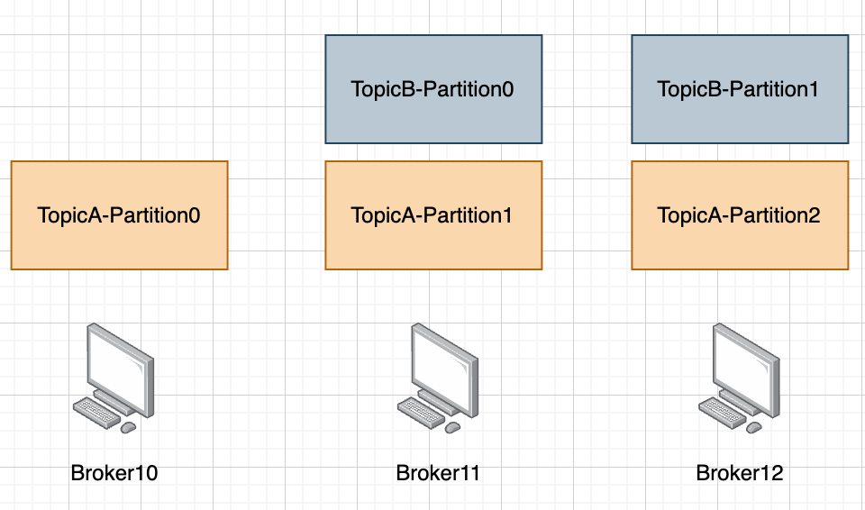

# 1.应用场景

## 1.1 消息队列常见应用场景有哪些？

应用场景很多，比如如下几点：

- 系统解耦：在重要操作完成后，发送消息到Kafka中，由别的服务系统来消费消息完成其他操作
- 流量削峰：一般用于秒杀或抢购活动中，来缓冲系统短时间内高流量带来的压力
- 异步处理：通过异步处理机制，可以把一个消息放入队列中，但不立即处理它，在需要的时候再进行处理
- 消息分发：比如一条消息需要传递给多个服务，这时候就可以用Kafka进行分发

  

## 1.2 什么情况下需要解耦？

比如发送短信场景，模块A发送消息给B，模块B发送短信给客户，A不需要得到回应，对于A而言只需要触达B就行了，这时候就可以引入消息队列，A将消息投递到了消息队列，B自己去处理，A不用再关心。这样可以收获更强的稳定性以及接口性能。

## 1.3 什么情况下需要削峰？

比如一个模块B一瞬间收到100个请求，如果B的承压能力非常差，或者B有什么资源限制，那么这100个请求下来，B可能就挂了或者报错了，这时候就可以引入消息队列，前置服务先将消息打到消息队列，B再根据自己的消费能力逐步消化。

## 1.4 什么情况下需要分发消息？

比如信息更新场景，某个用户信息更新了，而B、C、D三个模块都需要缓存这个信息，那么用户信息更新之后就可以发一条信息到消息队列，B、C、D只要订阅了相关主题，就都可以获得这条信息并做对应的缓存更新。

## 1.5 在项目开发中，你会怎么选择消息队列？

**分析**

要点：要说到从需求（功能性）上考虑，以及性能和稳定性。如果有实战经验的同学也可以说一下基本熟悉成熟做选择，没实战经验的同学可以不一定能完全GET到熟悉是多重要的事情，如果不能很自信的说出来，那不如不说。

**回答**

我会对比常见的几个消息队列，从功能性、性能、健壮性上去做对比，比如如果我们的性能要求非常高，我就会偏向于Kafka和RocketMQ这类性能又高，又自带扩展性的消息队列。

当然还有一个考虑点就是团队技术栈，如果基本要求都满足，会更倾向于选择团队使用成熟的组件。

## 1.6 Kafka和RocketMQ有什么区别

**分析**

问这个问题一般是由于你前面说了你两者都比较熟悉，如果是这样的话你高低得说出一些区别，不然就自相矛盾了。

如果你也没说你熟悉RocketMQ，你可以直接说不熟悉，熟悉一个消息队列其实就够了，面试官一般也不会为难你。

**回答**

**例子1:**

我之前主要都是在研究/使用Kafka，RocketMQ只有一些粗浅的认知，比如RocketMQ可以支持更多的主题，适合于需要非常多主题的场景，以及RocketMQ的功能应该更完善一些，比如天然支持死信队列。

**例子2（熟悉RocketMQ，不怕继续追问的同学）**:

- RocketMQ 和 Kafka 相比，在架构上做了减法，在功能上做了加法
- 跟 Kafka 的架构相比，RocketMQ 简化了协调节点和分区以及备份模型。同时增强了消息过滤、消息回溯和事务能力，加入了延迟队列，死信队列等新特性。

**参考**

[ 消息队列选型](https://ls8sck0zrg.feishu.cn/wiki/NKV2wsYyNiebMykwNaTcnkQSnbe?fromScene=spaceOverview)

[RocketMQ和Kafka区别](https://mp.weixin.qq.com/s/oje7PLWHz_7bKWn8M72LUw)

## 1.7 Kafka的优势是什么？

**分析**

这个问题一定要精炼一点回答，直击要点，像功能列举意义不大，现代消息队列的功能其实都差不多够用，反而Kafka不支持重试队列其实在功能上并不是很好吹。

我认为就抓住Kafka最核心的三点优势：高性能、天然水平扩展、被广泛使用。

**回答**

Kafka优点非常多，我认为最核心的是高吞吐、高可靠、天然支持分片水平扩展，另外还有一个非常重要的考量就是Kafka多年来被广泛使用，并且社区非常活跃，这就意味着它是经过市场验证的好产品。

**参考**

总结性问题，需要整体学完Kafka，其次可以稍微参考下 [ 消息队列选型](https://ls8sck0zrg.feishu.cn/wiki/NKV2wsYyNiebMykwNaTcnkQSnbe?fromScene=spaceOverview)

# 2.服务端

## 2.1 Kafka的大概框架是怎么样的

**分析**

基本问题，考察你对Kafka的架构有没有基础了解。

建议：分层次回答。

**回答**

我们可以先把Kafka宏观看作三层：Producer（生产者），Server（中转者），Consumer（消费者），生产者发送消息，服务端负责存储消息，消费者负责拉取消息。其中服务端其实就是由多个Broker节点组成，而我们平常说的主题就是在Broker节点上，当然，Topic是个逻辑概念，实际物理存储形式是主题分片，也就是Partition。

> 如果对Zookeeper了解并且不怕追问也可以提一嘴一些管理信息是必入Topic/Broker的信息是放Zookeeper的，同时它还帮忙起到选主的作用

**参考**

[ 把控全局，掌握整体架构](https://ls8sck0zrg.feishu.cn/wiki/MHsRwoRnki1kXRkIF0GcM6MCn7e)

## 2.2 如何获取topic主题的列表

**分析**

Kafka是提供了获取主题列表的接口的，如果是使用自带工具，可以用这个命令获取：./kafka-topics.sh --list --bootstrap-server localhost:9092

同样的，因为接口支持了，各个语言的客户端当然也可以获取。

Java和Golang都是用AdminClient获取，Java例子：

```java
import org.apache.kafka.clients.admin.AdminClient;
import org.apache.kafka.clients.admin.AdminClientConfig;
import org.apache.kafka.clients.admin.ListTopicsOptions;

import java.util.Collections;
import java.util.Map;
import java.util.Properties;
import java.util.concurrent.ExecutionException;

public class KafkaTopicLister {

    public static void main(String[] args) {
        // Kafka broker 地址
        String brokerAddress = "localhost:9092";

        // 配置 KafkaAdminClient
        Properties properties = new Properties();
        properties.put(AdminClientConfig.BOOTSTRAP_SERVERS_CONFIG, brokerAddress);

        try (AdminClient adminClient = AdminClient.create(properties)) {
            // 获取主题列表
            ListTopicsOptions options = new ListTopicsOptions();
            options.listInternal(false); // 是否列出内部主题
            adminClient.listTopics(options).names().get().forEach(System.out::println);
        } catch (InterruptedException | ExecutionException e) {
            e.printStackTrace();
        }
    }
}
```

Golang例子：

```go
package main

import (
    "fmt"
    "github.com/confluentinc/confluent-kafka-go/kafka"
)

func main() {
    // Kafka broker 地址
    broker := "localhost:9092"

    // 创建新的 Kafka admin client
    adminClient, err := kafka.NewAdminClient(&kafka.ConfigMap{"bootstrap.servers": broker})
    if err != nil {
        panic(fmt.Sprintf("Failed to create Admin client: %s", err))
    }
    defer adminClient.Close()

    // 获取主题列表
    metadata, err := adminClient.GetMetadata(nil, true, 10000)
    if err != nil {
        panic(fmt.Sprintf("Failed to get metadata: %s", err))
    }

    // 打印主题列表
    fmt.Println("Topics:")
    for _, topic := range metadata.Topics {
        fmt.Println(topic.Topic)
    }
}
```

**回答**

Kafka是提供了获取主题列表的接口的，可以使用kafka-topics.sh 这个工具获取，如果要在我们业务服务来获取的话，那主流语言都是支持获取的，比如Java和Golang，都可以用KafkaAdminClient直接调用接口来获取。

**参考**

[ 开门见山，从Topic开始讲起](https://ls8sck0zrg.feishu.cn/wiki/AUN5wnNzqixiz5kuUaRcuEnfnme)

## 2.3 有了Topic，为何还要Partition / Kafka 为什么要把消息分区

**分析**

Kafka消息会分发到不同Topic，这样既解决了消息混乱的问题，又顺带将流量进行了分摊，减少单个业务写入压力。

但是，不同业务对应的数据量级是不一样的，就算按业务分了Topic，但一个Topic可能信息还是会非常多，我们需要进一步分而治之，所以Topic下面还划分了Partition来实际存储，每个Topic都可以有多个Partition。

**回答**

**示例1（简洁回答）:**

一般而言一个业务可以用一个主题，但是就算分了Topic，单个业务的信息还是可能会非常多，所以需要能进一步进行分治，也就是一个主题由多个Partition组成，这样相同的主题也具备了更高的并发度。

**示例2（细致一点回答）:**

- 如果不进行分区，那么我们发消息写数据都只能保存到一个节点上，这样的话可能会导致单点服务器负载过高的问题，通过分区可以把数据均匀地分布到不同的节点。因此，分区带来了负载均衡和横向扩展的能力。
- 发送消息时可以根据分区分配的原则落在不同的Kafka服务器节点上，提升了并发写消息的性能，消费消息的时候又和消费者绑定了关系，可以从不同节点的不同分区消费消息，提高了读消息的能力。
- 另外一个就是分区又引入了副本，冗余的副本保证了Kafka的高可用和高持久性。

**参考**

[ 开门见山，从Topic开始讲起](https://ls8sck0zrg.feishu.cn/wiki/AUN5wnNzqixiz5kuUaRcuEnfnme?fromScene=spaceOverview)

[ 分而治之，主题分片Partition](https://ls8sck0zrg.feishu.cn/wiki/WswtwhbKhi7oKyk2AtncQMnYnwh?fromScene=spaceOverview)

## 2.4 Partition是逻辑概念还是物理概念？

**分析**

逻辑概念就是说是一个抽象概念，没有实际体现在物理存储上，物理概念则是相反的，Topic只是逻辑概念，Partition则是一个实实在在的物理存储概念。

**回答**

Partition是物理概念，因为数据实实在在是写入到Partition文件里去的。而因为设计了Partition的存在，Topic就只是一个逻辑概念了。

**参考**

[ 开门见山，从Topic开始讲起](https://ls8sck0zrg.feishu.cn/wiki/AUN5wnNzqixiz5kuUaRcuEnfnme?fromScene=spaceOverview)

[ 分而治之，主题分片Partition](https://ls8sck0zrg.feishu.cn/wiki/WswtwhbKhi7oKyk2AtncQMnYnwh?fromScene=spaceOverview)

## 2.5 介绍一下分区的分配策略

**分析**

我们可以关注消费端partition.assignment.strategy这个配置，它有如下几种选择：

1. Range Assignor：基于范围的分配策略，将分区按照范围分配给消费者。
2. RoundRobin Assignor：基于轮询的分配策略，分区均匀地分配给消费者。
3. Sticky Assignor：优先保持当前的分配状态，并尽量减少在再平衡过程中的分区移动。
4. CooperativeStickyAssignor：和Sticky Assignor的策略是一样，区别在于未受变动的消费者可以继续消费主题

**回答**

1. Range Assignor：基于范围的分配策略，将分区按照范围分配给消费者。
2. RoundRobin Assignor：基于轮询的分配策略，分区均匀地分配给消费者。
3. Sticky Assignor：优先保持当前的分配状态，并尽量减少在再平衡过程中的分区移动。
4. CooperativeStickyAssignor：和Sticky Assignor的策略是基本一样的，区别在于该协议将原来的一次大的全部分区重平衡，改成多次小规模分区重平衡。简单理解就是渐进式重平衡。

## 2.6 Kafka 创建 Topic 时如何将分区放置到不同的 Broker 中

**分析**

Partition是存放在Broker节点上的，如果单个Broker，很好理解，Partition都在Broker上。

如果是多个Broker，则Partition会分布到不同的Broker上，简单来说，一个Partition只对应一个Broker，一个Broker可以存放多个Partition。



回顾了这个知识之后，那么剩下的就是直接讲述分配规则了。

**回答**

具体而言某个Topic的Partition分配的规则如下，我们以2个Partition的TopicB举例：

1.先随机选取一个Broker，比如Broker11

2.将主题对应的第一个分片，放入Broker11，即TopicB的0号分片放到了Broker11

3.依次往后放TopicB后续的分片，比如TopicB的1号分片放入了Broker12，TopicB在我们的例子中只有2个Partition，假设有3个，那么下一个就放到Broker10

总结一下规则就是kafka是先随机挑选一个broker放置分区0，然后再按顺序放置其他分区

**参考**

[ 坚如磐石，服务器节点Broker](https://ls8sck0zrg.feishu.cn/wiki/UGREw1wsYiJxAAkKMTvcAxWxnEc)

## 2.7 消息存入哪个Partition的规则 / Kafka 中分区分配的原则

**分析**

可以说是Partition常识性问题，把规则说清楚就好了，有疑问的同学看看下面参考资料。

**回答**

一个主题的数据分散成了多个分片，我们就需要有一种方式来决定消息是写入哪个分片，规则如下：

1.如果指定了Partition，那么就是发送到特定的Partition，但是一般情况下，业务其实不需要感知Partition，除非有特殊理由，否则不建议直接指定要发送到哪个Partition；

2.如果没有指定Partition，但是指定了一个Key，那么就是根据Key的Hash对Partition数目取模来决定是哪个Partition，也就是说只要发送时指定了相同的Key，那么相关消息一定会发送到相同的Partition。

3.如果没有指定Partition，也没有指定Key，那么就采取轮询调度算法，也就是每一次把来自用户的请求轮流分配给Partition。

**参考**

[ 分而治之，主题分片Partition](https://ls8sck0zrg.feishu.cn/wiki/WswtwhbKhi7oKyk2AtncQMnYnwh)

## 2.8 Kafka服务端可接收的消息最大默认多少字节，如何修改

**分析**

知道有个配置可以修改，并且记住默认配置即可。记不住英文名就说消息最大字节数这个配置。

**回答**

Kafka可以接收的最大消息默认为1MB，如果想调整它的大小，可在Broker中修改配置参数：message.max.bytes的值。

**参考**

官方文档[Apache Kafka](https://kafka.apache.org/documentation/)搜索message.max.bytes就能看到

## 2.9 Kafka 的Topic中 Partition 数据是怎么存储到磁盘的

**分析**

考察Partition存储相关知识，没有太多技巧，直接阐述即可

**回答**

Topic 中的多个 Partition 以文件夹的形式保存到 Broker，每个分区序号从0递增，且消息有序。Partition 文件下有多个Segment（xxx.index，xxx.log），Segment文件的大小是可以进行配置的。默认为1GB。如果大小大于1GB时，会滚动一个新的Segment并且以上一个Segment最后一条消息的偏移量命名。

**参考**

[ 高性能秘诀-多层次](https://ls8sck0zrg.feishu.cn/wiki/L3JgwhGfRiQUaxkRUUhcmxU0nDe?fromScene=spaceOverview)

## 2.10 Kafka如何清理数据/Kafka数据越积越多怎么办

**分析**

对Kafka的原理进行一些考察，无论是任何组件，其实都会遇到控制存储空间的问题，即数据满了怎么清理，像Redis是有对应的内存淘汰算法，而Kafka也有特定的保留策略。

**回答**

可以用基于时间的保留策略，这种策略允许用户指定消息的保留时间（如 7 天）。超过指定时间的消息将被自动删除。

也可以用基于大小的保留策略，Kafka 允许用户指定日志的最大尺寸。一旦日志的大小超过了配置的值，Kafka 将开始删除最早的消息。

**参考**

[ Kafka消息保留策略](https://ls8sck0zrg.feishu.cn/wiki/CFaSwBux8imVlekeST5cnEe7nhe?fromScene=spaceOverview)

# 3.生产者

## 3.1 介绍一下生产消息的流程

**分析**

考察生产者基础，回答要点：1.生产者是在业务服务器那一侧 2.讲述生产消息的流程。

**回答**

生产消息是发生在业务服务器那一侧，看似简单，其实也分了好几步来做。

第一步是构建消息，即将要发送的内容，打包成一个Kafka的消息结构；

第二步是序列化消息为二进制内容，以在网络中传输

第三步是进行分区选择，即计算要发到哪个Partition，发送消息到该Partition对应的Broker

**参考**

[ 辛勤创造，生产者Producer](https://ls8sck0zrg.feishu.cn/wiki/OVE3wagUaii4A6k4X7Pcyw0Ynfb?fromScene=spaceOverview)

## 3.2 讲一讲kafka的ack的三种机制

**分析**

|acks |行为 |可靠 |性能 |
|---|---|---|---|
|0 |生产者在发送消息后不会等待来自服务器的确认，所以生产者实际是不知道消息是否成功，也就无从去重试，生产可靠性是最低的 |不可靠 |最高 |
|1 |生产者会在消息发送后等待主节点的确认，但不会等待所有副本的确认 |相对可靠 |还是比较高的 |
|all或-1 |只有在所有副本都成功写入消息后，生产者才会收到确认。这确保了消息的可靠性，但延迟显然是最高的 |可靠 |会低一些<br /> |

文字看着策略可能会比较枯燥，我们可以进一步结合这个图来理解（其中实线箭头表示需要操作完成，虚线箭头表示不用等待操作完成）：


**回答**

第一种模式，ack=0，生产者在发送消息后不会等待来自服务器的确认，所以生产者实际是不知道消息是否成功，也就无从去重试，生产可靠性是最低的。

第二种模式，ack=1，生产者会在消息发送后等待主节点的确认，但不会等待所有副本的确认。

第三种模式，ack=all，只有在所有副本都成功写入消息后，生产者才会收到确认。这确保了消息的可靠性，但延迟显然是最高的

**参考**

[ 如何保证消息不丢失](https://ls8sck0zrg.feishu.cn/wiki/GnrnwtEJEiM8qqkmEOkc7arinBb)

## 3.3 生产过程中何时会发生QueueFullExpection以及如何处理

**分析**

生产者发送消息的速度过快，导致生产者这一侧缓冲区满了，就会抛出QueueFullExpection这个错误。

处理方式：直接对症下药就可以，参见回答。

**回答**

生产者发送消息的速度过快，导致生产者这一侧缓冲区满了，我们有几条路去解决：

- 等待重试：当发生QueueFullException异常时，可以等待一段时间后再次尝试发送消息。在等待的过程中，可以通过调整生产者的发送速度或者增加Kafka的消息队列大小等方式来避免再次发生QueueFullException异常。
- 增加Kafka的缓冲区大小：可以通过修改Kafka的配置文件来增加缓冲区的大小，以适应生产者发送消息的速度。
- 限流控制：可以通过限制生产者发送消息的速度来避免QueueFullException异常的发生。

**参考**

[ 高性能秘诀-批量操作](https://ls8sck0zrg.feishu.cn/wiki/ZTxkwgpJ9ihXdMkHP7BcnDHSnNc)搜buffer.memory

## 3.4 Kafka 生产者何时发出消息

**分析**

对缓冲区参数的考察，没啥讨论，直接描述即可

**回答**

- 累计的数据大小达到Batch大小，默认16KB
- 缓冲区中累计的空闲等待时间间隔，默认0ms，也就是默认收到数据就发送

通过增加 Batch 的大小，可以减少网络请求和磁盘I/O的频次，具体参数配置需要在效率和时效性做一个权衡。

**参考**

[ 高性能秘诀-批量操作](https://ls8sck0zrg.feishu.cn/wiki/ZTxkwgpJ9ihXdMkHP7BcnDHSnNc)搜buffer.memory

## 3.5 生产者发送消息的模式有几种（Java）

**分析**

Java的SDK支持三种发送模式

1.同步发送，这种方式会阻塞调用线程，直到消息发送成功或抛出异常。适用于需要确保消息发送成功后才进行后续处理的场景。这种速度会慢一些，但是可以很准确知道发送是否成功。

```java
try {
    kafkaTemplate.send("topicName", "message").get();
} catch (InterruptedException | ExecutionException e) {
    e.printStackTrace();
}
```

2.发送即忘（Fire-and-forget）**，**发送了就不管了，这种方式是最简单的发送方式。消息发送后不等待任何响应，也不处理可能的异常，示例：

```java
kafkaTemplate.send("topicName", "message");
```

3.异步发送，发送了就做其它事情去了，这种方式不会阻塞调用线程，而且可以注册回调函数来处理发送结果或异常。示例：

```java
ListenableFuture<SendResult<String, String>> future = kafkaTemplate.send("topicName", "message");
future.addCallback(new ListenableFutureCallback<SendResult<String, String>>() {@Overridepublic void onSuccess(SendResult<String, String> result) {
        System.out.println("Sent message=["message + "] with offset=["result.getRecordMetadata().offset() + "]");
    }@Overridepublic void onFailure(Throwable ex) {
        System.out.println("Unable to send message=["          + message + "] due to : "ex.getMessage());
 }
});
```

**回答**

有三种模式，同步发送、发送即忘、异步发送。

- 同步发送性能最差，但是可靠性最强。
- 发送即忘性能最高，这种模式不需要等待 Kafka 服务器的响应，所以可靠性低，也不知道是不是发送成功了
- 异步发送不阻塞调用线程，同时允许调用者处理发送结果或异常。适用于对消息传输可靠性有要求，同时希望保持高性能的场景。

<span style="color: rgb(143,149,158); background-color: inherit">如果有参与过相关项目，可以加如下一段话，展示自己是有实际经验的</span>

其中异步发送模式因为兼顾（折中）了可靠性和性能，所以是最被广泛使用的，我在实习/工作中参与的xxx项目、xxx项目，都是用的异步发送模式。

**参考**

[ 辛勤创造，生产者Producer](https://ls8sck0zrg.feishu.cn/wiki/OVE3wagUaii4A6k4X7Pcyw0Ynfb?fromScene=spaceOverview)

# 4.消费者

## 4.1 Kafka 消费者是推模式还是拉模式/Kafka 消息的消费模式

**分析**

Kafka的消费者使用的拉模式来获取信息，也就是说每次消费者是发消息到Kafka的Broker来获取信息，而不是由Kafka的Broker主动推送。

选择拉模式的主要原因还是为了让消费者可以按自身情况来控制消费速度，根据系统资源利用情况（如 CPU、内存等）、业务需要等因素合理拉取消息，避免因消息处理速度不合理带来的资源浪费或过载。

**回答**

Kafka采用拉模式拉取消息，采用拉模式可以使每个消费者以自身的消费能力去消费。拉模式有个缺点是，如果Broker没有可供消费的消息，将导致Consumer不断在循环中轮询，直到新消息到达。为了避免这点，kafka消费者可以使用在消费数据时传入timeout参数，在这个时间范围内进行阻塞等待，直到有数据或超时后再返回。

**参考**

[ 努力承接，消费者Comsumer](https://ls8sck0zrg.feishu.cn/wiki/QTLdwzoXFiX39lkZDPhcGsUqnHe?fromScene=spaceOverview)

## 4.2 消费者故障，出现活锁问题如何解决？

**分析**

首先要理解什么是活锁：

消费者持续的维持心跳，但因为异常进行消息处理，或者消息处理非常长时间卡住了，这种情况下，这个消费者在就会一直持有分区，该分区的消息就无法得到处理。

要解决这个问题，需要有活锁检测机制。

**回答**

可以使用最大拉取间隔这个参数来解决活锁问题，即max.poll.interval.ms，如果消费者轮询间隔大于了这个值，消费者就会离开分区，这样其它消费者就可以接管对应分区。

> 对于消息处理时间不可预测的情况，还有个办法就是将消息处理移到另一个线程中，也就是说轮询一个线程，处理单独开线程，不影响轮询节奏。
>
> 用这个方式要注意确保已提交的 offset 不超过实际处理到的位置。 另外，你必须禁用自动提交，并只有在线程完成处理后才为记录手动提交偏移量。

**参考**

[ 努力承接，消费者Comsumer](https://ls8sck0zrg.feishu.cn/wiki/QTLdwzoXFiX39lkZDPhcGsUqnHe?fromScene=spaceOverview)

## 4.3 有消费者为什么还要消费者组？

**分析**

考察对消费者组的理解，可以用一句话笼统介绍，再列举下消费者组解决了什么问题。

**回答**

消费组其实就是把多个消费者组织在一起进行消费。我觉得解决了几个问题吧：

1.对主题分片的分配问题，让每个分片都能有消费者处理，又不至于所有消费者处理同一个分片

2.面对主题分片的变化，消费组可以自动调整，也就是再平衡

3.对于业务开发者而言，有了消费组，就只用关心主题维度，而不用关心分片维度，很大程度降低了理解和应用难度

**参考**

[ 努力承接，消费者Comsumer](https://ls8sck0zrg.feishu.cn/wiki/QTLdwzoXFiX39lkZDPhcGsUqnHe?fromScene=spaceOverview)

## 4.4 介绍一下再平衡机制

**分析**

首先要大体介绍一下，表示这个机制的核心目的你是知道的，其次可以介绍一下平衡策略，尽量说得随意点，不要像背书一样。

**回答**

消费者组再平衡是一个关键机制，用于管理和分配主题分区给消费者组中的各个消费者。再平衡过程可以确保数据负载在消费者之间均匀分布，并在消费者加入或离开时自动调整分区的分配。我记得是有几个分区策略可以选择的，

分别是范围分配，轮询分配，粘性分配，合作粘性分配，其中合作粘性分配和粘性分配一样都是尽可能减少变动，不同点是合作粘性分配下，是把大的分区平衡分为多次小规模的分区平衡，以尽可能减少影响。

**参考**

[ 拥抱变化，消费组再平衡机制](https://ls8sck0zrg.feishu.cn/wiki/HDMvwzerfiqMZ0ktTAdcFQjnnDg?fromScene=spaceOverview)

## 4.5 Kafka什么情况下会Rebalance

**分析**

再平衡基本问题，列举情况即可。

**回答**

当kafka遇到如下三种情况的时候，kafka会触发Rebalance机制：

1. 新消费者加入：当一个新的消费者加入消费者组时，Kafka需要重新分配分区，以包括新的消费者。
2. 消费者离开：当一个消费者离开（无论是正常关闭还是崩溃）时，需要重新分配该消费者负责的分区给其他消费者。
3. 主题分区变化：当主题的分区数量发生变化时（例如，增加新的分区），Kafka需要重新分配这些分区。

**参考**

[ 拥抱变化，消费组再平衡机制](https://ls8sck0zrg.feishu.cn/wiki/HDMvwzerfiqMZ0ktTAdcFQjnnDg)

## 4.6 Rebalance有什么影响

**分析**

列举一下影响，最好再提下解决方案，当然，也可以不提等他追问，酌情处理。

**回答**

1.重复消费，如果某个消费者离开消费组时还没来得及提交Offset，当再平衡之后，接盘对应分区的消费者就会重复消费，浪费资源。

2.性能变差，上面介绍了再平衡是需要相对复杂的流程去实施的，在实施再平衡的这个过程中，消费速度也会受到影响

所以我们需要避免频繁再平衡，业务需要导致的变化我们管不了，但我们可以调节心跳相关参数，避免存活误判导致的再平衡。

> 如果追问可以介绍关注如下参数：
>
> session.timeout.ms： 一次session的连接超时时间，也就是说超过这个时间没心跳就会判定消费组超时，触发再平衡，如果想避免误判，<span style="color: inherit; background-color: rgba(255,246,122,0.8)">这个时间可以设置稍微大一些</span>，比如5s、10s
>
> heartbeat.interval.ms： 心跳时间，如果设置过大，就容易触发频繁再平衡，比如session.timeout.ms设置为10s，如果你心跳时间也是设置为10s，那很容易就超时了，一般都要保证在超时时间之内，<span style="color: inherit; background-color: rgba(255,246,122,0.8)">至少有3-5次心跳机会</span>，比如这里可以设置为3s、4s、5s。
>
> max.poll.interval.ms：可以调节这个参数避免活锁问题，Consumer消费时间过长超过这个参数，会导致Coordinator错误地认为“已停止”从而被“踢出”Group

**参考**

[ 拥抱变化，消费组再平衡机制](https://ls8sck0zrg.feishu.cn/wiki/HDMvwzerfiqMZ0ktTAdcFQjnnDg)

## 4.7 介绍一下重平衡的具体执行流程？

**分析**

问流程也就是问发生重平衡时要做哪几件事情。

有5个步骤，依次是：

1. 暂停消费：在再平衡过程中，消费者会暂停对消息的消费，以防止在重新分配期间发生数据丢失或重复。
2. 触发再平衡：由消费者组协调器（通常是Kafka集群中的一个Broker）触发再平衡。
3. 重新分配分区：协调器根据当前消费者组的成员重新分配主题的分区。
4. 通知消费者：重新分配完成后，协调器会通知所有消费者新的分配情况。
5. 恢复消费：消费者收到新的分配后，恢复消费，开始处理被分配到的新分区。

回答时候可以相对精炼点。

**回答**

我理解有如下几个步骤。

首先是暂停消费，其作用是防止在重新分配期间发生数据丢失或重复，接着由消费组协调器触发再平衡，进而重新分配分区，最后就是开启消费，简单来说就是通知消费者，然后消费者就可以恢复消费了。

**参考**

[ 拥抱变化，消费组再平衡机制](https://ls8sck0zrg.feishu.cn/wiki/HDMvwzerfiqMZ0ktTAdcFQjnnDg?fromScene=spaceOverview)

## 4.8 介绍一下重平衡时的分区策略

**分析**

分区策略（也被叫做分区协议）由partition.assignment.strategy这个参数配置，回顾一下，它有如下几种选择：

1. Range Assignor：基于范围的分配策略，将分区按照范围分配给消费者。
2. RoundRobin Assignor：基于轮询的分配策略，分区均匀地分配给消费者。
3. Sticky Assignor：优先保持当前的分配状态，并尽量减少在再平衡过程中的分区移动。
4. CooperativeStickyAssignor：和Sticky Assignor的策略是一样，区别在于未受变动的消费者可以继续消费主题

从再平衡的视角，这几种分区策略大的来说其实可以分为两个“阵营”，一个叫Eager Rebalance，一个叫Incremental Rebalance，我们回答也按这两大阵容来展开，显得有层次感。

**回答**

大的方向分两类。

第一类是急切再平衡（Eager Rebalance）。Range Assignor、RoundRobin Assignor、Sticky Assignor都属于Eager Rebalance，可以理解为急切的再平衡，因为它太过急切，所以顾不得那么多，为了快点搞定这件事，一旦开启再平衡所有消费者都会停止从  Kafka 消费并放弃其分区的成员资格。

第二类是增量再平衡（Incremental Rebalance），CooperativeStickyAssignor这个2.3版本之后引入的优化策略就属于这一类，在此模式下，只有部分分区会从某个消费者移动到另外一个消费者，其它不受重新平衡影响的 Kafka 消费者可以继续处理数据而不会中断。

<span style="color: rgb(143,149,158); background-color: inherit">此处可停顿下，如果感觉面试官还有兴趣的话，可以继续讲下面这段话</span>

当然，这样一次执行下来可能分配个数是不均匀的，所以整个消费者组可以经历多次重新平衡，直到找到稳定的分配，因此称为增量重新平衡，可以理解为一点一点地来寻求重平衡。

相比于急切重平衡，优点在于消费不会全部暂停，且消费者的分配关系变动较小，当然付出的代价就是完成再平衡的时间可能会更久一些。

**参考**

[ 拥抱变化，消费组再平衡机制](https://ls8sck0zrg.feishu.cn/wiki/HDMvwzerfiqMZ0ktTAdcFQjnnDg)

## 4.9  解释下Kafka中位移（offset）的作用

**分析**

基础问题，但是十分重要，要是这个问题都答不上，会让人觉得你完全不懂Kafka。

**回答**

每条消息在Kafka中会有Partition ID以及OFFSET，通过这两个信息就可以定位到一条消息。消费者组消费消息之后会提交它在某个Partition对应的OFFSET，这样子下一次就可以从这个位置开始消费。

**参考**

[ 努力承接，消费者Comsumer](https://ls8sck0zrg.feishu.cn/wiki/QTLdwzoXFiX39lkZDPhcGsUqnHe)

## 4.10 如何控制消费的位置

**分析**

和上一条一样，也是考察Offset，只是换了一种问法，要能识别

**回答**

每条消息在Kafka中会有Partition ID以及OFFSET，通过这两个信息就可以定位到一条消息。消费者组消费消息之后会提交它在某个Partition对应的OFFSET，这样子下一次就可以从这个位置开始消费。

**参考**

[ 努力承接，消费者Comsumer](https://ls8sck0zrg.feishu.cn/wiki/QTLdwzoXFiX39lkZDPhcGsUqnHe)

## 4.11 Consumer默认从哪里开始消费

**分析**

如果已经Consumer在对应分区提交了偏移，Kafka Consumer会从提交偏移之后开始消费。

如果是一个未提交过偏移的Consumer（比如新加入），Kafka默认根据消费者客户端参数 auto.offset.reset 的配置来决定从何处开始进行消费，这个参数的默认值为 “latest” 。auto.offset.reset 的值可以为 earliest、latest 和 none 。

**回答**

默认从提交偏移之后的位置开始消费，如果没有提交过偏移，那么会根据auto.offset.reset这个配置决定从哪里开始消费，默认是latest，消费者将从当前最新的数据开始读取，如果业务需要，还可以选择从最早的偏移开始读取。

**参考**

了解下auto.offset.reset配置即可。

> auto.offset.reset 是 Apache Kafka 中消费者配置的一部分，用于指定消费者在没有初始偏移量（offset）或当前偏移量在服务器上不存在的情况下应如何处理的策略。这个配置参数有三个可能的值：
>
> 1. **latest**: （默认值）消费者将从最新的偏移量开始读取。这意味着它将开始从消息流的末尾读取数据。
> 2. **earliest**: 消费者将从最早的偏移量开始读取。这意味着它将从消息流的开头读取所有数据。
> 3. **none（很少用到）**: 如果找不到先前的偏移量且没有定义的偏移量，消费者将抛出一个异常。这种情况下，需要确保在启动消费者前，明确定义要消费的偏移量。

## 4.12 Consumer怎么手动指定开始消费偏移

**分析**

无论是Java还是Golang都可以指定Offset进行消费，具体方法或函数有个大概了解即可。

**回答**

**Java示例** ：

Java客户端有方法能指定开始消费的Offset，函数名应该就是seek，将希望的偏移量传入这个方法即可。

**Golang示例** ：

Golang客户端有方法能指定开始消费的Offset，我之前有使用过confluent的kafka库，方法名应该就是Assign，将希望的偏移量传入这个方法即可。

**参考**

**Java参考：**

```java
import org.apache.kafka.clients.consumer.ConsumerRecord;
import org.apache.kafka.clients.consumer.ConsumerRecords;
import org.apache.kafka.clients.consumer.KafkaConsumer;
import org.apache.kafka.common.TopicPartition;

import java.time.Duration;
import java.util.Collections;
import java.util.Properties;

public class KafkaConsumerExample {

    public static void main(String[] args) {
        // 配置Kafka消费者
        Properties props = new Properties();
        props.put("bootstrap.servers", "localhost:9092");
        props.put("group.id", "test-group");
        props.put("key.deserializer", "org.apache.kafka.common.serialization.StringDeserializer");
        props.put("value.deserializer", "org.apache.kafka.common.serialization.StringDeserializer");

        // 创建消费者
        KafkaConsumer<String, String> consumer = new KafkaConsumer<>(props);

        // 订阅主题和分区
        String topic = "test-topic";
        TopicPartition partition = new TopicPartition(topic, 0); // 假设使用分区0
        consumer.assign(Collections.singletonList(partition));

        // 指定偏移量
        long offsetToStart = 10L; // 从偏移量10开始消费
        consumer.seek(partition, offsetToStart);

        // 消费消息
        try {
            while (true) {
                ConsumerRecords<String, String> records = consumer.poll(Duration.ofMillis(100));
                for (ConsumerRecord<String, String> record : records) {
                    System.out.printf("offset = %d, key = %s, value = %s%n", 
                            record.offset(), record.key(), record.value());
                }
            }
        } finally {
            consumer.close();
        }
    }
}
```

**Golang参考：**

```go
package main

import (
    "fmt"
    "log"

    "github.com/confluentinc/confluent-kafka-go/kafka"
)

func main() {
    // Kafka 配置
    config := &kafka.ConfigMap{
        "bootstrap.servers": "localhost:9092",
        "group.id":          "your-group-id",
        "auto.offset.reset": "earliest",
    }

    // Kafka 消费者
    consumer, err := kafka.NewConsumer(config)
    if err != nil {
        log.Fatalf("Error creating Kafka consumer: %v", err)
    }
    defer consumer.Close()

    // 订阅 topic
    topic := "your-topic"
    err = consumer.Subscribe(topic, nil)
    if err != nil {
        log.Fatalf("Error subscribing to topic: %v", err)
    }

    // 手动设置 offset
    partition := int32(0)
    offset := kafka.Offset(10) // 指定的 offset
    err = consumer.Assign([]kafka.TopicPartition{{Topic: &topic, Partition: partition, Offset: offset}})
    if err != nil {
        log.Fatalf("Error assigning topic partition: %v", err)
    }

    // 消费消息
    for {
        msg, err := consumer.ReadMessage(-1)
        if err == nil {
            fmt.Printf("Consumed message offset %d: %s\n", msg.TopicPartition.Offset, string(msg.Value))
        } else {
            fmt.Printf("Error consuming message: %v\n", err)
        }
    }
}
```

## 4.13Kafka消费消息是推还是拉？

**分析**

很重要、也很常规的问题，回答这个问题可以按先结论后论述的范式：

1.直接点出答案，是拉模式

2.分析一下为什么Kafka选择拉模式而不是推模式，也就是说一下拉模式的优势

**回答**

Kafka的消费者使用的拉模式来获取信息，也就是说每次消费者是发消息到Kafka的Broker来获取信息，而不是由Kafka的Broker主动推送。

选择拉模式的主要原因还是为了让消费者可以按自身情况来控制消费速度，根据系统资源利用情况（如 CPU、内存等）、业务需要等因素合理拉取消息，避免因消息处理速度不合理带来的资源浪费或过载。

**参考**

[ 努力承接，消费者Consumer](https://ls8sck0zrg.feishu.cn/wiki/QTLdwzoXFiX39lkZDPhcGsUqnHe?fromScene=spaceOverview)

## 4.14 Kafka消费者提交之后就会清理掉数据吗

**分析**

这个问题是说消息生产到Broker之后，如果被消费者消费了，消费者正常提交了偏移，这条数据作为被处理过的数据是不是就会在Broker被删掉？

典型的钓鱼性问题，如果回答说是，基本就可以认为你对Kafka毫无理解了。

**回答**

在Kafka中，如果消息被消费者消费并提交了对应偏移，这条消息不会被删除，可以通过更改该消费者的偏移再次消费，也可以被其它消费者消费（只要消费者消费偏移不超过该消息对应的偏移）。

**参考**

[ 努力承接，消费者Consumer](https://ls8sck0zrg.feishu.cn/wiki/QTLdwzoXFiX39lkZDPhcGsUqnHe?fromScene=spaceOverview)

# 5.实践经验

## 5.1 Kafka 中什么情况下会出现消息丢失的问题

**分析**

从消息流转环节分析，分别考虑生产环节、存储环节、消费环节

**回答**

消息生产时如果设置的acks不是全部副本，那么如果在follower副本未完成同步之前，leader副本挂掉了，消息就会丢失。存储时如果没有用多副本备份，消息也可能会丢失。最后就是消费时，如果没有确认消费成功再提交offset，而这时候消费者又挂掉了，那么消息同样会丢失。

**参考**

[ 如何保证消息不丢失](https://ls8sck0zrg.feishu.cn/wiki/GnrnwtEJEiM8qqkmEOkc7arinBb?fromScene=spaceOverview)

## 5.2 Kafka 如何保证消息不丢失

**分析**

从消息流转环节分析，分别考虑生产环节、存储环节、消费环节来看。

**回答**

示例1（抓住核心总结性回答，面试官感兴趣的话会追问的）:

首先为主题分区配置好多副本，并且设置写入acks参数为全部副本，最后就是消费时候一定要确认消费成功再提交offset，这样即使消费者挂掉了，重启之后也能拉到原来那条未成功消费的消息。

如果是Java同学，也可以提一下发送消息要用带回调的方法，并且重试次数设置得大一些，比如10以上，避免瞬时抖动带来的失败。

**参考**

[ 如何保证消息不丢失](https://ls8sck0zrg.feishu.cn/wiki/GnrnwtEJEiM8qqkmEOkc7arinBb?fromScene=spaceOverview)

## 5.3 **MQ**消息积压了怎么办

**分析**

三板斧：扩容、降级、排查异常

**回答**

- 如果分区数大于消费者数量，那么通过扩容消费端的实例数来提升总体的消费能力；如果相等，那么既需要扩容消费者数量同时需要扩容分区数。
- 如果短时间内没有足够的服务器资源进行扩容，可以考虑将系统降级，通过关闭一些不重要的分支业务，让系统还能正常运转，服务一些重要业务。
- 还有一种不太常见的情况，你通过监控发现，无论是发送消息的速度还是消费消息的速度和原来都没什么变化，这时候你需要检查一下你的消费端，是不是消费失败导致的一条消息反复消费这种情况比较多，这种情况也会拖慢整个系统的消费速度。如果监控到消费变慢了，你需要检查你的消费实例，分析一下是什么原因导致消费变慢。优先检查一下日志是否有大量的消费错误，如果没有错误的话，可以通过打印堆栈信息，看一下你的消费线程是不是卡在什么地方不动了，比如触发了死锁或者卡在等待某些资源上了。

**参考**

[ 消息积压怎么办](https://ls8sck0zrg.feishu.cn/wiki/MYzZw8MtUiLJIOkS9PSc7X4Ancc?fromScene=spaceOverview)

## 5.4 Kafka 如何保证消息不重复消费

**分析**

**kafka出现消息重复消费的原因：**

- 消费者宕机、重启或者被强行kill进程，导致消费者消费的offset没有提交，恢复正常后可能会重复消费。
- 由于消费者端处理业务时间长导致会话超时，那么就会触发reblance重平衡，此时可能存在消费者offset没提交，会导致重平衡后重复消费。

要注意重复是不可避免的，重要的是保证不产生重复影响，即消费端需要保证幂等性。

**回答**

消费逻辑需要是幂等的，保证不产生重复影响，实现方式很多，比如MySQL设置唯一索引、额外使用记录表来判重等方式。

**参考**

[ 如何让消息不重复](https://ls8sck0zrg.feishu.cn/wiki/KrNGwaj5oi3P9vk7MxocvAWWnOO?fromScene=spaceOverview)

[ 后端场景优化-接口幂等性](https://ls8sck0zrg.feishu.cn/wiki/AFiVwuCfhiT86dkG9PyclDYOn9M?fromScene=spaceOverview)

## 5.5 Kafka 如何实现精准一次语义

**分析**

至少一次+最多一次，不重复+不丢失

**回答**

本质就是不重复+不丢失。不重复的核心是幂等消费。不丢失的核心是为主题分区配置好多副本，并且设置写入acks参数为全部副本，同时消费时候一定要确认消费成功再提交offset，这样即使消费者挂掉了，重启之后也能拉到原来那条未成功消费的消息。

**参考**

[ 如何保证消息不丢失](https://ls8sck0zrg.feishu.cn/wiki/GnrnwtEJEiM8qqkmEOkc7arinBb?fromScene=spaceOverview)

[ 如何让消息不重复](https://ls8sck0zrg.feishu.cn/wiki/KrNGwaj5oi3P9vk7MxocvAWWnOO?fromScene=spaceOverview)

## 5.6 假设你有个业务希望进入Kafka的消息都是有序的，你会怎么做？

**分析**

考察消息落入分片的规则，以及你会不会实际应用。可以直接回答怎么做，也可以先讲一下规则再说具体做法。

**回答**

Kafka的分片流入规则是这样的：

如果指定了Partition，那么就是发送到特定的Partition；如果没有指定Partition，但是指定了一个Key，那么就是根据Key的Hash取模来决定是哪个Partition；如果都没有指定，就是依次轮替着写入。

所以我们可以用一个能标识业务的唯一名字来当Key，比如秒杀，就叫SecKill，指定Key之后算出来一定是落在相同的Partition，也就保证了顺序。

**参考**

[ 开门见山，从Topic开始讲起](https://ls8sck0zrg.feishu.cn/wiki/AUN5wnNzqixiz5kuUaRcuEnfnme?fromScene=spaceOverview)

[ 分而治之，主题分片Partition](https://ls8sck0zrg.feishu.cn/wiki/WswtwhbKhi7oKyk2AtncQMnYnwh?fromScene=spaceOverview)

[ 如何让消息有序](https://ls8sck0zrg.feishu.cn/wiki/V3qnwiMsWi4XDtkXUVacMA7EnLc?fromScene=spaceOverview)

# 6.高可用

## 6.1 Replica、Leader 和 Follower 三者的概念

**分析**

基础概念问题，考察你有没有了解过多副本机制，直接讲述即可。

**回答**

- Replica：Replica是指Kafka集群中的一个副本，它可以是Leader副本或者Follower副本的一种。每个分区都有多个副本，其中一个是Leader副本，其余的是Follower副本。每个副本都保存了分区的完整数据，以保证数据的可靠性和高可用性。
- Leader：Leader是指Kafka集群中的一个分区副本，它负责处理该分区的所有读写请求。Leader副本是唯一可以向分区写入数据的副本，它将写入的数据同步到所有的Follower副本中，以保证数据的可靠性和一致性。
- Follower：Follower是指Kafka集群中的一个分区副本，Follower副本不能直接向分区写入数据，它只能从Leader副本中复制数据，并将数据同步到本地的副本中，以保证数据的可靠性和一致性。在leader副本挂掉的时候，follower副本有机会被选举为新的leader副本从而保证分区的可用性。

**参考**

[ 多副本机制介绍（重要）](https://ls8sck0zrg.feishu.cn/wiki/OaZQwIOSFi4NCYk4zaicFsHfnpd?fromScene=spaceOverview)

## 6.2 Kafka 中 AR、ISR、OSR 三者的概念

**分析**

基础概念问题，考察你有没有了解过多副本机制，直接讲述即可。

**回答**

- AR（Assigned Replicas）：AR是指分区的所有副本，包括Leader副本和Follower副本。
- ISR（In-Sync Replicas）：ISR是指与Leader副本保持同步的副本集合。ISR中的副本与Leader副本保持同步，即它们已经复制了Leader副本中的所有数据，并且与Leader副本之间的数据差异不超过一定的阈值(Follower副本能够落后Leader副本的最长时间间隔)。并且ISR副本集合是动态变化的，不是一成不变的。ISR中的副本可以被选举为新的Leader副本，以保证分区的正常运行。
- OSR（Out-of-Sync Replicas）：OSR是指与Leader副本不同步的副本集合。OSR中的副本与Leader副本之间的数据差异超过了一定的阈值，或者它们还没有复制Leader副本中的所有数据。OSR中的副本不能被选举为新的Leader副本，除非开启了Unclean选举。它们只能等待与Leader副本同步，或者被替换为新的副本。

**参考**

[ 多副本下的写入机制（重要，需要掌握）](https://ls8sck0zrg.feishu.cn/wiki/X36YwG7nmixB1pkEnnscg5NWnPd?fromScene=spaceOverview)

## 6.3 分区副本什么情况下会从 ISR 中剔出

**分析**

需要理解ISR是动态变化的机制

**回答**

每个Partition都会由Leader 动态维护一个与自己基本保持同步的ISR列表。所谓动态维护，就是说如果一个Follower比一个Leader落后超过了给定阈值，默认是10s，则Leader将其从ISR中移除。如果OSR列表内的Follower副本与Leader副本保持了同步，那么就将其添加到ISR列表当中。

**参考**

[ 多副本下的写入机制（重要，需要掌握）](https://ls8sck0zrg.feishu.cn/wiki/X36YwG7nmixB1pkEnnscg5NWnPd?fromScene=spaceOverview)

## 6.4 分区副本中的 Leader 如果宕机但 ISR 却为空该如何处理

**分析**

通过异常场景来考察对ISR机制的理解，也就是说没有副本跟上了节奏怎么办，这里有个具体参数unclean.leader.election需要理解。

**回答**

可以通过unclean选举配置参数（即unclean.leader.election，通常不用说这么长的配置名字） 来决定是否从OSR中选举出leader：

如果是该参数是true：允许 OSR 成为 Leader，但是 OSR 的消息较为滞后，可能会出现消息丢失的问题

否则：坚决不能让那些OSR竞选Leader。这样做的后果是这个分区就不可用了。

**参考**

[ 多副本下的写入机制（重要，需要掌握）](https://ls8sck0zrg.feishu.cn/wiki/X36YwG7nmixB1pkEnnscg5NWnPd?fromScene=spaceOverview)

## 6.5 分区副本之间同步，是推还是拉 （kafka如何主从同步）

**分析**

需要理解同步流程，也可以简单说一下拉的好处。

**回答**

数据是先写入到Leader副本，同步时候是Follower副本去主动拉取消息，拉的优势在于副本机器可以根据自身的负载情况来拉取。

**参考**

[ 多副本下的写入机制（重要，需要掌握）](https://ls8sck0zrg.feishu.cn/wiki/X36YwG7nmixB1pkEnnscg5NWnPd?fromScene=spaceOverview)

[ 副本同步机制（大概理解流程即可）](https://ls8sck0zrg.feishu.cn/wiki/EgPTwp9Khiwxx6kINlBcJbfbnHc?fromScene=spaceOverview)

## 6.6 高可用机制是怎么实现的

**分析**

Kafka受欢迎有一个很大的原因是它天然提供了容灾解决方案，可以应对机器故障等各种异常，这些异常我们很多是无法预防的，比如机房断电，机器硬盘损坏，甚至之前出现过的天津机房爆炸事故。

Kafka高可用机制主要就体现在多副本上，说直白点，副本横跨多个Broker/机器，一个副本挂了还有另一个。

这里回答的要点包括：1.多副本，相当于数据有了多个备份 2.多副本是横跨多Broker的，这样在机器级别也有了容灾能力。

**回答**

Kafka天然支持多副本机制，每个副本都有完整的数据，这些副本分散在不同的Broker上，就算主副本所在Broker的磁盘损坏了，其它Broker也能把数据找回来并升级为主副本，通过这种方式Kafka就实现了高可用。

**参考**

[ 多副本机制介绍（重要）](https://ls8sck0zrg.feishu.cn/wiki/OaZQwIOSFi4NCYk4zaicFsHfnpd?fromScene=spaceOverview)

## 6.7 Kafka是怎么为分片选择主副本的

**分析**

关键知识点是ISR，一个分区会有多个副本，为了实现更好的管理，可以将Kafka中的副本划分成不同的集合：

1. AR（Assigned Replicas）：AR是指分区的所有副本，包括Leader副本和Follower副本，也就是整体的集合
2. ISR（In-Sync Replicas）：ISR是指与Leader副本保持同步的副本集合。ISR中的所有副本与Leader副本保持同步（注意，Leader副本本身也属于ISR集合），即它们与Leader副本之间的数据差异不超过一定的阈值(Follower副本能够落后Leader副本的最长时间间隔)。并且ISR副本集合是动态变化的，不是一成不变的。除非开启了Unclean选举，不然只有处于ISR中的副本才有可能被选举为新的Leader副本，以保证分区的正常运行。
3. OSR（Out-of-Sync Replicas）：OSR是指与Leader副本不同步的副本集合。OSR中的副本与Leader副本之间的数据差异超过了一定的阈值，或者它们还没有复制Leader副本中的所有数据。除非开启了Unclean选举，否则OSR中的副本不能被选举为新的Leader副本。简单来说，OSR集合 = AR集合-ISR集合。

我们重点看第2点，ISR副本的解释，不难发现，Kafka是从ISR选择 主/Leader 副本的。

**回答**

Kafka维护了一个叫ISR的列表，ISR里的副本都是包含完整数据的，当没有Leader，或原有Leader挂掉了，Kafka就会从ISR列表中选择第一个副本升级为Leader。

**参考**

[ 多副本下的写入机制（重要，需要掌握）](https://ls8sck0zrg.feishu.cn/wiki/X36YwG7nmixB1pkEnnscg5NWnPd?fromScene=spaceOverview)

## 6.8 Kafka怎么知道Leader挂了

**分析**

Kafka比较早期就直接让分片副本抢写Zookeeper，谁先写入谁就是Leader，但是这样有个潜在问题：当分区和副本数量比较多的时候，所有的副本都直接参与选举，对ZooKeeper的压力会比较大。

更新一些的版本，Kafka做了优化，与其让所有副本都来卷，不然就先选举一个Broker作为Controller，也就是控制者。Controller职责：感知Broker、Topic、Partition的变化，维护Partiontion的Leader信息。

> 现在生产环境的版本都是优化之后的Controller方式了，原来所有副本都参与的方式很早很早了。
>
> 有了Controller再结合ISR机制，就可以直接指定ISR集合中的第一个备选Broker作为新Leader。

所以，是由Controller来持续监测Leader，如果发现Leader挂掉了再由Controller从ISR中选择新的Leader。

**回答**

Broker中会选出一个来担任Controller，选Controller负责监测Leader的状态，这样Leader挂掉之后Controller就能感知到，并从ISR选择出新的Leader。

<span style="color: rgb(36,91,219); background-color: inherit">这里如果追问Controller又是怎么选择的，我们就可以回答如下内容</span>

所有的Broker会尝试在Zookeeper中创建数据 /controller，先创建成功的就是Controller。

注意，这是个临时数据，如果当前的Controller挂掉或者网络掉线，这个数据就会消失。其它Broker通过Watch感知到这件事之后，就会再次抢写。

**参考**

[ 多副本机制介绍（重要）](https://ls8sck0zrg.feishu.cn/wiki/OaZQwIOSFi4NCYk4zaicFsHfnpd?fromScene=spaceOverview)

[ Zookeeper扮演了什么角色（有基本认知即可）](https://ls8sck0zrg.feishu.cn/wiki/X3p6wqX2DitkXkkc6KDcla2vnpb?fromScene=spaceOverview)

# 7.高性能

## 7.1 Kafka为什么这么快/Kafka性能为什么这么高/Kafka吞吐量为什么这么大

**分析**

原因很多，有几种回答方式，可以分点回答，但是一定不要说太多废话，说总结性的东西，以及有自己的观点，不然像背书，有些细节面试官感兴趣自然会追问的。

**回答**

我知道有几个点都有提升Kafka处理的速度，包括顺序写、零拷贝、数据压缩、批量操作（说自己比较熟悉的，多一个少一个，无所谓），其中我觉得影响最大或者说最具Kafka特色的，就是顺序写，通过磁盘的顺序写入，非常直接优化了兼顾了性能和复杂度，其次我印象最深的是批量操作和数据压缩，这两个也是业务优化的常见思路。

**参考**

[ 高性能秘诀-顺序写](https://ls8sck0zrg.feishu.cn/wiki/PjjlwLaRXi6w8Mk96ipcxll0nLb)

[ 高性能秘诀-页缓存](https://ls8sck0zrg.feishu.cn/wiki/OKFRwfKPfiXCCtkBXFOctwkuntd)

[ 高性能秘诀-零拷贝](https://ls8sck0zrg.feishu.cn/wiki/JFVLwNuVHie1hWkv1eucWJK8n2h)

[ 高性能秘诀-多层次](https://ls8sck0zrg.feishu.cn/wiki/L3JgwhGfRiQUaxkRUUhcmxU0nDe)

[ 高性能秘诀-批量操作](https://ls8sck0zrg.feishu.cn/wiki/ZTxkwgpJ9ihXdMkHP7BcnDHSnNc)

[ 高性能秘诀-数据压缩](https://ls8sck0zrg.feishu.cn/wiki/Mslawix7giWdNJkvCHXcNQ1Ynae)

## 7.2 聊聊Kafka顺序写机制

**分析**

要点：

1.Kafka数据写入就是直接追加到磁盘文件末尾，这就是顺序写

2.顺序写性能非常高，甚至接近内存写

3.Kafka从复杂度和性能综合考虑，选择了顺序写

**回答**

顺序写指的是按顺序将数据写入磁盘，对于Kafka而言，其实就是直接追加到磁盘文件末尾，顺序写性能非常高，甚至接近内存写，所以出于Kafka自身定位、复杂度、性能等综合考虑，Kafka选择了顺序写。

**参考**

[ 高性能秘诀-顺序写](https://ls8sck0zrg.feishu.cn/wiki/PjjlwLaRXi6w8Mk96ipcxll0nLb)

## 7.3 聊聊Kafka页缓存机制

**分析**

Page Cache 是提升 Kafka 性能的重要机制，通过合理配置 Kafka 参数和操作系统参数，可以充分利用 Page Cache 提高消息的读写性能。了解 Page Cache 的工作原理并进行适当的优化，对于保障 Kafka 集群的高效运行至关重要。

要点：

1.要说到是操作系统特性

2.要解释什么地方用到了PageCache

3.要说明为何对读写优化效果

**回答**

Page Cache可以简单看作热点磁盘数据的内存缓存，当消息写入时，是先写入Page Cache，后面由操作系统将其刷入磁盘，这样性能就会提升很多，同时，如果查询时候发现PageCache中有对应数据，那么也就不用去磁盘读取。

值得一提的是，Kafka是生产消费者模式，即生产了消息，在无积压情况下，这个消息很快就会被消费，也就是说我们生产消费时写入了Page Cache，而很快就有消费者来触发Kafka应用程序读取对应数据，而这个时间间隔很短，PageCache命中的可能性会很高，自然提升效果就会非常大了。

**参考**

[ 高性能秘诀-页缓存](https://ls8sck0zrg.feishu.cn/wiki/OKFRwfKPfiXCCtkBXFOctwkuntd)

## 7.4 聊聊Kafka零拷贝机制

**分析**

零拷贝技术可以优化数据发送效率，这是Linux本身的特性，而Kafka则是这个特性的使用者，通过最终调用sendfile系统调用来享受了零拷贝的福利。

回答要点：

1.减少系统调用

2.减少内核上下文切换

3.减少拷贝次数

**回答**

零拷贝技术可以优化数据发送效率，本质上是用sendfile系统调用，取代了write和read系统调用，让系统调用次数从2次变成了一次，相关内核上下文切换次数从4次变成了2次，同时配合DMA技术，让数据拷贝从4次变成了2次。

> 不要说太细，不然没有重点，一些细节比如说4次拷贝变成了2次拷贝，具体减少了哪2次，等追问再展开

**参考**

[ 高性能秘诀-零拷贝](https://ls8sck0zrg.feishu.cn/wiki/JFVLwNuVHie1hWkv1eucWJK8n2h)

## 7.5 聊聊Kafka分层设计机制

**分析**

要点：

1.可以提一下分治思想

2.Topic、Partition、Segment这些概念可以连通讲一遍

3.抓住扩展性来聊

**回答**

分层设计其实就是出自分治思考，对于Kafka而言，所有消息写入一个文件，那肯定扛不住，所以提出了Topic的概念，可以一个业务写入一个Topic，单个Topic不具备扩展性，扛不住大流量业务，所以Topic又进行了分片，也就是Partition，一个业务的消息可以根据规则写入多个Partition，单个Partition是不是也需要能扩展，于是一个Partition又可以切分为多个segment文件，segment文件支持按需滚动增长，所以Partition就具备了扩展性。这就是Kafka一以贯之的分层设计。

**参考**

[ 高性能秘诀-多层次](https://ls8sck0zrg.feishu.cn/wiki/L3JgwhGfRiQUaxkRUUhcmxU0nDe)

## 7.6 Kafka 文件高效存储设计原理

**分析**

知识点和上一题其实差不多，重点在讲述分层结构之外，还要点出如何高效

**回答**

- Kafka把topic中一个大的parition文件分成多个小的segment file，通过多个segment file，就容易定期清除或删除已经消费完的文件，减少磁盘的占用。
- 通过索引元数据来管理消息的位置和偏移量，以便快速定位和读取消息。
- 通过索引元数据全部映射到内存，可以避免segment file的IO磁盘操作。
- 通过索引文件稀疏存储，可以大幅降低索引文件元数据占用空间大小。

**参考**

[ 高性能秘诀-多层次](https://ls8sck0zrg.feishu.cn/wiki/L3JgwhGfRiQUaxkRUUhcmxU0nDe)

## 7.7 聊聊Kafka哪些环节用了批量操作

**分析**

从开发者视角来看，有两个比较重要的点：1.批量生产，2.批量消费。注意1、2没有关系，是两件独立的事情。

如果从服务层视角，在日志文件中的存储也是有批量操作的，也就说Kafka会将多条消息一次性批量写进磁盘里以提高性能。

**回答**

**示例1（从开发者视角来回答，基本是够的）:**

Kafka主要有2个批量操作的地方，一个是批量生产，也就是批量发送，其实就是通过发送缓冲，将数据缓冲起来，等聚集了一批数据，再一次性发送给Broker。另一个是批量消费，本质就是一次多拉几条消息，一起消费。

**示例1（如果对Kafka服务层比较了解，可以增加服务层回答）**

Kafka主要有2个批量操作的地方，一个是批量生产，也就是批量发送，其实就是通过发送缓冲，将数据缓冲起来，等聚集了一批数据，再一次性发送给Broker。另一个是批量消费，本质就是一次多拉几条消息，一起消费。

除此之外，Kafka服务层也会将多条消息一次性批量写进磁盘里以提高性能。

**参考**

[ 高性能秘诀-批量操作](https://ls8sck0zrg.feishu.cn/wiki/ZTxkwgpJ9ihXdMkHP7BcnDHSnNc)

## 7.8 聊聊Kafka数据压缩

**分析**

理解压缩其实就是让数据“变小”，这样效率自然就上去了。可以聊聊在哪里压缩，什么情况下适合压缩。

**回答**

通过压缩可以让传输的数据变小，以节约带宽，所以我们可以通过压缩消息来提升Kafka性能，一般而言就是在发送方进行压缩，有时候也可以在Broker侧进行压缩。压缩适用于CPU比较富裕，带宽相对不足的情况，而消息的传输大多数是符合这个情况的。

**参考**

[ 高性能秘诀-数据压缩](https://ls8sck0zrg.feishu.cn/wiki/Mslawix7giWdNJkvCHXcNQ1Ynae)

# 8.扩展

## 8.1 Zookeeper对于Kafka的作用是什么

**分析**

Zookeeper拥有分布式协调能力，Kafka主要是用Zookeeper来管理Broker/Topic数据、存储配置、选择Controller，曾经也会存储消费者偏移信息，但是因为Zookeeper不适合做频繁交互的操作，所以后面砍掉了记录消费提交这一点，尽可能让Zookeeper的压力更轻，专注于协调相关事情。

**回答**

- Zookeeper中存储了Broker的信息，Broker会向zk发送心跳请求来上报自己的状态。
- Zookeeper中存储了所有的topic的注册信息, 包括topic列表, 每个topic 的partition数量, 副本在哪一个broker(ISR)等等
- 控制器选举：kafka集群有多个broker, 其中一个会被选举为控制器保存在zk中(在/controller中维护), 控制器负责 brokers的上下线, 管理整个集群所有分区和副本的状态, 如果某个分区的Leader故障了, 控制器会选举出新的Leader
- 同时Zookeeper也用来记录一些配置信息，比如主题的配置信息，这样将配置信息存储在Zookeeper这种第三方组件，所有的Broker都可以很方便地拿到对应配置以及感知到相应变化。
- 分区注册：kafka的每个partition只能被某个消费者组的同一个consumer消费, kafka必须知道所有的partition与consumer的关系，因此消费者与分区的关系被保存在zk当中

**参考**

[ Zookeeper扮演了什么角色（有基本认知即可）](https://ls8sck0zrg.feishu.cn/wiki/X3p6wqX2DitkXkkc6KDcla2vnpb?fromScene=spaceOverview)

## 8.2 Kafka你用的是哪个版本？

**分析**

这个问题的目的有两个：

1.试探你是不是真的用过Kafka，要是没用过只是看了原理、背了面试题，遇到这种问题就容易露出马脚

2.考察你对项目的环境是否了解，如果你都工作几年了，用的组件都不知道是什么版本，会让面试官觉得你对项目整体的把控力是不够的

这里有个误区，很多同学直接说最新版本，其实是不建议的，很多公司都不喜欢用新版本，而是喜欢用稳定版本，比如腾讯云现在用的版本主要还是2.x版本，毕竟大部分团队都用了很多年了，稳定版本基本都能满足业务诉求，没有痛点为啥要升级，升级还会平添风险。

**回答 （工作中用过的同学据实回答即可）**

我们团队/我们实验室 在xxx项目中用的是Kafka 2.5.0版本，主要原因是这个版本团队用了很多年都是非常稳定的，所以新老项目都一直延用这个版本。

**参考**

[ Kafka版本演进（稍微了解）](https://ls8sck0zrg.feishu.cn/wiki/Zd1AwPDT6ibGgYkyexYczSGfnId?fromScene=spaceOverview)