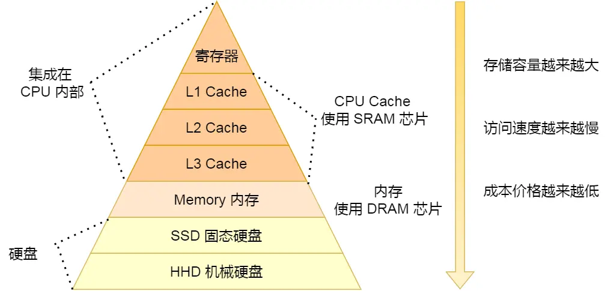
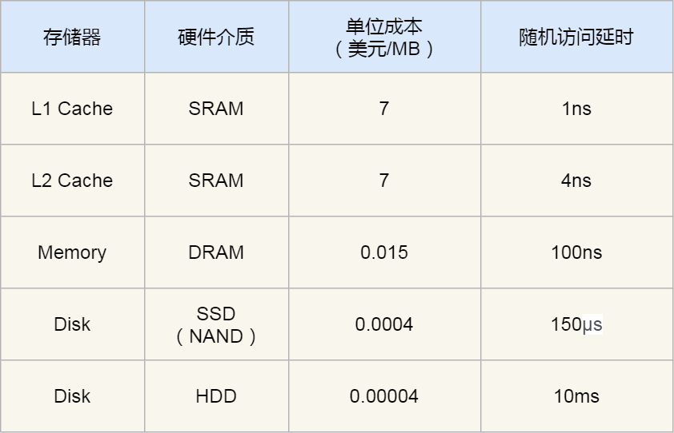
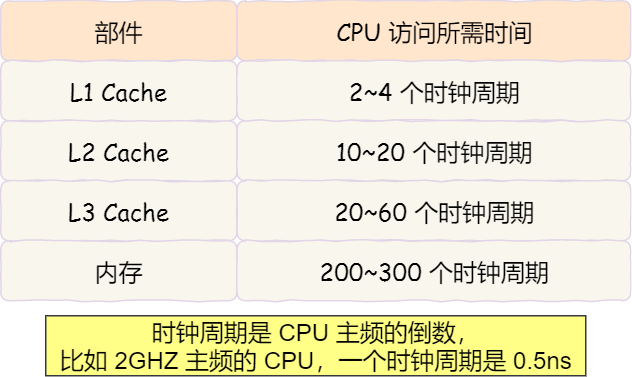
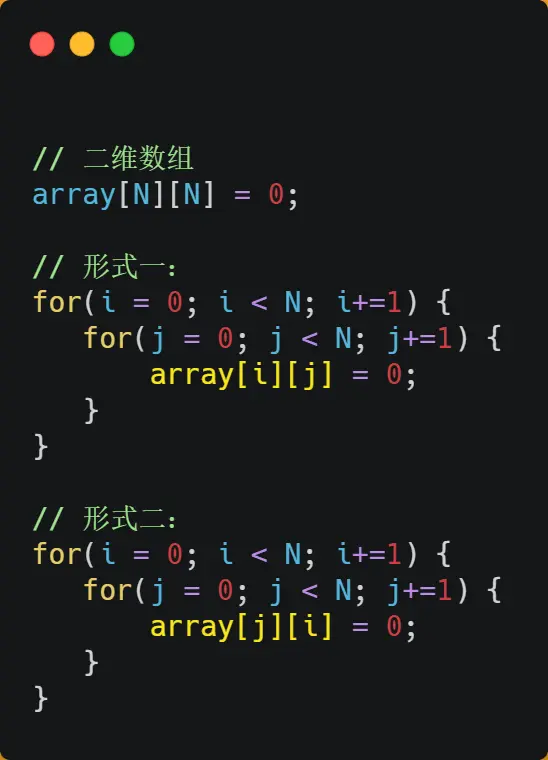
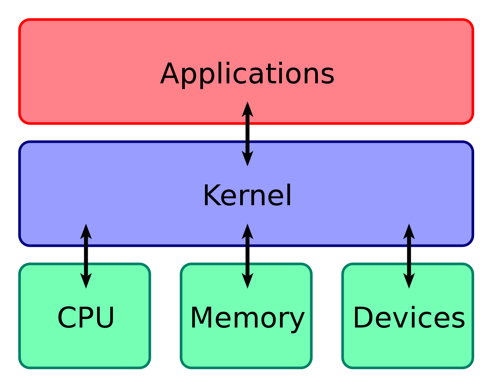
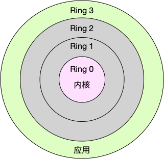
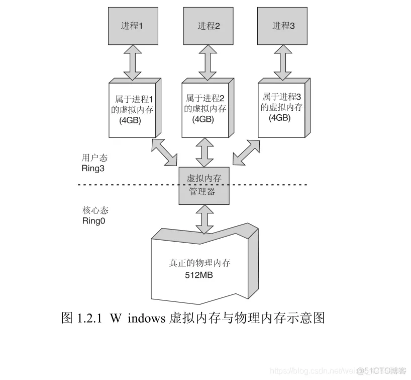
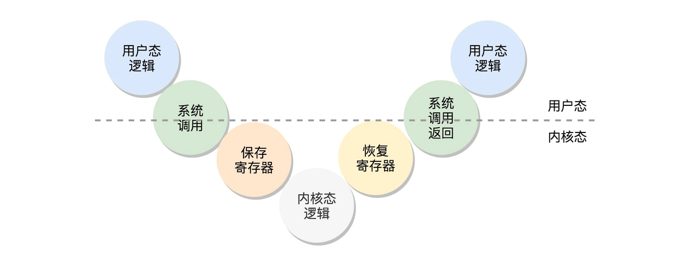
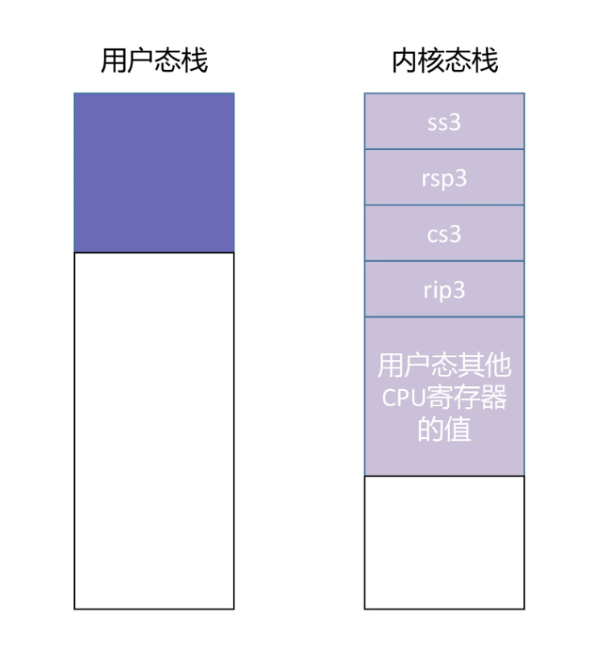
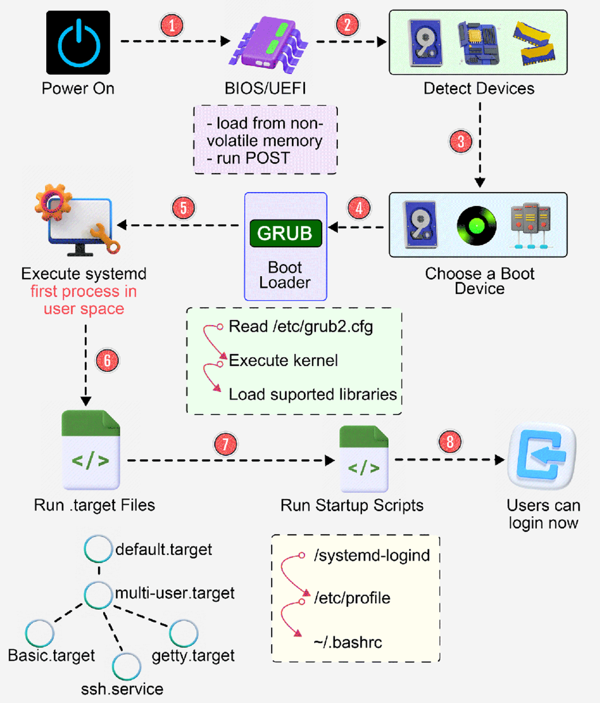

> 操作系统学习指引：[ 操作系统学习指引](https://ls8sck0zrg.feishu.cn/wiki/wikcnMfJXrpBI3Po7HHKfsDoUKr)

# 存储结构

## 1. 为什么计算机要给储存结构分级？

**分析**

计算机的存储结构的层级如下图，从上到下，存储的容量越来越大，但是CPU访问的速度越来越慢。

下面这张表格是不同层级的存储器之间的成本对比图：

**回答**

不同级别的储存结构具有不同的访问速度，CPU 访问 CPU Cache 的延时只需要几纳秒，访问物理内存的延时则是 100 纳秒，速度相差 100 倍，访问磁盘延时就更高了，已经到毫秒级别了，但是访问速度越快的存储器，造价成本会高很多，容量也比较小。

通过分级储存结构，可以将数据按照不同的访问速度、容量和成本要求进行管理，CPU Cache用于存储近期频繁访问的数据，内存用于存储当前执行的程序和数据，而硬盘则用于存储大量数据和长期存储。

**推荐资料**

[磁盘比内存慢几万倍？](https://xiaolincoding.com/os/1_hardware/storage.html)

## 2. CPU cache L1 L2 L3 读取数据的时间量级差距有多大？

**分析**

CPU 访问 L1 Cache 只需要 `2~4` 个时钟周期，访问 L2 Cache 大约 `10~20` 个时钟周期，访问 L3 Cache 大约 `20~60` 个时钟周期，而访问内存速度大概在 `200~300` 个 时钟周期之间。如下表格：

**回答**

差距不大，都是纳秒级别，CPU 访问 CPU Cache L1 的延时大概是 1-2 纳秒，访问 CPU Cache L2 的延时大概是 5-10 纳秒，访问 CPU Cache L3 的延时大概是 10-30 纳秒。

**推荐资料**

[如何写出让 CPU 跑得更快的代码？](https://xiaolincoding.com/os/1_hardware/how_to_make_cpu_run_faster.html)

## 3. CPU 缓存对程序性能的影响都体现在哪些方面？

**分析**

CPU 访问内存的速度，比访问 CPU Cache 的速度慢了 100 多倍，所以如果 CPU 所要操作的数据在 CPU Cache 中的话，这样将会带来很大的性能提升。访问的数据在 CPU Cache 中的话，意味着缓存命中，缓存命中率越高的话，代码的性能就会越好，CPU 也就跑的越快。

对于遍历二维数组的场景：

形式一的速度会比形式二的速度快很多，因为形式一可以更好利用 CPU Cache，访问数据的缓存命中率会比较高。

当 CPU 访问内存数据时，如果数据不在 CPU Cache 中，则会一次性会连续加载 64 字节大小的数据到 CPU Cache，那么当访问 `array[0][0]` 时，由于该元素不足 64 字节，于是就会往后顺序读取 `array[0][0]~array[0][15]` 到 CPU Cache 中。顺序访问的 `array[i][j]` 因为利用了这一特点，所以就会比跳跃式访问的 `array[j][i]` 要快。

**回答**

程序具有局部性原理，如果一个数据被访问，那么附近的数据很可能也会被访问到， CPU Cache就是基于这个局部性原理，在访问数据的时候，如果访问的数据不在 CPU Cache中，不会只从内存读这一个数据，而是会从内存连续加载数据到 CPU Cache，这样相邻的数据都会被缓存在  CPU Cache，那么程序在访问相邻数据的时候，相邻数据就可以直接在缓存中命中，无需访问内存，可以提高访问的效率。

**推荐资料**

[如何写出让 CPU 跑得更快的代码？](https://xiaolincoding.com/os/1_hardware/how_to_make_cpu_run_faster.html)

# 内核态（重要）

## 4. 什么是内核？

**分析**

计算机是由各种外部硬件设备组成的，比如内存、CPU、硬盘等，如果每个应用都要和这些硬件设备对接通信协议，那这样太累了，所以由「内核」作为中间人，让**内核作为应用连接硬件设备的桥梁**，应用程序只需关心与内核交互，不用关心硬件的细节。

现代操作系统，内核一般会提供 4 个基本能力：

* 管理进程、线程，决定哪个进程、线程使用 CPU，也就是进程调度的能力；

* 管理内存，决定内存的分配和回收，也就是内存管理的能力；

* 管理硬件设备，为进程与硬件设备之间提供通信能力，也就是硬件通信能力；

* 提供系统调用，如果应用程序要运行更高权限运行的服务，那么就需要有系统调用，它是用户程序与操作系统之间的接口。

**回答**

内核是操作系统的核心组件，负责管理系统资源、提供硬件抽象层、调度任务和实现进程间通信等功能。内核是系统中第一个加载的程序，并拥有最高的特权级别，控制整个系统的运行和资源分配。它与用户空间程序进行交互，提供系统调用接口，实现了操作系统的基本功能。

**推荐资料**

[用户态和内核态:用户态线程和内核态线程有什么区别?.md](https://learn.lianglianglee.com/%E4%B8%93%E6%A0%8F/%E9%87%8D%E5%AD%A6%E6%93%8D%E4%BD%9C%E7%B3%BB%E7%BB%9F-%E5%AE%8C/14%20%20%E7%94%A8%E6%88%B7%E6%80%81%E5%92%8C%E5%86%85%E6%A0%B8%E6%80%81%EF%BC%9A%E7%94%A8%E6%88%B7%E6%80%81%E7%BA%BF%E7%A8%8B%E5%92%8C%E5%86%85%E6%A0%B8%E6%80%81%E7%BA%BF%E7%A8%8B%E6%9C%89%E4%BB%80%E4%B9%88%E5%8C%BA%E5%88%AB%EF%BC%9F.md)

zh## 5. 内核态和用户态区别？为什么要区分内核态和用户态？

**分析**

在 CPU 的所有指令中，有一些指令是非常危险的，如果错用，将导致整个系统崩溃，比如：清空内存，修改时钟等。如果所有的程序代码都能够直接使用这些指令，那么很有可能我们的系统一天将会死 n 次。

所以，CPU将指令分为 **特权指令** 和 **非特权指令** ，对于较为危险的指令，只允许操作系统本身及其相关模块进行调用，普通的、用户自行编写的应用程序只能使用那些不会造成危险的指令。

基于安全的考虑，CPU 提供了特权分级机制，把区域分成了四个 Ring，越往里权限越高，越往外权限越低。

操作系统根据 CPU 的特权分级机制，把进程的运行空间分为「内核空间」和「用户空间」，分别对应着上图中， CPU 特权等级的 Ring 0 和 Ring 3。

* 内核空间（Ring 0）具有最高权限，可以直接访问所有硬件资源，比如硬盘、网卡、内存等；

* 用户空间（Ring 3）只能访问受限资源，不能直接访问内存等硬件设备，过「系统调用」陷入到内核中，才能访问这些特权资源。

为什么要区分内核态和用户态呢？这是为了实现操作系统的核心功能和保证系统的稳定性、安全性以及资源的合理分配。通过区分内核态和用户态，操作系统可以：

* 提供一种安全机制，限制用户程序对系统资源的直接访问，防止恶意程序对系统造成破坏。

* 实现操作系统的核心功能，如管理进程、文件系统、内存管理等，这些功能需要在内核态下执行。

* 实现多任务并发执行，通过在内核态和用户态之间进行切换，操作系统可以在不同的应用程序之间共享处理器资源，实现任务的并发执行。

**回答**

CPU 将指令分为了特权指令和非特权指令，然后操作系统根据 CPU 的特权分级机制，把进程的运行空间分为内核空间和用户空间。

内核态具有最高权限，可以执行特权指令，直接访问所有系统和硬件资源，而用户态不能执行特权指令，只能执行非特权指令，所以只能访问受限的资源，比如不可以直接访问内存、硬盘、网卡等硬件设备，如果要访问这些硬件资源，需要通过系统调用的方式，让进程陷入到内核态才能访问这些特权资源。

之所以要区分内核态和用户态，目的就是为了保证系统的稳定性和安全性，因为通过限制应用程序对特权指令的访问，可以防止恶意程序直接操作危险的指令导致系统崩溃的问题。

**推荐资料**

[Linux系统中，为什么需要区分内核空间与用户空间？](https://zhuanlan.zhihu.com/p/266950886)

## 6. 什么时候会由用户态陷入内核态？

**分析**

有三种方式程序会从用户态陷入内核态：

* **系统调用**：这是用户态进程**主动**要求切换到内核态的一种方式，用户态进程通过系统调用申请使用操作系统提供的服务程序完成工作。

* **异常**：当CPU在执行运行在用户态下的程序时，发生了某些事先不可知的异常，这时会触发由当前运行进程切换到处理此异常的内核相关程序中，也就转到了内核态，比如访问非法内存、除零错误等

* **外围设备的中断**：当外围设备完成用户请求的操作后，会向CPU发出相应的中断信号，这时CPU会暂停执行下一条即将要执行的指令转而去执行与中断信号对应的处理程序，如果先前执行的指令是用户态下的程序，那么这个转换的过程自然也就发生了由用户态到内核态的切换。比如硬盘读写操作完成，系统会切换到硬盘读写的中断处理程序中执行后续操作等。

这3种方式是系统在运行时由用户态转到内核态的最主要方式，其中**系统调用可以认为是用户进程「主动」发起的，异常和外围设备中断则是「被动」的。**

**回答**

主要有三种情况，会导致应用程序从用户态陷入到内核态：

* 应用程序执&#x884C;**系统调用**&#x7684;时候，会触发一个软件中断（比如 int 指令），会进入内核态执行相应的内核代码，完成后再返回用户态。

* 当应用程序发&#x751F;**异常**&#x60C5;况，如访问非法内存、除零错误等，CPU会触发一个异常，将控制权转移到内核态的异常处理程序中。

* 当系统接收&#x5230;**外部设备的中断信号**，如硬件设备的输入/输出请求、定时器中断等，处理器会中断当前的执行，进入内核态执行相应的中断处理程序。

**推荐资料**

[用户态切换到内核态的3种方式](https://liuyehcf.github.io/2017/08/20/%E7%B3%BB%E7%BB%9F%E8%B0%83%E7%94%A8/)

## 7. 系统调用的过程？

**分析**

当程序需要访问硬件资源的时候，比如内存、硬盘等，就需要通过「系统调用」陷入到内核中，才能访问这些特权资源。系统调用可以理解为内核实现的函数，比如应用程序要通过网卡接收数据，会调用 Socket 的 read 函数。

程序在执行系统调用的过程中会从用户态切换到内核态，再从内核态切换到用户态，过程如下：

系统调用的过程：

* **从用户态到内核态**：当应用程序使用系统调用时，先将系统调用名称转换为系统调用号，接着将「系统调用号」和「请求参数」放到寄存器里，然后执行软件中断指令（int $0x80 指令），产生一个**中断**，CPU 陷入到内核态。

* **执行内核态逻辑：**&#x43;PU 跳转到中断处理程序，先将当前用户态的寄存器（用户态的代码段、数据段、保存参数的寄存器）压入到内核栈中，接着将系统调用号从寄存器里面取出来，最后根据系统调用号，在「系统调用表」中找到相应的系统调用函数进行调用，并将寄存器中保存的参数取出来，作为函数参数。

* **从内核态到用户态：**&#x6267;行完系统调用后，执行中断返回指令（iret 指令），内核栈会弹出之前保存的寄存器，将原来用户态保存的现场恢复回来，包含代码段、指令指针寄存器等。这时候 CPU 恢复到用户态，用户态进程恢复执行。

**一次系统调用过程中的，会发生两次「 CPU 上下文切换」（**&#x6240;谓的 CPU 上下文就是 CPU 寄存器和程序计数&#x5668;**）：**

* **第一次** CPU 上下文切换是从用户态切换到内核态：CPU 寄存器里原来用户态的指令位置，需要先保存起来。接着，为了执行内核态代码，CPU 寄存器需要更新为内核态指令的新位置。最后才是跳转到内核态运行内核任务。

* **第二次&#x20;**&#x43;PU 上下文切换是从内核态切换到用户态： CPU 寄存器需要恢复原来保存的用户态，然后再切换到用户空间，继续运行进程。

**回答**

当应用程序发生系统调用的时候，会发生用户态和内核态的切换，过程是这样的：

* 执行系统调用的时候，先将系统调用名称转换为系统调用号，接着将系统调用号和请求的参数放到寄存器中，然后执行软件中断命令，CPU会从用户态切换到内核态

* CPU 跳转到中断处理程序，将当前用户态的现场信息保存到内核栈中，接着根据系统调用号从系统调用表中找到对应的系统调用函数，并将寄存器中保存的参数取出来，作为函数参数，然后在内核中执行系统调用函数

* 执行完系统调用后，执行中断返回指令，内核栈会弹出之前保存的用户态的现场信息，将原来用户态保存的现场恢复回来，这时候 CPU 恢复到用户态，用户态进程恢复执行

**推荐资料**

[为什么系统调用会消耗较多资源](https://draveness.me/whys-the-design-syscall-overhead/)

[在 x86 中实现用户态与系统调用](https://blog.men.ci/x86-userland-and-syscall/)

## 8. 用户态和内核态是如何切换的？

Linux 系统中每个进程都有两个栈，分别是**用户栈和内核栈**，当应用程序运行在用户态的时候，就会使用用户栈，当应用程序运行在内核态的时候，就会使用内核栈。

内核态与用户态的相互切换，其中最重要的一个步骤就是**用户栈和内核栈的切换**。

**1、用户栈到内核栈：**

* 执行中断指令（int $0x80 指令），中断发生时，CPU 去一个特定的结构（比如 TSS）中，**获取该进程的内核栈的地址信息**，也就是内核栈的段选择子和栈顶指针（这两个东西是描述内核栈在内存的哪个地址空间），**并分别送入 ss 寄存器和 rsp 寄存器，这时候 CPU 就指向了该进程的内核栈的栈顶位置了，这就完成了用户态到内核态的一次栈的切换**。（*PS：如果不明白 ss 和 rsp 寄存器是干嘛的，可以看这篇文章：[一个学渣对于stack的顿悟（1）：从CPU的视角说起](http://liupzmin.com/2021/06/27/theory/stack-insight-01-md/)*）

* 然后，IP 寄存器（指令指针寄存器）跳入中断服务程序开始执行，中断服务程序会**把用户态的所有寄存器压入到内核栈中**，如下图，CPU 自动地将用户态栈的段选择子 ss3，和栈顶指针 rsp3 都放到内核态栈里了。**这里的数字 3 代表了 CPU 特权级，内核态是 0，用户态是 3。**

**2、内核栈到用户栈**

* 当中断结束时，中断服务程序会从内核栈里将 CPU 寄存器的值全部恢复，最后再执行"iret"指令。

* **将 ss3/rsp3 都弹出栈，并且将这个值分别送到 ss 和 rsp 寄存器中，这时候 CPU 就指向了该进程的用户栈的栈顶位置了**，这样就完成了从内核栈到用户栈的一次切换。

* 内核栈的 ss0 和 rsp0 也会被保存到前面所说的 CPU 的一个特定的结构（比如 TSS）中，以供下次切换时使用。

## 9. 为什么用户态和内核态的相互切换过程开销比较大

**分析**

当程序中有系统调用语句，程序执行到系统调用时，首先使用类似 int 80 的软件中断指令，保存现场，去系统调用，在内核态执行，然后恢复现场，**每个进程都会有两个栈，一个内核态栈和一个用户态栈**。当 int 中断执行时就会由用户态栈转向内核态栈，系统调用时需要进行栈的切换，而且内核代码对用户不信任，需要进行额外的检查，而且系统调用的返回过程有很多额外工作，比如检查是否需要调度等。&#x20;

系统调用一般都需要保存用户程序得上下文（context）, 在进入内核的时候需要保存用户态的寄存器，在内核态返回用户态的时候会恢复这些寄存器的内容。这是一个开销的地方。 如果需要在不同用户程序间切换的话，那么还要更新 cr3 寄存器（*CR3含有存放页目录表页面的物理地址*），这样会更换每个程序的虚拟内存到物理内存映射表的地址，也是一个比较高负担的操作。

**回答**

1. **上下文切换**：在用户态和内核态之间切换时，需要保存当前进程或线程的上下文信息，包括程序计数器、寄存器状态、栈指针等。这些上下文信息保存在内存中或者内核数据结构中，在切换完成后需要再次加载回来。这个过程会消耗一定的时间和资源。

2. **权限切换**：用户态和内核态具有不同的权限级别，内核态拥有更高的特权级别，可以执行一些用户态不可访问的指令和操作。因此，从用户态切换到内核态需要进行特权级别的变更，这个过程也会增加开销。

3. **TLB刷新**：TLB是CPU中的一种缓存，用于存储虚拟地址到物理地址的映射关系。当发生用户态和内核态的切换时，可能导致TLB中的缓存无效，需要进行TLB刷新，这会引起一定的性能损失。

# 中断

## 10. 什么是中断？为什么要有中断？

**分析**

在计算机中，**中断是系统用来响应硬件设备请求的一种机制，操作系统收到硬件的中断请求，会打断正在执行的进程，然后调用内核中的中断处理程序来响应请求**。

简单来说，中断会让 CPU 停止正在执行的程序，转而让 CPU 去执行中断处理函数程序，执行完再返回原程序。例如，我们敲击键盘的时候，键盘的控制器就会向 CPU 发起一个中断请求。CPU 在接到请求以后，就会停下正在做的工作，把当前的寄存器状态全部保存好，然后去调用中断服务程序。

**为什么需要中断？**&#x6211;举个生活中取外卖的例子，对比一下有中断和没有中断的场景：

* 如果没有中断机制（外卖员不会打电话给我），我需要一直一直傻傻地盯着看外卖配送员的进度，没办法去干其他事情，直到外卖到了，我才能做其他事情。

* 如果有中断机制（外卖员会打电话给我），我就不需要盯着外卖配送员的进度，我可以做其他事情，等外卖到了，外卖员会打电话给我（中断发生），我才会停下手中地事情，去拿外卖。

这里的打电话，其实就是对应计算机里的中断，没接到电话的时候，我可以做其他的事情，只有接到了电话，也就是发生中断，我才会停下当前的事情，去进行另一个事情，也就是拿外卖。

从这个例子，我们可以知道，**中断是一种异步的事件处理机制，可以提高系统的并发处理能力**。

**回答**

**中断机制的好处是化主动为被动，避免 CPU 轮询等待某条件成立**。如果没有中断机制，那么“某个条件成立”就需要 CPU 轮询判断，这样就会增加系统的开销。而使用中断机制，就可以在条件成立之后，向 CPU 发送中断事件，强制中断 CPU 执行程序，转而去执行中断处理程序。

## 11. 什么是硬件中断和软件中断？（基本不问）

**分析**

先来说说中断的分类，以 Intel CPU 作为例子，Intel CPU 提供了三种「中断（动词）」程序执行的机制，分别是：

* **中断（interrupt）**：由硬件设备触发，比如点击一下鼠标、敲一下键盘，这时候外部设备会给 CPU 发送一个中断号，属于异步事件；

* **异常（exception）**：CPU 在执行指令时检测到的反常条件，比如除法异常、错误指令异常，缺页异常等，然后CPU 自己给自己一个中断号，无需外界给，属于同步事件；

* **INT 指令**：INT 指令后面跟一个数字，就相当于直接用指令的形式，告诉 CPU 一个中断号。比如 INT 0x80，就是告诉 CPU 中断号是 0x80。Linux 内核提供的系统调用，就是用了 INT 0x80 这种指令。

根据触发的方式不同，将这三个机制分成两类：

* **中断和异常属于「硬件中断」**，因为他们都是硬件自动触发的，中断是由外部设备触发的，异常是由 CPU 触发的。

* **INT 指令属于「软件中断」**，因为他是由软件程序主动触发的。

但是注意，中断、异常、INT指令都是属于「硬中断」，没有“件”字。为什么都属于硬中断呢？因为这是 Intel CPU 这个硬件实现的中断机制，注意这里是实现机制，并不是触发机制，因为触发可以通过外部硬件，也可以通过软件的 INT 指令。

**回答**

* 硬件中断：由硬件自动触发的中断就属于硬件中断，比如中断和异常都属于硬件中断，中断是由外部设备触发的，异常是由 CPU 触发的。

* 软件中断：由软件程序主动触发的中断属于软件中断，比如 INT 指令，Linux 内核提供的系统调用，就是用了 INT 0x80 这种指令。

## 12. 什么是硬中断和软中断？（基本不问）

**分析**

根据实现的方式的不同，分为了硬中断和软中断：

* **由 CPU 硬件实现的中断机制，就属于硬中断**，比如中断、异常、INT指令都是由 CPU 实现的中断机制。

* **由软件实现实现的中断机制，就属于软中断**。比如 Linux 实现的软中断守护进程。

硬中断和软中断的中断效果是一样的，都&#x662F;**打断当前正在运行的程序，转而去执行中断处理程序，执行完之后再返回原程序**。

**回答**

硬中断和软中断区别在于，谁去检测中断事件：

* 硬中断就是 CPU 在每一个指令周期的最后，都&#x4F1A;**留一个 CPU 周期去查看是否有中断**，如果有，就把中断号取出，去「中断向量表」中寻找中断处理程序，然后跳过去执行中断处理程序。

* 软中断就是有一&#x4E2A;**单独的守护进程**，不断轮询一组标志位，如果哪个标志位有值了，那去这个标志位对应的「软中断向量表数组」的相应位置，找到软中断处理函数，然后跳过去执行软中断处理函数。

## 13. **为什么要有软中断？（基本不问）**

**分析**

Linux 某网卡接收了一个数据包，此时会触发一个硬中断，由于处理数据包的过程比较耗时，而硬中断资源又非常宝贵，如果占着硬中断函数不返回，会影响到其他硬中断的响应速度，比如点击鼠标、按下键盘等。

而且，中断处理程序在响应中断时，可能还会「临时关闭中断」，这意味着，如果当前中断处理程序没有执行完之前，系统中其他的中断请求都无法被响应，也就说中断有可能会丢失，所以中断处理程序要短且快。

Linux 系统为了解决中断处理程序执行过长和中断丢失的问题，将中断过程分成了两个阶段，分别是「上半部和下半部分」。

* 上半部用来快速处理中断，主要负责处理跟硬件紧密相关或者时间敏感的事情。

* 下半部用来延迟处理上半部未完成的工作，一般由「内核守护进程」来完成，相当于将中断处理程序比较复杂的逻辑解耦出来了，并通过异步的方式来处理这些复杂的逻辑。

以常见的网卡接收网络包的例子。

网卡收到网络包后，通过 DMA 方式将接收到的数据写入内存，将网络包的数据写入到内存后，下一步就需要通知内核来处理，于是网卡会触发一个硬中断，内核就会调用网卡的中断处理程序来处理该事件，这个事件的处理会分成上半部和下半部：

* 上部分由硬中断处理程序处理，要做的事情很少，做完后就会发起了一&#x6B21;**软中断**，然后就结束了。这里发起的软中断，并不是向 CPU 发送中断信号，而是将软中断标记数组中的某一个位置标记一下。

* 下半部由软中断处理程序处理，内核守护进程会不断轮询软中断标记数组，看哪个位置被标记为 1 了，接着就去软中断向量表里，寻找这个标志位对应的处理程序，然后执行软中断处理程序处理，其主要是需要从内存中找到网络数据，再按照网络协议栈，对网络数据进行逐层解析和处理，最后把数据送给应用程序。

所以，**软中断的作用就是承接原本硬中断处理程序比较复杂且耗时的工作，让硬中断的中断处理函数的逻辑尽可能的简单，从而提高系统的中断响应速度**。

**回答**

软中断可以承接原本硬中断处理程序比较复杂且耗时的工作，让硬中断的中断处理函数的逻辑尽可能的简单，从而提高系统的中断响应速度。

比方说，在网卡收到数据包的时候，会把数据包的事件分为上半部分和下半部分：

* 上部分由硬中断处理程序处理，要做的事情很少，做完后就会发起了一&#x6B21;**软中断**，然后就结束了。这里发起的软中断，并不是向 CPU 发送中断信号，而是将软中断标记数组中的某一个位置标记一下。

* 下半部由软中断处理程序处理，内核守护进程会不断轮询软中断标记数组，看哪个位置被标记为 1 了，接着就去软中断向量表里，寻找这个标志位对应的处理程序，然后执行软中断处理程序处理，其主要是需要从内存中找到网络数据，再按照网络协议栈，对网络数据进行逐层解析和处理，最后把数据送给应用程序。

# Linux 启动

## 14. 说一下Linux 启动的流程

**分析**

只有腾讯喜欢问，其他公司问的少，面腾讯的同学才需要重点准备，否则可以不学

下图给我们展示了 Linux 启动的流程具体步骤。

**回答**

* 第一步：当我们打开电源时，BIOS（基本输入/输出系统，Basic Input/Output System）或 UEFI（统一可扩展固件接口，Unified Extensible Firmware Interface）固件会从非易失性内存中加载，并执行 POST（开机自检，Power On Self Test）。

* 第二步：BIOS/UEFI 检测连接到系统的设备，包括 CPU、内存和存储设备。

* 第三步：选择一个启动设备来启动操作系统。可以是硬盘、网络服务器或 CD ROM。

* 第四步：BIOS/UEFI 运行引导加载器 (GRUB)，它提供了一个选择操作系统或内核功能的菜单。

* 第五步：内核准备就绪后，我们现在切换到用户空间。内核启动 systemd 作为第一个用户空间进程，负责管理进程和服务、探测所有剩余硬件、挂载文件系统并运行桌面环境。

* 第六步：系统启动时，systemd 默认激活 default.target 单元。同时还会执行其他分析单元。

* 第七步：系统运行一组启动脚本并配置环境。

* 第八步：用户将看到一个登录窗口。系统现已准备就绪。

**推荐资料**

[简述 Linux 的启动过程](https://www.bilibili.com/video/BV1sfpgeXEwM/?spm_id_from=333.788.recommend_more_video.0\&vd_source=894a223b85ae44e61e16dcd1a7356db0)
