> 操作系统学习指引：[ 操作系统学习指引](https://ls8sck0zrg.feishu.cn/wiki/wikcnMfJXrpBI3Po7HHKfsDoUKr)

# 进程与线程（重要）

## 1. 进程和线程有什么区别？

**分析**

|            | 进程                                       | 线程                              |
| ---------- | ---------------------------------------- | ------------------------------- |
| 定义         | 进程是操作系统资源分配的基本单位                         | 线程是任务调度和执行的基本单位                 |
| 切换情况       | 进程CPU环境（栈、寄存器、页表和文件句柄等）的保存以及新调度进程环境的设置。  | 保存和设置程序计数器，少量寄存器和栈的内容           |
| 关联性性  | 不同进程之间实现并发，各自占用cpu时间片                    | 一个进程内部多个线程并发执行             |
| 系统开销       | 切换虚拟地址空间，切换内核栈和硬件上下文，CPU高速缓存失效、页表切换，开销很大 | 切换时只需保存和设置少量寄存器内容， 有⼀定的开销  |
| 通信方式       | 进程之间的通信需要借助操作系统，比如管道、消息队列、socket 通信等等    | 线程之间可以直接读写进程数据段（如全局变量），来进⾏通信    |
| 安全性        | 多进程安全性较好，在某一个进程出问题时，其他进程一般不受影响           | 在多线程的情况下，一个线程执行了非法操作会导致整个进程退出   |

这个虽然是很简单的问题，但是很多同学都犯了很严重的错误，面试只说一句：“进程是操作系统资源分配的基本单位，线程是任务调度和执行的基本单位”，这样的回答没有灵魂，也没有自己的思考，很难跟别人拉开差距！！

人人都回答这句话，你该怎么脱颖而出？肯定要回答的更全面一点，比如可以把进程和线程的「系统开销、上下文切换、安全性」的区别都说出来，才能展现你的对这个问题的思考。

**回答**

* 定义区别：进程就是运行起来的可执行程序，当我们运行一个可执行程序的时候，就会创建一个或多个进程，创建进程的时候需要分配空间，比如：栈区、文件映射区、堆区、静态区、常量区、代码段，因此也会说进程是资源分配的最小单位；线程则是程序执行的基本单位，每个进程中都有唯一的主线程，且只能有一个，主线程和进程是相互依存的关系，主线程结束进程也会结束。

* 共享资源区别：每个进程有自己的独立地址空间，不与其他进程分享；一个进程里可以有多个线程，彼此共享同一个地址空间。堆内存、文件、socket等资源都归进程管理，同一个进程里的多个线程可以共享使用。每个进程占用的内存和其他资源，会在进程退出或被杀死时返回给操作系统。

* 上下文切换区别：进程和线程上下文切换的时候，都会发生内核态和用户态的切换，进程间的切换的时候，除了需要切换 CPU 上下文，还需要切换页表，切换了页表会影响TLB的命中率，那么虚拟地址转换为物理地址就会变慢，表现出来的就是程序运行会变慢，而线程切换只需要切换 CPU 上下文，不会改变虚拟地址空间，不会影响TLB命中率。

* 安全性区别：应用开发可以用多进程或多线程的方式。多线程由于可以共享资源，效率较高；反之，多进程不共享地址空间和资源，开发较为麻烦，在需要共享数据时效率也较低。但多进程安全性较好，在某一个进程出问题时，其他进程一般不受影响；而在多线程的情况下，一个线程执行了非法操作会导致整个进程退出。

**推荐资料**

[进程、线程基础知识](https://xiaolincoding.com/os/4_process/process_base.html)

## 2. 为什么需要线程？

**分析**

线程是轻量级的进程，可以从并行能力、切换开销、通信方便来说明线程的优势

**回答**

* 并发能力：线程可以实现程序的并发执行，即在同一时间内可以同时执行多个任务，提高了系统的响应速度和资源利用率。通过多线程编程，可以将耗时的操作与其他任务并行执行，提升程序的性能。

* 切换开销：线程的切换开销比进程小，线程切换只需要切换 CPU 上下文，不会改变虚拟地址空间，不需要重新加载页表，不会影响TLB命中率。

* 通信方便：同一个进程内，多个线程是可以共享进程内存资源的，线程间的通信比进程间的通信更简单和高效。

**推荐资料**

[进程和线程:进程的开销比线程大在了哪里?.md](https://learn.lianglianglee.com/%E4%B8%93%E6%A0%8F/%E9%87%8D%E5%AD%A6%E6%93%8D%E4%BD%9C%E7%B3%BB%E7%BB%9F-%E5%AE%8C/17%20%20%E8%BF%9B%E7%A8%8B%E5%92%8C%E7%BA%BF%E7%A8%8B%EF%BC%9A%E8%BF%9B%E7%A8%8B%E7%9A%84%E5%BC%80%E9%94%80%E6%AF%94%E7%BA%BF%E7%A8%8B%E5%A4%A7%E5%9C%A8%E4%BA%86%E5%93%AA%E9%87%8C%EF%BC%9F.md)

## 3. **多线程是不是越多越好，太多会有什么问题？**

**分析**

线程数量越多，切换的开销就越高，发生死锁的概率就越大。

**回答**

多线程不一定越多越好，过多的线程可能会导致一些问题。

* 切换开销：线程的创建和切换会消耗系统资源，包括内存和CPU。如果创建太多线程，会占用大量的系统资源，导致系统负载过高，某个线程崩溃后，可能会导致进程崩溃。

* 死锁的问题：过多的线程可能会导致竞争条件和死锁。竞争条件指的是多个线程同时访问和修改共享资源，如果没有合适的同步机制，可能会导致数据不一致或错误的结果。而死锁则是指多个线程相互等待对方释放资源，导致程序无法继续执行。

## 4. 什么时候用单线程，什么时候用多线程呢？

**回答**

一般在单个逻辑比较简单，而且速度相对来非常快的情况下，我们可以使用单线程。例如， Redis 处理命令的实现是用了单线程，从内存中快速读取值，避免了加锁的开销。

而在逻辑相对来说很复杂的场景，等待时间相对较长又或者是需要大量计算的场景，建议使用多线程来提高系统的整体性能。例如，NIO 时期的文件读写操作、图像处理以及大数据分析等。

**分析**

单线程适用于以下情况：

* 简单的程序：当程序逻辑简单且任务量较少时，使用单线程可以简化代码结构，减少线程切换的开销。

* 需要顺序执行的任务：例如，需要按照特定的顺序依次执行任务的场景，单线程可以确保任务按照预期的顺序执行。

* 对资源访问有限制：某些资源（如共享数据、文件）可能有访问限制，单线程可以避免并发访问造成的竞争和冲突。

多线程适用于以下情况：

* 并发处理任务：当需要同时处理多个任务，且任务之间没有强依赖关系时，使用多线程可以提高程序的并发性和整体性能。

* 大规模计算：对于需要大量计算的任务，使用多线程可以将计算任务分配给多个线程，加快计算速度。

* 高响应性要求：多线程可以提高系统的响应性，例如在图形界面应用中，使用多线程可以保持界面的流畅性，同时处理用户输入和后台任务

## 5. 线程共享了进程的哪些资源？

**分析**

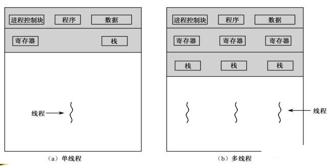

同一进程中的线程共享资源：

* 虚拟内存空间：共享进程的代码区、堆区、数据区的资源等。

* 文件描述符：共享进程打开的文件、套接字等资源。

* 信号处理器：共享进程的信号处理器

同一进程中的线程独占资源：

* 程序计数器和寄存器的值

* 栈：每个线程中的函数调用过程是独立的，因此需要有独立的栈

**回答**

线程共享了进程的虚拟内存空间，文件描述符、还有信号处理器。

* 虚拟内存空间：意味着线程可以访问进程的代码区、堆区、数据区的资源等。

* 文件描述符：意味着线程可以通过文件描述符访问进程打开的文件、套接字等资源。

* 信号处理器：意味着线程可以接收和处理进程收到的信号。

**推荐资料**

[线程间到底共享了哪些进程资源？](https://cloud.tencent.com/developer/article/1768025)

## 6. 为什么创建进程比创建线程慢？

**分析**

从创建虚拟内存的成本来考虑

**回答**

Linux 中创建一个进程自然会创建一个线程，也就是主线程。创建进程需要为进程划分出一块完整的内存空间，包含代码区、堆区、栈区、数据区等内存资源

创建线程则简单得多，只需要确定 PC 指针和寄存器的值，并且给线程分配一个栈用于执行程序，同一个进程的多个线程间可以复用进程的虚拟内存空间，减少了创建虚拟内存的开销。

因此，创建进程比创建线程慢，而且进程的内存开销更大。

**推荐资料**

[进程和线程:进程的开销比线程大在了哪里?.md](https://learn.lianglianglee.com/%E4%B8%93%E6%A0%8F/%E9%87%8D%E5%AD%A6%E6%93%8D%E4%BD%9C%E7%B3%BB%E7%BB%9F-%E5%AE%8C/17%20%20%E8%BF%9B%E7%A8%8B%E5%92%8C%E7%BA%BF%E7%A8%8B%EF%BC%9A%E8%BF%9B%E7%A8%8B%E7%9A%84%E5%BC%80%E9%94%80%E6%AF%94%E7%BA%BF%E7%A8%8B%E5%A4%A7%E5%9C%A8%E4%BA%86%E5%93%AA%E9%87%8C%EF%BC%9F.md)

## 7. 为什么进程的切换比线程开销大？

**分析**

进程切换分两步：

1. 切换「页表」以使用新的地址空间，一旦去切换上下文，CPU 中所有已经缓存的内存地址就失效了。

2. 切换内核栈和 CPU 上下文。

线程和进程的最大区别就在于地址空间，对于线程切换，第1步是不需要做的，第2步是进程和线程切换都要做的。因为每个进程都有自己的虚拟地址空间，而线程是共享所在进程的虚拟地址空间的，因此同一个进程中的线程进行线程切换时不涉及虚拟地址空间的转换。

进程都有自己的虚拟地址空间，把虚拟地址转换为物理地址需要查找页表，页表查找是一个很慢的过程，因此通常使用Cache来缓存常用的地址映射，这样可以加速页表查找，这个Cache就是TLB（translation Lookaside Buffer，TLB本质上就是一个Cache，是用来加速页表查找的）。

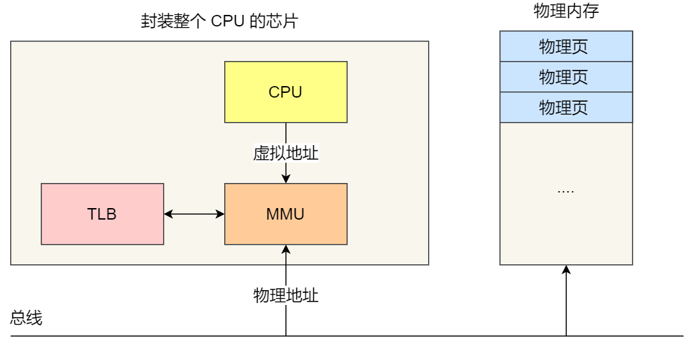

由于每个进程都有自己的虚拟地址空间，那么显然每个进程都有自己的页表，那么当进程切换后页表也要进行切换，页表切换后TLB就失效了，Cache失效导致命中率降低，那么虚拟地址转换为物理地址就会变慢，表现出来的就是程序运行会变慢，而线程切换则不会导致TLB失效，因为线程无需切换地址空间，因此我们通常说线程切换要比较进程切换快，原因就在这里。

**回答**

进程间的切换的时候，除了需要切换 CPU 上下文，还需要切换页表，切换了页表会影响TLB的命中率，**那么虚拟地址转换为物理地址就会变慢，表现出来的就是程序运行会变慢，**&#x800C;线程切换只需要切换 CPU 上下文，不会改变虚拟地址空间，不会影响TLB命中率。

**推荐资料**

[深入理解Linux内核进程上下文切换](https://cloud.tencent.com/developer/article/1710837)

## 8. 线程的上下文切换是怎么个过程？

**分析**

当线程切换的时候，当前线程被时钟中断打断，将发生中断时的现场保存到进程内核栈（如：sp, lr等），然后会切换到下一个线程，当再次回切换回来的时候，返回用户空间的时候会恢复之前的现场，线程就可以继续执行（执行之前被中断打断的下一条指令，继续使用自己用户态sp），这对于用户程序来说是透明的。

如下为硬件上下文切换示例图：

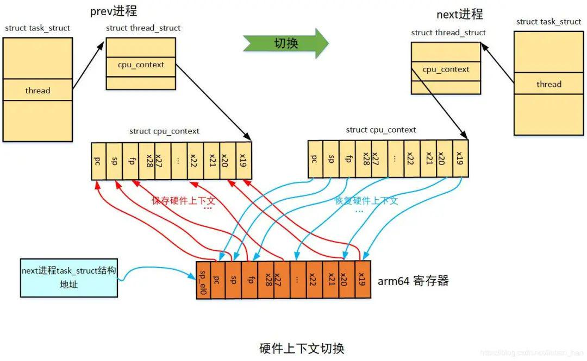

**回答**

线程发生上下文切换的时候，正在运行的线程会将寄存器的状态保存到内核中的 TCB（线程控制块） 里，然后恢复另一个线程的上下文。和进程的区别是，线程只需要切换CPU的上下文，不会改变地址空间.

**推荐资料**

[深入理解Linux内核进程上下文切换](https://cloud.tencent.com/developer/article/1710837)

## 9. 进程有哪些状态？

**分析（操作系统理论中的进程状态）**

在操作系统理论中，把进程的状态分为 5 种状态，状态的变迁如下图：

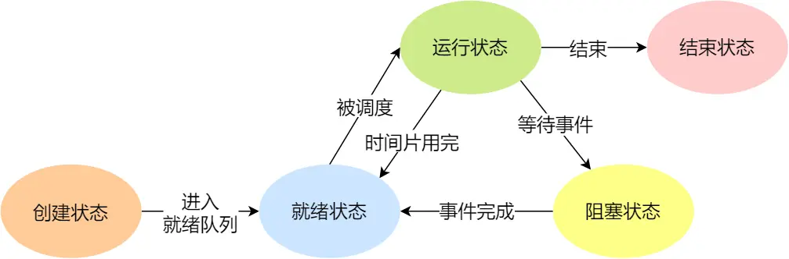

上图中各个状态的意义：

* 创建状态（*new*）：进程new状态，创建之后就会进入ready状态

* 就绪状态（*Ready*）：当ready状态的线程被调度器选择时进入running状态，而被中断时又会重新进入ready状态

* 运行状态（*Running*）：处于ready状态的进程被调度器调度时会进入running状态执行，此时进程持有cpu执行权

* 阻塞状态（*Blocked*）：当runing状态的进程I/O或事件等待时，会进入waiting状态，当I/O或事件完成时会进入ready状态等待调度器调度

* 结束状态（*Exit*）：当处于running状态的进程运行退出时会进入终止状态

**回答（操作系统理论中的进程状态）**

我在大学课本学到的进程状态主要有 5 种，分别是创建状态、就绪状态、运行状态、阻塞状态、结束状态。

一个进程刚开始创建的时候，是处于创建状态，随后就会进入就绪状态，等待被操作系统调度，当进程被调度器选中后，就会进入运行状态，此时进程就持有 CPU 执行权，当进程发生 I/O 事件的时候，就会进入到阻塞状态，等待 I/O 事件完成，I/O 事件完后进程就会恢复为就绪状态，当进程退出后，就会变为结束状态。

**分析（Linux系统的进程状态）**

在Linux系统中，把进程的状态分为7 种状态

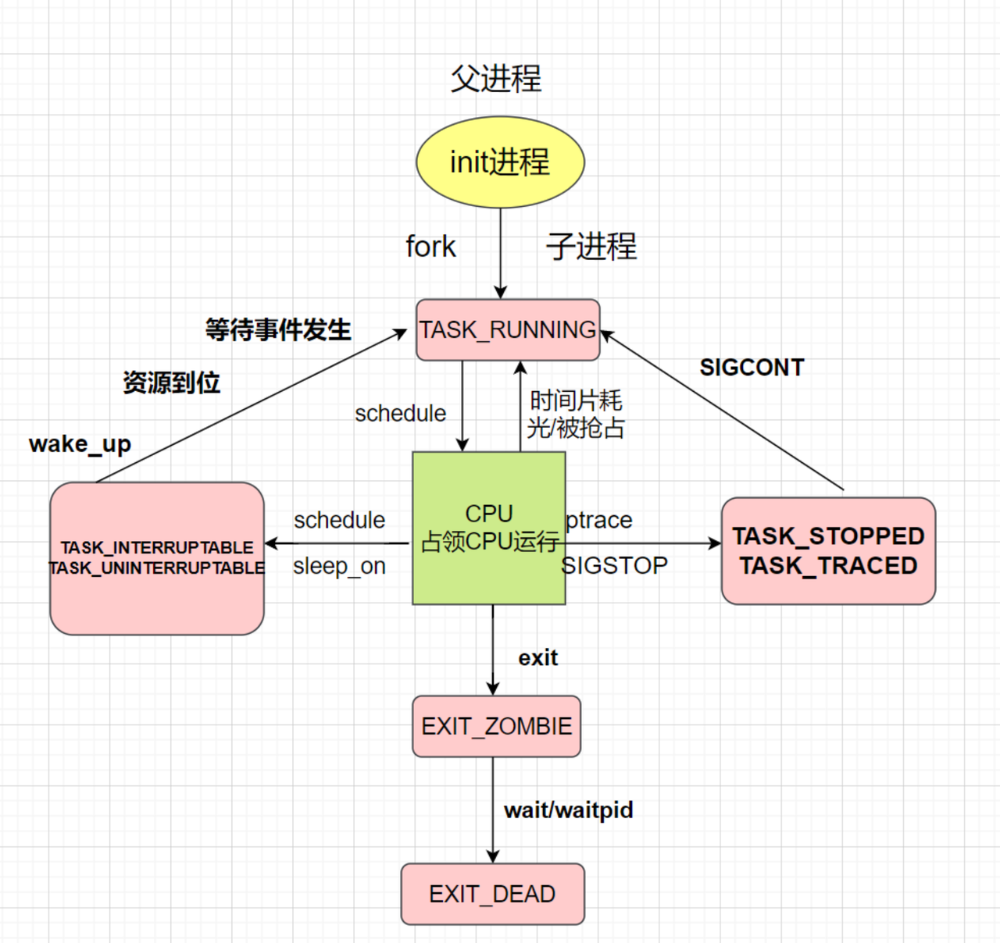

* TASK\_RUNNING是教科书中两种状态的结合，一种是正在占用CPU事件的RUNNING状态，一种是RUNNING状态的进程时间片耗尽或者主动让出CPU，或者被更高优先级进程抢占后，进入的READY状态。处于TASK\_RUNNING状态的进程要么正在CPU上运行，要么随时都可以投入运行，所以TASK\_RUNNING状态未必正在使用CPU，也许是在等待调度。

* TASK\_INTERRUPTIBLE 可中断的睡眠状态。这是一种浅睡眠的状态，也就是说，虽然在睡眠，等待 I/O 完成，但是这个时候一个信号来的时候，进程还是要被唤醒。只不过唤醒后，不是继续刚才的操作，而是进行信号处理。当然程序员可以根据自己的意愿，来写信号处理函数，例如收到某些信号，就放弃等待这个 I/O 操作完成，直接退出；或者收到某些信息，继续等待。

* TASK\_UNINTERRUPTIBLE，不可中断的睡眠状态。这是一种深度睡眠状态，不可被信号唤醒，只能死等 I/O 操作完成。一旦 I/O 操作因为特殊原因不能完成，这个时候，谁也叫不醒这个进程了。你可能会说，我 kill 它呢？别忘了，kill 本身也是一个信号，既然这个状态不可被信号唤醒，kill 信号也被忽略了。除非重启电脑，没有其他办法。TASK\_UNINTERRUPTIBLE的存在是因为内核中某些处理是不能被打断的，比如read系统调用正在操作磁盘，就要用TASK\_UNINTERRUPTIBLE将其保护起来以免受到打扰而陷入不可控的状态。

* TASK\_STOPPED 是在进程接收到 SIGSTOP、SIGTTIN、SIGTSTP 或者 SIGTTOU 信号之后进入该状态。

* TASK\_TRACED 表示进程被 debugger 等进程监视（比如 gdb 调试的时候），进程执行被调试程序所停止。

* EXIT\_ZOMBIE 是一个比较特殊的状态，表示进程死了但是并没有被收尸，具体就是子进程退出后，父进程并没有调用`wait()` 或 `waitpid()` 来回收，那么就会产生僵尸进程。僵尸进程是一个已经死亡的进程，但是其进程描述符仍然保存在系统的进程表中。

* EXIT\_DEAD 是进程的最终状态。

**回答（Linux系统的进程状态）**

Linux 系统把进程的状态分为了 7 种状态，分别是：

* 可运行状态，该状态表示进程正在运行或者等待被调度。

* 在运行中的进程，一旦要进行一些 I/O 操作，需要等待 I/O 完毕，这个时候会释放 CPU，进入睡眠状态。Linux 把睡眠状态分为了两种，一种是可中断的睡眠状态，另一种是不可中断的睡眠状态，这两种状态的区别是能否响应收到的信号，可中断的睡眠状态在等待 I/O 完毕期间，如果收到了其他信号，还是可以被唤醒，而不可中断的睡眠状态在等待 I/O 完毕期间，只有等待 I/O 完毕才有可能返回运行状态，任何信号都无法打断它。如果这种状态的进程出错，无法杀死，只能重启。

* 暂停状态，当进程接收到SIGSTOP、SIGTTIN、SIGTSTP 或者 SIGTTOU 信号之后进入该状态。

* 跟踪状态，当对进程进行 gdb 调试的时候，进程会进入跟踪状态。

* 僵尸状态，当子进程先于父进程退出后，父进程没有执行 wait 或者 waitpid 函数来回收子进程的时候，子进程的状态就会变为僵尸状态，表示已经死亡的进程，但是进程ID还保留着。

* 结束状态，当进程正确退出后，就进入结束状态，是进程的最终状态。

**推荐资料**

[进程、线程基础知识](https://xiaolincoding.com/os/4_process/process_base.html)

[linux 中进程的状态](https://quant67.com/post/linux/taskstatus.html)

## 10. 僵尸进程，孤儿进程，守护进程的区别？

**分析**

**僵尸进程（记忆点：儿子死了，爸爸没有收尸，儿子就成僵尸了）：**&#x50F5;尸进程是指**终止但还未被回收**的进程。如果子进程退出，而父进程并没有调用 `wait()` 或 `waitpid()` 来回收，那么就会产生僵尸进程。僵尸进程是一个已经死亡的进程，但是其进程描述符仍然保存在系统的进程表中。

危害：占用进程号，系统所能使用的进程号是有限的，可能导致不能产生新的进程；占用一定的内存。

如何避免产生僵尸进程：

* 父进程调用 `wait` 或者 `waitpid` 等待子进程结束

* 子进程结束时，内核会发生 `SIGCHLD` 信号给父进程。父进程可以注册一个信号处理函数，在该函数中调用 `waitpid`，等待所有结束的子进程；也可以用 `signal(SIGCLD, SIG_IGN)` 忽略 `SIGCHLD` 信号，那么子进程结束后，内核会进行回收

* 杀死父进程，僵尸进程就会变成孤儿进程，由 Init 进程接管并处理

**孤儿进程（记忆点：爸爸没了，就是孤儿）；：**&#x5982;果某个进程的父进程先结束了，那么它的子进程会成为孤儿进程每个进程结束的时候，系统都会扫描是否存在子进程，如果有则用 Init 进程（pid = 1）接管，并由 Init 进程调用 `wait` 等待其结束，完成状态收集工作。孤儿进程不会对系统造成危害。

**守护进程：**&#x5B88;护进程（英语：daemon）是运行在后台的一种特殊进程。它独立于控制终端并且周期性地执行某种任务或等待处理某些发生的事件。它不需要用户输入就能运行而且提供某种服务，不是对整个系统就是对某个用户程序提供服务。Linux系统的大多数服务器就是通过守护进程实现的。守护进程的名称通常以d结尾，比如sshd、xinetd、crond等，常见的守护进程包括系统日志进程syslogd、 web服务器httpd、邮件服务器sendmail和数据库服务器mysqld等。

**回答**

* 僵尸进程是指子进程已经终止，但其父进程尚未调用wait()或waitpid()函数来获取子进程的终止状态，导致子进程的进程描述符仍然保留在系统进程表中，成为僵死进程，僵死进程不占用系统资源，但会占用一个进程ID。

* 孤儿进程是指父进程先于子进程退出或异常终止，导致子进程成为孤儿进程。孤儿进程会被init进程（进程ID为1）接管，init进程会成为孤儿进程的新的父进程。

* 守护进程是在后台运行的一种特殊进程，不与任何终端关联，关闭终端并不会影响守护进程的生命周期，守护进程的生命周期通常是伴随系统的启动和关闭，会一直在后台运行。

**推荐资料**

[Linux 之守护进程、僵死进程与孤儿进程](https://liubigbin.github.io/2016/03/11/Linux-%E4%B9%8B%E5%AE%88%E6%8A%A4%E8%BF%9B%E7%A8%8B%E3%80%81%E5%83%B5%E6%AD%BB%E8%BF%9B%E7%A8%8B%E4%B8%8E%E5%AD%A4%E5%84%BF%E8%BF%9B%E7%A8%8B/)

## 11. 怎么杀死僵尸进程？

**分析**

可以使用 `ps aux | grep Z` 命令来找到僵尸进程。在状态位带有 Z 关键字的进程代表其为僵尸进程。

我们可使用 `top` 命令查看系统中是否有僵尸进程存在。

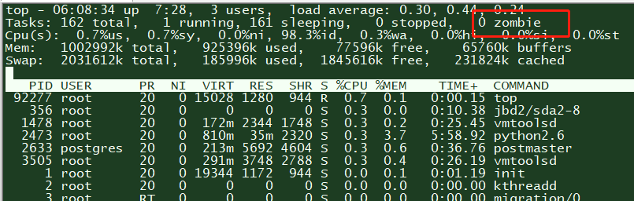

正常情况下我们可以用 `SIGKILL` 信号来杀死进程，但是僵尸进程已经死了， 你不能杀死已经死掉的东西。

所以只能通过杀死僵尸进程的父进程来达到杀死僵尸进程的效果，因为当父进程终止时，操作系统会将所有子进程的父进程设置为init进程（进程ID为1），init进程会自动接管僵尸进程的回收工作。

因此，要杀掉一个僵尸进程，需找到其父进程号（PPID）并给它发送SIGKILL (9) 信号：kill -9 ppid。可使用以下命令去找到僵尸进程的PPID。

例子：

**回答**

僵尸进程是已经死了的，不能直接使用 kill 命令杀掉僵尸进程，只能通过 ps 命令找到僵尸进程的父进程的 pid 号，然后通过 kill 命令杀掉父进程的方式来达到僵尸进程的效果，因为当父进程被杀掉后，操作系统会将僵尸进程的父进程设置为 1 号 init 进程，接着 init 进程会自动接管僵尸进程的回收工作。

**推荐资料**

[技术|](https://linux.cn/article-9143-1.html) [什么是僵尸进程，如何找到并杀掉僵尸进程?](https://zhuanlan.zhihu.com/p/425381927)

## 12. 并行和并发的区别

**分析**

* 并发指的是多个任务或操作在时间上有重叠，可以交替执行，共享计算资源。在并发执行中，多个任务可能会交替执行，由于计算资源有限，任务之间可能需要进行切换和调度。例如，在单核CPU上运行多个线程，每个线程在一段时间内执行，然后切换到另一个线程。

* 并行指的是同时执行多个任务或操作，利用多个处理单元（如多核CPU）同时进行计算，以提高整体的计算能力和执行效率。在并行计算中，多个任务能够同时进行，彼此之间相互独立。例如，将一个大任务分成多个子任务，分配给多个处理单元并行执行。

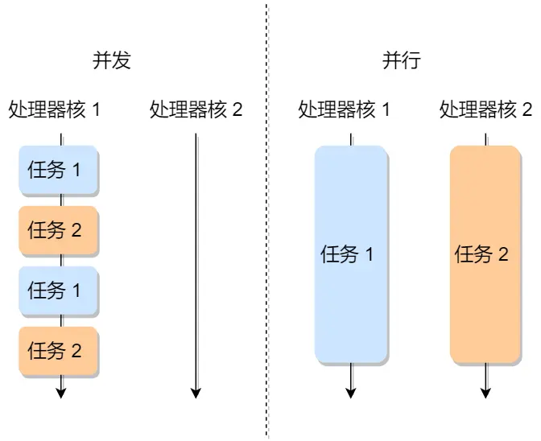

**回答**

并发是多个线程在单核 CPU 上交替运行，同一时间只会有一个线程在执行。

并行是多个线程在多核 CPU 上同时运行，同一时间可以有多个线程同时在执行。

**推荐资料**
[并发和并行有什么区别？](https://cloud.tencent.com/developer/article/1424249)

## 13. 多进程和多线程的区别？

**分析**

并发应用开发可以用多进程或多线程的方式。

按照多个不同的维度，来看看多进程和多线程的对比（注：都是相对的，不是说一个好得不得了，另一个差的无法忍受）

**回答**

多线程由于可以共享进程资源，而多进程不共享地址空间和资源，多进程需要通过进程间通信技术来实现数据传输，开发起来会比较麻烦。

但多进程安全性较好，在某一个进程出问题时，其他进程一般不受影响；而在多线程的情况下，一个线程执行了非法操作会导致整个进程退出。

**推荐资料**

[多进程和多线程的概念](https://www.cnblogs.com/linuxAndMcu/p/11064916.html)

## 14. **一个进程fork出一个子进程，那么他们占用的内存是之前的2倍吗？**

**分析**

考察写时复制的概念，在发生写操作的时候，操作系统才会去复制物理内存，否则父子进程的物理内存还是共享状态，并不会增加内存占用。

**回答**

不是的。

fork 的时候，创建的子进程是复父进程的虚拟内存，并不是物理内存，这时候父子的虚拟内存指向的是同一个物理内存空间，这样能够**节约物理内存资源**，页表对应的页表项的属性会标记该物理内存的权限为**只读**。

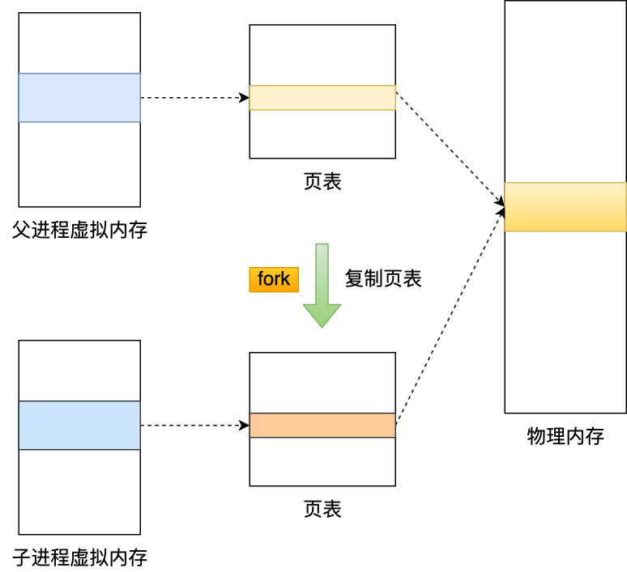

不过，当父进程或者子进程在向这个内存发起写操作时，CPU 就会触发**写保护中断**，这个写保护中断是由于违反权限导致的，然后操作系统会在「写保护中断处理函数」里进行**物理内存的复制**，拷贝原来页的内容到新页，然后修改页表项内容指向新页并修改为**可读写**，这个过程被称为「**写时复制**」，发生了这个过程，内存占用才会增多。

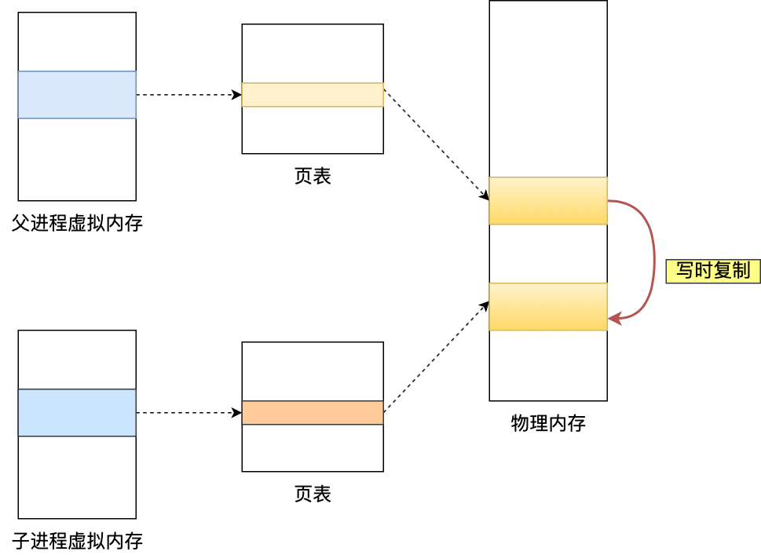

**推荐资料**

[Linux 写时复制机制原理](https://segmentfault.com/a/1190000039869422)

# 协程

## 15. 什么是协程？

**分析**

要强调协程是用户态的线程，切换的时候是不需要发生用户态和内核态的切换，相当于是一个轻量级线程。

**回答**

协程是一个用户态的线程，用户在**堆**上模拟出协程的栈空间。当需要进行协程上下文切换的时候，主线程只需要交换栈空间和恢复协程的一些相关的寄存器的状态，就可以实现上下文切换。相比于线程上下文切换，没有了从用户态转换到内核态的切换成本。

**推荐资料**

[从头到尾理解有栈协程实现原理](https://zhuanlan.zhihu.com/p/94018082)

## 16. 协程和线程有什么区别？（重要）

**分析**

|      | 进程                                       | 线程                              | 协程                                         |
| ---- | ---------------------------------------- | ------------------------------- | ------------------------------------------ |
| 定义   | 资源（包括内存、打开的文件等）分配的单位                | cpu调度的基本单位                      | 用户态轻量级线程，线程内部调度的基本单位                       |
| 切换情况 | 进程CPU环境（栈、寄存器、页表和文件句柄等）的保存以及新调度进程环境的设置。  | 保存和设置程序计数器，少量寄存器和栈的内容           | 先将寄存器的上下⽂ 和栈保存，等切换回 来再进⾏恢复                 |
| 切换过程 | ⽤户态-》内核态-》 ⽤户态                           | ⽤户态-》内核态-》 ⽤户态                  | 用户态                                        |
| 调用栈  | 内核栈                                      | 内核栈                             | 用户栈                                        |
| 并发性  | 不同进程之间实现并发，各自占用cpu时间片                    | 一个进程内部多个线程并发执行             | 同⼀时间只能⼀个协程，⽽其它的协程处 于休眠状态，适合对 任务分时处理   |
| 系统开销 | 切换虚拟地址空间，切换内核栈和硬件上下文，CPU高速缓存失效、页表切换，开销很大 | 切换时只需保存和设置少量寄存器内容， 有⼀定的开销  | 直接操作栈则基本没有内核切换的开销， 可以不加锁的访问全局变量，开销最⼩  |
| 通信   | 进程之间的通信需要借助操作系统                          | 线程之间可以直接读写进程数据段（如全局变量），来进⾏通信    | 共享内存，消息队列                             |
| 占用内存 | 依据所调⽤的资源⼤⼩                               | 固定不变，由编译器决定                     | 初始⼀般较⼩，可以⾃动扩展                              |

从调度方式、切换开销、栈大小这三个方面来展开说明区别。

1. 协程的调度是协作式调度（主动放弃执行，并不会被其他协程打断），当一个协程处理完自己的任务后，可以主动将执行权限让给其他协程。这意味着协程能更好地在规定时间内完成自己的工作，而不会被任意抢占。当一个协作式运行的时间过长，Go 语言调度器才会强制抢占其执行。线程是抢占式调度，当发生中断或者i/o的时候，cpu就会自动切换别的线程，也就是线程的切换的主动权不再线程自己身上。

2. 协程的切换要快于线程，因为协程的切换不用经过操作系统用户态与内核态的切换，并且 Go 语言中协程的切换只需要保留极少的状态和寄存器变量值（SP/BP/PC），而线程的切换会保留额外的寄存器变量值（例如浮点寄存器）。在 Go 语言中，上下文切换速度的一个可参考量化指标是，线程大约为 1\~2 微秒，协程大约是 0.2 微秒，比线程快数倍。

3. 线程的栈比协程的栈大很多，线程的栈大小一般是在创建时指定，为了避免出现栈溢出（Stack Overflow）的错误，默认的栈大小会相对较大（例如 8M），这意味着创建 1000 个线程就需要消耗 2G 的虚拟内存，这大大限制了线程创建的数量（虽然今天 64 位的虚拟内存地址空间已经让这种限制变得不太严重）。而 Go 语言中的协程栈默认为 2KB，在实践中，我们经常会看成千上万的协程存在。另外，线程的栈在运行时栈不能够更改，而协程栈在 Go 运行时的帮助下可以动态检测栈的大小，进行扩容和收缩。由于协程栈很小，在实践中，协程常被看作是一种轻量级的资源。

**回答**

协程可以理解为用户态线程，跟线程的区别主要有三个方面

* 线程调度由内核负责，协程调度由用户负责，所以协程的切换是比线程快的，因为协程的切换不用经过操作系统用户态与内核态的切换，并且协程的切换只需要保留极少的状态和寄存器变量值，比如SP、BP、PC寄存器，而线程的切换会保留额外的寄存器变量值，比如浮点寄存器。

* 线程的栈比协程的栈大很多，线程的栈大小一般是在创建时指定，默认是大小是 8MB，如果创建成千上万个线程的话，对于系统会有很大的负担，而协程栈通常是 KB 级别的，比如 2K，所以即使创建上千上万个协程，对于系统来说也不是很大的负担。另外，线程的栈在运行时栈不能够更改，而协程栈在 Go 运行时的帮助下可以动态检测栈的大小，进行扩容和收缩

* 协程的调度是协作式调度，当一个协程处理完自己的任务后，可以主动将执行权限让给其他协程，而线程是抢占式调度，线程的切换的主动权不再线程自己身上。

**推荐资料**

[进程线程协程的本质区别](https://huweicai.com/process-thread-goroutine/)

## 17. 协程切换的本质是什么？

**分析**

协程实际上是将函数实现成可以任意中断的函数，比如函数 1 执行到一半，可以直接切换执行别的函数，给人的感觉就是多个函数在并发，所以协程的切换类似于函数调用栈切换。

已知函数运行在调用栈上，如果将一个函数作为协程，保存上下文即是保存从这个函数栈帧存储的值，以及此时寄存器存储的值；恢复上下文即是将这些值分别重新写入对应的栈帧和寄存器；而切换上下文无非是保存当前正在运行的函数的上下文，恢复下一个将要运行的函数的上下文。

下图是协程切换前的状态：

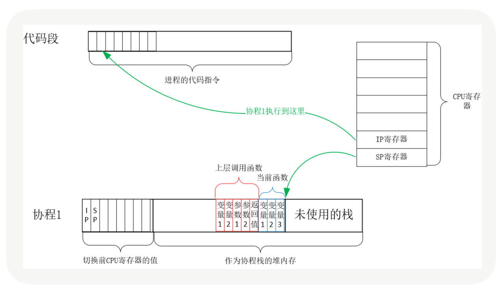

从协程 1 切换到协程 2 后的状态如下图所示：

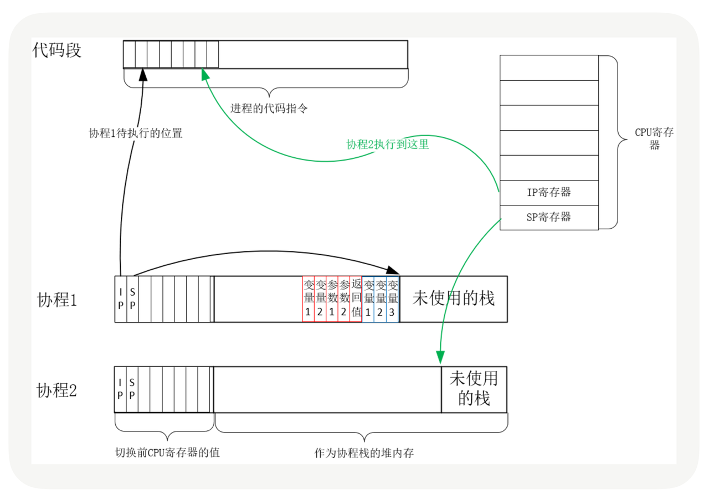

**回答**

协程的切换本质就是切换CPU寄存器，把当前协程的 CPU 寄存器状态保存起来，比如IP、SP寄存器，然后将需要切换进来的协程的 CPU 寄存器状态加载到 CPU 寄存器上就完成了切换的过程，整个切换过程发生在用户态，不会陷入内核态。

**推荐资料**

[有栈协程与无栈协程](https://zhuanlan.zhihu.com/p/330606651)

## 18. **为什么协程切换的开销比线程切换小？**

**分析**

从用户态切换、协作式调度方式去对比

**回答**

* 用户态切换：协程的切换是在用户态进行的，不需要操作系统的介入。相比之下，线程的切换需要操作系统进行调度和上下文切换，需要从用户态切换到内核态，这涉及到CPU寄存器的保存和恢复等操作，开销较大。

* 协作式调度：协程的调度是协作式的，由协程自身主动让出执行权，而不是被操作系统强制切换。这种调度方式避免了不必要的上下文切换，减少了切换开销。

**推荐资料**

[进程线程协程的本质区别](https://huweicai.com/process-thread-goroutine/)

# 进程间通信（重要）

## 19. 进程间有哪些通信方式？

**分析**

要说出每个通信方式的应用场景和优劣势。

* 管道：分为有名管道和匿名管道

  * 匿名管道顾名思义，它没有名字标识，匿名管道是特殊文件只存在于内存，没有存在于文件系统中，shell 命令中的「`|`」竖线就是匿名管道，通信的数据是无格式的流并且大小受限，通信的方式是单向的，数据只能在一个方向上流动，如果要双向通信，需要创建两个管道，再来匿名管道是只能用于存在父子关系的进程间通信，匿名管道的生命周期随着进程创建而建立，随着进程终止而消失。

  * 命名管道突破了匿名管道只能在亲缘关系进程间的通信限制，因为使用命名管道的前提，需要在文件系统创建一个类型为 p 的设备文件，那么毫无关系的进程就可以通过这个设备文件进行通信。另外，不管是匿名管道还是命名管道，进程写入的数据都是缓存在内核中，另一个进程读取数据时候自然也是从内核中获取，同时通信数据都遵循先进先出原则，不支持 lseek 之类的文件定位操作。

* 消息队列：消息队列克服了管道通信的数据是无格式的字节流的问题，消息队列实际上是保存在内核的「消息链表」，消息队列的消息体是可以用户自定义的数据类型，发送数据时，会被分成一个一个独立的消息体，当然接收数据时，也要与发送方发送的消息体的数据类型保持一致，这样才能保证读取的数据是正确的。消息队列通信的速度不是最及时的，毕竟每次数据的写入和读取都需要经过用户态与内核态之间的拷贝过程。

* 共享内存：共享内存可以解决消息队列通信中用户态与内核态之间数据拷贝过程带来的开销，它直接分配一个共享空间，每个进程都可以直接访问，就像访问进程自己的空间一样快捷方便，不需要陷入内核态或者系统调用，大大提高了通信的速度，享有最快的进程间通信方式之名。但是便捷高效的共享内存通信，带来新的问题，多进程竞争同个共享资源会造成数据的错乱。

* 信号量：信号量可以保护共享资源，以确保任何时刻只能有一个进程访问共享资源，这种方式就是互斥访问。信号量不仅可以实现访问的互斥性，还可以实现进程间的同步，信号量其实是一个计数器，表示的是资源个数，其值可以通过两个原子操作来控制，分别是 P 操作和 V 操作。

* 信号：与信号量名字很相似的叫信号，它俩名字虽然相似，但功能一点儿都不一样。信号是异步通信机制，信号可以在应用进程和内核之间直接交互，内核也可以利用信号来通知用户空间的进程发生了哪些系统事件，信号事件的来源主要有硬件来源（如键盘 Cltr+C ）和软件来源（如 kill 命令），一旦有信号发生，进程有三种方式响应信号 1. 执行默认操作、2. 捕捉信号、3. 忽略信号。有两个信号是应用进程无法捕捉和忽略的，即 `SIGKILL` 和 `SIGSTOP`，这是为了方便我们能在任何时候结束或停止某个进程。

* socket 通信：前面说到的通信机制，都是工作于同一台主机，如果要与不同主机的进程间通信，那么就需要 Socket 通信了。Socket 实际上不仅用于不同的主机进程间通信，还可以用于本地主机进程间通信，可根据创建 Socket 的类型不同，分为三种常见的通信方式，一个是基于 TCP 协议的通信方式，一个是基于 UDP 协议的通信方式，一个是本地进程间通信方式。

**回答**

进程间通信方式主要有管道、消息队列、共享内存、信号、信号量和 socket 通信。

* 管道通信的数据是无格式的字节流，并且通信方向是单向的，只能在一个方向上流动，管道分为匿名管道和有名管道，匿名管道是没有文件实体，只能用于存在父子关系的进程间通信，匿名管道的生命周期随着进程创建而建立，随着进程终止而消失。而有名管道有文件实体，可以用于任何进程间的通信，并且数据可以持久化保存，即使创建它的进程退出，其他进程仍然可以使用该管道。

* 消息队列在内核中是通过链表来组织消息的，克服了管道通信的数据是无格式的问题。

* 管道和消息队列在读写数据的时候，都需要经过用户态与内核态之间的拷贝过程，共享内存就解决了这个问题，多个进程可以将共享内存映射到各自的虚拟地址空间，实现共享数据的读写，不会涉及用户态和内核态之间的数据拷贝，所以共享内存方式是进程间通信方式里最高效的，不过共享内存带来新的问题，多进程竞争同个共享资源会造成数据的错乱，因为需要同步机制来保证多进程下的读写数据的安全。

* 信号量可以实现进程间的同步和互斥访问共享资源，信号量其实是一个计数器，表示的是资源个数，当一个进程想要访问资源时，它会尝试递减信号量（称为P操作）。如果信号量的值大于零，这个操作会成功，否则进程就会阻塞，直到信号量变为正数。当进程完成对资源的访问后，它会递增信号量（称为V操作），允许其他阻塞的进程访问资源。

* 信号是一种异步的通知机制，用于通知进程某个事件已经发生。当一个信号发送给一个进程时，操作系统会中断进程的正常流程来处理信号，只适用于简单的通知和事件处理。

* 前面提到的这些通信方式都只能在本机上进行进程间通信，如果要实现跨主机的进程间通信，就需要通过socket 通信了，可以实现基于 TCP 或者 UDP 协议的通信方式。

**推荐资料**

[进程间有哪些通信方式？](https://xiaolincoding.com/os/4_process/process_commu.html#%E6%80%BB%E7%BB%93)

## 20. 哪个进程间通信效率最高的？

**分析**

共享内存通信效率最高。

共享内存的机制，就是拿出一块虚拟地址空间来，映射到相同的物理内存中。这样这个进程写入的东西，另外一个进程马上就能看到了，都不需要拷贝来拷贝去，传来传去，大大提高了进程间通信的速度。

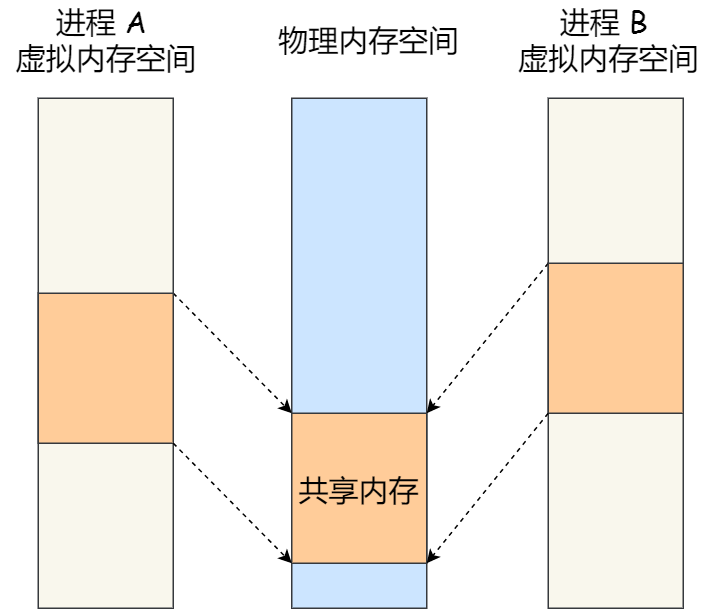

**回答**

共享内存的通信效率最高，因为共享内存不涉及内核态和用户态之间的数据拷贝

**推荐资料**

[进程间有哪些通信方式？](https://xiaolincoding.com/os/4_process/process_commu.html#%E6%80%BB%E7%BB%93)

## 21. 有名管道和匿名管道的区别？

**分析**

说出 2 个区别点：

* 持久性：有名管道在文件系统中存在，可以持久化保存，即使创建它的进程退出，其他进程仍然可以使用该管道。而匿名管道只存在于创建它的进程的内存中，进程退出后即被销毁。

* 进程间关系：有名管道可以用于任意进程间的通信，不受进程关系的限制。而匿名管道只能在父子进程之间进行通信，因为子进程会复制父进程的文件句柄，虽然这样子进程就拥有了匿名管道的文件句柄，因此就可以进行父子通信了。

**回答**

匿名管道没有文件实体，不能用于非亲缘进程间通信，只能用于在父子进程之间进行通信，并且匿名管道只存在于创建它的进程的内存中，进程退出后即被销毁。

而有名管道存在文件实体，可以用于任意进程间的通信，并且数据可以持久化保存，即使创建它的进程退出，其他进程仍然可以使用该管道。

**推荐资料**

[Linux 进程间通信——匿名管道和有名管道](https://www.colourso.top/linux-pipefifo/)

## 22. 信号和信号量的区别

**分析**

* 概念不同：信号是一种异步通知机制，用于通知进程发生了某个特定事件，例如键盘输入、异常等。信号量是一种同步机制，用于实现多个进程之间的互斥访问和同步操作。

* 使用方式不同：信号通过发送信号的进程向接收信号的进程发送信号，接收进程通过注册信号处理函数来响应信号。信号量通过对共享资源进行加锁和解锁的操作，协调多个进程对共享资源的访问。

* 应用场景不同：信号常用于处理异步事件，例如捕获异常、处理用户输入等。信号量常用于解决多个进程对共享资源的并发访问问题，例如控制进程的执行顺序、避免竞态条件等。

**回答**

信号用于异步处理异常或特殊事件，而信号量用于同步进程以安全地访问共享资源。

* 信号是一种异步的通知机制，用于通知进程某个事件已经发生。当一个信号发送给一个进程时，操作系统会中断进程的正常流程来处理信号。

* 信号量是一种用于解决多进程同步和互斥问题的工具，主要用于保护共享资源，防止多个进程同时访问。信号量有一个整数值，该值的含义是可以同时访问某个资源的进程数量。当一个进程想要访问资源时，它会尝试递减信号量（称为P操作）。如果信号量的值大于等于零，这个操作会成功，否则进程就会阻塞，直到信号量变为正数。当进程完成对资源的访问后，它会递增信号量（称为V操作），允许其他阻塞的进程访问资源。

**推荐资料**

[进程间有哪些通信方式？](https://xiaolincoding.com/os/4_process/process_commu.html#%E6%80%BB%E7%BB%93)

# 调度

## 23. 进程的调度算法有哪些？

**回答**

我了解到主要有 5 种调度算法。

1. 先来先服务：按照进程到达的顺序进行调度，先到达的进程先执行。优势是简单、公平，但可能导致长作业等待时间过长，无法适应实时性要求高的场景。

2. 最短作业优先：选择估计运行时间最短的进程优先执行。优势是能够最大程度地减少平均等待时间，但需要准确预测进程的运行时间，这个实现起来会比较困难。

3. 轮转调度：按照时间片的方式轮流调度进程执行，每个进程分配一个固定的时间片，时间片用完后切换到下一个进程。优势是公平，但对于长作业和实时性要求高的场景可能不够高效。

4. 优先级调度：为每个进程分配一个优先级，优先级高的进程先执行。可根据不同的调度策略确定优先级，如静态优先级、动态优先级等。优势是能够根据进程的重要性和紧急程度进行调度，但可能导致优先级低的进程长时间等待。

5. 多级反馈队列调度：将进程划分为多个队列，每个队列有不同的优先级和时间片大小，每个队列优先级从高到低，同时优先级越高时间片越短，新的进程会被放入到第一级队列的末尾，按先来先服务的原则排队等待被调度，如果在第一级队列规定的时间片没运行完成，则将其转入到第二级队列的末尾，以此类推，直至完成。如果进程运行时，有新进程进入较高优先级的队列，则停止当前运行的进程并将其移入到原队列末尾，接着让较高优先级的进程运行。多级反馈队列调度存在的问题，优先级较低的队列可能会被优先级较高的队列长时间占用，导致优先级较低的进程无法得到执行，从而产生饥饿现象。

**分析**

1. **先来先服务（FCFS）**：按照进程到达的先后顺序进行调度，先到达的进程先执行，后到达的进程后执行。

* **最短作业优先（SJF）**：按照进程的执行时间进行排序，执行时间短的进程优先执行，以减少平均等待时间。

* **优先级调度**：为每个进程分配一个优先级，根据优先级高低进行调度，优先级高的进程先执行。

* **时间片轮转（RR）**：将CPU时间分成多个时间片，每个进程轮流占用一个时间片，如果一个进程在该时间片结束时还没有完成，则将其移到队列的末尾，等待下一次调度。

* **多级反馈队列调度（MFQS）**：「多级」表示有多个队列，每个队列优先级从高到低，同时优先级越高时间片越短。「反馈」表示如果有新的进程加入优先级高的队列时，立刻停止当前正在运行的进程，转而去运行优先级高的队列。工作流程：

  * 设置了多个队列，赋予每个队列不同的优先级，每个队列优先级从高到低，同时优先级越高时间片越短；

  * 新的进程会被放入到第一级队列的末尾，按先来先服务的原则排队等待被调度，如果在第一级队列规定的时间片没运行完成，则将其转入到第二级队列的末尾，以此类推，直至完成；

  * 当较高优先级的队列为空，才调度较低优先级的队列中的进程运行。如果进程运行时，有新进程进入较高优先级的队列，则停止当前运行的进程并将其移入到原队列末尾，接着让较高优先级的进程运行；

**推荐资料**

[进程、线程基础知识](https://xiaolincoding.com/os/4_process/process_base.html#%E8%B0%83%E5%BA%A6)

# 锁（重要）

## 24. 线程间同步方式有哪一些？

**分析**

Linux 系统提供了五种用于线程间同步的方式：**互斥锁**、**读写锁**、**条件变量**、**自旋锁、信号量。**

* **互斥锁（mutex）**：主要用于保护共享数据，确保同一时间只有一个线程访问数据。互斥量从本质上来说是一把锁，在访问共享资源前对互斥量进行加锁，访问完成后释放互斥量（解锁）。对互斥量进行加锁之后，任何其他试图再次对互斥量加锁的线程都会被阻塞直到当前线程释放该互斥锁。这样就可以保证每次只有一个线程可以向前执行。

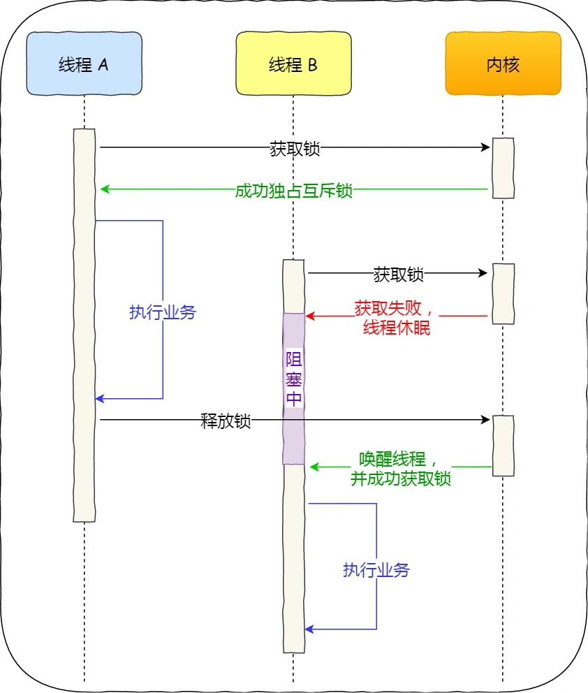

* **读写锁（reader-writer lock）**：读写锁也叫做共享互斥锁（shared-exclusive lock），它有三种状态：读模式下加锁状态、写模式下加锁状态、不加锁状态。一次只能有一个线程可以占有写模式的读写锁，但是多个线程可以同时占有读模式的读写锁。因此与互斥量相比，读写锁允许更高的并行性。**读写锁非常适合对数据结构读的次数远大于写的情况**。

* **信号量**：线程的信号量和进程的信号量类似，使用线程的信号量可以高效地完成基于线程的资源计数。信号量实际上是一个非负的整数计数器，用来实现对公共资源的控制。在公共资源增加的时候，信号量就增加；公共资源减少的时候，信号量就减少；只有当信号量的值大于0的时候，才能访问信号量所代表的公共资源。

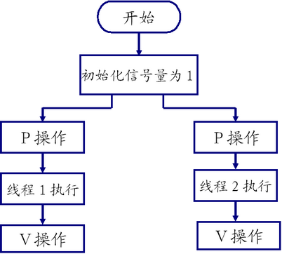

* **条件变量：**&#x662F;线程可用的另一种同步机制。条件变量给多个线程提供了一个会合的场所。**条件变量与互斥量一起使用时，允许线程以无竞争的方式等待特定的条件发生**。条件本身是由互斥量保护的。线程在改变条件状态之前必须首先锁住互斥量。其他线程在获得互斥量之前不会察觉到这种改变，因此互斥量必须在锁住以后才能计算条件。推荐阅读：[有了互斥锁，为什么还要条件变量？](https://www.jianshu.com/p/01ad36b91d39)

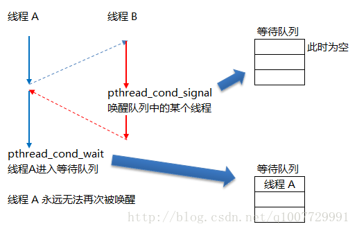

* **自旋锁：**&#x81EA;旋锁是一种忙等待锁，不是通过休眠使进程阻塞，而是在获取所之前一直处于忙等（自旋）阻塞状态。自旋锁可用于以下情况：**锁被持有的时间短，而且线程并不希望在重新调度上花费太多的成本**。自旋锁用在非抢占式内核中时是非常有用的，除了提供互斥机制以外，还可以阻塞中断，这样中断处理程序就不会陷入死锁状态。

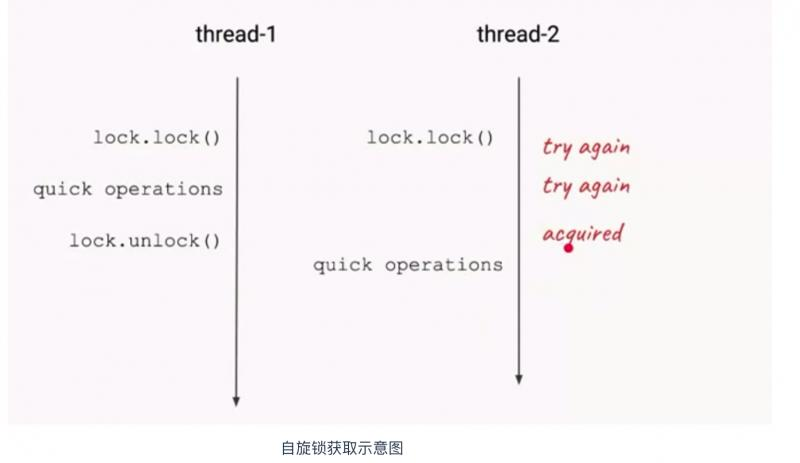

**回答**

Linux 系统提供了五种用于线程间同步的方式：**互斥量**、**读写锁、信号量、自旋锁、条件变量。**

* 互斥锁：用于保护共享资源，确保同一时间只有一个线程可以访问该资源。只有获得互斥锁的线程才能进入临界区，其他线程需要等待锁的释放。

* 读写锁：也称为共享-独占锁，允许多个线程同时读取共享资源，但在写操作时需要独占访问。读写锁在读多写少的场景中可以提供更好的并发性能。

* 信号量：用于控制对一组资源的访问。信号量可以允许多个线程同时访问资源，但是需要在访问前进行P操作（申请资源）和在访问结束后进行V操作（释放资源），以确保资源的正确使用。

* 自旋锁：是一种忙等待锁，在获取锁之前，线程会一直尝试获取锁，而不会进入睡眠状态。自旋锁适用于保护临界区较小、锁占用时间短暂的情况。

* 条件变量：用于在线程之间进行条件同步。一个线程可以等待某个条件满足，而另一个线程在满足条件时可以通知等待的线程继续执行。

**推荐资料**

[多线程冲突了怎么办？](https://xiaolincoding.com/os/4_process/multithread_sync.html)

[什么是悲观锁、乐观锁？](https://xiaolincoding.com/os/4_process/pessim_and_optimi_lock.html)

## 25. 信号量和互斥锁应用场景有什么区别？

**分析**

Linux信号量（Semaphore）和互斥锁（Mutex）是同步机制，主要区别在于它们的用途和功能：

互斥锁：

* 用于控制对共享资源的独占访问。

* 只能由获取它的线程释放。

* 通常用于保护临界区，确保一次只有一个线程可以执行临界区代码。

信号量：

* 用于同步操作，可以用作互斥锁。

* 可以由任何线程释放，不仅限于获取它的线程。

* 可以是二值的（0或1，类似于互斥锁），也可以有多个值，用于控制多个资源的分配。

应用场景：

* 互斥锁适用于确保多个线程不会同时修改同一数据的场合。

* 信号量适用于控制有限数量资源的访问，或者需要允许多个线程同时访问同一资源池的场合。

**回答**

* 信号量一般以同步的方式对共享资源进行控制，而互斥锁通过互斥的方式对共享资源对其进行控制；

* 信号量可以控制有限资源的访问，而互斥锁只能控制一个资源的访问

* 互斥量的加锁和解锁必须由同一线程分别对应使用，信号量可以由一个线程释放，另一个线程得到

**推荐资料**

[多线程冲突了怎么办？](https://xiaolincoding.com/os/4_process/multithread_sync.html)

## 26. 自旋锁和互斥锁有什么区别？分别适合哪些应用场景？

**分析**

当已经有一个线程加锁后，其他线程加锁则就会失败，互斥锁和自旋锁对于加锁失败后的处理方式是不一样的：

* 互斥锁是一种阻塞锁，线程在获取锁时，如果发现锁已经被其他线程持有，它会被阻塞，释放CPU资源，并等待锁的释放。这种锁适用于并发竞争时间较长或资源争用较激烈的情况。当锁的持有时间较长或竞争激烈时，互斥锁可以避免线程忙等待，减少CPU资源的浪费。但是，互斥锁的阻塞和唤醒操作需要进行线程切换和上下文切换，会带来一定的开销。

* 自旋锁是一种忙等待的锁，线程在获取锁时，如果发现锁已经被其他线程持有，它会一直忙等待，不会释放CPU资源。这种锁适用于并发竞争时间短暂的情况，例如在多核处理器上，线程的忙等待时间很短，可以有效避免线程切换和上下文切换的开销。当锁的持有时间较长或并发竞争激烈时，自旋锁可能会浪费大量CPU资源，因此不适合长时间的竞争或资源争用较激烈的场景。

**回答**

互斥锁加锁失败的时候，线程会放弃CPU，陷入到内核态，执行线程切换和CPU上下文切换的过程，切换到其他线程，而自旋锁加锁失败后，线程不会放弃 CPU，而是选择忙等待，直到它拿到锁。

自旋锁适用于并发竞争时间短暂的情况，可以减少线程切换和CPU上下文切换的开销。互斥锁适用于并发竞争时间较长或资源争用较激烈的情况，可以避免线程忙等待，但会带来线程切换和上下文切换的开销。

**推荐资料**

[什么是悲观锁、乐观锁？](https://xiaolincoding.com/os/4_process/pessim_and_optimi_lock.html)

## 27. 悲观锁和乐观锁有什么区别？

**分析**

先说出概念区别：

* 悲观锁比较悲观，它认为如果不锁住这个资源，别的线程就会来争抢，就会造成数据结果错误，所以悲观锁为了确保结果的正确性，会在每次获取并修改数据时，都把数据锁住，让其他线程无法访问该数据，这样就可以确保数据内容万无一失。

* 乐观锁比较乐观，认为自己在操作资源的时候不会有其他线程来干扰，所以并不会锁住被操作对象，不会不让别的线程来接触它，同时，为了确保数据正确性，在更新之前，会去对比在我修改数据期间，数据有没有被其他线程修改过：如果没被修改过，就说明真的只有我自己在操作，那我就可以正常的修改数据；如果发现数据和我一开始拿到的不一样了，说明其他线程在这段时间内修改过数据，那说明我迟了一步，所以我会放弃这次修改，并选择报错、重试等策略。

再说应用场景：

* 悲观锁适合用于并发写入多、临界区代码复杂、竞争激烈等场景，这种场景下悲观锁可以避免大量的无用的反复尝试等消耗。

* 乐观锁适用于大部分是读取，少部分是修改的场景，也适合虽然读写都很多，但是并发并不激烈的场景。在这些场景下，乐观锁不加锁的特点能让性能大幅提高。

**回答**

悲观锁做事比较悲观，它认为多线程同时修改共享资源的概率比较高，很容易出现冲突，造成数据错乱，所以会每次读写共享资源之前，先要加锁，确保任意时刻只有一个线程才能对数据进行读写操作。

乐观锁做事比较乐观，它假定冲突的概率很低，先修改完共享资源，再验证这段时间内有没有发生冲突，如果没有其他线程在修改资源，那么操作完成，如果发现有其他线程已经修改过这个资源，就放弃本次操作，并选择报错、重试等策略。

悲观锁适合并发写入多和竞争激烈的场景，这种场景下悲观锁可以避免大量的无用的反复尝试等消耗。乐观锁适合读多写少和并发不激烈的场景，在这些场景下乐观锁不加锁的特点能让性能大幅提高。

**推荐资料**

[什么是悲观锁、乐观锁？](https://xiaolincoding.com/os/4_process/pessim_and_optimi_lock.html)

[悲观锁和乐观锁的本质是什么？](https://learn.lianglianglee.com/%E4%B8%93%E6%A0%8F/Java%20%E5%B9%B6%E5%8F%91%E7%BC%96%E7%A8%8B%2078%20%E8%AE%B2-%E5%AE%8C/20%20%E6%82%B2%E8%A7%82%E9%94%81%E5%92%8C%E4%B9%90%E8%A7%82%E9%94%81%E7%9A%84%E6%9C%AC%E8%B4%A8%E6%98%AF%E4%BB%80%E4%B9%88%EF%BC%9F.md)

## 28. 乐观锁怎么实现？

**分析**

乐观锁的实现一般都是利用 CAS 算法实现的。CAS 是 Compare And Swap 的缩写，意思是**比较并替换**。

如下图，CAS 机制当中使用了 3 个基本操作数：内存地址V、期望值E、要修改的新值N。更新一个变量的时候，只有当变量的预期值E 和内存地址V 的真正值相同时，才会将内存地址V 对应的值修改为 N。如果不相当，就会重试。

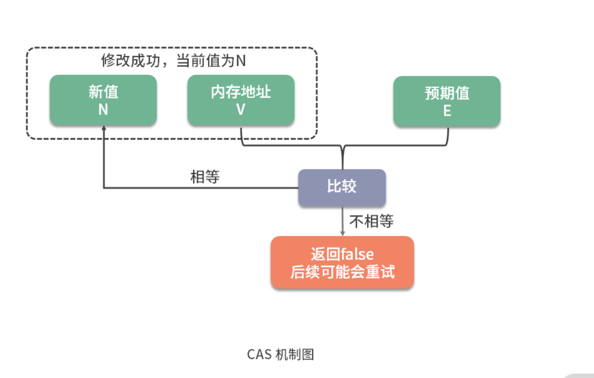

**回答**

乐观锁的实现通常基于版本号或时间戳机制，比如 CAS 算法是乐观锁的一种实现方式，它包含三个参数：内存地址、期望值和新值。

CAS操作会比较内存位置的当前值与期望值是否相等，如果相等，则将内存地址的值更新为新值；如果不相等，则说明其他进程或线程已经修改过内存地址的值，就不会修改数据，会根据不同的业务逻辑去选择报错或者重试。

**推荐资料**

[ 悲观锁和乐观锁的本质是什么?](https://learn.lianglianglee.com/%E4%B8%93%E6%A0%8F/Java%20%E5%B9%B6%E5%8F%91%E7%BC%96%E7%A8%8B%2078%20%E8%AE%B2-%E5%AE%8C/20%20%E6%82%B2%E8%A7%82%E9%94%81%E5%92%8C%E4%B9%90%E8%A7%82%E9%94%81%E7%9A%84%E6%9C%AC%E8%B4%A8%E6%98%AF%E4%BB%80%E4%B9%88%EF%BC%9F.md)

[案例分析:乐观锁和无锁](https://learn.lianglianglee.com/%E4%B8%93%E6%A0%8F/Java%20%E6%80%A7%E8%83%BD%E4%BC%98%E5%8C%96%E5%AE%9E%E6%88%98-%E5%AE%8C/14%20%20%E6%A1%88%E4%BE%8B%E5%88%86%E6%9E%90%EF%BC%9A%E4%B9%90%E8%A7%82%E9%94%81%E5%92%8C%E6%97%A0%E9%94%81.md)

## 29. 操作系统死锁怎么产生的？

**分析**

什么是死锁？死锁是指在并发执行的多个进程或线程中，每个进程或线程都在等待其他进程或线程释放资源，导致所有进程或线程都无法继续执行的一种状态。

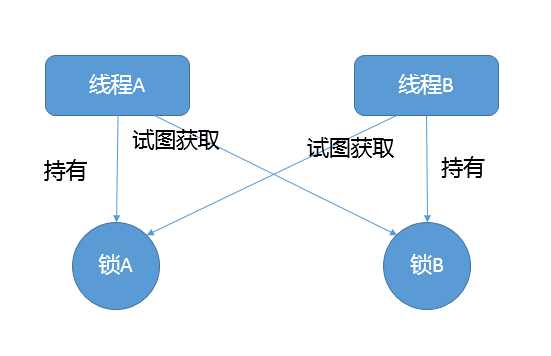

死锁产生的四个必要条件：

* 互斥条件：一个资源一次只能被一个进程使用

* 持有并等待条件：一个进程因请求资源而阻塞时，对已获得资源保持不放

* 不剥夺条件：进程获得的资源，在未完全使用完之前，不能强行剥夺

* 环路等待条件：若干进程之间形成一种头尾相接的环形等待资源关系

**回答**

当两个或者以上线程并行执行的时候，争夺资源而造成**相互等待**的现象，这时候就是发生了**死锁**。

死锁产生的四个必要条件：互斥条件、持有并等待条件、不剥夺条件、环路等待条件。只要上述条件之一不满足，就不会发生死锁。

**推荐资料**

[怎么避免死锁？](https://xiaolincoding.com/os/4_process/deadlock.html)

## 30. 如何避免死锁？

**分析**

可以从三个角度来分析：加锁顺序、加锁时限、死锁检测。

如果记不住，记住一个加锁顺序就可以了。

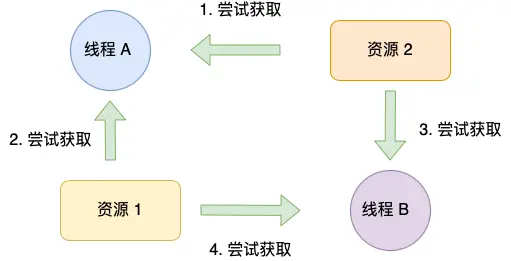

**回答**

要避免死锁的发生，可以采取加锁顺序、加锁时限、死锁检测的技术。

* 加锁顺序：破坏死锁四个必要条件中任意一个就能避免死锁，最常用的方法就是**使用资源有序分配法来破坏环路等待条件，**&#x6BD4;如线程1先对A资源加锁，再对B资源加锁，线程2，也使用相同的顺序。

* 加锁时限：在尝试获取锁的时候加一个超时时间，如果超时时间到了，该线程则放弃对该锁请求。如果一个线程没有在给定的时限内成功获得所有需要的锁，则会进行回退并释放所有已经获得的锁，然后等待一段随机的时间再重试。这段随机的等待时间让其它线程有机会尝试获取相同的这些锁，并且让该应用在没有获得锁的时候可以继续运行。

* 死锁检测：当一个线程请求锁失败时，这个线程可以遍历锁的关系图看看是否有死锁发生。例如，线程A请求锁7，但是锁7这个时候被线程B持有，这时线程A就可以检查一下线程B是否已经请求了线程A当前所持有的锁。如果线程B确实有这样的请求，那么就是发生了死锁，检测出结果后，就释放锁资源，类似 mysql 的死锁检测机制。

**推荐资料**

[​死锁的产生、防止、避免、检测和解除](https://zhuanlan.zhihu.com/p/61221667)

## 31. 发生死锁时，怎么排查？

**分析**

不同语言项目排查死锁的工具是不同，要结合自己熟悉的语言来掌握死锁排查的工具来回答这个问题，主要是通过工具获取线程栈，然后定位互相之间的依赖关系，进而找到死锁的代码。

如果程序运行时发生了死锁，绝大多数情况下都是无法在线解决的，只能重启、修正程序本身问题。所以，代码开发阶段互相审查，或者利用工具进行预防性排查，也是很重要的。

**推荐资料**

* Java项目发生了死锁，通过jstack工具来排查死锁，案例：[什么情况下Java程序会产生死锁?如何定位、修复?](https://learn.lianglianglee.com/%E4%B8%93%E6%A0%8F/Java%20%E6%A0%B8%E5%BF%83%E6%8A%80%E6%9C%AF%E9%9D%A2%E8%AF%95%E7%B2%BE%E8%AE%B2/18%20%20%E4%BB%80%E4%B9%88%E6%83%85%E5%86%B5%E4%B8%8BJava%E7%A8%8B%E5%BA%8F%E4%BC%9A%E4%BA%A7%E7%94%9F%E6%AD%BB%E9%94%81%EF%BC%9F%E5%A6%82%E4%BD%95%E5%AE%9A%E4%BD%8D%E3%80%81%E4%BF%AE%E5%A4%8D%EF%BC%9F-%E6%9E%81%E5%AE%A2%E6%97%B6%E9%97%B4.md)

* C/C++项目发生了死锁，通过gdb工具来排查死锁，案例：[怎么避免死锁？](https://xiaolincoding.com/os/4_process/deadlock.html)

* Golang项目发生了死锁，通过pprof工具来排查死锁，案例：[如何用pprof检测golang代码中的死锁](https://blog.csdn.net/u013536232/article/details/107868474)

